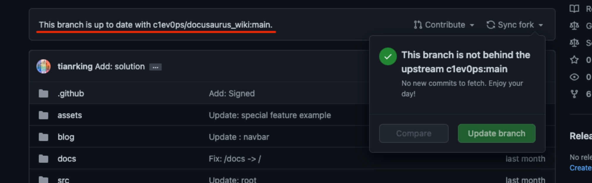
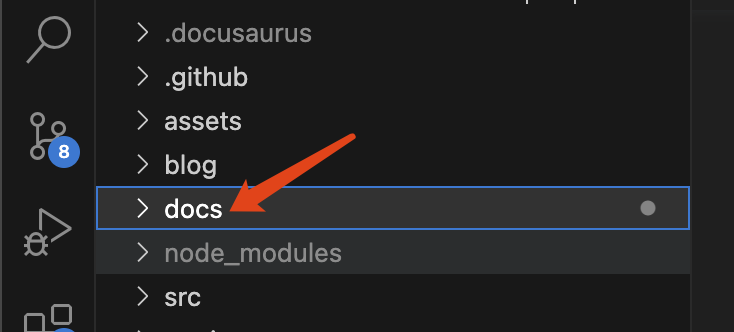
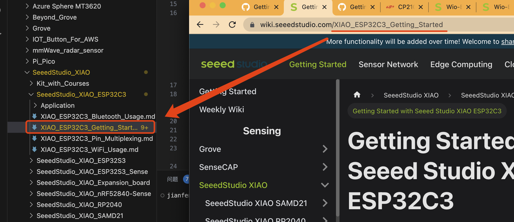
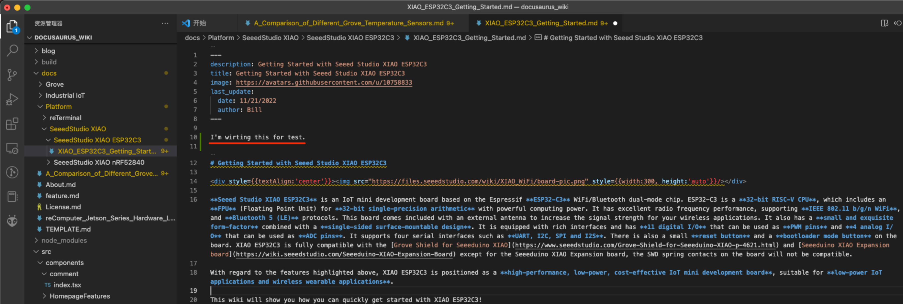
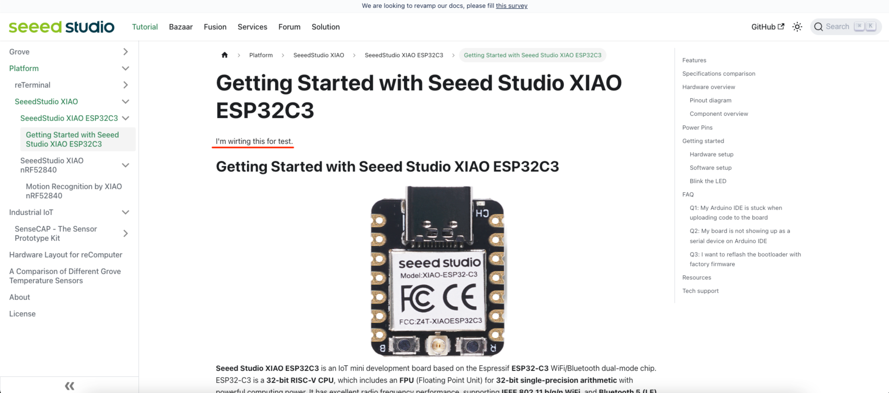
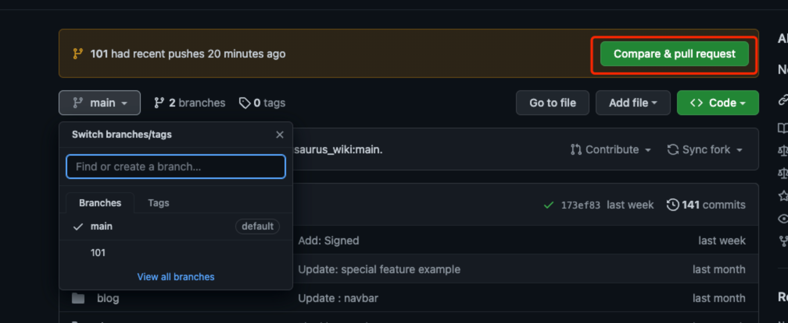
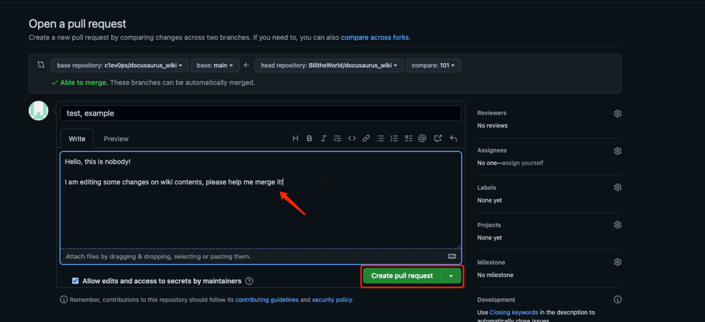

Would you like to contribute to building this open wiki platform with us? Here is a basic guide to contributing. Looking forward to collaborating with every single of you very soon. Thank you so much in advance!

We also provide methods for you can **modify existed files** and **add new files**.

## What to Contribute / How to Contribute

<table align="center">
  <tbody>
    <tr>
    <td>
    <strong>What to Contribute</strong>
    </td>
    <td>
    <strong>Edits Suggestion</strong><br/>- Bug hunting<br/>- Proof-reading
    </td>
    <td><strong>Doc Translation</strong><br/>- Translate docs into your languages</td>
    <td>
    <strong>Contribution Bounty</strong><br/>- Tutorial & demo<br/>- Firmware
    </td>
    </tr>
    <tr>
    <td>
    <strong>How to Contribute</strong>
    </td>
    <td>
    Click <strong>"Edit this page"</strong> at the end of the page to submit your edits and suggestions by pulling a requestion</td>
    <td>Please <a href="https://github.com/Seeed-Studio/wiki-documents/blob/docusaurus-version/HOW_TO.md" target="_blank"><span>set up this platform locally</span></a> so you can contribute for long content with an ease. You can check out your <a href="https://github.com/Seeed-Studio/wiki-documents/projects?query=is%3Aopen" target="_blank"><span>contribution progress here</span></a>.
    </td>
    <td>1) <a href="https://github.com/Seeed-Studio/wiki-documents/blob/docusaurus-version/HOW_TO.md" target="_blank"><span>Please set up this platform locally.</span></a>  <br/>2）Regularly visit our <a href="https://github.com/Seeed-Studio/wiki-documents/blob/docusaurus-version/TASK.md" target="_blank"><span>Contribution Bounty Page</span></a> to follow the specific guide to contribute with extra benefits!</td>
    </tr>
  </tbody></table>

## Step by Step Modify Files

Before modifying the existed files, please make sure you can [build the wiki platform page locally](/Deploy_Page_Locally)

### 1. Bring your forked branch up to date



### 2. Update the downloaded files

```
git checkout main
git pull
```

### 3. Modify the contents of existed files

All the files on the wiki platform are stored in the "docs" folder.



And the name of file you want to change usually is the last part of the url(take Seeed Studio XIAO ESP32C3 as an example).



Once you done updating, you can use the command below to see whether it shows fine.

```
yarn start
```

On the edit platform:



On the local page:



### 4. Save and push the changes to your forked github repository

If all is ok, you can use the command below to push the changes to your forked github repository.

```
git add "the files that you changed"
git commit -m "Update：I have updated ..."
git push
```

### 5. Pull request to the Seeed Studio Repository

Once you have pushed the changes to your github repository, there is a column showing up automatically. Click the "Compare & Pull Request" button:



Show us what you have edited and click "creat pull request" button to us.



Thank you for your contributions!
