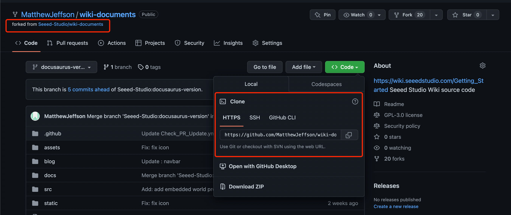

### 1. Fork and Download the Repository

a. Please visit the [Seeed Studio Wiki Platform's Github Repository](https://github.com/Seeed-Studio/wiki-documents/tree/docusaurus-version) and then `fork` the 'wiki-documents' repository of your own.


b. Download the files into your local PC. If you don't have `git` you can download [here](https://git-scm.com/).

```
git clone {your repository}
```



### 2. Download node.js

Please download the [node.js](https://nodejs.org/en/download/) according to your operating system(Windows, Mac).

### 3. Download Visual Studio Code

Please download the [Visual Studio Code](https://code.visualstudio.com/Download) according to your operating system(Windows, Mac).

### 4. Install Yarn

Open the "Visual Studio Code" and use the followling command to install Yarn.

```
npm install --global yarn
```

For further information, please check [here](https://classic.yarnpkg.com/lang/en/docs/install/#windows-stable).

### 5. Automatically install dependencies using Yarn

```
yarn
```

For people using Windows operating system, please change "Powershall" to "Command Promat" and then execute `yarn`.

### 6. Build the wiki patform locally using Yarn

```
yarn start
```

