# Xiao ESP32C3 ESPHome Smart ThermoStat

### 1. Items Used

a. Seed Studio Xiao ESP32C3

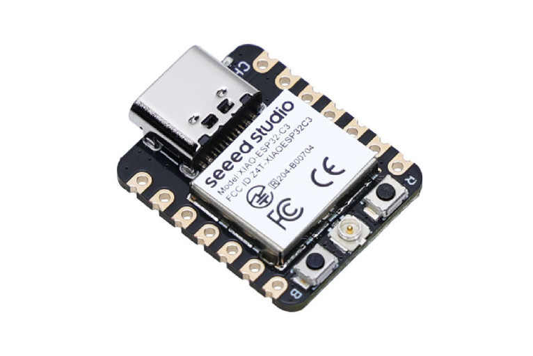

b. Grove DHT22 Sensor

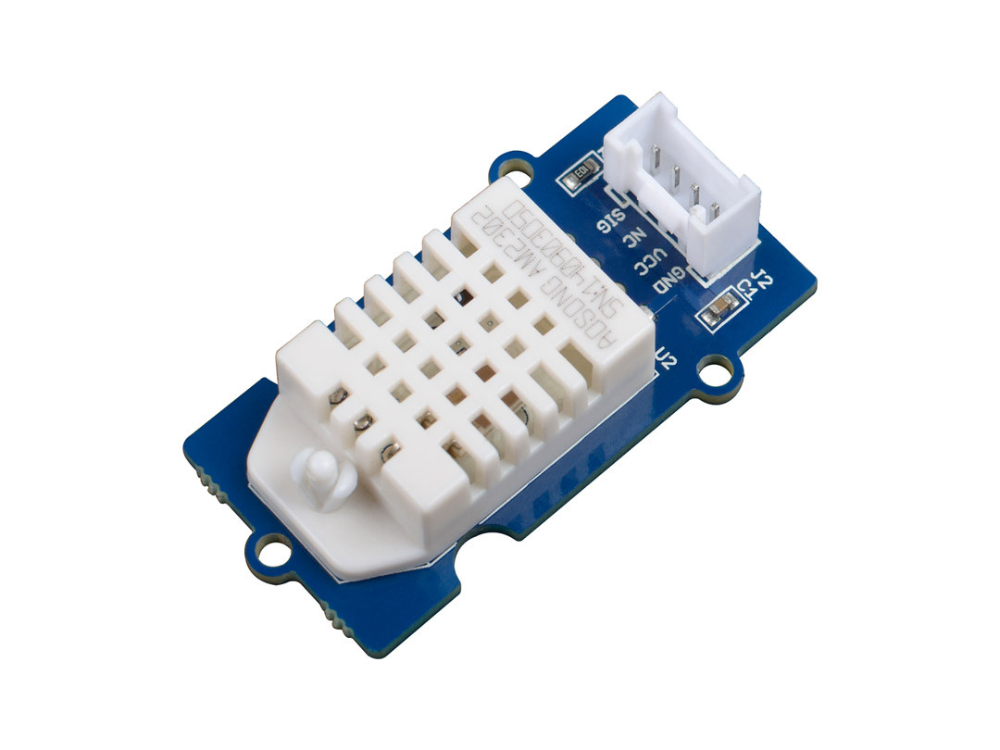

c. Grove 2 Channel Relay

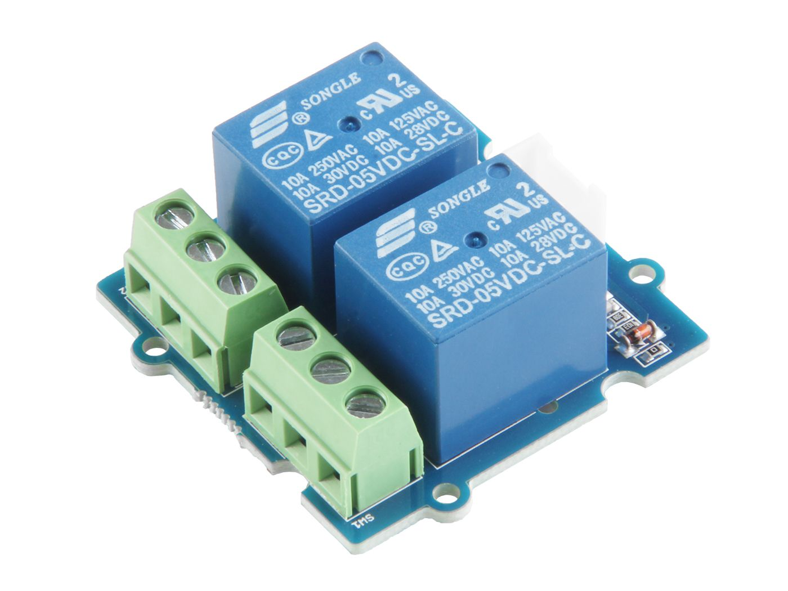

d. Grove Single Channel Relay

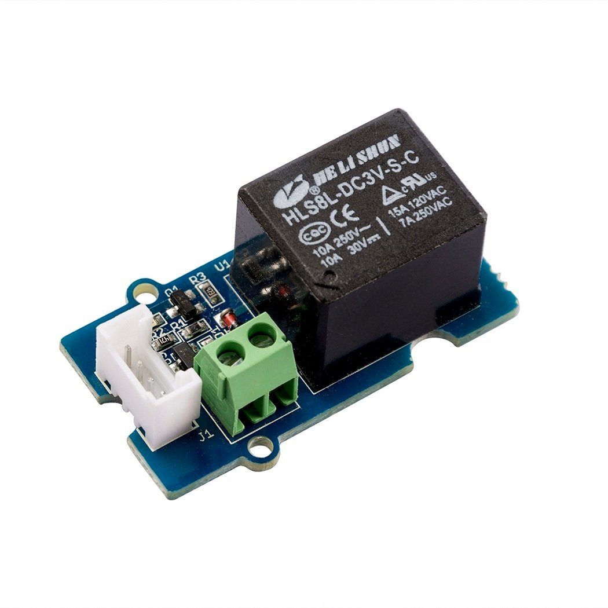

e. Grove SSD1306 Module

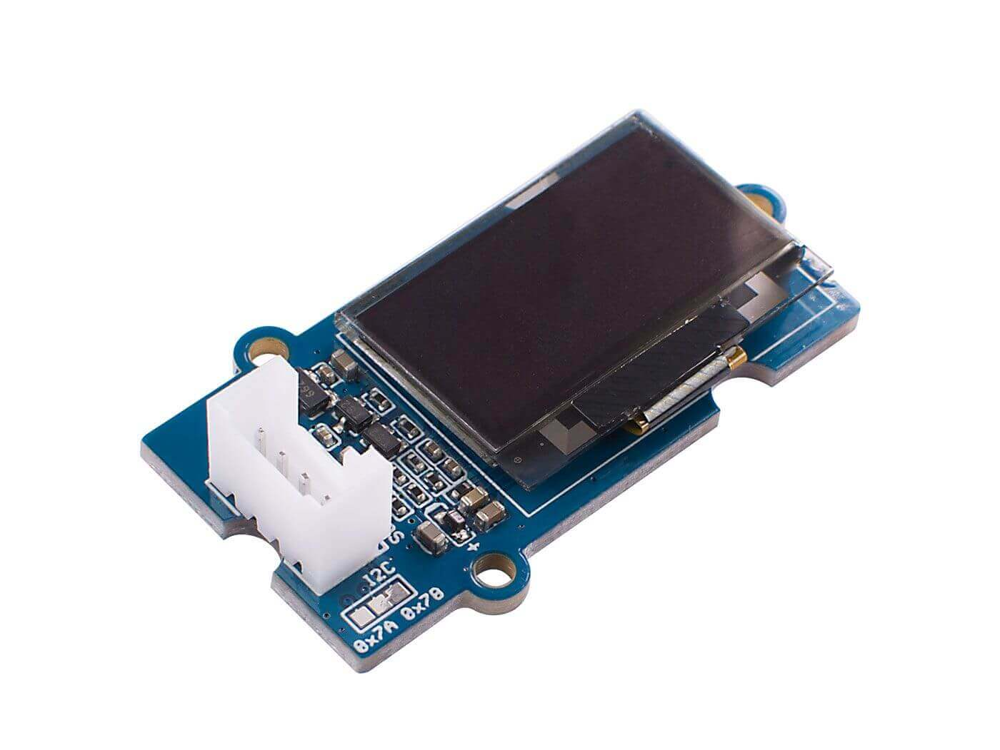

f. (Optional) Seeed Studio Expansion Board

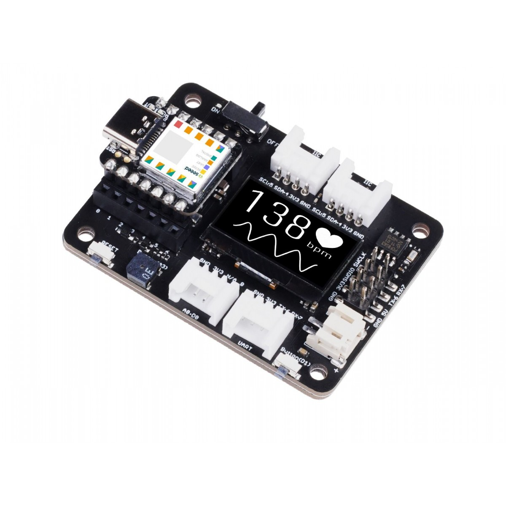

d. (Optional) [Seeed Studio Home Assistant Yellow](https://www.seeedstudio.com/Home-Assistant-Yellow-Kit-with-selectable-CM4-p-5680.html), or device of choice

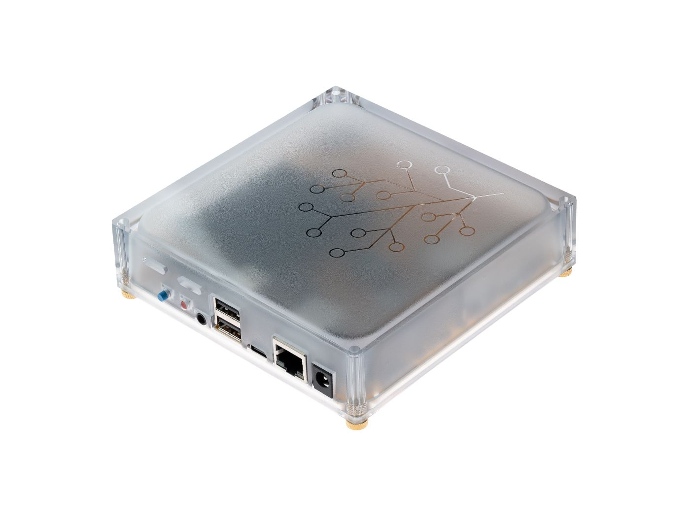

e. Momentary buttons (Any kind will do)

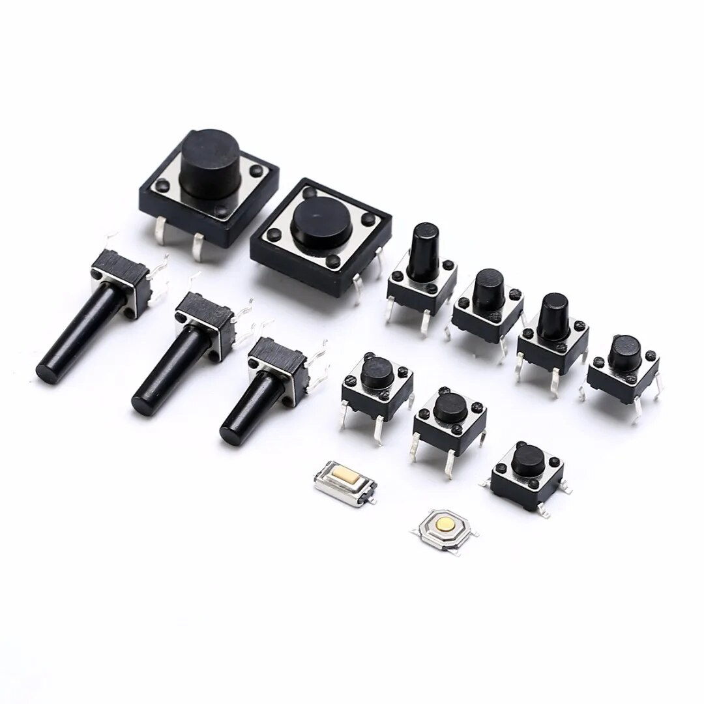

### 2. Install Home Assistant and ESPHome

- Install Home Assistant on your device of choice. There are a lot of informative guides
based on whatever device you are trying to Install Home Assistant onto. The type of device will determine which
style of Home Assistant will meet your needs the best.

- Installation of ESPHome is as easy as searching for "ESPHome" in the Supervisor/Add-Ons/Extensions tab and clicking it to install.

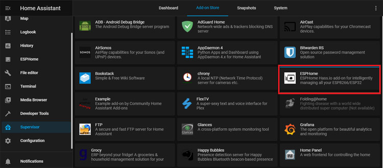

### 3. Create and Upload YAML Config

Explanation of the code below:
- Name: "thermostat"
- Board Configuration:
Flash mode set to DIO.
Board specified as "seeed_xiao_esp32c3" with the Arduino framework.
- On Boot Actions:
Displays a log message: "Booting thermostat."
Turns off three relays: heat, cooling, and fan.
Delays for 500 milliseconds.
Executes a script named "boot_beep."
- Script Configuration:
Boot Beep Script:
Turns on a buzzer, sets its frequency to produce a beep, and turns it off after 300 milliseconds.
- API and OTA Configuration:
API:
Encryption key specified.
OTA:
Password set to "13371337" for over-the-air updates.
- Buzzer Output:
Configured using the LEDC platform with pin 5.
- WiFi Configuration:
Specifies SSID and password for connecting to Wi-Fi.
Fallback hotspot (captive portal) configured with SSID "Xiao-Esp32C3" and password "13371337."
- I2C Configuration:
Configures I2C communication with SDA pin 6 and SCL pin 7.
- Font Configuration:
Defines two fonts for the display with different sizes.
- Display Configuration:
Utilizes an SSD1306 I2C display with a lambda function to format and display information.
Displays temperature in Fahrenheit, humidity, Wi-Fi signal strength, and IP address.
- Sensor Configuration:
Utilizes a DHT22 sensor for temperature and humidity readings with a 10-second update interval.
Includes a Wi-Fi signal sensor with a 20-second update interval.
- Text Sensor Configuration:
Displays the thermostat's IP address and ESPHome version.
- Switch Configuration:
Configures three GPIO switches for relay_heat, relay_cooling, and relay_fan.
- Binary Sensor Configuration:
Configures a binary sensor for a circulating fan button press.
When pressed, it controls the climate system's fan mode.
- Climate Configuration:
Implements a thermostat control using the specified temperature sensor.
Defines actions for heating, cooling, fan mode, and idle.
Sets temperature limits, step sizes, and default presets.

Paste this into your ESPHome Device Configuration YAML file

```yaml
esphome:
  name: ecostat
  platformio_options:
    board_build.flash_mode: dio
  on_boot:
    priority: 750
    then:
      - logger.log: "Booting EcoStat"
      - delay: 500ms
      - lambda: |-
          id(relay_heat).turn_off();
          id(relay_cooling).turn_off();
          id(relay_fan).turn_off();
          id(ecostat_control_heat).mode = CLIMATE_MODE_OFF;
          id(ecostat_control_cooling).mode = CLIMATE_MODE_OFF;
      - script.execute: boot_beep

esp32:
  board: seeed_xiao_esp32c3
  variant: esp32c3
  framework:
    type: arduino
    platform_version: 5.4.0

#logger:
 # level: VERY_VERBOSE

api:
  encryption:
    key: "YOURKEYHERE"

ota:
  password: "13371337"

script:
- id: boot_beep
  then:
    # First ^E
    - output.turn_on: buzzer
    - output.ledc.set_frequency:
        id: buzzer
        frequency: 659.25Hz  # E
    - output.set_level:
        id: buzzer
        level: "50%"
    - delay: 150ms
    - output.turn_off: buzzer
    - output.turn_on: buzzer
    - output.ledc.set_frequency:
        id: buzzer
        frequency: 1000Hz
    - output.set_level:
        id: buzzer
        level: "50%"
    - delay: 150ms
    - output.turn_off: buzzer
output:
  - platform: ledc
    pin: 5
    id: buzzer

wifi:
  ssid: YOURWIFINAME
  password: YOURWIFIPASS

  # Enable fallback hotspot (captive portal) in case wifi connection fails
  ap:
    ssid: "Xiao-Esp32C3 Fallback Hotspot"
    password: "13371337"

i2c:
  sda: 6
  scl: 7
  scan: False

font:
  # gfonts://family[@weight]
  - file: "gfonts://Roboto"
    id: roboto
    size: 20

  - file: "gfonts://Poppins@700"
    id: inter
    size: 10

display:
  - platform: ssd1306_i2c
    id: oled
    model: "SSD1306 128x64"
    address: 0x3C
    lambda: |-
      float temp_celsius = id(temp).state;
      float temp_fahrenheit = (temp_celsius * 9.0 / 5.0) + 32.0;
      char temp_str[6]; // Buffer for temperature string
      dtostrf(temp_celsius, 4, 1, temp_str); // Convert Celsius to string with 1 decimal place

      it.print(28, 0, id(inter), id(ip_address).state.c_str());
      it.printf(0, 18, id(roboto), "T: %.1f  ", temp_fahrenheit);
      it.printf(70, 18, id(roboto), "H: %d", int(id(humidity).state));
      it.printf(31, 45, id(inter), "RSSI: %d", int(id(rssi).state));

climate:
  - platform: thermostat
    name: "EcoStat Heating"
    id: ecostat_control_heat
    sensor: temp
    heat_deadband: 2 °F
    heat_overrun: 0
    min_heating_run_time: 60s
    min_heating_off_time: 120s
    min_idle_time: 3min
    visual:
      min_temperature: 60 °F
      max_temperature: 80 °F
      temperature_step:
        current_temperature: 0.1
        target_temperature: 1.0
        target_temperature_low: 65 °F
    heat_action:
      - switch.turn_on: relay_heat
    idle_action:
      - switch.turn_off: relay_heat
    default_preset: Normal
    preset:
      - name: Normal
        default_target_temperature_low: 65 °F


  - platform: thermostat
    name: "EcoStat Cooling"
    id: ecostat_control_cooling
    sensor: temp
    cool_deadband: 2 °F
    cool_overrun: 0
    min_cooling_off_time: 20s
    min_cooling_run_time: 60s
    min_idle_time: 3min
    visual:
      min_temperature: 60 °F
      max_temperature: 80 °F
      temperature_step:
        current_temperature: 0.1
        target_temperature: 1.0
        target_temperature_low: 70 °F
    cool_action:
      - switch.turn_on: relay_cooling
    idle_action:
      - switch.turn_off: relay_cooling
    min_fan_mode_switching_time: 20s
    fan_mode_on_action:
      - switch.turn_on: relay_fan
    fan_mode_off_action:
      - switch.turn_off: relay_fan
    default_preset: Normal
    preset:
      - name: Normal
        default_target_temperature_high: 70 °F

sensor:
  - platform: dht
    pin: 20
    model: DHT22
    update_interval: 10s
    temperature:
      name: "EcoStat Temperature"
      id: temp
    humidity:
      name: "EcoStat Humidity"
      id: humidity
  - platform: wifi_signal
    name: "Wi-Fi Signal Strength"
    id: rssi
    update_interval: 20s

text_sensor:
  - platform: wifi_info
    ip_address:
      name: "EcoStat IP Address"
      id: ip_address
  - platform: version
    name: "EcoStat ESPHome Version"

switch:
  - platform: gpio
    id: relay_heat
    pin:
      number: 10
      mode: OUTPUT
  - platform: gpio
    id: relay_cooling
    pin:
      number: 9
      mode: OUTPUT
  - platform: gpio
    id: relay_fan
    pin:
      number: 21
      mode: OUTPUT

binary_sensor:
  - platform: gpio
    id: tempup
    pin:
      number: 8
      mode: INPUT_PULLUP
    filters:
      - delayed_on: 50ms
      - delayed_off: 50ms
    on_press:
      then:
        - lambda: |-
            if (id(ecostat_control_heat).mode == esphome::climate::CLIMATE_MODE_HEAT) {
              auto current_target_temp = id(ecostat_control_heat).target_temperature_low;
              id(ecostat_control_heat).target_temperature_low = current_target_temp + 0.56;
              auto current_target_temp_high = id(ecostat_control_heat).target_temperature_high;
              id(ecostat_control_heat).target_temperature_high = current_target_temp_high + 0.56;
            } else if (id(ecostat_control_cooling).mode == esphome::climate::CLIMATE_MODE_COOL) {
              auto current_target_temp = id(ecostat_control_cooling).target_temperature_low;
              id(ecostat_control_cooling).target_temperature_low = current_target_temp + 0.56;
              auto current_target_temp_high = id(ecostat_control_cooling).target_temperature_high;
              id(ecostat_control_cooling).target_temperature_high = current_target_temp_high + 0.56;
            }

  - platform: gpio
    id: tempdown
    pin:
      number: 2
      mode: INPUT_PULLUP
    filters:
      - delayed_on: 50ms
      - delayed_off: 50ms
    on_press:
      then:
        - lambda: |-
            if (id(ecostat_control_heat).mode == esphome::climate::CLIMATE_MODE_HEAT) {
              auto current_target_temp = id(ecostat_control_heat).target_temperature_low;
              id(ecostat_control_heat).target_temperature_low = current_target_temp - 0.56;
              auto current_target_temp_high = id(ecostat_control_heat).target_temperature_high;
              id(ecostat_control_heat).target_temperature_high = current_target_temp_high - 0.56;
            } else if (id(ecostat_control_cooling).mode == esphome::climate::CLIMATE_MODE_COOL) {
              auto current_target_temp = id(ecostat_control_cooling).target_temperature_low;
              id(ecostat_control_cooling).target_temperature_low = current_target_temp - 0.56;
              auto current_target_temp_high = id(ecostat_control_cooling).target_temperature_high;
              id(ecostat_control_cooling).target_temperature_high = current_target_temp_high - 0.56;
            }

  - platform: gpio
    id: modeswitch
    pin:
      number: 3
      mode: INPUT_PULLUP
    filters:
      - delayed_on: 50ms
      - delayed_off: 50ms
    on_press:
      then:
        - lambda: |-
            auto current_mode = id(ecostat_control_heat).mode;
            if (current_mode == esphome::climate::CLIMATE_MODE_OFF) {
              id(ecostat_control_heat).mode = esphome::climate::CLIMATE_MODE_HEAT;
            } else if (current_mode == esphome::climate::CLIMATE_MODE_HEAT) {
              id(ecostat_control_heat).mode = esphome::climate::CLIMATE_MODE_COOL;
            } else if (current_mode == esphome::climate::CLIMATE_MODE_COOL) {
              id(ecostat_control_heat).mode = esphome::climate::CLIMATE_MODE_OFF;
            }

  - platform: gpio
    id: momentaryswitch0
    pin:
      number: 4
      mode: INPUT_PULLUP
    filters:
      - delayed_on: 50ms
      - delayed_off: 50ms
    on_press:
      then:
        - if:
            condition:
              switch.is_off: relay_fan
            then:
              - climate.control: 
                  id: ecostat_control_cooling
                  fan_mode: "on"
            else:
              - climate.control: 
                  id: ecostat_control_cooling
                  fan_mode: "off"
```

### 4. Assemble case of choice (Optional)

I have included STL files for the case I used for this project.
Feel free to use or modify them as you like. If you dont personally have a 3d Printer,
there are lots of services online that will print these files in any material you would like.

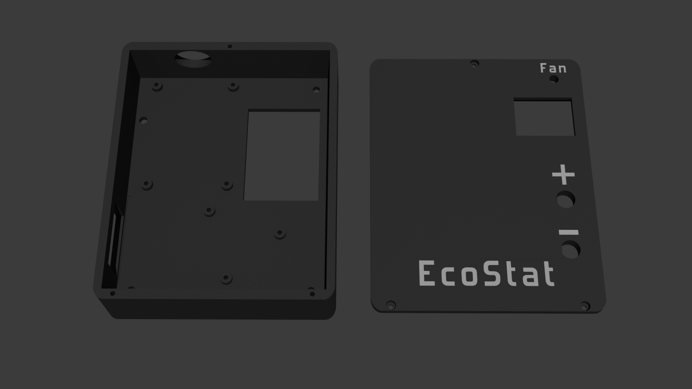


### 5. Install Components

1. Using M2x4 & M2x6 screws, install all previously listed components into their corresponding places within the case.
   (The DHT22 Sensor simply press fits into place).

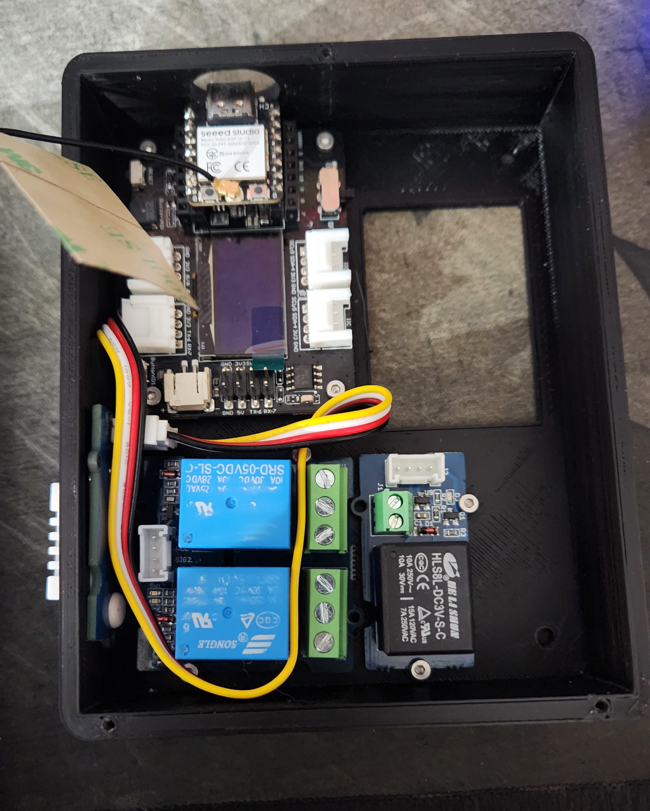

2. Connect all sensors and peripherals to their corresponding pins within the aforementioned YAML. (You may have to desolder and flip the connectors for the DHT22 and SSD1306 to the other side of their PCBS for proper fitment.) I used a combination of the included JST
connectors and DuPont style connections as well. for the DHT22 and SSD1306 I used JST. For the relays I used JST on one side and for the other side I used DuPont connectors for GPIO breakout headers on the expansion board. As you can see in the photo below. I also have a 3.7V Lithium cell plugged into the expansion boards battery connection for use as a backup battery in case of main supply power loss.

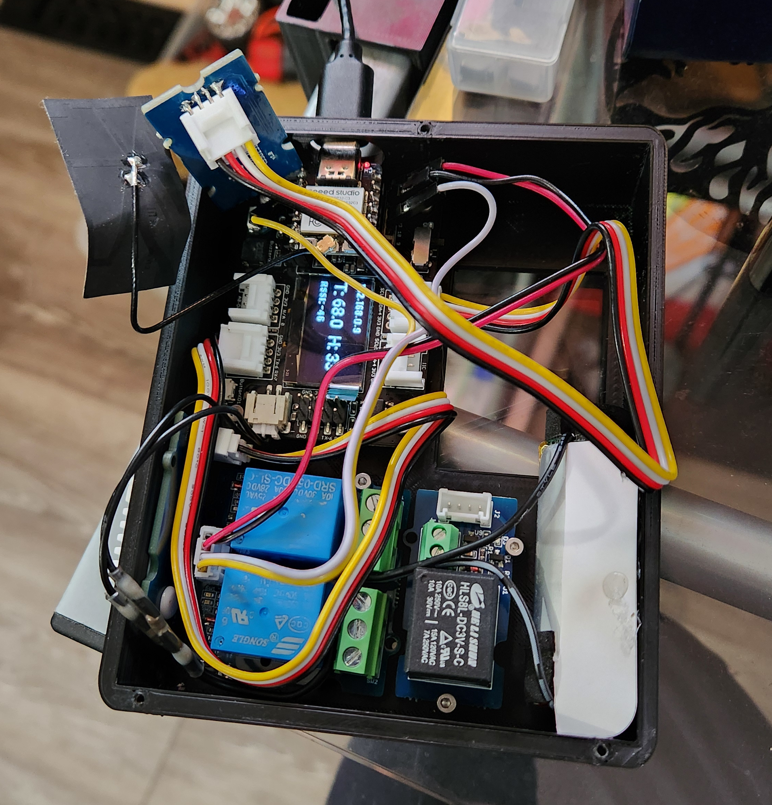

3. Connect desired style of momentary buttons to the inside front of the case. I accomplished this by attaching the buttons with a bit of heat glue. I then 
soldered wires to the diagonally opposing pins of the momentary buttons, and placed DuPont connectors on the other end of the wires to connect to
the correct breakout GPIO headers on the expansion board.

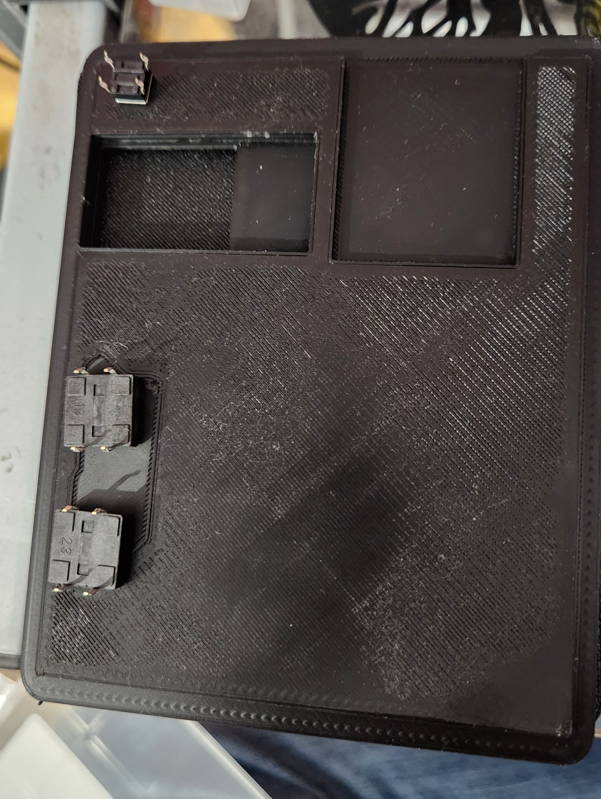

4. Assemble screen into the rear of the front cover (Secure in place with a small amount of heat glue). Then secure the front cover to case with 3 M4x6 screws as shown below.

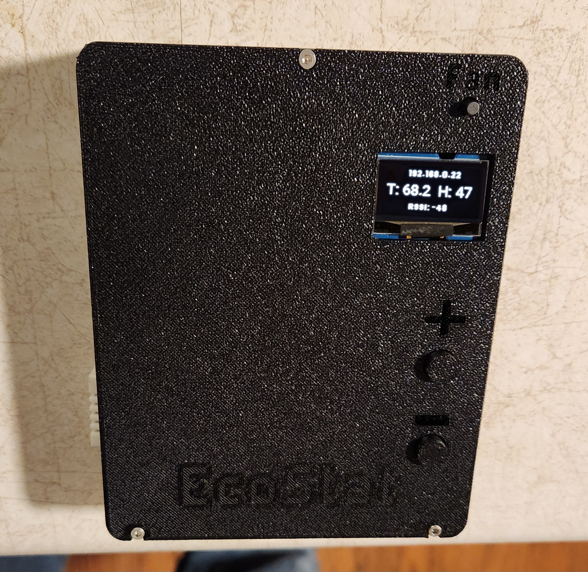

### 6. Be warm! (Or Cool)

Smart Thermostat Complete! Simply remove your homes existing thermostat and use the picture below to connect the correct wires, to the corresponding relays on EcoStat!

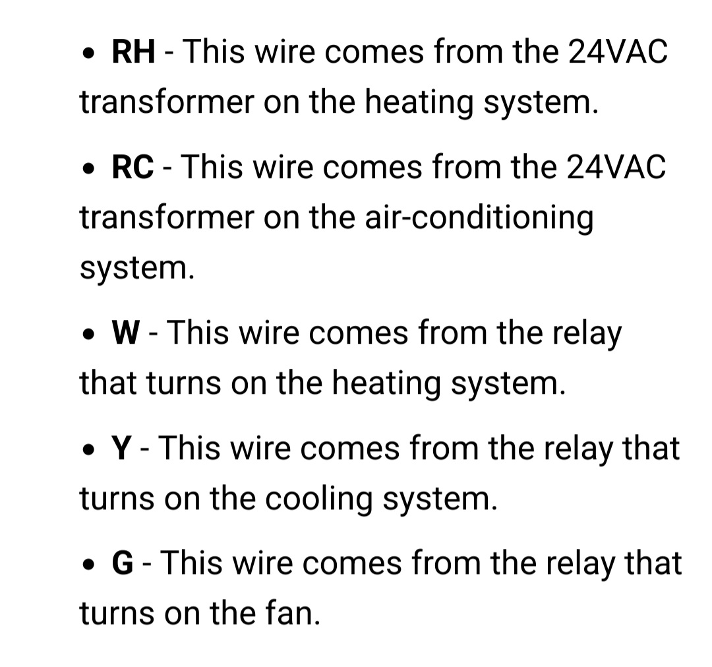
