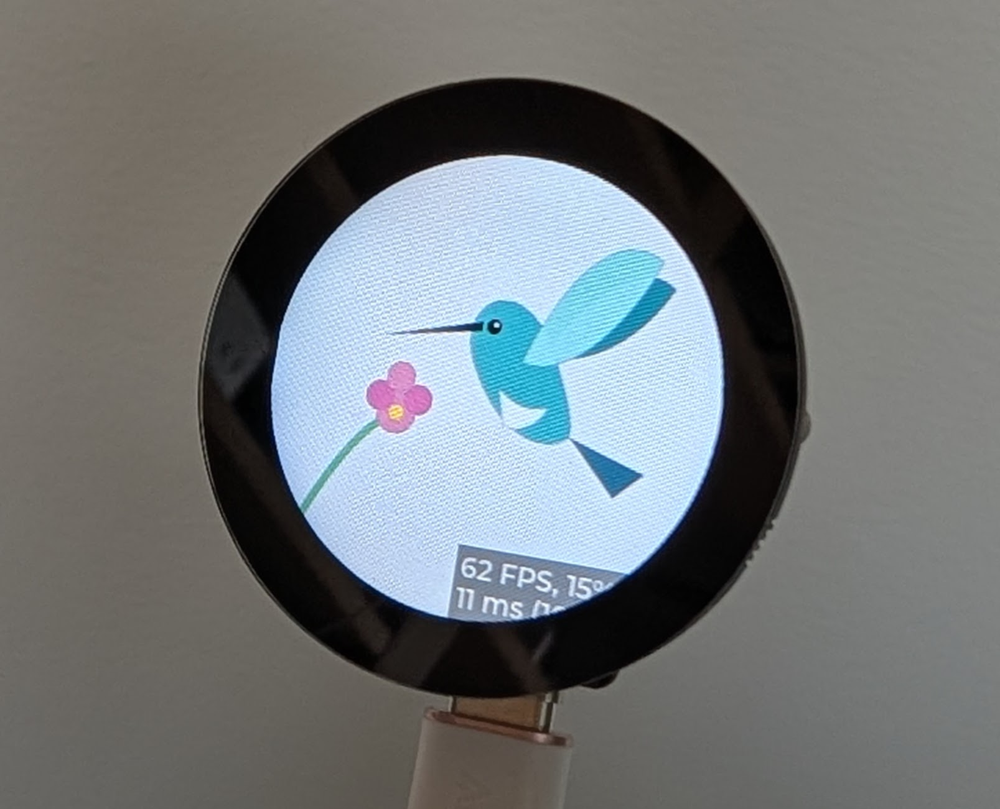
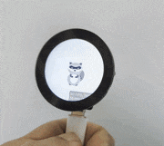
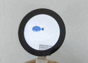

# Animation workshop: ESP32-S3 and LVGL optimization guide

Welcome to the Animation Workshop! This tutorial will walk you through the process of taking basic SVG animations and optimizing them for the ESP32-S3. The optimizations will walk you through five phases that show improvements from a stuttering **7-9 FPS** to a fluid **30 FPS**.

In this workshop, you will implement an application that renders and animates three vector assets: a **Hummingbird**, a **Raccoon**, and a **Whale**. You'll learn how to handle complex SVG rendering on resource-constrained hardware by navigating through progressive optimization phases.

<div style="display: flex; flex-wrap: wrap; gap: 20px; justify-content: center; align-items: flex-start; margin: 20px 0;">
  <div style="flex: 1; min-width: 200px; max-width: 300px;">
    
    <p style="text-align: center; font-weight: bold; margin-top: 8px;">Hummingbird</p>
  </div>
  <div style="flex: 1; min-width: 200px; max-width: 300px;">
    
    <p style="text-align: center; font-weight: bold; margin-top: 8px;">Raccoon</p>
  </div>
  <div style="flex: 1; min-width: 200px; max-width: 300px;">
    
    <p style="text-align: center; font-weight: bold; margin-top: 8px;">Whale</p>
  </div>
</div>

The example code uses a [Seeed Studio XIAO ESP32-S3 Plus](https://www.seeedstudio.com/XIAO-ESP32S3-p-5627.html) and a [XIAO Round Display](https://www.seeedstudio.com/XIAO-ESP32S3-p-5627.html).

### 🌐 The ecosystem
This project leverages a powerful open-source stack designed for high-performance embedded graphics:
*   **[ESP32-S3](https://www.espressif.com/en/products/socs/esp32-s3)**: A dual-core MCU with vector instructions and 8MB of Octal PSRAM.
*   **[ESP-IDF](https://docs.espressif.com/projects/esp-idf/en/latest/esp32s3/)**: The official development framework for Espressif SoCs.
*   **[LVGL](https://lvgl.io/)**: The most popular open-source embedded graphics library.
*   **`lvgl_cpp`**: A modern C++20 wrapper for LVGL that provides type safety and idiomatic abstractions for objects, animations, and displays.

---

## Getting started

### Prerequisites
Before diving into code, ensure you have a development ecosystem for working with ESP32. This tutorial assumes you have the following tools installed:
*   [Visual Studio Code](https://code.visualstudio.com/)
*   [Espressif IDF Extension for VS Code](https://marketplace.visualstudio.com/items?itemName=espressif.esp-idf-extension)

However, there is nothing in this project that prevents you from using other tools like [PlatformIO](https://platformio.org/) or the [ESP-IDF command-line interface](https://docs.espressif.com/projects/esp-idf/en/latest/esp32s3/api-guides/tools/idf-cli.html).

### Step 0: The "Hello World" check (crucial)
If you are new to the ESP32 ecosystem with ESP-IDF, **do not skip this step**.
1.  Open VS Code and press `F1`.
2.  Type `ESP-IDF: Show Examples Projects`.
3.  Select `get-started` -> `blink` (or `hello_world`).
4.  Build, Flash, and Monitor the project to your device.

**Why?** This verifies that your toolchain, USB drivers, and hardware connection are fully functional before we introduce the complexity of a C++ graphics library.

### Step 1a: Quick start (clone the workshop)
If you prefer not to start from scratch, you can clone the full workshop repository, which comes pre-configured with all components and settings.

```bash
git clone https://github.com/pedapudi/lvgl_workshop.git
cd lvgl_workshop
git submodule update --init --recursive
```

If you choose this path, you can skip to **Step 3 (Configuration)** to verify your settings, or jump straight to building.

### Step 1b: Create a new project (from scratch)
If you want to build the project yourself:
1.  Open `ESP-IDF: Show Examples Projects` again.
2.  Choose `get-started` -> `sample_project`.
3.  Click "Create project using example blink".

### Step 2: Install `lvgl_cpp`
We will install the library as a local component. In your project's root terminal:

```bash
mkdir -p components
cd components
git submodule add https://github.com/pedapudi/lvgl_cpp.git lvgl_cpp
git submodule update --init --recursive
```

> **Note**: `lvgl_cpp` includes an `idf_component.yml` file that will automatically pull the correct version of `lvgl/lvgl` (v9.x) from the IDF Component Registry during the first build. You do not need to install LVGL manually.

### Step 3: Configuration
Open the project configuration menu to enable C++20 and optimal settings:
1.  Press `F1` and run `ESP-IDF: SDK Configuration Editor (Menuconfig)`.
2.  Navigate to `Compiler options` -> `C++ Language Standard` and select `C++20` (or `GNU++20`).
3.  (Optional but recommended) Set `Compiler optimization level` to `Optimize for performance (-O2)`.

---

## �🛠️ How to follow this guide
This workshop uses a "software throttle" to simulate hardware limitations without forcing you to recompile the bootloader constantly. You can switch implementation levels in two ways:
1.  **The workshop way**: Use `idf.py menuconfig` -> `Animation Workshop` to toggle phases 1-5.
2.  **The manual way**: Modify `#define WORKSHOP_PHASE` in `main/workshop_config.h`.

---

## 📊 Phase overview
The workshop progresses through four stages of optimization, moving from naive functional implementation to expert-level PSRAM utilization.

| Phase | Title | Key Optimizations | Buffer Strategy | Rendering Mode |
| :--- | :--- | :--- | :--- | :--- |
| **Phase 1** | Baseline | 160MHz CPU / 20MHz SPI | 1x Full Frame (Internal) | Full Refresh |
| **Phase 2** | Foundation | 240MHz CPU / 80MHz SPI | 1x Full Frame (Internal) | Full Refresh |
| **Phase 3** | Parallelism | Double Buffering | 2x Partial Strip (Internal) | Partial Refresh |
| **Phase 4** | Expert | Octal PSRAM / SIMD | 2x Full Frame (PSRAM) | Partial Refresh |
| **Phase 5** | Native | Native Driver / SWAR SIMD | 2x Large Partial (Internal) | Partial Refresh |

---

## Phase 1: The baseline (naive implementation)
**Goal:** Display an SVG with minimal configuration.

In this phase, we focus on functional correctness. We use LVGL's **ThorVG** engine to decode and render SVG paths. However, because we haven't optimized the system, the CPU is slow (160MHz) and the rendering mode is set to **Full Refresh** (redrawing every pixel every frame), causing significant overhead.

### ⚙️ ESP-IDF configuration
To achieve this baseline in a production project, you would set:
- **CPU frequency**: `CONFIG_ESP_DEFAULT_CPU_FREQ_MHZ=160` in `sdkconfig`.
- **LVGL task stack**: Set as a parameter in your `xTaskCreate` call (typically `8192`).
- **Display bus**: Set `.pclk_hz = 20 * 1000 * 1000` (20MHz) in your `esp_lcd_panel_io_spi_config_t` struct.
- **Optimization**: `CONFIG_COMPILER_OPTIMIZATION_DEFAULT` (-Og).

### 💻 Implementation
Setting up the hardware and SVG display in Phase 1 requires orchestrating the display driver and the LVGL porting layer.

**Hardware and port initialization (`app_main`):**
```cpp
// Initialize the GC9A01 SPI display
Gc9a01 display_hw(display_cfg);
display_hw.init();

// Initialize the LVGL porting layer with SRAM-only buffers
LvglPort::Config lvgl_config;
lvgl_config.malloc_caps = MALLOC_CAP_DMA | MALLOC_CAP_INTERNAL;
lvgl_config.double_buffered = false;

LvglPort lvgl_port(lvgl_config);
lvgl_port.init(display_hw.get_panel_handle(), display_hw.get_io_handle());
```

**SVG display logic:**
```cpp
// 1. skip SVG header metadata to find the XML start tag
const char* raw_svg_ptr = hummingbird_svg;
while (*raw_svg_ptr && *raw_svg_ptr != '<') raw_svg_ptr++;

// 2. create an image descriptor for ThorVG
static lvgl::ImageDescriptor bird_dsc(75, 75, LV_COLOR_FORMAT_RAW,
                                    (const uint8_t*)raw_svg_ptr,
                                    strlen(raw_svg_ptr) + 1);

// 3. display the SVG on an image object
auto hummingbird = std::make_unique<lvgl::Image>(parent);
hummingbird->set_src(bird_dsc).center();
```

**Result:** ~9 FPS. The static hummingbird renders successfully, and the raccoon animation runs without crashing (though it remains choppy). However, the default 8KB stack is dangerously close to overflowing when scaling complex paths.

---

## Phase 2: Hardware foundation
**Goal:** Maximize the ESP32-S3's raw clock speeds.

SVG rendering is a "Math Problem." By increasing the CPU frequency, we give the vector engine more cycles to calculate Bezier curves.

### ⚡ The strategy
1.  **CPU boost**: Increase frequency from 160MHz to **240MHz**.
2.  **SPI overclock**: Increase the display highway speed from 20MHz to **80MHz**.
3.  **Compiler power**: Enable **-O3** performance optimizations to speed up the vector math engine.

### ⚙️ ESP-IDF configuration
- **CPU speed**: `CONFIG_ESP_DEFAULT_CPU_FREQ_MHZ=240` in `sdkconfig`.
- **Display bus**: `.pclk_hz = 80 * 1000 * 1000` (80MHz) in your SPI config. 
    > **Note**: 80MHz is the absolute limit for the S3's SPI bus. Higher is not supported by the hardware, and lower speeds cause visible "tearing" as the bus cannot keep up with the frame updates.
- **Optimization level**: Set `CONFIG_COMPILER_OPTIMIZATION_PERF=y` in your configuration to enable `-O3`.
- **Byte correction**: In your `flush_cb`, implement a loop to swap bytes from Little-Endian (CPU) to Big-Endian (LCD):
```cpp
void LvglPort::flush_cb(lv_display_t* disp, const lv_area_t* area, uint8_t* px_map) {
    auto* port = (LvglPort*)lv_display_get_user_data(disp);
    uint16_t* buf = (uint16_t*)px_map;
    uint32_t len = (area->x2 - area->x1 + 1) * (area->y2 - area->y1 + 1);

    for (uint32_t i = 0; i < len; i++) {
        uint16_t color = buf[i];
        buf[i] = (color << 8) | (color >> 8);
    }

    esp_lcd_panel_draw_bitmap(port->panel_handle_, area->x1, area->y1,
                              area->x2 + 1, area->y2 + 1, buf);
}
```

**Result:** ~15 FPS. The movement is visibly smoother compared to Phase 1.

---

## Phase 3: Parallel logic and double buffering
**Goal:** Eliminate screen tearing and decouple the CPU from the display.

### ⚡ The strategy
*   **Double buffering**: We allocate **two** separate buffers. While the hardware DMA (Direct Memory Access) is sending Buffer A to the screen, the CPU can immediately start drawing Buffer B.
*   **Stack boost**: We increase the LVGL task stack to **64KB**. Vector graphics use recursion; an 8KB stack will overflow and crash when scaling complex assets.

### ⚙️ ESP-IDF configuration
- **DMA enable**: Ensure `MALLOC_CAP_DMA` is used during buffer allocation.
- **LVGL buffers**: When calling `lv_display_set_buffers`, provide two pointers instead of one.
- **Buffer mode**: Set `LV_DISPLAY_RENDER_MODE_PARTIAL`.

### 💻 Implementation
Moving to Phase 3 requires enabling double buffering and increasing the task stack to prevent stack overflows during complex SVG scaling.

**Double buffer allocation:**
```cpp
// Allocate two strike buffers in internal memory
lvgl_config.double_buffered = true;
lvgl_config.render_mode = LV_DISPLAY_RENDER_MODE_PARTIAL;

// Use small strip buffers (usually 1/10th or 1/20th of the screen)
// to fit both buffers in fast internal SRAM.
lvgl_config.full_frame = false; 
```

**Recursion-safe stack boost:**
```cpp
// Increasing from 8KB (Standard) to 64KB (Vector-Safe)
lvgl_config.task_stack_size = 65536; 
```

**Result:** ~9 FPS (regression!).

### 🧠 Deep dive: Tiling penalty
Why does adding parallelism sometimes make the animation *slower*?

1.  **Phase 2 (Full Frame)**: The ThorVG engine calculates the vector path **once** per frame for the entire 240x240 image.
2.  **Phase 3 (Partial Strips)**: Because we are double-buffering in limited SRAM, we can only fit small buffers (e.g., 20 lines). This forces ThorVG to run its calculation loop **12 times** (once for each strip) to generate the full image.

This overhead of re-calculating the vector geometry 12 times heavily outweighs the benefit of parallel DMA transfer, resulting in lower overall FPS (~9 FPS vs ~15 FPS). This is the classic "Compute vs. Bandwidth" trade-off. We solve this in **Phase 4**.

---

## Phase 4: Expert optimization (the 26 FPS secret)
**Goal:** Eliminate "Tiling Overhead" using Large Octal PSRAM.

### ⚡ The strategy
1.  **Full-frame buffers**: We move the buffers to the 8MB **octal PSRAM** and increase them to a **full Frame** (240x240 pixels).
    *   *The Gain*: ThorVG renders the Raccoon in a **single pass**. Even though PSRAM is slightly slower than SRAM, avoiding 12x re-calculation is a massive win.
2.  **Xtensa intrinsics**: We replace the manual swap loop with `__builtin_bswap16`, a hardware instruction that swaps bits in a **single cycle**.

### ⚙️ ESP-IDF configuration
- **PSRAM init**: `CONFIG_SPIRAM=y`, `CONFIG_SPIRAM_MODE_OCT=y`, `CONFIG_SPIRAM_SPEED_80M=y`.
- **Memory caps**: Use `MALLOC_CAP_DMA | MALLOC_CAP_SPIRAM` for 115KB buffer allocation.
- **Compiler power**: Enable `CONFIG_COMPILER_OPTIMIZATION_PERF=y` and `CONFIG_COMPILER_OPTIMIZATION_LTO=y`. 

**Result:** **~25 FPS**. Smooth, high-fidelity SVG animation.
 
### 🧠 Deep dive: Explicit hardware intrinsics
The most expensive part of the rendering pipeline is the **Flush Callback**. For every frame, we must swap the bytes of every pixel (Endianness correction) and invert colors (LCD panel requirement).

Instead of a standard C math loop, Phase 4 uses:
```cpp
buf[i] = __builtin_bswap16(buf[i]);
```
*   **`__builtin_bswap16`**: This is a compiler intrinsic that tells the CPU to use a dedicated hardware instruction (`BE`) to swap bytes in a single clock cycle.
*   **⚠️ NOT Pitfall (`~`)**: You might see examples using `~__builtin_bswap16()`. This is used for "Active-Low" LCD panels that require bitwise inversion to display colors correctly. If your colors look like a "photo negative," remove the `~` operator.

**Note:** During Phase 1 implementation, using the `~` inversion on standard GC9A01 panels often results in inverted colors. Always verify your panel's logic level before applying bitwise negation in the flush loop.

---


## Phase 5: Native Architecture (The 30+ FPS Standard)
**Goal:** "Large Partial" SRAM buffering and 32-bit SWAR bit-swapping.

While **Phase 4** brute-forced performance using massive PSRAM buffers, it introduced latency due to external memory wait-states. **Phase 5** reaches the **30+ FPS milestone** by shifting to a "Mobile-Grade" architecture: using high-speed **Internal SRAM** buffers but making them large enough to minimize tiling overhead.

### ⚡ The Strategy: "Mobile-Grade" Architecture
1.  **"Large Partial" Buffering**: We allocate **1/2 Screen buffers** (240x120) in Internal SRAM. This achieves the best of both worlds: higher bandwidth than PSRAM and only a 2x tiling multiplier (compared to 12x in Phase 3).
2.  **32-bit SWAR Processing**: We implement **SIMD-within-a-Register (SWAR)** in the driver's flush logic. This allows us to swap and invert two pixels (32 bits) in the same time it previously took to do one pixel (16 bits) using standard intrinsics.
3.  **Core unpinning**: By removing task pinning (`tskNO_AFFINITY`), we allow the FreeRTOS scheduler to saturate the S3's dual CPU cores—one core can handle the heavy ThorVG rasterization while the other services the high-frequency SPI DMA interrupts.

### 🚀 Acceleration: SIMD patch
In addition to the C++ optimizations, we rely on a critical hardware accelerator: the `lvgl_s3_simd_patch`.

*   **Problem:** Default LVGL uses generic C loops for pixel blending. On the ESP32, this is slow because it processes one pixel at a time (inefficient) or uses generic compiler optimizations that miss platform-specific instructions.
*   **Solution:** We inject hand-written **ESP32-S3 Assembly** routines (macros like `lv_color_blend_to_rgb565_esp`) that leverage the Xtensa LX7's SIMD (Single Instruction, Multiple Data) capabilities.

**Configuration:**
This is controlled via `sdkconfig`:
```properties
CONFIG_LV_USE_DRAW_SW_ASM=255
```
> [!NOTE]
> **Global vs. Phase 5**: This setting is **globally active** for all workshop phases (1-5). However, you likely won't notice its impact until **Phase 5**.
>
> **Why?** In Phase 4 (PSRAM), the CPU is constantly stalled waiting for memory to arrive from the external RAM chip. The assembly routine is fast, but it can't run if it doesn't have data! In **Phase 5 (Internal SRAM)**, the memory bandwidth is finally fast enough to feed the SIMD pipeline, allowing the assembly optimizations to shine.

**How it works:**
1.  **Header injection**: The `lvgl_s3_simd_patch` component forces itself into LVGL's include path.
2.  **Macro overlay**: It redefines standard macros (e.g., `LV_DRAW_SW_COLOR_BLEND_TO_RGB565`) to point to our custom shim functions.
3.  **Linker magic**: It uses `-u symbol` flags to force the linker to include the assembly objects, ensuring they aren't optimized away.

---

### 💻 32-bit SWAR Loop
The secret sauce of Phase 5 is the **SIMD-Within-A-Register (SWAR)** optimization.
Standard pixel processing handles one 16-bit pixel at a time. By casting the buffer to `uint32_t*`, we can process **two pixels** per CPU cycle.

**Intuition:**
We need to swap bytes (`RGB565` -> `BGR565`) for two pixels packed into a 32-bit integer `0xAABBCCDD`.
*   Target: `0xBBAADDCC`
*   Mask 1 (`0xFF00FF00`): Isolates `AA` and `CC`.
*   Mask 2 (`0x00FF00FF`): Isolates `BB` and `DD`.
*   Shift and OR: Moves them to the correct positions simultaneously.

**Implementation (`esp32_spi.cpp`):**
```cpp
// 1. Cast 16-bit buffer to 32-bit pointer for 2x throughput
uint32_t* buf32 = reinterpret_cast<uint32_t*>(buf);
size_t len32 = len / 2; // Process 2 pixels at once

// 2. Define the SWAR lambda
auto swap_two_pixels = [](uint32_t v) {
    // 0xAABBCCDD -> 0xBBAADDCC
    return ((v & 0xFF00FF00) >> 8) | 
           ((v & 0x00FF00FF) << 8);
};

// 3. Unrolled loop (8x) to maximize pipeline usage
// This processes 16 pixels per loop iteration!
size_t i = 0;
for (; i < len32 - 8; i += 8) {
    buf32[i + 0] = swap_two_pixels(buf32[i + 0]);
    buf32[i + 1] = swap_two_pixels(buf32[i + 1]);
    buf32[i + 2] = swap_two_pixels(buf32[i + 2]);
    buf32[i + 3] = swap_two_pixels(buf32[i + 3]);
    buf32[i + 4] = swap_two_pixels(buf32[i + 4]);
    buf32[i + 5] = swap_two_pixels(buf32[i + 5]);
    buf32[i + 6] = swap_two_pixels(buf32[i + 6]);
    buf32[i + 7] = swap_two_pixels(buf32[i + 7]);
}

// 4. Handle remaining pixels
for (; i < len32; i++) {
    buf32[i] = swap_two_pixels(buf32[i]);
}
```

### 🧠 Deep dive: Why is using a large partial buffer faster?
It seems counter-intuitive that **Partial Buffers (Phase 5)** are faster than **Full-Frame (Phase 4)**.

*   **Phase 4 (PSRAM)**:
    *   **Pros**: 1x render pass. 0x tiling overhead.
    *   **Cons**: PSRAM writes are ~3-4x slower than SRAM. The CPU spends significant time waiting for the SPI bus.
*   **Phase 5 (Internal SRAM)**:
    *   **Pros**: SRAM writes are near instantaneous (comparatively).
    *   **Cons**: 2x render passes (top half, bottom half).
*   **Verdict**: For the ESP32-S3 @ 240MHz, the cost of **one extra SVG render pass** is *lower* than the cost of writing 115KB of data to external PSRAM. This is a critical architectural finding: **Memory bandwidth often matters more than compute cycles.**

**Result:** **~30 FPS**. Fluid animation that hits the limits of the XIAO Round Display's SPI bus.

---

## 🎨 The animation engine

Our UI doesn't just display static images; it reproduces high-fidelity motion from SVG specifications using `lvgl_cpp`. While LVGL's SVG rendering engine, ThorVG, does not support animation tags in SVGs, this workshop still leverages `lvgl::Animation` to animate the SVGs. This is a useful utility for animation, and for the purpose of this workshop, it generates CPU-intensive load to showcase the performance of the workshop phases.

### The SVG-to-LVGL Bridge
SVG animations often use "Cubic Bezier" curves (defined as `keySplines`) for fluid motion. LVGL has a built-in Bezier engine, but it's traditionally used for internal easing.

We've exposed this logic natively in `lvgl_cpp` so you can use standard SVG control points directly in your C++ code:

```cpp
// From main/ui/workshop_ui.cpp
// ANIMATION: FLAPPING (SVG keySpline="0.25 0.1 0.25 1.0")
a1.set_var(bird_dsc)
    .set_values(0, 7)
    .set_duration(150)
    // ...
    // Explicitly using the SVG cubic bezier curve
    .set_path_cb(lvgl::Animation::Path::CubicBezier(256, 102, 256, 1024)); 
```
*Note: The control points (0.25, 0.1, etc.) are mapped to the 0..1024 integer range used by LVGL's fixed-point math engine.*

### 🧪 Configuration deep dive: sdkconfig.defaults
For high-performance animations, your `sdkconfig` is just as important as your code. Here is the breakdown of the settings used in this workshop:

| Config | Value | Purpose |
| :--- | :--- | :--- |
| **`CONFIG_ESP_CONSOLE_USB_SERIAL_JTAG`** | `y` | **Crucial**: Offloads logging to the S3's dedicated hardware. This frees up **GPIO 43/44** on the XIAO S3 Plus, which are otherwise hardwired to the UART0 console and conflict with the display/touch pins on the Seeed XIAO Round Display. |
| **`CONFIG_ESP_DEFAULT_CPU_FREQ_MHZ_240`** | `y` | Sets the CPU clock to its maximum. Vector rendering is pure math; every MHz counts. |
| **`CONFIG_COMPILER_OPTIMIZATION_PERF`** | `y` | Enables **`-O3`** optimizations. This tells the compiler to prioritize execution speed over binary size (essential for ThorVG's complex loops). |
| **`CONFIG_COMPILER_OPTIMIZATION_LTO`** | `y` | Enables **link time optimization**. This allows the compiler to optimize *across* source files, potentially inlining your `flush_cb` directly into the engine's render loop. |
| **`CONFIG_SPIRAM`** | `y` | Enables the external 8MB PSRAM. Without this, you are limited to ~320KB of internal RAM, making full-frame buffering impossible. |
| **`CONFIG_SPIRAM_MODE_OCT`** | `y` | Configures the PSRAM in **octal mode** (8 data lines). This provides the massive bandwidth required for the CPU to read/write 240x240 pixel frames without stuttering. |
| **`CONFIG_LV_USE_THORVG`** | `y` | Enables the high-performance C++ vector engine used by LVGL for SVG rendering. |
| **`CONFIG_LV_CACHE_DEF_SIZE`** | `2097152` | Allocates a **2MB image cache** in PSRAM. This essentially "remembers" rendered frames, turning expensive vector math into simple memory copies for static or repeating frames. |

---

## 📊 Final performance summary
| Phase | Optimization | Target FPS | Primary focus |
| :--- | :--- | :--- | :--- |
| **Phase 1** | Baseline | ~9 FPS | SPI 20MHz / Full Refresh |
| **Phase 2** | Foundation | ~15 FPS | CPU 240MHz / SPI 80MHz |
| **Phase 3** | Parallelism | ~9 FPS (Regression!) | Double Buffering / DMA |
| **Phase 4** | Expert Tuning | ~25 FPS | PSRAM / Full-Frame Buffers |
| **Phase 5** | **Native** | **~30 FPS** | **Internal SRAM / 32-bit SWAR / SIMD** |

---

### Final note
In a production app, you could aim for **Phase 5** parameters from day one. The "journey" is for teaching, but the destination is always **native architecture** on the ESP32-S3. Source files contain verbose pedagogical comments to explain why certain C++ patterns were chosen.
