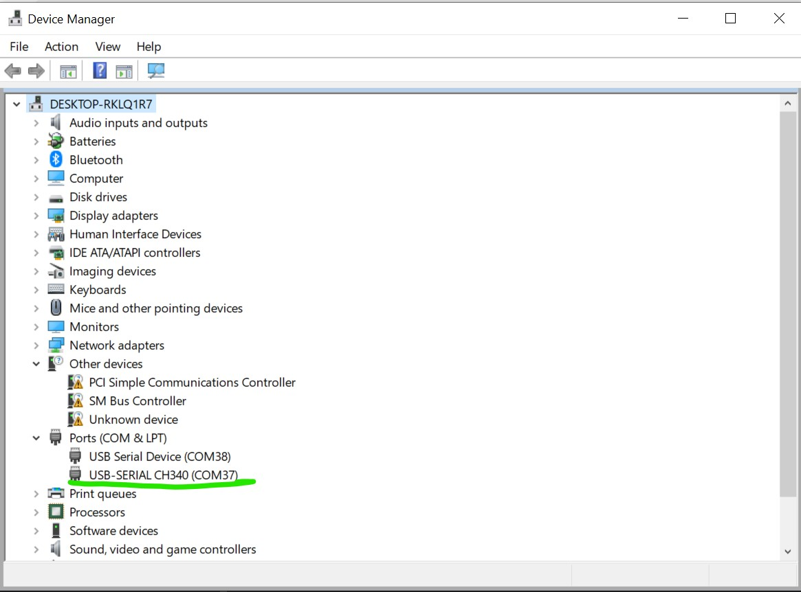
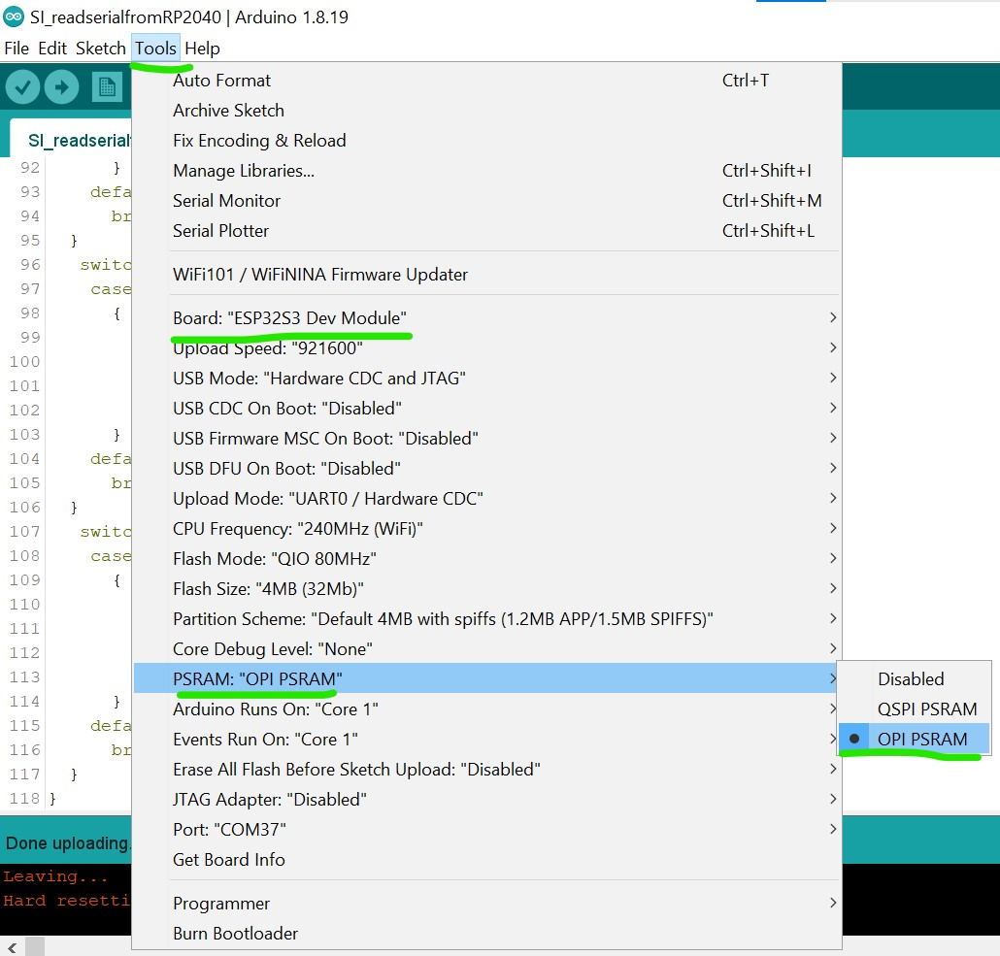
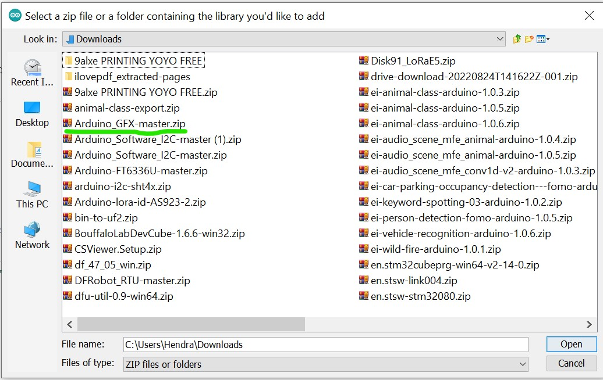
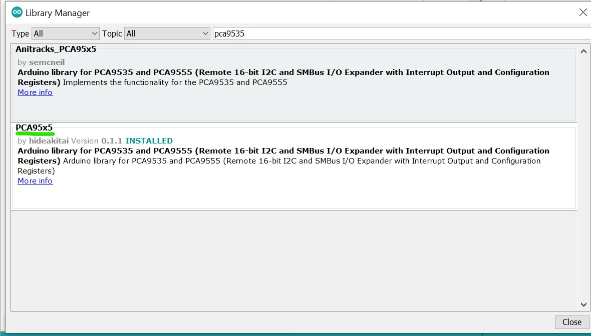
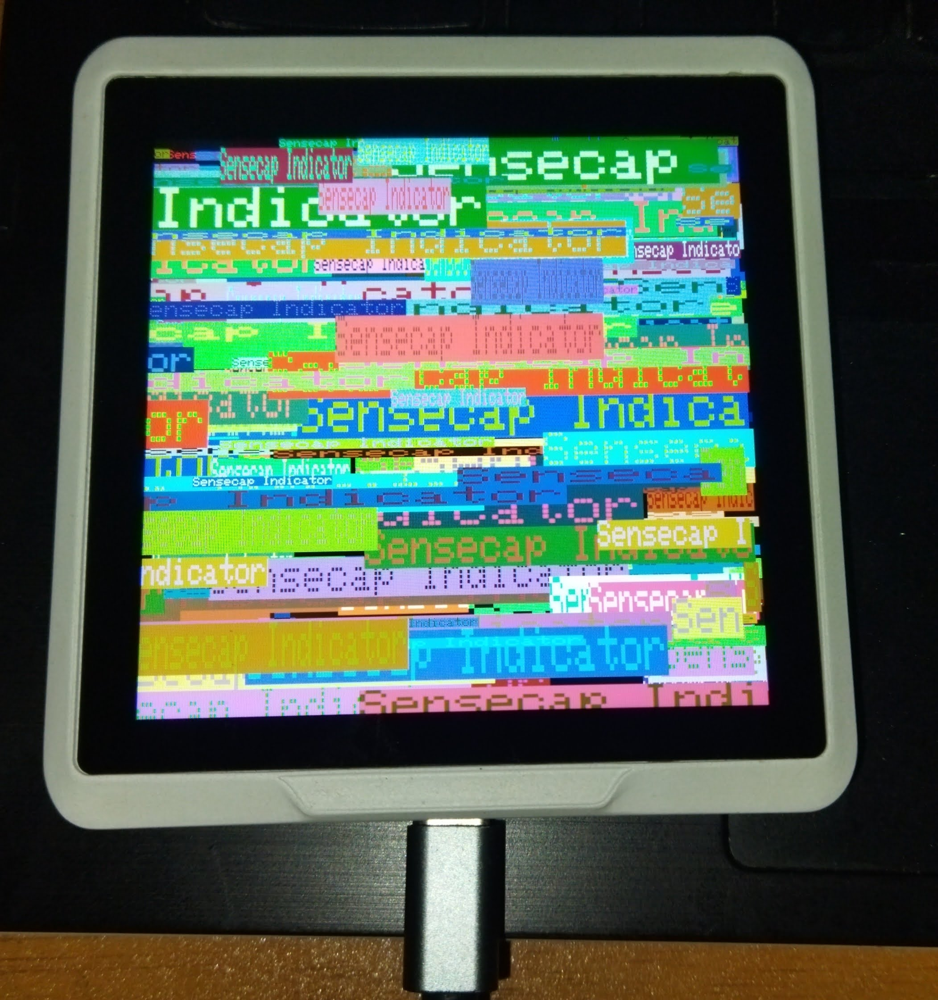
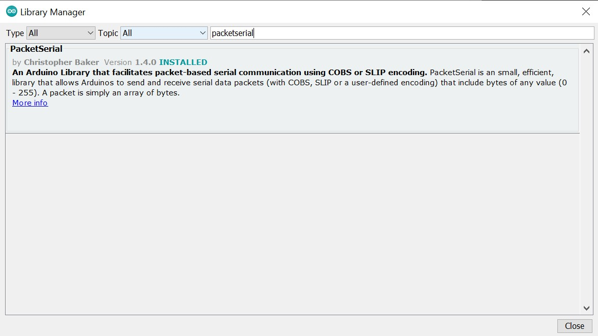
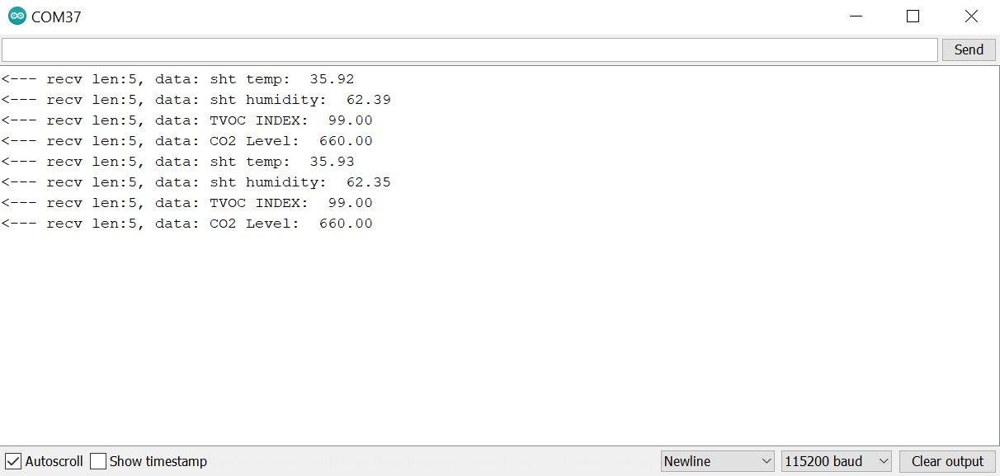
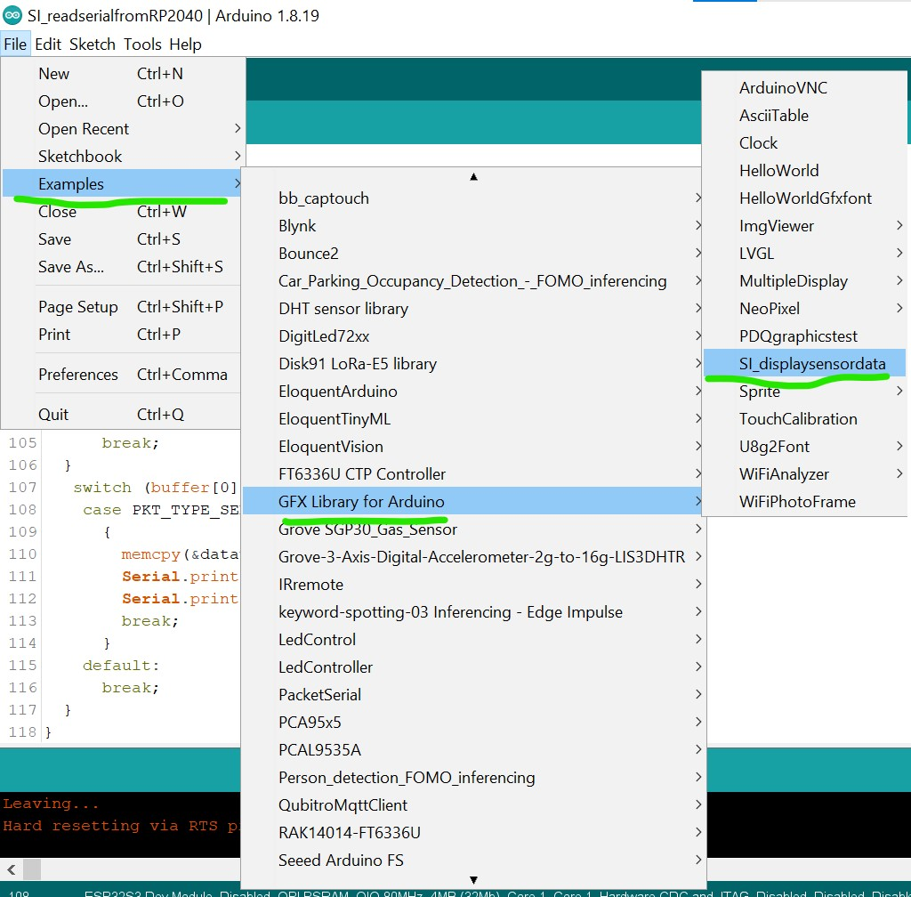
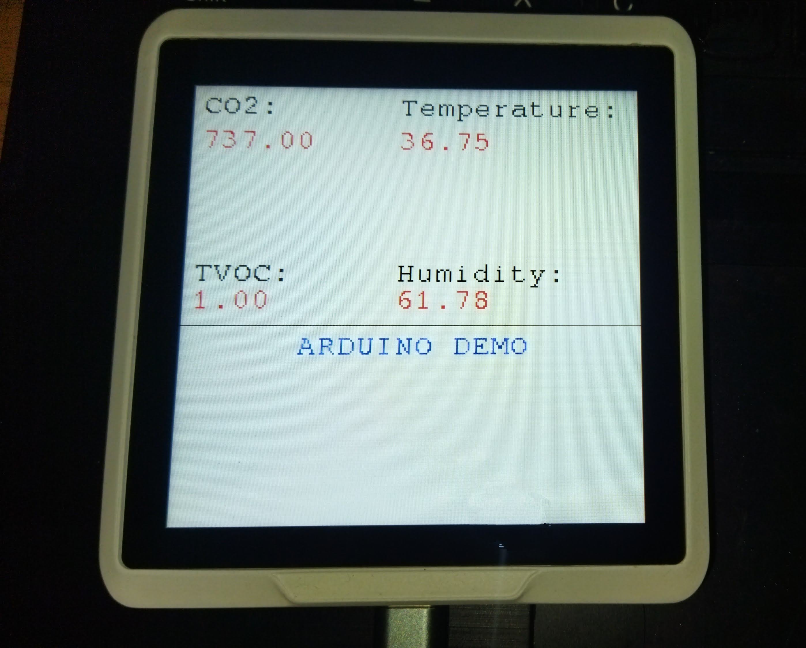

# **Arduino**

[Arduino](https://www.arduino.cc/) still hold up as one of the top choice for maker to develop their project. The Sensecap Indicator use one of the most popular microcontroller that already supported by many Arduino Libraries which is the ESP32. Specifically Sensecap Indicator use the ESP32S3 variant which boost more performance than the classic ESP32.

This tutorial will guide you to develop your own custom project/firmware for the Sensecap Indicator using the simplicity and Flexibility of the Arduino Framework.

## **Preparation**

**Specification & System Diagram**

|Screen|3\.95 Inch, Capacitive RGB Touch Screen using FT6336 driver|
| :- | :- |
|**Screen Resolution**|480 x 480 pixels using the ST7701 driver|
|**Power Supply**|5V-DC, 1A|
|**Battery**|No battery,only powered by USB port|
|**Processor**|<p>**ESP32-S3:** Xtensa® dual-core 32-bit up to 240 MHz</p><p>**RP2040:** Dual ARM Cortex-M0+ up to 133MHz</p>|
|**Flash**|<p>**ESP32-S3:** 8MB</p><p>**RP2040:** 2MB</p>|
|**External Storage**|Support up to 32GB Micro SD Card (not included)|
|**Wi-Fi**|802\.11b/g/n, 2.4GHz|
|**Bluetooth**|Bluetooth 5.0 LE|
|**LoRa(SX1262**)|<p>LoRa and FSK Modem</p><p>+21dBm Max Transmitted Power</p> <p>-136dBm@SF12 BW=125KHz RX Sensitivity</p><p>Up to 5km communication distance</p>|
|**Sensors**(Optional)|<p>**CO2(Sensirion SCD41)**</p><p>Range: 0-40000ppm</p><p>Accuracy: 400ppm-5000ppm ±(50ppm+5% of reading)</p><p>**TVOC (SGP40)**</p><p>Range: 1-500 VOC Index Points</p>**Grove Temperature and Humidity Sensor(AHT20)**<p>Temperature Range: -40 ~ + 85 ℃/± 0.3 ℃; 0 ~ 100% RH/± 2% RH (25 ℃)</p>|


<div align="center"></div>

Based on the Specs and diagram above there are few things need to keep in mind for better understanding on using this tutorial
1. There are two MCU used for the Sensecap Indicator which are RP2040 and ESP32S3
2. All the sensors are connected to RP2040 Microcontroller using I2C protocol
3. There is one I2C IO expander module using the PCA9535 IC
4. The screen are connected to ESP32S3 microcontroller with 2 Pin (CS, RESET) connected to the PCA9535 I2C expander
5. The RP2040 are connected to the ESP32S3 via pin 20 and pin 19 on the ESP32S3 using UART Interfaces
6. If the Sensecap Indicator plugged into the Computer you will be presented with 2 Serial Port one for the RP2040 and one for the ESP32S3. The one with the information **USB-SERIAL CH340** is the one that's connected to the ESP32S3 and this is the one will be use for the rest of the tutorial.



**Arduino Setup**

Before continue with the tutorial there are a few things needed to do in the Arduino IDE.

1. Make sure the ESP32 board definition is already installed and at the newest version. Follow [this guide](https://docs.espressif.com/projects/arduino-esp32/en/latest/installing.html) if the ESP32 board is not in the Arduino IDE yet.
2. Choose the ESP32S3 Dev Module as the Board definition
3. For the content of this tutorial, you need to turn on the PSRAM function of the Arduino IDE to ensure that the screen will working properly



## **Screen**

Based on the Specification and sistem diagram above, the Sensecap Indicator is using the ST7701 module for the screen. It uses parallel interfaces and already connected to the pins on the ESP32S3 MCU.
In order to be able to drive the screen a few arduino library is needed.

:::note
[Download the library screen for the screen here](https://drive.google.com/file/d/1Fzb9VEHyGaecVqauoIJi4HbFFEUC3Scz/view?usp=sharing)
:::

After the library is downloaded open the Arduino, on the sketch menu choose add zip library




Next on the same sketch menu choose manage libraries then search for "PCA9535" and choose the one made by hidea kitai then install it



The PCA9535 library is needed because the CS pin of the ST7701 is connected the PCA9535 i2c expander module. Specifically the Pin 4 of the i2c module.
After all the necessary libraries is installed upload the code below to test if the screen is working with the Arduino environment

```cpp
#include <Arduino_GFX_Library.h>
#include <PCA95x5.h>
#define GFX_BL DF_GFX_BL // default backlight pin, you may replace DF_GFX_BL to actual backlight pin

/* More dev device declaration: https://github.com/moononournation/Arduino_GFX/wiki/Dev-Device-Declaration */
#if defined(DISPLAY_DEV_KIT)
Arduino_GFX *gfx = create_default_Arduino_GFX();
#else /* !defined(DISPLAY_DEV_KIT) */

#define GFX_DEV_DEVICE ESP32_S3_RGB
#define GFX_BL 45
Arduino_DataBus *bus = new Arduino_SWSPI(
    GFX_NOT_DEFINED /* DC */, PCA95x5::Port::P04 /* CS */,
    41 /* SCK */, 48 /* MOSI */, GFX_NOT_DEFINED /* MISO */);

// option 1:
// Uncomment for 4" rect display
Arduino_ESP32RGBPanel *rgbpanel = new Arduino_ESP32RGBPanel(
    18 /* DE */, 17 /* VSYNC */, 16 /* HSYNC */, 21 /* PCLK */,
    4 /* R0 */, 3 /* R1 */, 2 /* R2 */, 1 /* R3 */, 0 /* R4 */,
    10 /* G0 */, 9 /* G1 */, 8 /* G2 */, 7 /* G3 */, 6 /* G4 */, 5 /* G5 */,
    15 /* B0 */, 14 /* B1 */, 13 /* B2 */, 12 /* B3 */, 11 /* B4 */,
    1 /* hsync_polarity */, 10 /* hsync_front_porch */, 8 /* hsync_pulse_width */, 50 /* hsync_back_porch */,
    1 /* vsync_polarity */, 10 /* vsync_front_porch */, 8 /* vsync_pulse_width */, 20 /* vsync_back_porch */);
Arduino_RGB_Display *gfx = new Arduino_RGB_Display(
    480 /* width */, 480 /* height */, rgbpanel, 2 /* rotation */, true /* auto_flush */,
    bus, GFX_NOT_DEFINED /* RST */, st7701_type1_init_operations, sizeof(st7701_type1_init_operations));

#endif /* !defined(DISPLAY_DEV_KIT) */
/*******************************************************************************
 * End of Arduino_GFX setting
 ******************************************************************************/

void setup(void)
{
  Serial.begin(115200);
  // Serial.setDebugOutput(true);
  // while(!Serial);
  Serial.println("Arduino_GFX Hello World example");

#ifdef GFX_EXTRA_PRE_INIT
  GFX_EXTRA_PRE_INIT();
#endif

  // Init Display
  if (!gfx->begin())
  {
    Serial.println("gfx->begin() failed!");
  }
  gfx->fillScreen(BLACK);

#ifdef GFX_BL
  pinMode(GFX_BL, OUTPUT);
  digitalWrite(GFX_BL, HIGH);
#endif

  gfx->setCursor(10, 10);
  gfx->setTextColor(RED);
  gfx->println("Sensecap Indicator");

  delay(5000); // 5 seconds
}

void loop()
{
  gfx->setCursor(random(gfx->width()), random(gfx->height()));
  gfx->setTextColor(random(0xffff), random(0xffff));
  gfx->setTextSize(random(6) /* x scale */, random(6) /* y scale */, random(2) /* pixel_margin */);
  gfx->println("Sensecap Indicator");

  delay(1000); // 1 second
}
```

If everything goes well a "Sensecap Indicator" text will be printed randomly on the screen



:::tip
For more understanding on using the Arduino GFX library you can visit the [Arduino_GFX github page](https://github.com/moononournation/Arduino_GFX)
:::

## **Sensors**
As mentioned above on the preparation section, all the sensors are connected to the RP2040. Assuming that you still have the default firmware on the RP2040 the sensor data are sent to the ESP32S3 using the UART interface.
In order for the ESP32S3 to be able to read the data a library need to be installed called **PacketSerial** 


After the library is installed upload the code below to get the sensor data on the ESP32S3
```cpp
//
// Copyright (c) 2012 Christopher Baker <https://christopherbaker.net>
//
// SPDX-License-Identifier: MIT
//


#include <PacketSerial.h>

PacketSerial myPacketSerial;

#define RXD2 20
#define TXD2 19

#define PKT_TYPE_SENSOR_SCD41_CO2 0XB2
#define PKT_TYPE_SENSOR_SHT41_TEMP 0XB3
#define PKT_TYPE_SENSOR_SHT41_HUMIDITY 0XB4
#define PKT_TYPE_SENSOR_TVOC_INDEX 0XB5
#define DEBUG   0

void setup()
{
  // We begin communication with our PacketSerial object by setting the
  // communication speed in bits / second (baud).
  myPacketSerial.begin(115200);

  // If we want to receive packets, we must specify a packet handler function.
  // The packet handler is a custom function with a signature like the
  // onPacketReceived function below.
 
  Serial1.begin(115200, SERIAL_8N1, RXD2, TXD2);
  myPacketSerial.setStream(&Serial1);
  myPacketSerial.setPacketHandler(&onPacketReceived);
}


void loop()
{
  // Do your program-specific loop() work here as usual.

  // The PacketSerial::update() method attempts to read in any incoming serial
  // data and emits received and decoded packets via the packet handler
  // function specified by the user in the void setup() function.
  //
  // The PacketSerial::update() method should be called once per loop(). Failure
  // to call the PacketSerial::update() frequently enough may result in buffer
  // serial overflows.
  myPacketSerial.update();

  // Check for a receive buffer overflow (optional).
  if (myPacketSerial.overflow())
  {
    // Send an alert via a pin (e.g. make an overflow LED) or return a
    // user-defined packet to the sender.
    //
    // Ultimately you may need to just increase your recieve buffer via the
    // template parameters (see the README.md).
  }
}


void onPacketReceived(const uint8_t *buffer, size_t size) {

  
  Serial.printf("<--- recv len:%d, data: ", size);


  if (size < 1) {
    return;
  }
  //byte serbytes[] = buffer[i];
  float dataval;
  switch (buffer[0]) {
    case PKT_TYPE_SENSOR_SCD41_CO2:
      {
        memcpy(&dataval, &buffer[1], sizeof(float));
        Serial.print("CO2 Level:  ");
        Serial.println(dataval);
        break;
      }
    default:
      break;
  }
   switch (buffer[0]) {
    case PKT_TYPE_SENSOR_SHT41_TEMP:
      {
        memcpy(&dataval, &buffer[1], sizeof(float));
        Serial.print("sht temp:  ");
        Serial.println(dataval, 2);
        break;
      }
    default:
      break;
  }
   switch (buffer[0]) {
    case PKT_TYPE_SENSOR_SHT41_HUMIDITY:
      {
        memcpy(&dataval, &buffer[1], sizeof(float));
        Serial.print("sht humidity:  ");
        Serial.println(dataval, 2);
        break;
      }
    default:
      break;
  }
   switch (buffer[0]) {
    case PKT_TYPE_SENSOR_TVOC_INDEX:
      {
        memcpy(&dataval, &buffer[1], sizeof(float));
        Serial.print("TVOC INDEX:  ");
        Serial.println(dataval);
        break;
      }
    default:
      break;
  }
}
```

Open Serial monitor and set the Baud Rate to 115200 the you will be presented the sensors data from the RP2040


## Display The Sensor Data

Open the example menu on the Arduino IDE and guide yourself to **GFX library for Arduino** then choose the **SI_displaysensordata** example and upload it


If successfully uploaded you will be presented with sensors data displayed on the screen


Congratulation now you can develop the Sensecap Indicator using Arduino IDE

## Further Development

There is still one part that is not configure in this tutorial which is the touchscreen part. I already try few arduino library for the FT6336 module but none have a successful result. This due to the INT Pin and RESET pin of the FT6366 module connected to the PCA9535 I2C expander and it need to configured manually in the library. I might get back to try this in the future.

## Special Thanks
thanks to github user [u4mzu4](https://github.com/u4mzu4) for the SWSPI config file that support the Sensecap indicator

## ✨ Contributor Project

- This project is supported by the Seeed Studio [Contributor Project](https://github.com/orgs/Seeed-Studio/projects/6/views/1?pane=issue&itemId=30957479).


## Tech Support & Product Discussion

Thank you for choosing our products! We are here to provide you with different support to ensure that your experience with our products is as smooth as possible. We offer several communication channels to cater to different preferences and needs.

<div class="button_tech_support_container">
<a href="https://forum.seeedstudio.com/" class="button_forum"></a> 
<a href="https://www.seeedstudio.com/contacts" class="button_email"></a>
</div>

<div class="button_tech_support_container">
<a href="https://discord.gg/eWkprNDMU7" class="button_discord"></a> 
<a href="https://github.com/Seeed-Studio/wiki-documents/discussions/69" class="button_discussion"></a>
</div>
