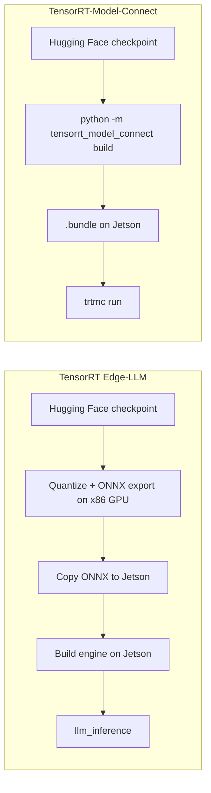

# Deploy TensorRT-Model-Connect on Jetson AGX Orin

<div align="center">
  
</div>

This wiki shows how to run [NVIDIA TensorRT-Model-Connect](https://github.com/NVIDIA/TensorRT-Model-Connect) (TRTMC) on a Seeed reComputer powered by **Jetson AGX Orin**. After the native runtime is built, the path is short: start from a Hugging Face checkpoint, produce a TensorRT `.bundle` on the device, and run text generation. There is no separate x86 host and no ONNX export step.

The walkthrough uses **Qwen3-4B-Instruct-2507** in FP16. That model is a dense transformer, so TensorRT can use a batched prefill engine. The same page also records conversion memory on AGX Orin 64GB, plus the two workloads where TRTMC is faster than llama.cpp CUDA: long prefill on Qwen3-4B, and greedy decode on Qwen3-0.6B.

:::note
TensorRT-Model-Connect is a public preview. APIs, model coverage, and the build flow can still change. NVIDIA’s own guidance is to use TRTMC when you want to try supported models quickly, and to start with [TensorRT Edge-LLM](/deploy_tensorrt_edge_llm_on_jetpack6.2/) when you need a production-oriented LLM/VLM runtime on Jetson.
:::

## What is TensorRT-Model-Connect?

TensorRT-Model-Connect is a collection of model-family reference implementations on top of NVIDIA TensorRT. A family-owned builder reads a Hugging Face snapshot, constructs TensorRT engines, and writes a versioned `.bundle`. The same bundle can be executed from the `trtmc` CLI or from native C++ task APIs such as text generation.

The practical difference on Jetson is the conversion path. TensorRT Edge-LLM still expects you to quantize and export ONNX on an x86 Linux machine with a discrete GPU, then copy those ONNX files to the device for engine generation. TRTMC builds the engine bundle on the Jetson itself.



<div align="center">
  
</div>

## Why this path is easier on Jetson

| Topic | TensorRT Edge-LLM | TensorRT-Model-Connect |
| --- | --- | --- |
| Where conversion runs | ONNX export on an x86 Linux host with an NVIDIA GPU, then engine build on Jetson | Hugging Face snapshot to `.bundle` on Jetson |
| Intermediate files | ONNX graphs, often tens of gigabytes, copied to the device | None. The `.bundle` is the artifact |
| Commands after setup | Export, copy, build engine, then run `llm_inference` | `python -m tensorrt_model_connect build` and `trtmc run` |
| Host memory during conversion | Vendor docs: FP8 ONNX export can need about 18–20× model size in CPU RAM on the x86 machine | Measured on AGX Orin 64GB for Qwen3-4B FP16: about 30.6 GB host used, 41 GB container peak |
| Best fit | Production LLM/VLM deployment on Jetson | Trying a supported model quickly on the same box that will run it |

The memory row is not a same-model bake-off. Edge-LLM’s published ONNX-export numbers explain why that pipeline usually leaves Jetson and occupies a high-RAM workstation. TRTMC’s numbers below are what we actually observed while building Qwen3-4B FP16 on AGX Orin 64GB.

## Hardware

This tutorial was reproduced on **reComputer Classic J5012** with Jetson AGX Orin 64GB. The Qwen3-4B FP16 conversion peaked around 41 GB inside the container, so 64 GB unified memory is the practical target. J5011 (32GB) is the same product family, but this conversion is likely to thrash or fail there.

<div style={{display:'grid', gridTemplateColumns:'repeat(2, minmax(0, 1fr))', gap:'24px', margin:'28px 0 42px'}}>
  <div style={{display:'flex', flexDirection:'column', overflow:'hidden', borderRadius:'16px', border:'2px solid #00a86b', background:'linear-gradient(145deg, #dce6ee, #cbd8e3)', color:'#172b4d', boxShadow:'0 14px 34px rgba(0,168,107,.18)'}}>
    <div style={{height:'290px', padding:'26px', display:'flex', alignItems:'center', justifyContent:'center', background:'linear-gradient(145deg, #d3dfe9, #bccbd8)'}}>
      
    </div>
    <div style={{display:'flex', flexDirection:'column', flex:'1', padding:'24px'}}>
      <div style={{fontSize:'23px', lineHeight:'1.35', fontWeight:'900', color:'#172b4d'}}>reComputer Classic J5012</div>
      <div style={{marginTop:'9px', color:'#526581', fontWeight:'600'}}>NVIDIA Jetson AGX Orin 64GB · verified in this wiki</div>
      <div class="get_one_now_container" style={{textAlign:'center', marginTop:'auto', paddingTop:'24px'}}>
        <a class="get_one_now_item" href="https://www.seeedstudio.com/reComputer-Classic-J5012-p-6881.html" target="_blank" rel="noopener noreferrer">
          <strong><span><font color={'FFFFFF'} size={"4"}> Get One Now 🖱️</font></span></strong>
        </a>
      </div>
    </div>
  </div>

  <div style={{display:'flex', flexDirection:'column', overflow:'hidden', borderRadius:'16px', border:'2px solid #3182ce', background:'linear-gradient(145deg, #dce6ee, #cbd8e3)', color:'#172b4d', boxShadow:'0 14px 34px rgba(49,130,206,.18)'}}>
    <div style={{height:'290px', padding:'26px', display:'flex', alignItems:'center', justifyContent:'center', background:'linear-gradient(145deg, #d3dfe9, #bccbd8)'}}>
      
    </div>
    <div style={{display:'flex', flexDirection:'column', flex:'1', padding:'24px'}}>
      <div style={{fontSize:'23px', lineHeight:'1.35', fontWeight:'900', color:'#172b4d'}}>reComputer Classic J5011</div>
      <div style={{marginTop:'9px', color:'#526581', fontWeight:'600'}}>NVIDIA Jetson AGX Orin 32GB · same board family</div>
      <div class="get_one_now_container" style={{textAlign:'center', marginTop:'auto', paddingTop:'24px'}}>
        <a class="get_one_now_item" href="https://www.seeedstudio.com/reComputer-Classic-J5011-p-6880.html" target="_blank" rel="noopener noreferrer">
          <strong><span><font color={'FFFFFF'} size={"4"}> Get One Now 🖱️</font></span></strong>
        </a>
      </div>
    </div>
  </div>
</div>

## Prerequisites

Prepare the following on the Jetson:

- reComputer Classic J5012, or another Jetson AGX Orin 64GB system
- JetPack 7.2 / Ubuntu 24.04 / L4T R39.2
- Docker with the NVIDIA runtime (`docker info` should list `nvidia` under Runtimes)
- About 40 GB free disk for the development image, Hugging Face snapshot, and `.bundle`
- Network access to GitHub, Hugging Face, and `nvcr.io`
- Optional for the benchmark section: `nvpmodel` MAXN and `jetson_clocks`

The verified software stack was:

| Item | Version |
| --- | --- |
| Device | Jetson AGX Orin 64GB |
| OS | Ubuntu 24.04.4 LTS, kernel 6.8.12-tegra |
| L4T | R39.2 |
| CUDA in the TRTMC image | 13.3.1 |
| TensorRT in the TRTMC image | 11.1.0.106 (TensorRT 26.07) |
| GPU SM | 87 (Orin) |
| Power mode | MAXN, GPU 1300 MHz |

:::tip
If `docker ps` returns `permission denied`, add your user to the `docker` group and log in again:

```bash
sudo usermod -aG docker $USER
```

:::

## 1. Clone TensorRT-Model-Connect

```bash
git clone https://github.com/NVIDIA/TensorRT-Model-Connect.git
cd TensorRT-Model-Connect
```

The official getting-started path is [Build from Source](https://nvidia.github.io/TensorRT-Model-Connect/getting-started/source-build) plus [Quick Start](https://nvidia.github.io/TensorRT-Model-Connect/getting-started/quick-start). The commands below are that path, with Jetson-specific flags filled in.

## 2. Build the development container

On AGX Orin the compute capability is 8.7, so `TRTMC_SM=87`. Jetson Docker images also need `--runtime nvidia`.

```bash
GPU=0
SM="$(
  nvidia-smi -i "$GPU" \
    --query-gpu=compute_cap \
    --format=csv,noheader,nounits |
  tr -d '.[:space:]'
)"
IMAGE="trtmc-quickstart"

docker build \
  -f Dockerfile.dev.aarch64 \
  -t "$IMAGE" \
  requirements

SOURCE_DIR="$(git rev-parse --show-toplevel)"

docker run --rm -it \
  --runtime nvidia \
  --gpus "device=${GPU}" \
  --ipc=host \
  --network host \
  --mount "type=bind,source=${SOURCE_DIR},target=/src" \
  --workdir /src \
  --env TRTMC_SM="$SM" \
  "$IMAGE" \
  bash
```

:::caution
Keep the remaining commands inside this container. The image already pins TensorRT 11.1, a Python 3.12 venv, and the native headers used by the Qwen family build. If `nvidia-smi` is missing on your Jetson, set `SM=87` by hand.
:::

If the Hugging Face snapshot and bundle will live on an external SSD, bind-mount that disk as well, for example `-v /path/to/data:/out`.

## 3. Build the native runtime

Run these commands in the container:

```bash
python -m pip install --no-deps -e . -C py-only=true

TRTMC_BUILD_DIR="build-sm${TRTMC_SM}"

cmake -S . -B "$TRTMC_BUILD_DIR" -G Ninja \
  -DCMAKE_BUILD_TYPE=Release \
  -DCMAKE_CUDA_ARCHITECTURES="${TRTMC_SM}-real" \
  -DTRTMC_BUILD_BACKEND_RTX=OFF \
  -DTRTMC_BUILD_TESTS=OFF \
  -DTRTMC_BUILD_EXAMPLES=OFF

cmake --build "$TRTMC_BUILD_DIR" --parallel "$(nproc)" --target \
  trtmc \
  trtmc_backend_trt \
  trtmc_model_qwen

export PATH="$PWD/$TRTMC_BUILD_DIR:$PATH"
```

`trtmc` looks up native libraries from `--runtime-root`. Point that argument at the CMake build directory, which must contain `libtrtmc_core.so`, `libtrtmc_runtime.so`, `libtrtmc_backend_trt.so`, and `libtrtmc_model_qwen.so`.

## 4. Build the Qwen3-4B bundle on Jetson

This is the conversion step that used to require an x86 GPU box. Pin `--max-sequence-length`. The Hugging Face config for this checkpoint advertises a 262,144-token context, and leaving that default in place will exhaust memory during engine generation.

```bash
python -m tensorrt_model_connect build Qwen/Qwen3-4B-Instruct-2507 \
  --precision fp16 \
  --backend trt \
  --max-sequence-length 2048 \
  --max-batch-size 1 \
  --tensor-parallel-size 1 \
  --output qwen3-4b-instruct-2507.bundle \
  --verbose
```

A local snapshot directory can replace the model ID. The builder downloads the checkpoint, lets the Qwen family claim it, and writes one `.bundle` that already contains the TensorRT engines.

On the verified J5012 unit, Qwen3-4B FP16 with `max_sequence_length=2048` produced the following conversion footprint. The public Qwen single-device FP16 path writes split engines (`engine.plan` + `prefill.plan`); the numbers below were taken from a dual-profile build, where prefill and decode share one plan with two optimization profiles.

| Metric | Measured value |
| --- | --- |
| Precision / layout | FP16, dual-profile |
| Max sequence length | 2048 |
| Engine generation | 128.1 s |
| TensorRT weights | 7.49 GiB |
| Prefill activation memory | 633 MiB |
| Decode activation memory | 12 MiB |
| TensorRT allocator peak GPU | 7,674 MiB |
| Host used, peak | 30,640 MB |
| Container memory, peak | 41.09 GiB |
| Python RSS, peak | 24.7 GB |
| Final `.bundle` | 7.6 GiB |

:::tip
Those host/container peaks are why this wiki recommends AGX Orin 64GB. You are converting on the edge device, but you still need enough unified memory for TensorRT to build the engines.
:::

Inspect the bundle before running it:

```bash
trtmc inspect ./qwen3-4b-instruct-2507.bundle
```

`trtmc inspect` prints JSON. Look for `family: qwen`, `task: text_generation`, and a sections list that includes `engine.plan` plus tokenizer files. A split FP16 build also lists `prefill.plan`. There is still no ONNX graph in the bundle.

## 5. Run inference

```bash
trtmc run ./qwen3-4b-instruct-2507.bundle \
  --runtime-root "$PWD/build-sm${TRTMC_SM}" \
  --prompt "What is the capital of France? Answer in one word." \
  --use-chat-template true \
  --enable-thinking false \
  --max-new-tokens 32
```

A successful run prints a short completion such as `Paris`. The same bundle can be loaded from C++ with `trtmc::load_task(bundle, runtime_root)` and the `ITextGeneration` interface; see the [C++ Task API](https://nvidia.github.io/TensorRT-Model-Connect/api/cpp-api).

## Inference performance vs llama.cpp

Conversion convenience is only half of the story. On the same J5012 we compared TRTMC FP16 with llama.cpp CUDA + flash-attention FP16, both at context 2048. The chart and table below keep only the workloads where TRTMC is faster.

<div align="center">
  
</div>

| Workload | TensorRT-Model-Connect | llama.cpp CUDA | TRTMC advantage |
| --- | --- | --- | --- |
| Qwen3-4B-Instruct-2507 long prefill | 1,967 tok/s · 606.9 ms / 1,194 tok | 1,601 tok/s · 743.2 ms / 1,190 tok | +22.9% |
| Qwen3-0.6B decode, 256 new tokens | 69.4 tok/s | 65.5 tok/s | +6.0% |
| Qwen3-0.6B decode after a 1,212-token prompt | 69.6 tok/s | 63.0 tok/s | +10.5% |

The 4B prefill result is the median of three measured runs after one warmup. The 0.6B decode results are one measured run after warmup, with the model kept loaded for the whole request so KV cache is filled once and then many tokens are generated.

:::note
Use a dense Qwen3 transformer for this comparison. Hybrid Mamba models such as NVIDIA Nano-9B currently prefill token-by-token in TRTMC, so they are a poor way to judge TensorRT throughput.
:::

## Reproduce the faster workloads

Lock clocks first, then keep the model loaded for the whole request. Report the engine timing lines, not process wall time. Process wall time includes TensorRT deserialize / GGUF load and will hide the gap.

```bash
sudo nvpmodel -m 0   # MAXN; confirm with nvpmodel -q
sudo jetson_clocks
```

llama.cpp on this board was built with CUDA and flash-attention, then run with all layers on GPU:

```bash
cmake -S llama.cpp -B llama.cpp/build-cuda \
  -DGGML_CUDA=ON -DGGML_CUDA_FA=ON -DGGML_NATIVE=ON \
  -DCMAKE_BUILD_TYPE=Release -DCMAKE_CUDA_ARCHITECTURES=87-real
cmake --build llama.cpp/build-cuda -j
```

### 1. Qwen3-4B long prefill

This is the workload where a batched TensorRT prefill engine helps. Build the FP16 bundle from [section 4](#4-build-the-qwen3-4b-bundle-on-jetson) with `--max-sequence-length 2048`, convert the same snapshot to GGUF F16, then feed both runtimes the same long prompt.

Shared setup for this row:

- Model: `Qwen/Qwen3-4B-Instruct-2507`, FP16, context 2048
- Prompt: about 6,000 background characters plus a 70-word Paris question (1,190–1,194 tokens after the chat template)
- Decode: 64 new tokens, greedy (`temperature=0`, `top-k=1`)
- TRTMC: dual-profile bundle, chat template on, thinking off
- llama.cpp: `GGML_CUDA=ON`, `GGML_CUDA_FA=ON`, `-ngl 99 -c 2048 -b 512 -ub 512 -fa on --jinja`
- Warmup 1 + measured 3; use the median

Convert the same Hugging Face snapshot to GGUF F16 for llama.cpp:

```bash
python3 convert_hf_to_gguf.py Qwen3-4B-Instruct-2507 \
  --outfile Qwen3-4B-Instruct-2507-F16.gguf \
  --outtype f16
```

Write the long prompt, then run TRTMC. Read `[trtmc-perf] Prefill` (or the `qwen prefill` engine timing).

```bash
python3 - <<'PY'
from pathlib import Path
filler = (
    "Transit planners track on-time performance, bus bunching, depot energy use, "
    "and spare-ratio policy across a dense coastal city. Housing staff compare "
    "permit latency, vacancy, and school-capacity constraints. Emergency managers "
    "rehearse flood gates, hospital diversion, and radio fallback. "
)
question = (
    "Write a 70-word factual paragraph about Paris. Include the Seine, the Louvre, "
    "and why it became the capital of France. Do not use bullet points. "
    "Do not stop after one word."
)
body = "Use the background notes only as context. Ignore them if they are not needed.\n\n"
while len(body) < 6000:
    body += filler
Path("qwen3-4b-long-prompt.txt").write_text(body[:6000] + "\n\n" + question)
print("wrote qwen3-4b-long-prompt.txt", 6000 + 2 + len(question), "chars")
PY

PROMPT="$(cat qwen3-4b-long-prompt.txt)"

trtmc run ./qwen3-4b-instruct-2507.bundle \
  --runtime-root "$PWD/build-sm${TRTMC_SM}" \
  --prompt "$PROMPT" \
  --use-chat-template true \
  --enable-thinking false \
  --temperature 0 \
  --top-k 1 \
  --max-new-tokens 64
```

Same prompt on llama.cpp. Read the `prompt eval time` / `Prompt:` tok/s line, not the process lifetime.

```bash
llama-completion \
  -m Qwen3-4B-Instruct-2507-F16.gguf \
  -ngl 99 -c 2048 -b 512 -ub 512 -fa on \
  --jinja --temp 0 --top-k 1 -n 64 \
  --no-warmup --simple-io --no-display-prompt \
  --prompt "$PROMPT"
```

On the verified J5012 this is **1,967 tok/s vs 1,601 tok/s** prefill.

### 2. Qwen3-0.6B greedy decode

Decode is the second place TRTMC leads, once you ask for a long completion in one request. Build a 0.6B FP16 bundle the same way as Qwen3-4B, still pinning `--max-sequence-length 2048`. The measured bundle used a split prefill/decode engine with KV cache rows=2048.

```bash
python -m tensorrt_model_connect build Qwen/Qwen3-0.6B \
  --precision fp16 \
  --backend trt \
  --max-sequence-length 2048 \
  --max-batch-size 1 \
  --tensor-parallel-size 1 \
  --output qwen3-0.6b.bundle \
  --verbose
```

Convert the same snapshot to GGUF F16 for llama.cpp, then run two decode cases. This board's `llama-cli` needs `-st` (single-turn) and does not accept `--prompt-file`; pass `--prompt` instead.

```bash
python3 convert_hf_to_gguf.py Qwen3-0.6B \
  --outfile Qwen3-0.6B-F16.gguf \
  --outtype f16
```

Short prompt, 256 new tokens:

```bash
COUNT_PROMPT='Count from 1 to 220. Write only integers separated by spaces. Do not add commentary. Continue until 220.'

trtmc run ./qwen3-0.6b.bundle \
  --runtime-root "$PWD/build-sm${TRTMC_SM}" \
  --prompt "$COUNT_PROMPT" \
  --use-chat-template true \
  --enable-thinking false \
  --temperature 0 \
  --top-k 1 \
  --max-new-tokens 256

llama-cli -st --simple-io \
  -m Qwen3-0.6B-F16.gguf \
  -ngl 99 -c 2048 \
  --temp 0 --top-k 1 -n 256 \
  --prompt "$COUNT_PROMPT"
```

Long prompt, 128 new tokens. The measured prompt was 1,212 tokens after the chat template: notes about reaching orbit, then a request for a 180-word briefing.

```bash
python3 - <<'PY'
from pathlib import Path
note = (
    "Low Earth orbit is a crowded working neighborhood for satellites, space stations, "
    "and visiting spacecraft. Reaching it requires a launcher that can fight gravity, "
    "thinning air, and the need for horizontal speed of about 7.8 kilometers per second. "
    "A typical rocket uses staged chemical propulsion. The first stage produces high "
    "thrust to clear the dense atmosphere. Upper stages ignite in thinner air to add "
    "delta-v. Guidance computers fly a gravity turn, then a circularization burn. "
)
text = "Read the notes below. Then write a detailed 180-word briefing on how rockets reach orbit. Keep writing until the briefing is complete.\n\n"
while text.count(" ") < 900:
    text += note
Path("qwen3-06b-long-prompt.txt").write_text(text)
print("wrote", len(text), "chars")
PY

LONG_PROMPT="$(cat qwen3-06b-long-prompt.txt)"

trtmc run ./qwen3-0.6b.bundle \
  --runtime-root "$PWD/build-sm${TRTMC_SM}" \
  --prompt "$LONG_PROMPT" \
  --use-chat-template true \
  --enable-thinking false \
  --temperature 0 \
  --top-k 1 \
  --max-new-tokens 128

llama-cli -st --simple-io \
  -m Qwen3-0.6B-F16.gguf \
  -ngl 99 -c 2048 \
  --temp 0 --top-k 1 -n 128 \
  --prompt "$LONG_PROMPT"
```

Read TRTMC `qwen decoder` / `[trtmc-perf] Decode`, and llama.cpp `eval time` / `Generation:` tok/s. On the verified J5012 this is **69.4 vs 65.5 tok/s** for 256 new tokens, and **69.6 vs 63.0 tok/s** after the 1,212-token prompt.

## What the numbers mean

- **Fewer machines.** You do not need an x86 GPU workstation just to export ONNX. The Jetson that will serve the model can also build it.
- **Lower conversion host RAM than the Edge-LLM FP8 ONNX path.** Edge-LLM documents CPU RAM up to about 20× model size for FP8 ONNX export. The Qwen3-4B FP16 TRTMC build stayed around 31 GB host used / 41 GB container on Orin 64GB.
- **Faster long prefill on Qwen3-4B** than llama.cpp FP16, which is the workload where a batched TensorRT engine helps.
- **Faster greedy decode on Qwen3-0.6B** when the whole completion runs in one request (256 new tokens, or 128 new tokens after a long prompt).
- **A reusable artifact.** The `.bundle` is what you copy, inspect, and run. There is no parallel ONNX tree to keep in sync.

## Troubleshooting

| Issue | What to check |
| --- | --- |
| Container cannot see the GPU | Use `--runtime nvidia` and confirm `docker info` lists the `nvidia` runtime |
| Engine build runs out of memory | Pin `--max-sequence-length 2048`, use AGX Orin 64GB, and close other GPU users |
| `trtmc run` cannot load libraries | Pass `--runtime-root` to the CMake build directory; the CLI does not search `PATH` or the current directory for DSOs |
| Hugging Face download fails | Place a local snapshot on disk and pass that directory to `build` instead of the model ID |
| Decode looks fine but prefill is slow | Confirm you are on a dense transformer with a dual-profile / batched prefill engine, not a hybrid Mamba graph |
| TRTMC looks slower than llama.cpp | Compare engine timing (`[trtmc-perf]`, `qwen decoder`, llama.cpp `eval time`), not process wall time. Keep the model loaded and generate many tokens in one request |
| `llama-cli` errors on `--prompt-file` or waits for stdin | Use `-st --simple-io --prompt "..."` |
| `nvidia-smi` is missing on Jetson | Set `SM=87` for AGX Orin |

## Resources

- [TensorRT-Model-Connect repository](https://github.com/NVIDIA/TensorRT-Model-Connect)
- [TensorRT-Model-Connect documentation](https://nvidia.github.io/TensorRT-Model-Connect/)
- [Deploy TensorRT Edge-LLM on JetPack 6.2](/deploy_tensorrt_edge_llm_on_jetpack6.2/)
- [reComputer Classic J501 Getting Started](/ai_robotics_seeed_agx_orin_dev_kit_getting_started/)
- [Qwen3-4B-Instruct-2507](https://huggingface.co/Qwen/Qwen3-4B-Instruct-2507)
- [Qwen3-0.6B](https://huggingface.co/Qwen/Qwen3-0.6B)

## Tech Support & Product Discussion

Thank you for choosing our products! We are here to provide you with different support to ensure that your experience with our products is as smooth as possible. We offer several communication channels to cater to different preferences and needs.

<div class="button_tech_support_container">
<a href="https://forum.seeedstudio.com/" class="button_forum"></a>
<a href="https://www.seeedstudio.com/contacts" class="button_email"></a>
</div>

<div class="button_tech_support_container">
<a href="https://discord.gg/eWkprNDMU7" class="button_discord"></a>
<a href="https://github.com/Seeed-Studio/wiki-documents/discussions/69" class="button_discussion"></a>
</div>
