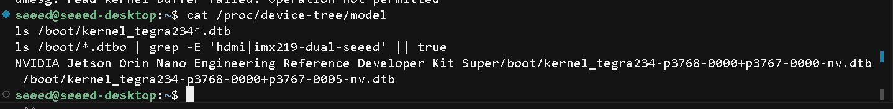
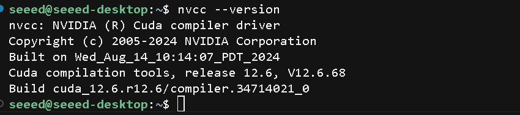

This wiki shows how to clone a full development environment from an **NVIDIA Jetson Orin Nano Developer Kit**, build a Hybrid BSP that can be flashed to **Seeed reComputer Classic (J4011/J4012, board config `recomputer-orin-j401`)**, and complete the flash.

It extends the same-carrier DIY BSP flow. If your source and target are both Seeed boards, use [Creating a Custom BSP Package from Jetson Development Environment](/make_diy_bsp_for_jetson/) instead.

Related docs:

- [Creating a Custom BSP Package from Jetson Development Environment](/make_diy_bsp_for_jetson/)
- [Migrate /home Data from Jetson Orin Nano Developer Kit to reComputer](/migrate_home_data_from_jetson_orin_nano_developer_kit_to_recomputer/)
- [Flash JetPack to a Selected Product](/flash/jetpack_to_selected_product/)

This guide uses JetPack 6.2 / L4T 36.4.3 as an example (module **SKU 0005** = Orin Nano 8GB).

## What You Are Building

<div class="table-center">
<table style={{textAlign: 'center'}}>
  <thead>
    <tr>
      <th>Goal</th>
      <th>Artifact</th>
      <th>Purpose</th>
    </tr>
  </thead>
  <tbody>
    <tr>
      <td>A. Same-carrier clone</td>
      <td><code>mfi_jetson-orin-nano-devkit-nvme.tar.gz</code></td>
      <td>Reflash <strong>DevKit</strong> with a full environment clone</td>
    </tr>
    <tr>
      <td>B. Classic Bundle</td>
      <td><code>mfi_recomputer-orin-j401.tar.gz</code></td>
      <td>Flash <strong>Classic J4011</strong>: J401 board-level QSPI + DevKit full APP (including <code>/home</code>)</td>
    </tr>
    <tr>
      <td>C. Safe fallback</td>
      <td>Official J401 BSP + migrate <code>/home</code> only</td>
      <td>Use when Hybrid results are abnormal</td>
    </tr>
  </tbody>
</table>
</div>

:::danger
**Do not** flash the DevKit `mfi_jetson-orin-nano-devkit-nvme` package directly onto Classic.  
**Do not** treat editing a single `.dtb` inside the mfi directory as board adaptation.
:::

## Prerequisites

### Hardware

- Source: Orin Nano **Developer Kit** (this example uses module **SKU 0005** = Orin Nano 8GB, NVMe boot)
- Target: Seeed **reComputer Classic J4011/J4012** (J401 carrier; module should ideally also be 0005)
- Host: Ubuntu 22.04 x86_64, USB Type-C cable (flash port)
- Disk: reserve **≥ 100GB** free space (backup + dual mfi + snapshots)

### Host Dependencies

```bash
sudo apt-get update -y
sudo apt-get install -y \
  build-essential flex bison libssl-dev \
  sshpass abootimg nfs-kernel-server \
  libxml2-utils qemu-user-static
```

Before backup/flash:

```bash
sudo systemctl stop udisks2.service
sudo service nfs-kernel-server start
lsusb | grep 0955:7523   # must show NVIDIA Corp. APX
```

### Board Comparison (This Example)

<div class="table-center">
<table style={{textAlign: 'center'}}>
  <thead>
    <tr>
      <th>Item</th>
      <th>DevKit</th>
      <th>Classic J4011</th>
    </tr>
  </thead>
  <tbody>
    <tr>
      <td>board-name</td>
      <td><code>jetson-orin-nano-devkit-nvme</code></td>
      <td><code>recomputer-orin-j401</code></td>
    </tr>
    <tr>
      <td>Config file</td>
      <td><code>p3768-0000-p3767-0000-a0-nvme.conf</code></td>
      <td><code>recomputer-orin-j401.conf</code></td>
    </tr>
    <tr>
      <td>Pinmux</td>
      <td><code>...-dp-a03</code> (DP)</td>
      <td><code>...-hdmi-a03</code> (HDMI)</td>
    </tr>
    <tr>
      <td>Overlay</td>
      <td>DevKit dynamic, etc.</td>
      <td><code>tegra234-dcb-p3767-0000-hdmi.dtbo</code> + <code>tegra234-p3767-camera-p3768-imx219-dual-seeed.dtbo</code></td>
    </tr>
    <tr>
      <td>SKU0005 main DTB</td>
      <td><code>...-0005-nv(-super).dtb</code></td>
      <td><strong>Still uses</strong> <code>tegra234-p3768-0000+p3767-0005-nv-super.dtb</code></td>
    </tr>
  </tbody>
</table>
</div>

Example backup `board_spec`:

```text
3767-300-0005-V.2-1-1-jetson-orin-nano-devkit-nvme-
```

:::danger
The reComputer Classic series has insufficient cooling to support MAXN Super mode. If you flash JetPack 6.2 onto a Classic device, **do not enable MAXN**.
:::

## 1. Prepare the Linux_for_Tegra Workspace

Download the Seeed L4T working package from the table in [Creating a Custom BSP Package from Jetson Development Environment](/make_diy_bsp_for_jetson/#1-prepare-working-directory-on-pc) (JetPack 6.2 / L4T 36.4.3 plus in this example).

```bash
sudo tar xpf L4T_36.4.3_plus.tar.gz
# Adjust the archive name to match your download

cd Linux_for_Tegra/
sudo ./apply_binaries.sh
cd ..

export ARCH=arm64
export CROSS_COMPILE="$PWD/aarch64--glibc--stable-2022.08-1/bin/aarch64-buildroot-linux-gnu-"
export PATH="$PWD/aarch64--glibc--stable-2022.08-1/bin:$PATH"
export INSTALL_MOD_PATH="$PWD/Linux_for_Tegra/rootfs/"

cd Linux_for_Tegra/source
./nvbuild.sh
./do_copy.sh
./nvbuild.sh -i
```

Verification:

```bash
test -f Linux_for_Tegra/recomputer-orin-j401.conf
test -f Linux_for_Tegra/jetson-orin-nano-devkit-nvme.conf
ls Linux_for_Tegra/kernel/dtb/tegra234-j401-*-recomputer.dtb
ls Linux_for_Tegra/kernel/dtb/tegra234-dcb-p3767-0000-hdmi.dtbo
```

<div align="center">


</div>

## 2. Back Up the Full DevKit Environment

### 2.1 Put the Source Device in Recovery Mode

Connect the DevKit flash port to the host with a USB Type-C data cable and enter Recovery mode. On the host, `lsusb` should show `0955:7523` **APX**.

For Recovery mode steps, see: [Flash JetPack to a Selected Product](/flash/jetpack_to_selected_product/)

During backup the device may briefly switch to `0955:7035` (Linux for Tegra / initrd). That is normal.

### 2.2 Backup Command

```bash
cd Linux_for_Tegra
sudo ./tools/backup_restore/l4t_backup_restore.sh \
  -e nvme0n1 -b -c jetson-orin-nano-devkit-nvme
```

:::warning
**Do not** use `recomputer-orin-j401` for the first backup when the source is a DevKit. That will corrupt `board_spec` and later baselines.
:::

### 2.3 Verification

```bash
ls -lah tools/backup_restore/images/
head -5 tools/backup_restore/images/nvpartitionmap.txt
```

You should see:

- `board_spec` contains `jetson-orin-nano-devkit-nvme`
- `nvme0n1p1.tar.zst` (or the later converted large APP) is **GB-scale**
- `QSPI0.img` exists (this is **DevKit** QSPI; Hybrid must not reuse it as Classic QSPI)

<div align="center">


</div>

Recommended: snapshot immediately:

```bash
sudo cp -a tools/backup_restore/images ~/backup_images_dk_sku0005
```

## 3. Build DevKit Same-Carrier DIY BSP (Optional)

Put the device back into **APX**. On the host, `lsusb` should show `0955:7523 APX`:

```bash
cd Linux_for_Tegra
sudo ./tools/kernel_flash/l4t_initrd_flash.sh \
  --use-backup-image --no-flash --network usb0 --massflash 5 \
  jetson-orin-nano-devkit-nvme internal
```

Artifacts:

- `mfi_jetson-orin-nano-devkit-nvme/`
- `mfi_jetson-orin-nano-devkit-nvme.tar.gz`

<div align="center">


</div>

:::danger
**For DevKit reflash only. Do not flash Classic with this package.**
:::

## 4. Required Reading: The QSPI Trap

With `--use-backup-image`, `convert_backup_image_to_initrd_flash` places:

| Backup content | Destination |
| --- | --- |
| NVMe / APP | `tools/kernel_flash/images/external/` |
| **Source** `QSPI0.img` | `tools/kernel_flash/images/internal/` |

Therefore:

| Wrong approach | Result |
| --- | --- |
| Only edit `mfi/.../rootfs` or one `.dtb` | Ineffective (what actually flashes is bak / QSPI) |
| DevKit backup, then directly `recomputer-orin-j401` + `--use-backup-image` | **Still flashes DevKit QSPI (DP pinmux)**; HDMI/USB may be wrong |
| Change conf, then `--flash-only` | `--flash-only` **does not** rebuild images from conf |

What really differs on Classic J4011 is **HDMI pinmux + DCB/camera overlay** in `recomputer-orin-j401.conf`:

```bash
PINMUX_CONFIG="tegra234-mb1-bct-pinmux-p3767-hdmi-a03.dtsi"
PMC_CONFIG="tegra234-mb1-bct-padvoltage-p3767-hdmi-a03.dtsi"
OVERLAY_DTB_FILE+=",tegra234-dcb-p3767-0000-hdmi.dtbo,tegra234-p3767-camera-p3768-imx219-dual-seeed.dtbo"
DCE_OVERLAY_DTB_FILE="tegra234-dcb-p3767-0000-hdmi.dtbo"
```

For SKU **0005**, the main DTB filename is still NVIDIA’s `*-0005-nv-super.dtb`. **Do not** force-switch to `*-0000-recomputer.dtb` (that path is for NX 16GB).

## 5. Hybrid B': Build the Classic J4011 Bundle

Core idea:

1. **APP**: keep using the DevKit backup (full user environment)
2. **QSPI**: regenerate with `recomputer-orin-j401` (**without** `--use-backup-image`)
3. Assemble into `mfi_recomputer-orin-j401`

```text
DevKit backup APP  ──►  external/ (nvme0n1p1_bak.img, etc.)
J401 conf new QSPI  ──►  internal/ (QSPI shards, not DevKit monolithic QSPI0.img)
                     └──► mfi_recomputer-orin-j401(.tar.gz)
```

### 5.1 Prepare APP-only (Remove DevKit QSPI)

```bash
cd Linux_for_Tegra
sudo cp -a ~/backup_images_dk_sku0005 \
  tools/backup_restore/images_app_only
sudo rm -f tools/backup_restore/images_app_only/QSPI0.img
sudo sed -i '/qspi/Id' tools/backup_restore/images_app_only/nvpartitionmap.txt
```

Convert APP-only into initrd flash `external` images (use the backup tool’s convert step, or reuse the large APP already under `tools/kernel_flash/images/external/` from the DevKit mfi pack step).

### 5.2 Regenerate QSPI with J401 conf

Device must be in APX. Module parameters should match the backup (this example: 3767 / 0005 / 300 / V.2):

```bash
cd Linux_for_Tegra
sudo BOARDID=3767 BOARDSKU=0005 FAB=300 BOARDREV=V.2 CHIP_SKU=00:00:00:D5 \
  ./tools/kernel_flash/l4t_initrd_flash.sh \
  --external-device nvme0n1p1 \
  -c tools/kernel_flash/flash_l4t_t234_nvme.xml \
  -p "-c bootloader/generic/cfg/flash_t234_qspi.xml --no-systemimg" \
  --no-flash --massflash 5 --showlogs --network usb0 \
  recomputer-orin-j401 internal
```

Logs should show HDMI pinmux, e.g. `tegra234-mb1-bct-pinmux-p3767-hdmi-a03`.

Recommended: save the new QSPI internal:

```bash
sudo cp -a tools/kernel_flash/images/internal ~/j401_qspi_internal_save
```

### 5.3 Assemble mfi

The final directory should satisfy:

| Path | Content |
| --- | --- |
| `mfi_recomputer-orin-j401/recomputer-orin-j401.conf` | Present |
| `.../tools/kernel_flash/images/internal/` | **New J401 QSPI** (no DevKit monolithic `QSPI0.img`, or hash differs from DevKit; `flash.idx` is often multi-line shards) |
| `.../tools/kernel_flash/images/external/nvme0n1p1_bak.img` | **GB-scale** APP |

Optional archive:

```bash
cd Linux_for_Tegra
sudo tar czf mfi_recomputer-orin-j401.tar.gz mfi_recomputer-orin-j401
```

<div align="center">


</div>

## 6. Flash to Classic J4011

### 6.1 Put Target in APX

`lsusb` → `0955:7523 NVIDIA Corp. APX`

### 6.2 Flash Command

**If the extracted directory already exists locally, do not run** `tar xpf` **again:**

```bash
cd Linux_for_Tegra/mfi_recomputer-orin-j401
sudo ./tools/kernel_flash/l4t_initrd_flash.sh \
  --flash-only --massflash 1 --network usb0 --showlogs
```

Only when another PC has **only** the `.tar.gz`:

```bash
sudo tar xpf mfi_recomputer-orin-j401.tar.gz
cd mfi_recomputer-orin-j401
sudo ./tools/kernel_flash/l4t_initrd_flash.sh \
  --flash-only --massflash 1 --network usb0 --showlogs
```

### 6.3 Normal Messages During Flash

| Log | Meaning |
| --- | --- |
| `p3768-0000-p3767-0000-a0.conf: No such file or directory` | Common with `--flash-only`; images are prebuilt, continue |
| `rpcbind already running` | Safe to ignore |
| `blockdev: cannot open /dev/mmcblk0boot0` | Orin Nano has no such partition; usually harmless |
| RCM-boot + `SSH ready` | Normal flash entry |
| DTB `...-0005-nv-super.dtb` | Correct for SKU0005 |
| Multiple `internal` lines + `Starting to flash to qspi` | Flashing J401 QSPI |
| `tar ... zstd ... nvme0n1p1_bak.img` | Restoring APP (longest step; may take tens of minutes) |

:::warning
**Do not power off or unplug until you see a successful completion message.**
:::

### 6.4 Post-Flash Checks (On Classic)

```bash
cat /proc/device-tree/model
ls /boot/kernel_tegra234*.dtb
ls /boot/*.dtbo | grep -E 'hdmi|imx219-dual-seeed' || true

# Whether peripherals actually work (more important than model / dtbo filenames)
xrandr 2>/dev/null | head -20
lsusb | head
ip -br link
ls /boot/*.dtbo 2>/dev/null | head -40
sudo dmesg | grep -iE 'dtb|overlay|hdmi|tegra234' | tail -30

# Whether the original DevKit user environment survived (CUDA example)
nvcc --version
```

:::info
Without sudo, `dmesg` may report `Operation not permitted`. That is a permissions issue; use `sudo`.
:::

**On device: model / DTB**

<div align="center">



</div>

**On device: CUDA installed on the original DevKit still works**

<div align="center">



</div>

#### How to Interpret Results (SKU 0005)

**1) `/proc/device-tree/model` still shows DevKit — normal for SKU 0005**

Example:

```text
NVIDIA Jetson Orin Nano Engineering Reference Developer Kit Super
```

Reason: for **SKU 0005**, `recomputer-orin-j401.conf` selects NVIDIA’s `tegra234-p3768-0000+p3767-0005-nv-super.dtb`. It **does not** switch to `tegra234-j401-*-recomputer.dtb`, so the model string still looks like the official DevKit. **Do not** conclude “flashed the wrong DevKit bundle” from this line alone.

**2) DTB filenames under `/boot`**

Commonly visible:

```text
/boot/kernel_tegra234-p3768-0000+p3767-0000-nv.dtb
/boot/kernel_tegra234-p3768-0000+p3767-0005-nv.dtb
```

You may not see a `*-0005-nv-super.dtb` filename; the actual boot DTB is often chosen by **UEFI/QSPI**. The `/boot` listing is reference only.

**3) Empty `grep hdmi|imx219-dual-seeed` — not a failure by itself**

After Hybrid flash, `/boot/*.dtbo` often still contains the generic overlay list from the DevKit backup. You **may not** see `tegra234-dcb-p3767-0000-hdmi.dtbo` or `...-imx219-dual-seeed.dtbo`. Seeed HDMI/camera settings mostly take effect through the **new J401 QSPI / UEFI overlay** path.

**4) Judge by “does it work?”**

| Check | Healthy example |
| --- | --- |
| USB | Hubs, mouse, Bluetooth, USB Ethernet enumerated (`lsusb` shows multiple devices) |
| Wired Ethernet | `enP8p1s0` etc. are `UP` |
| Wi‑Fi | `wlP1p1s0` is `UP` |
| Display | Desktop works; or `xrandr` has output |
| User environment | Original DevKit users, software, and data remain |
| CUDA | `nvcc --version` works (this example **12.6**), indicating APP clone is intact |

#### When to Edit `extlinux.conf`

Only if **HDMI / USB / boot is abnormal**, try adding under `LABEL primary` in `/boot/extlinux/extlinux.conf`:

```text
FDT /boot/kernel_tegra234-p3768-0000+p3767-0005-nv-super.dtb
```

(If that file is missing under `/boot`, try `...-0005-nv.dtb`, or copy from BSP `kernel/dtb/` first.)

```bash
sudo reboot
```

If still abnormal, use Section 7 Plan A (official J401 BSP + migrate `/home`).

## 7. Plan A Fallback (Official Path)

If Hybrid flash leaves partitions/UEFI/peripherals abnormal:

1. Flash the **official** `recomputer-orin-j401` BSP per Seeed’s flow (do not flash the DevKit mfi).
2. Extract `/home` from backup (`nvme0n1p1.tar.zst`) or follow [Migrate /home Data from Jetson Orin Nano Developer Kit to reComputer](/migrate_home_data_from_jetson_orin_nano_developer_kit_to_recomputer/).
3. Restore `/home` on Classic, then reinstall system-level software as needed (`/usr`, `/etc`, Docker, etc. need separate handling).

Pros: cleanest board firmware. Cons: not a full `/` disk clone.

## 8. Key Paths Quick Reference

| Type | Path (under `Linux_for_Tegra/`) |
| --- | --- |
| DK mfi | `mfi_jetson-orin-nano-devkit-nvme.tar.gz` |
| Classic Bundle mfi | `mfi_recomputer-orin-j401.tar.gz` |
| J401 conf | `recomputer-orin-j401.conf` |
| HDMI DCB | `kernel/dtb/tegra234-dcb-p3767-0000-hdmi.dtbo` |
| Seeed dual IMX219 | `kernel/dtb/tegra234-p3767-camera-p3768-imx219-dual-seeed.dtbo` |
| J401 DTB | `kernel/dtb/tegra234-j401-p3768-0000+p3767-*-recomputer.dtb` |
| SKU0005 DTB | `kernel/dtb/tegra234-p3768-0000+p3767-0005-nv-super.dtb` |

## 9. Flow Overview

```text
[Host] Extract L4T + apply_binaries + nvbuild
          │
          ▼
[DevKit APX] backup -c jetson-orin-nano-devkit-nvme
          │
          ├─► (optional) --use-backup-image → mfi_jetson-orin-nano-devkit-nvme
          │
          ├─► snapshot backup_images_dk_sku0005
          │         │
          │         ├─ APP-only (remove QSPI)
          │         └─► external APP
          │
          └─► [APX] J401 without --use-backup-image → generate QSPI
                    │
                    ▼
              assemble mfi_recomputer-orin-j401
                    │
                    ▼
              [Classic APX] --flash-only
                    │
                    ▼
              check display/USB/NVMe/user environment
```

## 10. FAQ

**Q: Both the directory and `.tar.gz` exist—do I still need to extract?**  
A: No. If `mfi_recomputer-orin-j401/` exists, `cd` into it and run `--flash-only`.

**Q: Target Classic module is not 0005?**  
A: Change `BOARDSKU`, pick the matching DTB per `p3767_super_overlay` in `recomputer-orin-j401.conf`, then regenerate QSPI.

**Q: I only want to keep `/home`, not clone the whole disk?**  
A: Use Plan A (Section 7). It is simpler and more reliable.

**Q: Why does the DIY BSP wiki example use `recomputer-orin-j401`?**  
A: That example assumes **source and target are both Seeed boards**. When the source is an official DevKit, backup must first use `jetson-orin-nano-devkit-nvme`, then follow this Hybrid Classic adaptation tutorial.

## Tech Support & Product Discussion

Thank you for choosing our products! We are here to provide you with different support to ensure that your experience with our products is as smooth as possible. We offer several communication channels to cater to different preferences and needs.

<div class="button_tech_support_container">
<a href="https://forum.seeedstudio.com/" class="button_forum"></a>
<a href="https://www.seeedstudio.com/contacts" class="button_email"></a>
</div>

<div class="button_tech_support_container">
<a href="https://discord.gg/eWkprNDMU7" class="button_discord"></a>
<a href="https://github.com/Seeed-Studio/wiki-documents/discussions/69" class="button_discussion"></a>
</div>
