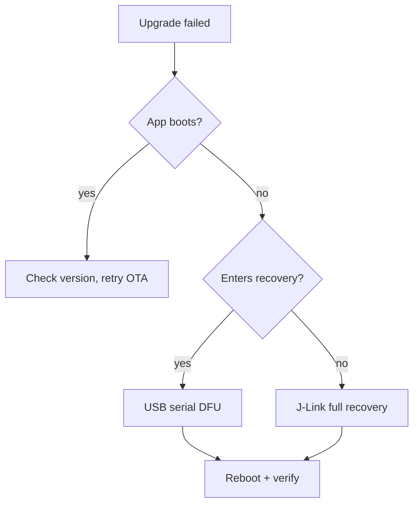

# reSpeaker Clip Firmware Development Guide

The comprehensive reference for the reSpeaker Clip device-side firmware: how it
is put together, the AT/GATT/UDP protocol it speaks, how it is built, updated,
recovered, validated, and shipped. For the build-to-smoke-test path from a clean
machine, see [Getting Started with the reSpeaker Clip Firmware SDK](./respeaker_clip_firmware_quick_start.md);
for full build/flash/power/pitfalls, see [CLAUDE.md](https://github.com/Seeed-Studio/reSpeaker_Clip/blob/main/CLAUDE.md).

The checked-out firmware source is authoritative; this guide summarizes it.
When they disagree, the source wins.

## Introduction

The Firmware SDK is an event-driven Zephyr RTOS application on the Nordic
nRF5340 (application core + network core) with a PDM microphone array, BLE,
Wi-Fi AP (nRF7002), USB, SD storage, and an OLED. It is for developers
modifying device-side behavior. This guide covers the design and the operational
reference (protocol, update, validation, production) in one place so that each
fact has exactly one home — cross-references point back here rather than
duplicating.

## System Architecture

### Layered Architecture

The firmware is organized in five layers, each depending only on the layer below:

| Layer | Responsibility | Key source |
|-------|----------------|------------|
| **App / event** | State machine, UI, button, the single place side effects happen | `clip_event.c`, `display.c`, `button.c`, `main.c` |
| **Service / transport-transfer-config** | Moving bytes (BLE/UDP/USB), file transfer engine, persistent config | `transport.c`, `transport_ble.c`, `transport_udp.c`, `usb_cdc.c`, `transfer.c`, `config.c` |
| **Processing / audio** | PDM capture → DSP → Opus → framed file writes | `audio.c`, `storage.c` |
| **HAL / drivers** | Board devices: OLED, PMIC, mic/regulators, SPI flash, SD, WiFi/BLE radio | `boards/seeed/clip/`, `drivers/`, `battery.c`, `haptic.c` |
| **Zephyr kernel** | Threads, message queues, semaphores, mutexes, power management | NCS v3.3.0 |

The invariant: **the app layer is the only place that mutates state and triggers
side effects.** Button presses and AT commands do not start the mic or write the
SD card directly — they post an event, and `clip_event.c` decides whether it is
legal in the current state and executes it.

A request flows: `button ISR` / `AT command` → `clip_post_event[_sync]()` →
`[k_msgq]` → `clip_event_process()` (main thread) → `execute_transition()` →
side effects (`audio_*`, `storage_*`, `display_*`, `haptic_*`, `ble_notify_*`).
Buttons post async (`K_NO_WAIT`, ISR-safe); AT commands post sync (block on a
per-event semaphore so `AT+START` can return the session id synchronously).

### Event and State Model

The dispatcher in `clip_event.c` is a table-driven state machine:

- `clip_post_event(event)` — async, non-blocking, ISR-safe; drops if the 8-slot
  queue is full.
- `clip_post_event_sync(event, &info)` — blocking; returns `OK`/`INVALID`/
  `BUSY`/`ERROR` through `info`.

States: `UNINITIALIZED → IDLE → RECORDING → TRANSMITTING / WIFI_SYNC → IDLE`,
plus `PAUSED`, `ERROR`, `OTA`. `transition_table[current_state][event]` returns
a next state, `TRANS_SAME` (stay, e.g. `MARK`), or `TRANS_INVALID` (reject). Two
pre-gated rejections: `START` while `WIFI_SYNC` ("WiFi blocked"), `START` while
USB MSC exposes the SD ("USB blocked" — mounting over USB while writing would
corrupt FAT). State is committed only in `execute_transition()` via
`atomic_set(&g_state, new)` — the one place state changes.

Notable side effects: `START` calls `storage_ensure_mounted()`, refuses if full,
then `audio_start_recording(AUDIO_MODE_MERGE)`. `STOP` waits ≤5 s for the audio
thread to flush/close; if the SD is busy, stop commits `IDLE` anyway so the
machine never deadlocks in `RECORDING` (the recording tail may be cut).
`POWER_OFF_EXEC` cancels any active transfer (bounded wait), stops a recording,
saves fuel-gauge state, puts the PMIC into ship mode.

### Thread Model

Five application threads (Zephyr priorities: lower number = higher priority,
preemptible at 0+; Bluetooth RX runs higher still):

| Thread | Pri | Stack | Role |
|--------|-----|-------|------|
| **Main** | (main) | — | Event loop `clip_event_wait()`→`clip_event_process()`, UI, time. Waits `K_FOREVER` idle or `K_MSEC(1000)` recording. |
| **Audio** `audio_rec` | 0 | 32768 | PDM read → DSP → Opus → storage. Highest-priority app thread (20 ms Opus deadline is hard). |
| **Transfer** | 5 | 16384 | File transfer engine: reads SD, sends via transport, retransmits. |
| **UDP server** | 5 | 4096 | Wi-Fi UDP socket server (port 8089). |
| **AT server** | 7 | 4096 | Parses AT on BLE/UDP/USB, posts sync events, sends JSON. |

Synchronization pattern: **volatile/atomic flags** for "should I stop?"
(`transfer_cancel_requested`, `pause_requested`), **semaphores** for "are you
done?" (`stop_done_sem`, `file_closed_sem`, `transfer_trigger_sem`), **mutexes**
for data structures (`audio_state_mutex`, `sd_lifecycle_mutex`,
`session_json_mutex`, `transport_lock`), **one message queue** for the
producer→consumer path that matters (`clip_ev_msgq`, events → main). A
`k_mem_slab` of 32 × 1280 B buffers gives 640 ms of DMIC queue depth to absorb
scheduling jitter (including BT RX preemption).

## Audio and Recording Architecture

### Audio Pipeline

Per 20 ms frame: `dmic_read()` (L+R stereo, 1280 B) → `process_pcm_frame()`
(merge + DSP, mode-dependent) → `opus_encode()` (≤4000 B packet) →
`storage_write_frame()` (2-byte length-prefixed, 4 KiB buffered writes).

Constants (`audio.h`): 16 kHz, 16-bit, 2-channel PDM; 20 ms frames → 320
samples/frame, 1280 B/block; 32 DMIC buffers (640 ms queue).

### Recording Modes

> Older docs describe `MODE_NORMAL` as **stereo**. That is wrong. Both modes
> record **mono**.

- **Both modes** record mono via an L+R merge. `clip_event.c` hardcodes
  `audio_start_recording(AUDIO_MODE_MERGE)`. `MODE_NORMAL` is not stereo — the
  name is legacy.
- **`MODE_NORMAL`** (default): delay-aligned L+R merge → hand-rolled 100 Hz
  high-pass → integer AGC (envelope + gain computer + smoother) → soft limiter.
  **No SpeexDSP.**
- **`MODE_ENHANCED`**: the same merge + hand-rolled DSP, **plus SpeexDSP** noise
  suppression + dereverberation, gated on `mode == ENHANCED && noise_suppress > 0`
  (`audio.c:506`). SpeexDSP AGC is *not* used (the build is `FIXED_POINT`; a
  float FFT AGC would cost ~15 ms/frame; the integer AGC replaces it).
- The merge step cross-correlates L vs R over lags \{−1, 0, +1\} (2.85 cm mic
  spacing → ≤1 sample ITD at 16 kHz) and delay-aligns before summing, preventing
  comb filtering. The AGC is a classic compressor: ~30 ms attack / ~300 ms
  release, target ≈−14.7 dBFS, gain clamped ±12/24 dB, soft limiter (knee −2
  dBFS, hard limit −0.5 dBFS).
- Opus: `OPUS_APPLICATION_AUDIO` (preserves fricatives better than VOIP for STT),
  VBR unconstrained, voice signal hint, 16-bit depth, DTX/FEC/packet-loss off.
  Bitrate/complexity are **per-mode Kconfig** (`CLIP_NORMAL_*`/`CLIP_ENHANCED_*`),
  not runtime-settable. Encoder + SpeexDSP state are cached, reinitialized only
  when parameters change.
- Set the mode with `AT+MODE=normal|enhanced` (persisted) or `AT+START
  mode=enhanced` (session-only, not persisted).

### Session, Chunking, and Storage Model

Each recording is one **session** with a 14-digit `session_id`:
`YYYYMMDDHHMMSS` (UTC) when the clock is synced, else `0` + 13 uptime digits.
The 14-digit form is enforced everywhere (`validate_session_id`) because the
storage layout shards it into path components.

A session is a directory tree: `session.json` (metadata: id, duration, files,
synced, size, channels, sample_rate, mode), `marks.bin` (binary bookmarks:
"BMRK" magic + count + offsets), and chunk files `0/0001.opus`, `0/0002.opus` …
`1/0101.opus` (group = (file_index−1)/100, 100 files per subdir). Opus files are
**length-prefixed frame streams** (2-byte LE length + packet, not OGG); a 4 KiB
write buffer coalesces frames before `fs_write`.

Segment chunking: **300 s per segment when not syncing**
(`CLIP_AUDIO_SEGMENT_DURATION_NO_SYNC`), **60 s during an active transfer**
(`CLIP_AUDIO_SEGMENT_DURATION_SYNC`) — when recording *while* transferring
(continuous mode), the transfer thread can only read a closed file, so 60 s caps
the client's wait for the next file; if sync starts mid-file and the current
file already exceeds 60 s, the engine slices immediately (`audio.c:868`). Each
`PAUSE`/`RESUME` cycle also opens a new file. `session.json`'s `synced` field
tracks acknowledged files so a download resumes from the first unsynced file.

**Storage:** microSD (FAT32, `/SD:`) holds recordings under `/SD:/REC/` in a
bucket layout sharding the session id (`/SD:/REC/<YYYYMMDD>/<HH>/<MM>/<SS>/…`).
External 8 MiB SPI flash (LittleFS, ~6.8 MiB) holds settings (`/lfs/settings/run`)
and OTA slots — separate from the SD so corrupt settings or an interrupted OTA
never take recordings down. The SD is **lazily remounted** via
`storage_ensure_mounted()` and **idle power-gated** after `CLIP_SD_IDLE_DELAY_MS`
(45 s) when genuinely idle (checked under lock to close the TOCTOU with a
recording/transfer starting mid-check).

### Power Management

Battery device (170 mAh "240" cell, NPM1300 + nRF Fuel Gauge); idle current is
the dominant constraint. Production build at the 3V3 rail:

| Source | Behavior | Cost |
|--------|----------|------|
| nRF5340 main + radio regulators | DCDC (`NRF5X_REG_MODE_DCDC`) | ~500–600 µA vs LDO |
| SD card | Idle power-gated after 45 s | ~0 when idle |
| Debug UART console | UARTE stays enabled between prints | **~570 µA** leak |
| BLE slow advertising | ~1 s interval | ~0.1 mA averaged |
| nRF70 QSPI | `CONFIG_NRF70_QSPI_LOW_POWER` when WiFi unused | minimal |

**Production idle ≈ 170 µA.** The largest leak after the regulators and SD were
fixed is the **debug UART console** (~570 µA); the `production` snippet disables
the console + UART log backend (`CONFIG_CONSOLE=n`, `CONFIG_UART_CONSOLE=n`,
`CONFIG_LOG_BACKEND_UART=n`), which is what reaches ~170 µA. `CONFIG_PM_DEVICE_RUNTIME=y`
auto-suspends UART/I2C/SPI drivers when idle. Recording/transfer briefly raise
current (CPU boost to 128 MHz, reference-counted; mic + SD rail on; released on
completion).

## Communication Protocol

### BLE GATT Service

| Characteristic | UUID (suffix of `6E40xxxx-B5A3-F393-E0A9-E50E24DCCA9E`) | Role |
|---|---|---|
| Service | `0001` | The reSpeaker Clip service |
| Command Receive | `0002` | Host writes AT commands here |
| Response Send | `0003` | Device notifies JSON responses |
| File Data | `0004` | Device notifies binary file-transfer frames |
| Audio Visualization | `0005` | Device notifies recording energy levels |

### AT Command Grammar

| Type | Format | Example | Notes |
|---|---|---|---|
| EXEC | `AT+XX` | `AT+GSTAT` | Action / default read |
| SET | `AT+XX=<value>` | `AT+MODE=enhanced` | Set a parameter / act with args |
| READ | `AT+XX?` | `AT+MODE?` | Query current value |

Parsing is shared: `parse_command()` (in `at_server.c`) owns the `AT+NAME=args`
grammar and the `=`/`?` type detection; handlers receive `ctx->args` already
split (past the `=`). `AT+LIST?2&10` is a paginated read.

### JSON Response Contract

- Success: `{"ok":true,"data":{...}}`
- Failure: `{"ok":false,"msg":"..."}`
- **No numeric error codes, no `error` field, no request ID.** Failures use
  `msg`. The same JSON goes out identically over BLE, UDP, and USB (routed by the
  command's originating transport via the `SEND_RESPONSE()` macro — your handler
  only fills the response buffer).

### Registered Command Reference

The registered commands live in `applications/clip/src/at_commands.c` (the
`.name = "..."` table). Verified set:

| Group | Commands |
|---|---|
| Device status | `GSTAT`, `BATT`, `DEVICE`, `VERSION` |
| Recording | `START`, `STOP`, `PAUSE`, `RESUME`, `MARK` |
| File management | `LIST`, `MARKS`, `DOWNLOAD`, `CANCEL`, `DELETE` |
| Config | `MODE`, `AUTODEL`, `BRIGHTNESS`, `TIME`, `NAME` |
| Connectivity | `WIFI`, `WIFICFG`, `USB`, `PAIR`, `DFU` |
| Maintenance | `LOG`, `STORAGE`, `FORMAT`, `REBOOT`, `POWEROFF`, `FACTORY` |

**Removed legacy — do not document as available:** `BITRATE`, `COMPLEXITY`,
`NOISE`, `AGC`, `DEREVERB`, `PURGE`. Noise suppression / dereverb are boot-time
Kconfig defaults (`CLIP_DEFAULT_NOISE`, `CLIP_DEFAULT_DEREVERB`), persisted in
`config.c`, but have **no runtime AT command**; AGC is hand-rolled, always-on,
not configurable. When you change an AT response, command, or transfer frame,
update `docs/protocol.md` and `sdk/` in the same change.

### UDP Frame Types

Wi-Fi UDP file transfer uses a binary frame protocol (port 8089) with per-frame
CRC32:

| Type | Value | Structure |
|---|---|---|
| `DATA` | `0x01` | type(1) + seq(2) + len(2) + data |
| `FILE_ACK` | `0x03` | type(1) + status(1) + received_count(2) + crc32(4) |
| `FILE_START` | `0x10` | type(1) + fn_len(1) + filename + file_size(4) |
| `FILE_END` | `0x11` | type(1) + crc32(4) |
| `TRANSFER_DONE` | `0x12` | type(1) + sid_len(1) + session_id + file_count(4) |
| `AT_RESP` | `0x20` | AT response carried over UDP |
| `HEARTBEAT` | `0x30` | keepalive |

**BLE has no per-frame CRC** (the link layer guarantees delivery) — only the
full-file CRC32 in `FILE_END` for end-to-end check. UDP has per-frame CRC32 +
`FILE_ACK` with a **selective-repeat bitmap NACK**: the client reports which
frames it is missing as a bitmap and the engine resends only those, paced by
`CLIP_UDP_REPAIR_PACE_US` (halves each retry round). A repair-pace that fails
falls back to whole-file retransmit; `TRANSFER_MAX_FILE_RETRIES` (10) caps
attempts before `ERROR`.

### Session and File Addressing

Host-visible session ids are exactly 14 decimal digits `YYYYMMDDHHMMSS`; physical
FAT paths are never exposed in the protocol. `AT+DOWNLOAD` accepts `session` or
`session:NNNN.opus`. Validate user-controlled arguments before storage, path, or
transfer access.

## Firmware Configuration and Build Profiles

### Stock and Development Builds

The default (no-snippet) debug build keeps the UART console on and writes logs to
`/SD:/LOG` (rotating 64 KiB files) at INF level (`CONFIG_LOG_BACKEND_FS=y`).
Build:

```sh
source ~/ncs/v3.3.0/zephyr/zephyr-env.sh
export ZEPHYR_EXTRA_MODULES=$PWD   # env var, not -D — Kconfig discovery runs before CMake
west build --build-dir build-clip --board clip/nrf5340/cpuapp applications/clip
# pristine (required after MCUboot/devicetree/sysbuild/partition changes):
west build --build-dir build-clip --pristine --board clip/nrf5340/cpuapp applications/clip
```

Every app builds as a **sysbuild** (MCUboot + app core + net-core radio) by
default; the board supplies the glue. Key `prj.conf` / devicetree / Kconfig
knobs: feature switches, log levels, BLE/Wi-Fi/FS config; GPIO/I2C/SPI/PDM/PMIC/
OLED mappings; buffer sizes, thread stacks, power policy.

### Production Build

Console + UART log off, idle ≈170 µA:

```sh
west build --build-dir build-clip-prod --board clip/nrf5340/cpuapp applications/clip \
  -- -DSNIPPET_ROOT=$(pwd)/applications/clip -DSNIPPET=production
```

`SNIPPET_ROOT` must be absolute. The `production` snippet lives in
`applications/clip/snippets/production/`. The project builds with **zero
warnings** — fix every compiler warning before committing.

## Firmware Update and Recovery

### Update Method Selection

| Scenario | Recommended | Package |
|---|---|---|
| End-user upgrade (enclosed device) | App BLE OTA or USB serial DFU | `*-signed.bin` / `*-ota.zip` |
| Serial recovery (no app) | mcumgr serial | `*-signed.bin` |
| Dev debug | `west flash` / J-Link | `merged.hex` |
| Production flash | J-Link / programmer | full `merged.hex` + `merged_CPUNET.hex` |
| App-core-only tweak | mcumgr serial | `*-signed.bin` (a `single.zip` is not yet shipped) |

### USB Serial DFU

The app keeps USB off by default — send `AT+USB=on` over BLE first (samples with
default CDC auto-enable USB, or hold the user button while plugging in). Open the
CDC-ACM port at **1200 baud** to trigger MCUboot serial recovery; a new port
appears with **PID `0x8069`** (running app `0x0069`; the `0x8000` bit marks
bootloader; both Seeed VID `0x2886`). Upload + reset:

```sh
nrfutil mcu-manager serial image-upload --firmware clip-<version>-signed.bin --serial-port /dev/ttyACMx
nrfutil mcu-manager serial reset     --serial-port /dev/ttyACMx
```

MCUboot verifies the RSA signature and boots the new app; the bootloader
partition is never touched.

### BLE OTA

```sh
nrfutil mcu-manager ble image-upload --firmware clip-<version>-ota.zip --address <BLE-MAC>
```

Or use nRF Connect Device Manager / SenseCraft Voice on a phone.

### J-Link

For dev/production/when USB+BLE recovery fails:

```sh
nrfutil device program --firmware clip-<version>-merged.hex --serial-number <JLINK-SN>
nrfutil device reset --serial-number <JLINK-SN>
```

### Package Manifest

Each release should carry a manifest so users don't guess package ranges from
filenames:

```yaml
firmware_version:
hardware_revision:
ncs_version:        # v3.3.0
bootloader_version: # mcuboot
app_core_version:
net_core_version:
package_type:       # debug | production
included_partitions: # [mcuboot, app, netcore]
upgrade_method:     # serial-dfu | ble-ota | programmer
sha256:
rollback_supported:
```

### Recovery Decision Tree



### Reset Command Matrix

| Method | Command | When |
|---|---|---|
| mcumgr serial reset | `nrfutil mcu-manager serial reset --serial-port …` | After serial DFU |
| BLE mcumgr reset | `nrfutil mcu-manager ble reset --address …` | After BLE OTA |
| J-Link reset | `nrfutil device reset --serial-number <JLINK-SN>` | Dev/production |
| west runner reset | `west flash --build-dir … && nrfutil device reset` | Dev — note `west flash --reset` does NOT work here |

`--recover` erases **both cores** (clears the b0n access-port lock) — use only
when net-core AP is locked, never routinely.

### Safety Rules

Never, unprepared: full-chip erase; UICR modify; overwrite the bootloader;
partition-table change; flash a wrong-hardware-revision merged image; recover a
production device without backing up its config.

## Validation and Debugging

### Regression Matrix by Change Type

| Change | Must test |
|---|---|
| Audio pipeline | SNR, STOI, WER; buffer overflow; CPU; real-time (20 ms deadline) |
| Opus | Decode; frame format; file size; transfer compat |
| AT / GATT | Old commands; response format; error paths; Python SDK |
| Filesystem | Long recording; power-loss; space-full; CRC |
| BLE / Wi-Fi | Connect; fragmentation; resume; timeout |
| Power | Idle; recording; Wi-Fi; wake |
| Firmware update | OTA; recovery; version readback; rollback |

### Audio Quality Metrics

SNR (signal vs noise clarity), STOI (intelligibility), WER (ASR error rate — the
business metric), THD (DSP/hardware distortion). Test scenarios: quiet
near/far, office, café, car, street; both Normal and Enhanced; cover Chinese,
English, digit sequences, silence.

> **PESQ/STOI need a clean reference + alignment.** Do not compute them on
> arbitrary field recordings and claim a conclusion — without a matched
> reference, the number is not meaningful.

### Serial, Logging, Storage, and Timing Debug

```sh
minicom -D /dev/ttyACM0 -b 921600   # ttyACM1 if a J-Link also connected
```

Log levels: `AT+LOG=off|info|debug` (debug default: info). `CONFIG_LOG_BACKEND_FS=y`
writes to `/SD:/LOG` (rotating 64 KiB) for post-mortem; `AT+LOG=off` lets the SD
idle power-gate. The audio thread prints DWT cycle-counter stats (`enc avg/min/max`,
`dsp`) every 500 frames (10 s). Known pitfalls (`CLAUDE.md`): `%llu` not supported
on nRF5340 (use `%u` + cast); UDP `sendto()` returns success even on silent TX
drops; FAT directory order is not chronological; corrupt `/lfs/settings/run`
blocks `settings_load` (watchdog wipes + reboots after 3 s).

### Host-side Test Tools

```sh
python applications/clip/tests/tools/clip-cli.py status        # BLE default; --transport wifi
python applications/clip/tests/tools/clip-cli.py record --duration 5
python applications/clip/tests/tools/clip-cli.py list
python applications/clip/tests/tools/clip-cli.py sync --session <id>
python applications/clip/tests/tools/clip-cli.py terminal      # interactive AT shell
python applications/clip/tests/tools/udp_sync.py --session <id>
python applications/clip/tests/tools/decode_opus.py <file>.opus out.wav
```

**"Build passes" is not "hardware verified."** A clean compile says nothing about
on-device behavior.

## Production Release

### Release Artifacts and Manifest

Manual export today (tag-triggered `scripts/build_release.sh` +
`.github/workflows/release.yml` are **not yet implemented**). Debug and
production each produce four artifacts:

| Artifact | Use |
|---|---|
| `merged.hex` | App-core full image (programmer / J-Link) |
| `merged_CPUNET.hex` | Network-core full image |
| `dfu_application.zip` (release name `*-ota.zip`) | mcumgr OTA package (BLE / USB serial) |
| `clip/zephyr/zephyr.signed.bin` (release name `*-signed.bin`) | MCUboot-signed app image (USB serial DFU) |

A `single.zip` (app-core-only) is **not yet shipped** — until `build_release.sh`
lands, use `*-signed.bin` for app-only updates. Publish: add
`docs/release_notes/v$VERSION.md`, commit, `git tag vX.Y.Z && git push origin
vX.Y.Z` → CI builds the GitHub Release.

### Signing Keys

`boards/seeed/clip/sysbuild/root-rsa-2048.pem` is a **copy of the MCUboot
default key**. Anyone with the public source can sign images for your devices.
**Generate your own key for production** and keep the private half secret;
rotate by replacing the key and re-flashing the bootloader.

### CI

`.github/workflows/firmware.yml` builds the clip app on push/PR to `main`
(compilation check; applies the MCUboot patches + `west build`).
`mobile-ci.yml` (analyze + unit tests, on PR) and `mobile-verify.yml` (debug APK
/ iOS smoke, push + manual) cover `mobile/`.

### Factory Programming and Test Firmware

Each test image is a standalone sysbuild under `tests/<name>`, built like
`west build --build-dir build-test --pristine --board clip/nrf5340/cpuapp
tests/clip`. Tests **opt out of MCUboot** (factory/cert firmware, flashed
directly via J-Link) via `SB_CONFIG_BOOTLOADER_NONE=y`:

| Test | Purpose |
|---|---|
| `tests/clip` | Multi-image hardware test suite (hosts the `lfxo`/`hfxo` crystal-tuning shell) |
| `tests/dtm` | BLE Direct Test Mode (RF conformance; 2-wire UART @19200) |
| `tests/wifi_radio` | nRF70 Wi-Fi radio test (TX/RX, tone, IQ, FICR) |
| `tests/otp` | nRF70 OTP programming (factory) |
| `tests/re` | Reference-board bring-up |

Mass flash uses `nrfutil device program --firmware …-merged.hex --serial-number
<JLINK-SN>`.

### Compatibility Rules

- Keep the AT response shape: `{"ok":true,"data":{...}}` /
  `{"ok":false,"msg":"..."}`. No numeric error codes, no `error` field.
- Don't break the file format (length-prefixed Opus, `session.json` schema).
- Update `docs/protocol.md` **and** `sdk/` whenever an AT response, command, or
  transfer frame changes.
- Don't auto-execute a full-chip erase; don't auto-flash a production device.
- The firmware source is the source of truth.

### NCS v3.2.1 to v3.3.0 Migration

`main` migrated to **v3.3.0-only Kconfig** (e.g. the WPA3
`..._WPA3_IMPLEMENTATION_NONE` choice) and will no longer build against NCS
v3.2.1. The `ncs/v3.3.0` branch is an older diverged line (~12 commits behind
`main`); local `master` is only the ancient initial import. Target NCS v3.3.0.

## AI-Assisted Development

The repo ships a firmware-dev skill at
[`skills/clip-dev/`](https://github.com/Seeed-Studio/reSpeaker_Clip/blob/main/skills/clip-dev/SKILL.md)
for AI agents (Claude Code, etc.) that work on this firmware. It encodes the
project's real constraints so an agent does not re-derive them — and does not
guess facts that are easy to get wrong. **Use it; do not duplicate its rules
into the docs.**

For a complete, copyable example of AI-assisted AT command customization, see
[Customization: Add a Custom AT Command](/respeaker_clip_customization_at_command/).
That article shows how to prompt an AI agent to load the repository skill, add
`AT+ECHO`, build the firmware, and validate the command on-device.

**What the skill provides** — `SKILL.md` plus nine references under
`skills/clip-dev/references/` (`audio`, `build-flash`, `ble-at`, `storage`,
`wifi-udp`, `mcuboot`, `power`, `display`, `hardware`):

- active NCS version, board sysbuild defaults, build/flash commands;
- the **current AT command set** (registered in `at_commands.c`) and the
  response contract `{"ok":true,"data":...}` / `{"ok":false,"msg":...}`;
- the audio pipeline truth — both modes are mono L+R merge; **runtime commands
  for bitrate, codec complexity, AGC, noise suppression, and dereverb do not
  exist**;
- power constraints (console leak, the `production` snippet, SD idle gating);
- a firmware workflow: confirm the contract in source before editing docs or
  clients, validate user-controlled args, flash only the requested image,
  update `docs/protocol.md` + `sdk/` whenever an AT response changes.

**How to load it.** In Claude Code the skill is auto-discovered; otherwise
point the agent at the file:

```
@clip-dev
Analyze how to add distinct haptic patterns for recording start vs stop.
Give the modification plan first; do not edit code yet.
```

**Standard task template** — fill this in before asking an agent to change
firmware:

```markdown
## Goal
<device behavior to implement>

## Baseline
- Firmware commit/tag: v0.0.9
- NCS version: v3.3.0
- Board target: clip/nrf5340/cpuapp
- Build config: debug | production

## Constraints
- Keep which AT/GATT interfaces compatible
- New protocol fields allowed? (yes/no)
- File format changes allowed? (yes/no)
- Devicetree/Kconfig changes allowed? (yes/no)
- MCUboot / partition table / signing key edits forbidden

## Acceptance criteria
- Firmware builds (pristine, zero new warnings)
- Basic-SDK regression passes
- Expected serial log
- On-device behavior
- RAM/Flash delta
- Power or real-time constraint
```

**Safety rules the skill enforces.** Do not guess files, functions, Kconfig, or
board targets — search the real source first. Do not infer a public interface
from an internal module name. Do not modify MCUboot, the partition table, or
signing keys without explicit confirmation. Do not auto-erase the whole chip or
flash a production device. Do not break existing AT responses or file formats.
"Build passes" is not "hardware verified" — claim only what was actually tested
on a device. For audio/protocol changes, report CPU, buffer, flash, RAM, and
output-format impact; for protocol changes, update the Python `sdk/` and
`docs/protocol.md` in the same change.

## Related Resources

- [Getting Started with the reSpeaker Clip Firmware SDK](./respeaker_clip_firmware_quick_start.md) — build-to-smoke-test path
- [CLAUDE.md](https://github.com/Seeed-Studio/reSpeaker_Clip/blob/main/CLAUDE.md) — full build/flash/power/pitfalls reference
- [`skills/clip-dev/`](https://github.com/Seeed-Studio/reSpeaker_Clip/blob/main/skills/clip-dev/) — firmware AI development skill
- Source: [clip_event.c](https://github.com/Seeed-Studio/reSpeaker_Clip/blob/main/applications/clip/src/clip_event.c) (state machine),
  [audio.c](https://github.com/Seeed-Studio/reSpeaker_Clip/blob/main/applications/clip/src/audio.c) (DSP/Opus),
  [at_commands.c](https://github.com/Seeed-Studio/reSpeaker_Clip/blob/main/applications/clip/src/at_commands.c) (AT registry),
  [at_server.c](https://github.com/Seeed-Studio/reSpeaker_Clip/blob/main/applications/clip/src/at_server.c) (parse/route),
  [transfer.c](https://github.com/Seeed-Studio/reSpeaker_Clip/blob/main/applications/clip/src/transfer.c) (transfer engine),
  [transport.c](https://github.com/Seeed-Studio/reSpeaker_Clip/blob/main/applications/clip/src/transport.c) (transport abstraction),
  [storage.c](https://github.com/Seeed-Studio/reSpeaker_Clip/blob/main/applications/clip/src/storage.c) (sessions/SD lifecycle),
  [main.c](https://github.com/Seeed-Studio/reSpeaker_Clip/blob/main/applications/clip/src/main.c) (init order)
- [usb_dfu.md](https://github.com/Seeed-Studio/reSpeaker_Clip/blob/main/docs/usb_dfu.md),
  [protocol.md](https://github.com/Seeed-Studio/reSpeaker_Clip/blob/main/docs/protocol.md),
  [udp_protocol.md](https://github.com/Seeed-Studio/reSpeaker_Clip/blob/main/docs/udp_protocol.md)
