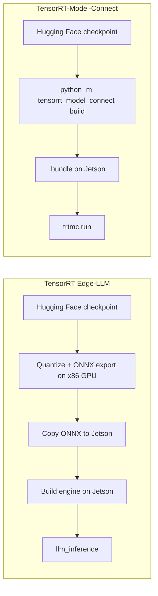

# Implementar TensorRT-Model-Connect en Jetson AGX Orin

<div align="center">
  
</div>

Este wiki muestra cómo ejecutar [NVIDIA TensorRT-Model-Connect](https://github.com/NVIDIA/TensorRT-Model-Connect) (TRTMC) en un reComputer de Seeed impulsado por **Jetson AGX Orin**. Una vez que se compila el runtime nativo, el camino es corto: se parte de un checkpoint de Hugging Face, se produce un `.bundle` de TensorRT en el dispositivo y se ejecuta la generación de texto. No hay un host x86 separado ni un paso de exportación a ONNX.

Este recorrido utiliza **Qwen3-4B-Instruct-2507** en FP16. Ese modelo es un transformer denso, por lo que TensorRT puede usar un motor de prefill por lotes. En esta misma página también se registran la memoria de conversión en AGX Orin 64GB, además de las dos cargas de trabajo en las que TRTMC es más rápido que llama.cpp CUDA: prefill largo en Qwen3-4B y decodificación codiciosa en Qwen3-0.6B.

:::note
TensorRT-Model-Connect es una vista previa pública. Las APIs, la cobertura de modelos y el flujo de compilación aún pueden cambiar. La propia recomendación de NVIDIA es usar TRTMC cuando quieras probar modelos compatibles rápidamente y empezar con [TensorRT Edge-LLM](/es/deploy_tensorrt_edge_llm_on_jetpack6.2/) cuando necesites un runtime de LLM/VLM orientado a producción en Jetson.
:::

## ¿Qué es TensorRT-Model-Connect?

TensorRT-Model-Connect es un conjunto de implementaciones de referencia por familia de modelos sobre NVIDIA TensorRT. Un generador específico de la familia lee un snapshot de Hugging Face, construye motores de TensorRT y escribe un `.bundle` versionado. El mismo bundle se puede ejecutar desde la CLI `trtmc` o desde APIs nativas de tareas en C++, como generación de texto.

La diferencia práctica en Jetson es la ruta de conversión. TensorRT Edge-LLM sigue esperando que cuantices y exportes ONNX en una máquina Linux x86 con una GPU discreta y luego copies esos archivos ONNX al dispositivo para la generación de motores. TRTMC construye el bundle de motores en el propio Jetson.



<div align="center">
  
</div>

## Por qué esta ruta es más sencilla en Jetson

| Tema | TensorRT Edge-LLM | TensorRT-Model-Connect |
| --- | --- | --- |
| Dónde se ejecuta la conversión | Exportación ONNX en un host Linux x86 con una GPU NVIDIA y luego compilación del motor en Jetson | Snapshot de Hugging Face a `.bundle` en Jetson |
| Archivos intermedios | Grafos ONNX, a menudo de decenas de gigabytes, copiados al dispositivo | Ninguno. El `.bundle` es el artefacto |
| Comandos después de la configuración | Exportar, copiar, compilar el motor y luego ejecutar `llm_inference` | `python -m tensorrt_model_connect build` y `trtmc run` |
| Memoria del host durante la conversión | Documentación del proveedor: la exportación ONNX en FP8 puede necesitar alrededor de 18–20× el tamaño del modelo en RAM de CPU en la máquina x86 | Medido en AGX Orin 64GB para Qwen3-4B FP16: alrededor de 30,6 GB usados en el host, 41 GB de pico en el contenedor |
| Mejor encaje | Despliegue de LLM/VLM en producción en Jetson | Probar rápidamente un modelo compatible en la misma máquina que lo ejecutará |

La fila de memoria no es una comparación con el mismo modelo. Las cifras publicadas de Edge-LLM para la exportación ONNX explican por qué ese flujo de trabajo suele salir de Jetson y ocupar una estación de trabajo con mucha RAM. Las cifras de TRTMC que aparecen a continuación son lo que realmente observamos al compilar Qwen3-4B FP16 en AGX Orin 64GB.

## Hardware

Este tutorial se reprodujo en **reComputer Classic J5012** con Jetson AGX Orin 64GB. La conversión de Qwen3-4B FP16 alcanzó un pico de alrededor de 41 GB dentro del contenedor, por lo que 64 GB de memoria unificada es el objetivo práctico. J5011 (32GB) pertenece a la misma familia de productos, pero es probable que esta conversión haga thrashing o falle allí.

<div style={{display:'grid', gridTemplateColumns:'repeat(2, minmax(0, 1fr))', gap:'24px', margin:'28px 0 42px'}}>
  <div style={{display:'flex', flexDirection:'column', overflow:'hidden', borderRadius:'16px', border:'2px solid #00a86b', background:'linear-gradient(145deg, #dce6ee, #cbd8e3)', color:'#172b4d', boxShadow:'0 14px 34px rgba(0,168,107,.18)'}}>
    <div style={{height:'290px', padding:'26px', display:'flex', alignItems:'center', justifyContent:'center', background:'linear-gradient(145deg, #d3dfe9, #bccbd8)'}}>
      
    </div>
    <div style={{display:'flex', flexDirection:'column', flex:'1', padding:'24px'}}>
      <div style={{fontSize:'23px', lineHeight:'1.35', fontWeight:'900', color:'#172b4d'}}>reComputer Classic J5012</div>
      <div style={{marginTop:'9px', color:'#526581', fontWeight:'600'}}>NVIDIA Jetson AGX Orin 64GB · verificado en este wiki</div>
      <div class="get_one_now_container" style={{textAlign:'center', marginTop:'auto', paddingTop:'24px'}}>
        <a class="get_one_now_item" href="https://www.seeedstudio.com/reComputer-Classic-J5012-p-6881.html" target="_blank" rel="noopener noreferrer">
          <strong><span><font color={'FFFFFF'} size={"4"}> Consigue uno ahora 🖱️</font></span></strong>
        </a>
      </div>
    </div>
  </div>

  <div style={{display:'flex', flexDirection:'column', overflow:'hidden', borderRadius:'16px', border:'2px solid #3182ce', background:'linear-gradient(145deg, #dce6ee, #cbd8e3)', color:'#172b4d', boxShadow:'0 14px 34px rgba(49,130,206,.18)'}}>
    <div style={{height:'290px', padding:'26px', display:'flex', alignItems:'center', justifyContent:'center', background:'linear-gradient(145deg, #d3dfe9, #bccbd8)'}}>
      
    </div>
    <div style={{display:'flex', flexDirection:'column', flex:'1', padding:'24px'}}>
      <div style={{fontSize:'23px', lineHeight:'1.35', fontWeight:'900', color:'#172b4d'}}>reComputer Classic J5011</div>
      <div style={{marginTop:'9px', color:'#526581', fontWeight:'600'}}>NVIDIA Jetson AGX Orin 32GB · misma familia de placas</div>
      <div class="get_one_now_container" style={{textAlign:'center', marginTop:'auto', paddingTop:'24px'}}>
        <a class="get_one_now_item" href="https://www.seeedstudio.com/reComputer-Classic-J5011-p-6880.html" target="_blank" rel="noopener noreferrer">
          <strong><span><font color={'FFFFFF'} size={"4"}> Consigue uno ahora 🖱️</font></span></strong>
        </a>
      </div>
    </div>
  </div>
</div>

## Requisitos previos

Prepara lo siguiente en el Jetson:

- reComputer Classic J5012 u otro sistema Jetson AGX Orin 64GB
- JetPack 7.2 / Ubuntu 24.04 / L4T R39.2
- Docker con el runtime de NVIDIA (`docker info` debería listar `nvidia` en Runtimes)
- Alrededor de 40 GB de disco libre para la imagen de desarrollo, el snapshot de Hugging Face y el `.bundle`
- Acceso de red a GitHub, Hugging Face y `nvcr.io`
- Opcional para la sección de benchmarks: `nvpmodel` MAXN y `jetson_clocks`

La pila de software verificada fue:

| Elemento | Versión |
| --- | --- |
| Dispositivo | Jetson AGX Orin 64GB |
| SO | Ubuntu 24.04.4 LTS, kernel 6.8.12-tegra |
| L4T | R39.2 |
| CUDA en la imagen de TRTMC | 13.3.1 |
| TensorRT en la imagen de TRTMC | 11.1.0.106 (TensorRT 26.07) |
| SM de la GPU | 87 (Orin) |
| Modo de energía | MAXN, GPU 1300 MHz |

:::tip
Si `docker ps` devuelve `permission denied`, añade tu usuario al grupo `docker` y vuelve a iniciar sesión:

```bash
sudo usermod -aG docker $USER
```

:::

## 1. Clonar TensorRT-Model-Connect

```bash
git clone https://github.com/NVIDIA/TensorRT-Model-Connect.git
cd TensorRT-Model-Connect
```

La ruta oficial de inicio rápido es [Build from Source](https://nvidia.github.io/TensorRT-Model-Connect/getting-started/source-build) más [Quick Start](https://nvidia.github.io/TensorRT-Model-Connect/getting-started/quick-start). Los comandos siguientes siguen esa ruta, con las banderas específicas de Jetson ya rellenadas.

## 2. Compilar el contenedor de desarrollo

En AGX Orin la capacidad de cómputo es 8.7, así que `TRTMC_SM=87`. Las imágenes de Docker para Jetson también necesitan `--runtime nvidia`.

```bash
GPU=0
SM="$(
  nvidia-smi -i "$GPU" \
    --query-gpu=compute_cap \
    --format=csv,noheader,nounits |
  tr -d '.[:space:]'
)"
IMAGE="trtmc-quickstart"

docker build \
  -f Dockerfile.dev.aarch64 \
  -t "$IMAGE" \
  requirements

SOURCE_DIR="$(git rev-parse --show-toplevel)"

docker run --rm -it \
  --runtime nvidia \
  --gpus "device=${GPU}" \
  --ipc=host \
  --network host \
  --mount "type=bind,source=${SOURCE_DIR},target=/src" \
  --workdir /src \
  --env TRTMC_SM="$SM" \
  "$IMAGE" \
  bash
```

:::caution
Mantén los comandos restantes dentro de este contenedor. La imagen ya fija TensorRT 11.1, un venv de Python 3.12 y los headers nativos usados por la compilación de la familia Qwen. Si `nvidia-smi` no está disponible en tu Jetson, establece `SM=87` manualmente.
:::

Si el snapshot de Hugging Face y el bundle van a residir en un SSD externo, haz también un bind-mount de ese disco, por ejemplo `-v /path/to/data:/out`.

## 3. Compilar el runtime nativo

Ejecuta estos comandos en el contenedor:

```bash
python -m pip install --no-deps -e . -C py-only=true

TRTMC_BUILD_DIR="build-sm${TRTMC_SM}"

cmake -S . -B "$TRTMC_BUILD_DIR" -G Ninja \
  -DCMAKE_BUILD_TYPE=Release \
  -DCMAKE_CUDA_ARCHITECTURES="${TRTMC_SM}-real" \
  -DTRTMC_BUILD_BACKEND_RTX=OFF \
  -DTRTMC_BUILD_TESTS=OFF \
  -DTRTMC_BUILD_EXAMPLES=OFF

cmake --build "$TRTMC_BUILD_DIR" --parallel "$(nproc)" --target \
  trtmc \
  trtmc_backend_trt \
  trtmc_model_qwen

export PATH="$PWD/$TRTMC_BUILD_DIR:$PATH"
```

`trtmc` busca bibliotecas nativas desde `--runtime-root`. Apunta ese argumento al directorio de compilación de CMake, que debe contener `libtrtmc_core.so`, `libtrtmc_runtime.so`, `libtrtmc_backend_trt.so` y `libtrtmc_model_qwen.so`.

## 4. Compilar el paquete Qwen3-4B en Jetson

Este es el paso de conversión que antes requería una máquina x86 con GPU. Fija `--max-sequence-length`. La configuración de Hugging Face para este checkpoint anuncia un contexto de 262.144 tokens, y dejar ese valor predeterminado agotará la memoria durante la generación del motor.

```bash
python -m tensorrt_model_connect build Qwen/Qwen3-4B-Instruct-2507 \
  --precision fp16 \
  --backend trt \
  --max-sequence-length 2048 \
  --max-batch-size 1 \
  --tensor-parallel-size 1 \
  --output qwen3-4b-instruct-2507.bundle \
  --verbose
```

Un directorio de snapshot local puede reemplazar el ID del modelo. El generador descarga el checkpoint, deja que la familia Qwen lo reclame y escribe un único `.bundle` que ya contiene los motores de TensorRT.

En la unidad J5012 verificada, Qwen3-4B FP16 con `max_sequence_length=2048` produjo la siguiente huella de conversión. La ruta pública de Qwen de un solo dispositivo en FP16 escribe motores divididos (`engine.plan` + `prefill.plan`); las cifras siguientes se tomaron de una compilación de doble perfil, donde prefill y decode comparten un plan con dos perfiles de optimización.

| Métrica | Valor medido |
| --- | --- |
| Precisión / disposición | FP16, doble perfil |
| Longitud máxima de secuencia | 2048 |
| Generación del motor | 128.1 s |
| Pesos de TensorRT | 7.49 GiB |
| Memoria de activación de prefill | 633 MiB |
| Memoria de activación de decode | 12 MiB |
| Pico de GPU del asignador de TensorRT | 7,674 MiB |
| Uso de host, pico | 30,640 MB |
| Memoria del contenedor, pico | 41.09 GiB |
| Python RSS, pico | 24.7 GB |
| `.bundle` final | 7.6 GiB |

:::tip
Esos picos de host/contenedor son la razón por la que este wiki recomienda AGX Orin 64GB. Estás convirtiendo en el dispositivo perimetral, pero aún necesitas suficiente memoria unificada para que TensorRT construya los motores.
:::

Inspecciona el paquete antes de ejecutarlo:

```bash
trtmc inspect ./qwen3-4b-instruct-2507.bundle
```

`trtmc inspect` imprime JSON. Busca `family: qwen`, `task: text_generation` y una lista de secciones que incluya `engine.plan` más los archivos del tokenizador. Una compilación dividida en FP16 también lista `prefill.plan`. Todavía no hay un grafo ONNX en el paquete.

## 5. Ejecutar inferencia

```bash
trtmc run ./qwen3-4b-instruct-2507.bundle \
  --runtime-root "$PWD/build-sm${TRTMC_SM}" \
  --prompt "What is the capital of France? Answer in one word." \
  --use-chat-template true \
  --enable-thinking false \
  --max-new-tokens 32
```

Una ejecución correcta imprime una respuesta corta como `Paris`. El mismo paquete se puede cargar desde C++ con `trtmc::load_task(bundle, runtime_root)` y la interfaz `ITextGeneration`; consulta la [API de tareas en C++](https://nvidia.github.io/TensorRT-Model-Connect/api/cpp-api).

## Rendimiento de inferencia frente a llama.cpp

La comodidad de la conversión es solo la mitad de la historia. En el mismo J5012 comparamos TRTMC FP16 con llama.cpp CUDA + flash-attention FP16, ambos con contexto 2048. El gráfico y la tabla siguientes conservan solo las cargas de trabajo donde TRTMC es más rápido.

<div align="center">
  
</div>

| Carga de trabajo | TensorRT-Model-Connect | llama.cpp CUDA | Ventaja de TRTMC |
| --- | --- | --- | --- |
| Qwen3-4B-Instruct-2507 prefill largo | 1,967 tok/s · 606.9 ms / 1,194 tok | 1,601 tok/s · 743.2 ms / 1,190 tok | +22.9% |
| Qwen3-0.6B decode, 256 tokens nuevos | 69.4 tok/s | 65.5 tok/s | +6.0% |
| Qwen3-0.6B decode después de un prompt de 1,212 tokens | 69.6 tok/s | 63.0 tok/s | +10.5% |

El resultado de prefill 4B es la mediana de tres ejecuciones medidas después de un calentamiento. Los resultados de decode 0.6B son de una ejecución medida después del calentamiento, con el modelo mantenido cargado durante toda la petición para que la caché KV se llene una vez y luego se generen muchos tokens.

:::note
Usa un transformador Qwen3 denso para esta comparación. Los modelos híbridos Mamba como NVIDIA Nano-9B actualmente hacen prefill token por token en TRTMC, por lo que son una mala forma de juzgar el rendimiento de TensorRT.
:::

## Reproducir las cargas de trabajo más rápidas

Bloquea primero las frecuencias, luego mantén el modelo cargado durante toda la petición. Informa las líneas de temporización del motor, no el tiempo de pared del proceso. El tiempo de pared del proceso incluye la deserialización de TensorRT / carga de GGUF y ocultará la diferencia.

```bash
sudo nvpmodel -m 0   # MAXN; confirm with nvpmodel -q
sudo jetson_clocks
```

llama.cpp en esta placa se compiló con CUDA y flash-attention, y luego se ejecutó con todas las capas en la GPU:

```bash
cmake -S llama.cpp -B llama.cpp/build-cuda \
  -DGGML_CUDA=ON -DGGML_CUDA_FA=ON -DGGML_NATIVE=ON \
  -DCMAKE_BUILD_TYPE=Release -DCMAKE_CUDA_ARCHITECTURES=87-real
cmake --build llama.cpp/build-cuda -j
```

### 1. Qwen3-4B prefill largo

Esta es la carga de trabajo donde ayuda un motor de prefill de TensorRT por lotes. Compila el paquete FP16 de la [sección 4](#4-compilar-el-paquete-qwen3-4b-en-jetson) con `--max-sequence-length 2048`, convierte el mismo snapshot a GGUF F16 y luego alimenta a ambos runtimes con el mismo prompt largo.

Configuración compartida para esta fila:

- Modelo: `Qwen/Qwen3-4B-Instruct-2507`, FP16, contexto 2048
- Prompt: unos 6,000 caracteres de contexto más una pregunta sobre París de 70 palabras (1,190–1,194 tokens después de la plantilla de chat)
- Decode: 64 tokens nuevos, codicioso (`temperature=0`, `top-k=1`)
- TRTMC: paquete de doble perfil, plantilla de chat activada, thinking desactivado
- llama.cpp: `GGML_CUDA=ON`, `GGML_CUDA_FA=ON`, `-ngl 99 -c 2048 -b 512 -ub 512 -fa on --jinja`
- Calentamiento 1 + 3 medidos; usa la mediana

Convierte el mismo snapshot de Hugging Face a GGUF F16 para llama.cpp:

```bash
python3 convert_hf_to_gguf.py Qwen3-4B-Instruct-2507 \
  --outfile Qwen3-4B-Instruct-2507-F16.gguf \
  --outtype f16
```

Escribe el prompt largo y luego ejecuta TRTMC. Lee `[trtmc-perf] Prefill` (o la temporización del motor `qwen prefill`).

```bash
python3 - <<'PY'
from pathlib import Path
filler = (
    "Transit planners track on-time performance, bus bunching, depot energy use, "
    "and spare-ratio policy across a dense coastal city. Housing staff compare "
    "permit latency, vacancy, and school-capacity constraints. Emergency managers "
    "rehearse flood gates, hospital diversion, and radio fallback. "
)
question = (
    "Write a 70-word factual paragraph about Paris. Include the Seine, the Louvre, "
    "and why it became the capital of France. Do not use bullet points. "
    "Do not stop after one word."
)
body = "Use the background notes only as context. Ignore them if they are not needed.\n\n"
while len(body) < 6000:
    body += filler
Path("qwen3-4b-long-prompt.txt").write_text(body[:6000] + "\n\n" + question)
print("wrote qwen3-4b-long-prompt.txt", 6000 + 2 + len(question), "chars")
PY

PROMPT="$(cat qwen3-4b-long-prompt.txt)"

trtmc run ./qwen3-4b-instruct-2507.bundle \
  --runtime-root "$PWD/build-sm${TRTMC_SM}" \
  --prompt "$PROMPT" \
  --use-chat-template true \
  --enable-thinking false \
  --temperature 0 \
  --top-k 1 \
  --max-new-tokens 64
```

Mismo prompt en llama.cpp. Lee la línea `prompt eval time` / `Prompt:` tok/s, no la vida del proceso.

```bash
llama-completion \
  -m Qwen3-4B-Instruct-2507-F16.gguf \
  -ngl 99 -c 2048 -b 512 -ub 512 -fa on \
  --jinja --temp 0 --top-k 1 -n 64 \
  --no-warmup --simple-io --no-display-prompt \
  --prompt "$PROMPT"
```

En la J5012 verificada esto es **1,967 tok/s frente a 1,601 tok/s** en prefill.

### 2. Qwen3-0.6B decode codicioso

Decode es el segundo lugar donde TRTMC lidera, una vez que pides una respuesta larga en una sola petición. Compila un paquete 0.6B FP16 de la misma manera que Qwen3-4B, fijando aún `--max-sequence-length 2048`. El paquete medido usó un motor dividido de prefill/decode con filas de caché KV=2048.

```bash
python -m tensorrt_model_connect build Qwen/Qwen3-0.6B \
  --precision fp16 \
  --backend trt \
  --max-sequence-length 2048 \
  --max-batch-size 1 \
  --tensor-parallel-size 1 \
  --output qwen3-0.6b.bundle \
  --verbose
```

Convierte el mismo snapshot a GGUF F16 para llama.cpp y luego ejecuta dos casos de decode. El `llama-cli` de esta placa necesita `-st` (single-turn) y no acepta `--prompt-file`; pasa `--prompt` en su lugar.

```bash
python3 convert_hf_to_gguf.py Qwen3-0.6B \
  --outfile Qwen3-0.6B-F16.gguf \
  --outtype f16
```

Prompt corto, 256 tokens nuevos:

```bash
COUNT_PROMPT='Count from 1 to 220. Write only integers separated by spaces. Do not add commentary. Continue until 220.'

trtmc run ./qwen3-0.6b.bundle \
  --runtime-root "$PWD/build-sm${TRTMC_SM}" \
  --prompt "$COUNT_PROMPT" \
  --use-chat-template true \
  --enable-thinking false \
  --temperature 0 \
  --top-k 1 \
  --max-new-tokens 256

llama-cli -st --simple-io \
  -m Qwen3-0.6B-F16.gguf \
  -ngl 99 -c 2048 \
  --temp 0 --top-k 1 -n 256 \
  --prompt "$COUNT_PROMPT"
```

Prompt largo, 128 tokens nuevos. El prompt medido fue de 1,212 tokens después de la plantilla de chat: notas sobre alcanzar la órbita y luego una petición de un informe de 180 palabras.

```bash
python3 - <<'PY'
from pathlib import Path
note = (
    "Low Earth orbit is a crowded working neighborhood for satellites, space stations, "
    "and visiting spacecraft. Reaching it requires a launcher that can fight gravity, "
    "thinning air, and the need for horizontal speed of about 7.8 kilometers per second. "
    "A typical rocket uses staged chemical propulsion. The first stage produces high "
    "thrust to clear the dense atmosphere. Upper stages ignite in thinner air to add "
    "delta-v. Guidance computers fly a gravity turn, then a circularization burn. "
)
text = "Read the notes below. Then write a detailed 180-word briefing on how rockets reach orbit. Keep writing until the briefing is complete.\n\n"
while text.count(" ") < 900:
    text += note
Path("qwen3-06b-long-prompt.txt").write_text(text)
print("wrote", len(text), "chars")
PY

LONG_PROMPT="$(cat qwen3-06b-long-prompt.txt)"

trtmc run ./qwen3-0.6b.bundle \
  --runtime-root "$PWD/build-sm${TRTMC_SM}" \
  --prompt "$LONG_PROMPT" \
  --use-chat-template true \
  --enable-thinking false \
  --temperature 0 \
  --top-k 1 \
  --max-new-tokens 128

llama-cli -st --simple-io \
  -m Qwen3-0.6B-F16.gguf \
  -ngl 99 -c 2048 \
  --temp 0 --top-k 1 -n 128 \
  --prompt "$LONG_PROMPT"
```

Lee TRTMC `qwen decoder` / `[trtmc-perf] Decode`, y llama.cpp `eval time` / `Generation:` tok/s. En el J5012 verificado esto es **69.4 vs 65.5 tok/s** para 256 tokens nuevos, y **69.6 vs 63.0 tok/s** después del prompt de 1,212 tokens.

## Qué significan los números

- **Menos máquinas.** No necesitas una estación de trabajo x86 con GPU solo para exportar ONNX. El Jetson que servirá el modelo también puede construirlo.
- **Menor RAM de host para la conversión que la ruta Edge-LLM FP8 ONNX.** Edge-LLM documenta RAM de CPU de hasta unas 20× el tamaño del modelo para la exportación FP8 ONNX. La compilación TRTMC FP16 de Qwen3-4B se mantuvo alrededor de 31 GB usados en el host / 41 GB en el contenedor en Orin 64GB.
- **Prefill largo más rápido en Qwen3-4B** que llama.cpp FP16, que es la carga de trabajo donde ayuda un motor TensorRT por lotes.
- **Decode codicioso más rápido en Qwen3-0.6B** cuando toda la completion se ejecuta en una sola petición (256 tokens nuevos, o 128 tokens nuevos después de un prompt largo).
- **Un artefacto reutilizable.** El `.bundle` es lo que copias, inspeccionas y ejecutas. No hay un árbol ONNX paralelo que mantener sincronizado.

## Solución de problemas

| Problema | Qué comprobar |
| --- | --- |
| El contenedor no puede ver la GPU | Usa `--runtime nvidia` y confirma que `docker info` lista el runtime `nvidia` |
| La compilación del motor se queda sin memoria | Fija `--max-sequence-length 2048`, usa AGX Orin 64GB y cierra otros usuarios de la GPU |
| `trtmc run` no puede cargar bibliotecas | Pasa `--runtime-root` al directorio de compilación de CMake; la CLI no busca DSOs en `PATH` ni en el directorio actual |
| La descarga desde Hugging Face falla | Coloca un snapshot local en disco y pasa ese directorio a `build` en lugar del ID del modelo |
| El decode se ve bien pero el prefill es lento | Confirma que estás en un transformer denso con un motor de prefill de doble perfil / por lotes, no en un grafo híbrido Mamba |
| TRTMC parece más lento que llama.cpp | Compara el tiempo del motor (`[trtmc-perf]`, `qwen decoder`, llama.cpp `eval time`), no el tiempo de pared del proceso. Mantén el modelo cargado y genera muchos tokens en una sola petición |
| `llama-cli` da errores con `--prompt-file` o espera stdin | Usa `-st --simple-io --prompt "..."` |
| Falta `nvidia-smi` en Jetson | Establece `SM=87` para AGX Orin |

## Recursos

- [Repositorio TensorRT-Model-Connect](https://github.com/NVIDIA/TensorRT-Model-Connect)
- [Documentación de TensorRT-Model-Connect](https://nvidia.github.io/TensorRT-Model-Connect/)
- [Implementar TensorRT Edge-LLM en JetPack 6.2](/es/deploy_tensorrt_edge_llm_on_jetpack6.2/)
- [reComputer Classic J501 Introducción](/es/ai_robotics_seeed_agx_orin_dev_kit_getting_started/)
- [Qwen3-4B-Instruct-2507](https://huggingface.co/Qwen/Qwen3-4B-Instruct-2507)
- [Qwen3-0.6B](https://huggingface.co/Qwen/Qwen3-0.6B)

## Soporte técnico y debate sobre el producto

Gracias por elegir nuestros productos. Estamos aquí para ofrecerte distintos tipos de soporte y garantizar que tu experiencia con nuestros productos sea lo más fluida posible. Ofrecemos varios canales de comunicación para adaptarnos a diferentes preferencias y necesidades.

<div class="button_tech_support_container">
<a href="https://forum.seeedstudio.com/" class="button_forum"></a>
<a href="https://www.seeedstudio.com/contacts" class="button_email"></a>
</div>

<div class="button_tech_support_container">
<a href="https://discord.gg/eWkprNDMU7" class="button_discord"></a>
<a href="https://github.com/Seeed-Studio/wiki-documents/discussions/69" class="button_discussion"></a>
</div>
