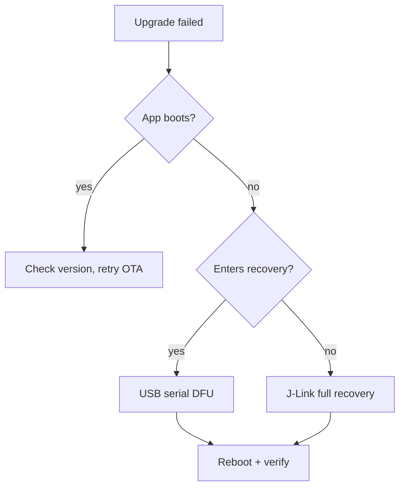

# Guía de Desarrollo de Firmware de reSpeaker Clip

La referencia completa para el firmware del lado del dispositivo de reSpeaker Clip: cómo está construido, el protocolo AT/GATT/UDP que utiliza, cómo se compila, actualiza, recupera, valida y envía. Para el flujo desde compilación hasta prueba de humo en una máquina limpia, consulta [Getting Started with the reSpeaker Clip Firmware SDK](/es/respeaker_clip_firmware_quick_start); para información completa sobre compilación/flasheo/energía/posibles problemas, consulta [CLAUDE.md](https://github.com/Seeed-Studio/reSpeaker_Clip/blob/main/CLAUDE.md).

El código fuente del firmware descargado es la referencia autorizada; esta guía lo resume. Cuando haya discrepancias, el código fuente prevalece.

## Introducción

El Firmware SDK es una aplicación basada en eventos sobre Zephyr RTOS en el Nordic nRF5340 (núcleo de aplicación + núcleo de red) con una matriz de micrófonos PDM, BLE, Wi-Fi AP (nRF7002), USB, almacenamiento SD y una pantalla OLED. Está destinado a desarrolladores que modifican el comportamiento del lado del dispositivo. Esta guía cubre el diseño y la referencia operativa (protocolo, actualización, validación, producción) en un solo lugar para que cada dato tenga exactamente un único origen — las referencias cruzadas apuntan de vuelta aquí en lugar de duplicarse.

## Arquitectura del Sistema

### Arquitectura en Capas

El firmware está organizado en cinco capas, cada una dependiendo solo de la capa inferior:

| Capa | Responsabilidad | Código clave |
|-------|----------------|------------|
| **App / eventos** | Máquina de estados, UI, botón, el único lugar donde ocurren efectos secundarios | `clip_event.c`, `display.c`, `button.c`, `main.c` |
| **Servicio / transporte-transfer-config** | Movimiento de bytes (BLE/UDP/USB), motor de transferencia de archivos, configuración persistente | `transport.c`, `transport_ble.c`, `transport_udp.c`, `usb_cdc.c`, `transfer.c`, `config.c` |
| **Procesamiento / audio** | Captura PDM → DSP → Opus → escrituras de archivos enmarcadas | `audio.c`, `storage.c` |
| **HAL / drivers** | Dispositivos de la placa: OLED, PMIC, mic/reguladores, flash SPI, SD, radio WiFi/BLE | `boards/seeed/clip/`, `drivers/`, `battery.c`, `haptic.c` |
| **Kernel Zephyr** | Hilos, colas de mensajes, semáforos, mutexes, gestión de energía | NCS v3.3.0 |

El invariante: **la capa de aplicación es el único lugar que muta el estado y desencadena efectos secundarios.** Las pulsaciones de botón y los comandos AT no inician el micrófono ni escriben en la tarjeta SD directamente — publican un evento, y `clip_event.c` decide si es legal en el estado actual y lo ejecuta.

Una solicitud fluye así: `button ISR` / `AT command` → `clip_post_event[_sync]()` → `[k_msgq]` → `clip_event_process()` (hilo principal) → `execute_transition()` → efectos secundarios (`audio_*`, `storage_*`, `display_*`, `haptic_*`, `ble_notify_*`). Los botones publican de forma asíncrona (`K_NO_WAIT`, seguro en ISR); los comandos AT publican de forma síncrona (bloquean en un semáforo por evento para que `AT+START` pueda devolver el id de sesión de forma síncrona).

### Modelo de Eventos y Estados

El despachador en `clip_event.c` es una máquina de estados dirigida por tablas:

- `clip_post_event(event)` — asíncrono, no bloqueante, seguro en ISR; descarta si la cola de 8 ranuras está llena.
- `clip_post_event_sync(event, &info)` — bloqueante; devuelve `OK`/`INVALID`/ `BUSY`/`ERROR` a través de `info`.

Estados: `UNINITIALIZED → IDLE → RECORDING → TRANSMITTING / WIFI_SYNC → IDLE`, más `PAUSED`, `ERROR`, `OTA`. `transition_table[current_state][event]` devuelve un estado siguiente, `TRANS_SAME` (permanecer, p. ej. `MARK`), o `TRANS_INVALID` (rechazar). Dos rechazos prefiltrados: `START` mientras `WIFI_SYNC` ("WiFi bloqueado"), `START` mientras USB MSC expone la SD ("USB bloqueado" — montar sobre USB mientras se escribe corrompería FAT). El estado solo se consolida en `execute_transition()` mediante `atomic_set(&g_state, new)` — el único lugar donde el estado cambia.

Efectos secundarios notables: `START` llama a `storage_ensure_mounted()`, rechaza si está llena, luego `audio_start_recording(AUDIO_MODE_MERGE)`. `STOP` espera ≤5 s a que el hilo de audio vacíe/cierre; si la SD está ocupada, stop consolida `IDLE` de todos modos para que la máquina nunca se bloquee en `RECORDING` (la cola de la grabación puede cortarse). `POWER_OFF_EXEC` cancela cualquier transferencia activa (espera acotada), detiene una grabación, guarda el estado del medidor de combustible y pone el PMIC en modo de envío.

### Modelo de Hilos

Cinco hilos de aplicación (prioridades Zephyr: número más bajo = mayor prioridad, con posibilidad de desalojo a partir de 0; la recepción Bluetooth se ejecuta aún más alta):

| Hilo | Pri | Pila | Rol |
|--------|-----|-------|------|
| **Principal** | (main) | — | Bucle de eventos `clip_event_wait()`→`clip_event_process()`, UI, tiempo. Espera `K_FOREVER` en reposo o `K_MSEC(1000)` grabando. |
| **Audio** `audio_rec` | 0 | 32768 | Lectura PDM → DSP → Opus → almacenamiento. Hilo de aplicación de mayor prioridad (el plazo de 20 ms de Opus es estricto). |
| **Transferencia** | 5 | 16384 | Motor de transferencia de archivos: lee la SD, envía vía transporte, retransmite. |
| **Servidor UDP** | 5 | 4096 | Servidor de sockets UDP Wi-Fi (puerto 8089). |
| **Servidor AT** | 7 | 4096 | Analiza AT sobre BLE/UDP/USB, publica eventos síncronos, envía JSON. |

Patrón de sincronización: **banderas volátiles/atómicas** para "¿debo detenerme?" (`transfer_cancel_requested`, `pause_requested`), **semáforos** para "¿has terminado?" (`stop_done_sem`, `file_closed_sem`, `transfer_trigger_sem`), **mutexes** para estructuras de datos (`audio_state_mutex`, `sd_lifecycle_mutex`, `session_json_mutex`, `transport_lock`), **una cola de mensajes** para la ruta productor→consumidor que importa (`clip_ev_msgq`, eventos → principal). Un `k_mem_slab` de 32 × 1280 B búferes proporciona 640 ms de profundidad de cola DMIC para absorber el jitter de planificación (incluida la preempción de RX BT).

## Arquitectura de Audio y Grabación

### Canalización de Audio

Por cada trama de 20 ms: `dmic_read()` (L+R estéreo, 1280 B) → `process_pcm_frame()` (mezcla + DSP, dependiente del modo) → `opus_encode()` (paquete de ≤4000 B) → `storage_write_frame()` (escrituras en búfer de 2 bytes con longitud prefijada, 4 KiB).

Constantes (`audio.h`): 16 kHz, 16 bits, PDM de 2 canales; tramas de 20 ms → 320 muestras/trama, 1280 B/bloque; 32 búferes DMIC (cola de 640 ms).

### Modos de Grabación

> Documentos antiguos describen `MODE_NORMAL` como **estéreo**. Eso es incorrecto. Ambos modos graban en **mono**.

- **Ambos modos** graban en mono mediante una mezcla L+R. `clip_event.c` fija `audio_start_recording(AUDIO_MODE_MERGE)`. `MODE_NORMAL` no es estéreo — el nombre es heredado.
- **`MODE_NORMAL`** (predeterminado): mezcla L+R alineada en retardo → filtro pasa-altos manual de 100 Hz → AGC entero (envolvente + cálculo de ganancia + suavizado) → limitador suave. **Sin SpeexDSP.**
- **`MODE_ENHANCED`**: la misma mezcla + DSP manual, **más SpeexDSP** de supresión de ruido + desreverberación, condicionado a `mode == ENHANCED && noise_suppress > 0` (`audio.c:506`). El AGC de SpeexDSP *no* se usa (la compilación es `FIXED_POINT`; un AGC FFT en coma flotante costaría ~15 ms/trama; el AGC entero lo reemplaza).
- El paso de mezcla correlaciona cruzadamente L vs R sobre retardos \{−1, 0, +1\} (separación de micrófonos de 2.85 cm → ≤1 muestra de ITD a 16 kHz) y alinea el retardo antes de sumar, evitando el filtrado en peine. El AGC es un compresor clásico: ~30 ms de ataque / ~300 ms de liberación, objetivo ≈−14.7 dBFS, ganancia limitada a ±12/24 dB, limitador suave (rodilla −2 dBFS, límite duro −0.5 dBFS).
- Opus: `OPUS_APPLICATION_AUDIO` (preserva mejor las fricativas que VOIP para STT), VBR sin restricciones, indicación de señal de voz, profundidad de 16 bits, DTX/FEC/pérdida de paquetes desactivados. La tasa de bits/complejidad son **por modo en Kconfig** (`CLIP_NORMAL_*`/`CLIP_ENHANCED_*`), no configurables en tiempo de ejecución. El estado del codificador + SpeexDSP se almacena en caché, se reinicializa solo cuando cambian los parámetros.
- Establece el modo con `AT+MODE=normal|enhanced` (persistente) o `AT+START mode=enhanced` (solo para la sesión, no persistente).

### Modelo de Sesión, Segmentación y Almacenamiento

Cada grabación es una **sesión** con un `session_id` de 14 dígitos: `YYYYMMDDHHMMSS` (UTC) cuando el reloj está sincronizado, de lo contrario `0` + 13 dígitos de tiempo de actividad. La forma de 14 dígitos se aplica en todas partes (`validate_session_id`) porque el diseño de almacenamiento la fragmenta en componentes de ruta.

Una sesión es un árbol de directorios: `session.json` (metadatos: id, duración, archivos, sincronizado, tamaño, canales, sample_rate, modo), `marks.bin` (marcadores binarios: magia "BMRK" + recuento + desplazamientos), y archivos de segmentos `0/0001.opus`, `0/0002.opus` … `1/0101.opus` (grupo = (file_index−1)/100, 100 archivos por subdirectorio). Los archivos Opus son **flujos de tramas con longitud prefijada** (longitud LE de 2 bytes + paquete, no OGG); un búfer de escritura de 4 KiB agrupa tramas antes de `fs_write`.

Segmentación en trozos: **300 s por segmento cuando no se sincroniza** (`CLIP_AUDIO_SEGMENT_DURATION_NO_SYNC`), **60 s durante una transferencia activa** (`CLIP_AUDIO_SEGMENT_DURATION_SYNC`) — al grabar *mientras* se transfiere (modo continuo), el hilo de transferencia solo puede leer un archivo cerrado, por lo que 60 s limita la espera del cliente para el siguiente archivo; si la sincronización comienza a mitad de archivo y el archivo actual ya supera los 60 s, el motor corta inmediatamente (`audio.c:868`). Cada ciclo `PAUSE`/`RESUME` también abre un archivo nuevo. El campo `synced` de `session.json` rastrea los archivos reconocidos para que una descarga se reanude desde el primer archivo no sincronizado.

**Almacenamiento:** la microSD (FAT32, `/SD:`) contiene las grabaciones bajo `/SD:/REC/` en un diseño de cubos que fragmenta el id de sesión (`/SD:/REC/<YYYYMMDD>/<HH>/<MM>/<SS>/…`). La flash SPI externa de 8 MiB (LittleFS, ~6.8 MiB) contiene la configuración (`/lfs/settings/run`) y las ranuras OTA — separadas de la SD para que una configuración corrupta o una OTA interrumpida nunca afecten a las grabaciones. La SD se **remonta de forma perezosa** mediante `storage_ensure_mounted()` y se **apaga por energía en reposo** después de `CLIP_SD_IDLE_DELAY_MS` (45 s) cuando está realmente inactiva (comprobado bajo bloqueo para cerrar la ventana TOCTOU con una grabación/transferencia que comience a mitad de la comprobación).

### Gestión de Energía

Dispositivo de batería (celda "240" de 170 mAh, NPM1300 + nRF Fuel Gauge); la corriente en reposo es la restricción dominante. Compilación de producción en el raíl de 3V3:

| Fuente | Comportamiento | Coste |
|--------|----------|------|
| Reguladores principales + de radio nRF5340 | DCDC (`NRF5X_REG_MODE_DCDC`) | ~500–600 µA frente a LDO |
| Tarjeta SD | Se apaga por energía en reposo después de 45 s | ~0 cuando está inactiva |
| Consola UART de depuración | UARTE permanece habilitado entre impresiones | **~570 µA** de fuga |
| Publicidad lenta BLE | Intervalo de ~1 s | ~0.1 mA promedio |
| nRF70 QSPI | `CONFIG_NRF70_QSPI_LOW_POWER` cuando WiFi no se usa | mínimo |

**Reposo en producción ≈ 170 µA.** La mayor fuga después de corregir los reguladores y la SD es la **consola UART de depuración** (~570 µA); el fragmento `production` desactiva la consola + el backend de registro UART (`CONFIG_CONSOLE=n`, `CONFIG_UART_CONSOLE=n`, `CONFIG_LOG_BACKEND_UART=n`), lo que permite alcanzar ~170 µA. `CONFIG_PM_DEVICE_RUNTIME=y` suspende automáticamente los controladores UART/I2C/SPI cuando están inactivos. La grabación/transferencia eleva brevemente la corriente (impulso de CPU a 128 MHz, con recuento de referencias; riel de micrófono + SD encendido; se libera al completar).

## Protocolo de comunicación

### Servicio BLE GATT

| Característica | UUID (sufijo de `6E40xxxx-B5A3-F393-E0A9-E50E24DCCA9E`) | Rol |
|---|---|---|
| Servicio | `0001` | El servicio reSpeaker Clip |
| Recepción de comandos | `0002` | El host escribe aquí los comandos AT |
| Envío de respuesta | `0003` | El dispositivo notifica respuestas JSON |
| Datos de archivo | `0004` | El dispositivo notifica tramas binarias de transferencia de archivos |
| Visualización de audio | `0005` | El dispositivo notifica niveles de energía de grabación |

### Gramática de comandos AT

| Tipo | Formato | Ejemplo | Notas |
|---|---|---|---|
| EXEC | `AT+XX` | `AT+GSTAT` | Acción / lectura por defecto |
| SET | `AT+XX=<value>` | `AT+MODE=enhanced` | Establecer un parámetro / actuar con argumentos |
| READ | `AT+XX?` | `AT+MODE?` | Consultar el valor actual |

El análisis sintáctico es compartido: `parse_command()` (en `at_server.c`) posee la gramática `AT+NAME=args` y la detección de tipo `=`/`?`; los manejadores reciben `ctx->args` ya dividido (después del `=`). `AT+LIST?2&10` es una lectura paginada.

### Contrato de respuesta JSON

- Éxito: `{"ok":true,"data":{...}}`
- Fallo: `{"ok":false,"msg":"..."}`
- **Sin códigos de error numéricos, sin campo `error`, sin ID de petición.** Los fallos usan `msg`. El mismo JSON se envía de forma idéntica por BLE, UDP y USB (encaminado por el transporte de origen del comando mediante la macro `SEND_RESPONSE()` — tu manejador solo rellena el búfer de respuesta).

### Referencia de comandos registrados

Los comandos registrados residen en `applications/clip/src/at_commands.c` (la tabla `.name = "..."`). Conjunto verificado:

| Grupo | Comandos |
|---|---|
| Estado del dispositivo | `GSTAT`, `BATT`, `DEVICE`, `VERSION` |
| Grabación | `START`, `STOP`, `PAUSE`, `RESUME`, `MARK` |
| Gestión de archivos | `LIST`, `MARKS`, `DOWNLOAD`, `CANCEL`, `DELETE` |
| Configuración | `MODE`, `AUTODEL`, `BRIGHTNESS`, `TIME`, `NAME` |
| Conectividad | `WIFI`, `WIFICFG`, `USB`, `PAIR`, `DFU` |
| Mantenimiento | `LOG`, `STORAGE`, `FORMAT`, `REBOOT`, `POWEROFF`, `FACTORY` |

**Legado eliminado — no documentar como disponible:** `BITRATE`, `COMPLEXITY`, `NOISE`, `AGC`, `DEREVERB`, `PURGE`. La supresión de ruido / desreverberación son valores predeterminados de Kconfig en tiempo de arranque (`CLIP_DEFAULT_NOISE`, `CLIP_DEFAULT_DEREVERB`), persistidos en `config.c`, pero **no tienen comando AT en tiempo de ejecución**; AGC está implementado a mano, siempre activo, no configurable. Cuando cambies una respuesta AT, comando o trama de transferencia, actualiza `docs/protocol.md` y `sdk/` en el mismo cambio.

### Tipos de tramas UDP

La transferencia de archivos por Wi‑Fi UDP usa un protocolo de tramas binarias (puerto 8089) con CRC32 por trama:

| Tipo | Valor | Estructura |
|---|---|---|
| `DATA` | `0x01` | type(1) + seq(2) + len(2) + data |
| `FILE_ACK` | `0x03` | type(1) + status(1) + received_count(2) + crc32(4) |
| `FILE_START` | `0x10` | type(1) + fn_len(1) + filename + file_size(4) |
| `FILE_END` | `0x11` | type(1) + crc32(4) |
| `TRANSFER_DONE` | `0x12` | type(1) + sid_len(1) + session_id + file_count(4) |
| `AT_RESP` | `0x20` | Respuesta AT transportada sobre UDP |
| `HEARTBEAT` | `0x30` | keepalive |

**BLE no tiene CRC por trama** (la capa de enlace garantiza la entrega) — solo el CRC32 de archivo completo en `FILE_END` para la comprobación extremo a extremo. UDP tiene CRC32 por trama + `FILE_ACK` con un **NACK de mapa de bits de repetición selectiva**: el cliente informa qué tramas le faltan como un mapa de bits y el motor solo reenvía esas, reguladas por `CLIP_UDP_REPAIR_PACE_US` (se reduce a la mitad en cada ronda de reintento). Un ritmo de reparación que falla recurre a retransmisión de archivo completo; `TRANSFER_MAX_FILE_RETRIES` (10) limita los intentos antes de `ERROR`.

### Sesión y direccionamiento de archivos

Los IDs de sesión visibles para el host son exactamente 14 dígitos decimales `YYYYMMDDHHMMSS`; las rutas físicas FAT nunca se exponen en el protocolo. `AT+DOWNLOAD` acepta `session` o `session:NNNN.opus`. Valida los argumentos controlados por el usuario antes de acceder a almacenamiento, ruta o transferencia.

## Configuración de firmware y perfiles de compilación

### Compilaciones estándar y de desarrollo

La compilación de depuración por defecto (sin fragmento) mantiene la consola UART encendida y escribe registros en `/SD:/LOG` (archivos rotativos de 64 KiB) al nivel INF (`CONFIG_LOG_BACKEND_FS=y`). Compilar:

```sh
source ~/ncs/v3.3.0/zephyr/zephyr-env.sh
export ZEPHYR_EXTRA_MODULES=$PWD   # env var, not -D — Kconfig discovery runs before CMake
west build --build-dir build-clip --board clip/nrf5340/cpuapp applications/clip
# pristine (required after MCUboot/devicetree/sysbuild/partition changes):
west build --build-dir build-clip --pristine --board clip/nrf5340/cpuapp applications/clip
```

Cada aplicación se compila como un **sysbuild** (MCUboot + núcleo de aplicación + radio del núcleo de red) por defecto; la placa proporciona el pegamento. Ajustes clave de `prj.conf` / devicetree / Kconfig: interruptores de funciones, niveles de registro, configuración BLE/Wi‑Fi/FS; asignaciones GPIO/I2C/SPI/PDM/PMIC/OLED; tamaños de búfer, pilas de hilos, política de energía.

### Compilación de producción

Consola + registro UART desactivados, reposo ≈170 µA:

```sh
west build --build-dir build-clip-prod --board clip/nrf5340/cpuapp applications/clip \
  -- -DSNIPPET_ROOT=$(pwd)/applications/clip -DSNIPPET=production
```

`SNIPPET_ROOT` debe ser absoluto. El fragmento `production` se encuentra en `applications/clip/snippets/production/`. El proyecto se compila con **cero advertencias** — corrige todas las advertencias del compilador antes de hacer commit.

## Actualización y recuperación de firmware

### Selección del método de actualización

| Escenario | Recomendado | Paquete |
|---|---|---|
| Actualización de usuario final (dispositivo cerrado) | App BLE OTA o DFU serie USB | `*-signed.bin` / `*-ota.zip` |
| Recuperación serie (sin app) | mcumgr serie | `*-signed.bin` |
| Depuración de desarrollo | `west flash` / J-Link | `merged.hex` |
| Programación de producción | J-Link / programador | `merged.hex` completo + `merged_CPUNET.hex` |
| Ajuste solo del núcleo de app | mcumgr serie | `*-signed.bin` (aún no se distribuye un `single.zip`) |

### DFU serie USB

La app mantiene el USB apagado por defecto — envía primero `AT+USB=on` por BLE (las muestras con CDC por defecto activan USB automáticamente, o mantén pulsado el botón de usuario mientras conectas). Abre el puerto CDC‑ACM a **1200 baudios** para activar la recuperación serie de MCUboot; aparece un nuevo puerto con **PID `0x8069`** (app en ejecución `0x0069`; el bit `0x8000` marca el bootloader; ambos con VID Seeed `0x2886`). Subir + reiniciar:

```sh
nrfutil mcu-manager serial image-upload --firmware clip-<version>-signed.bin --serial-port /dev/ttyACMx
nrfutil mcu-manager serial reset     --serial-port /dev/ttyACMx
```

MCUboot verifica la firma RSA e inicia la nueva app; la partición del bootloader nunca se toca.

### BLE OTA

```sh
nrfutil mcu-manager ble image-upload --firmware clip-<version>-ota.zip --address <BLE-MAC>
```

O usa nRF Connect Device Manager / SenseCraft Voice en un teléfono.

### J-Link

Para desarrollo/producción/cuando falla la recuperación por USB+BLE:

```sh
nrfutil device program --firmware clip-<version>-merged.hex --serial-number <JLINK-SN>
nrfutil device reset --serial-number <JLINK-SN>
```

### Manifiesto de paquetes

Cada versión debería incluir un manifiesto para que los usuarios no tengan que adivinar los rangos de paquetes a partir de los nombres de archivo:

```yaml
firmware_version:
hardware_revision:
ncs_version:        # v3.3.0
bootloader_version: # mcuboot
app_core_version:
net_core_version:
package_type:       # debug | production
included_partitions: # [mcuboot, app, netcore]
upgrade_method:     # serial-dfu | ble-ota | programmer
sha256:
rollback_supported:
```

### Árbol de decisión de recuperación



### Matriz de comandos de reinicio

| Método | Comando | Cuándo |
|---|---|---|
| Reinicio serie mcumgr | `nrfutil mcu-manager serial reset --serial-port …` | Después de DFU serie |
| Reinicio mcumgr BLE | `nrfutil mcu-manager ble reset --address …` | Después de BLE OTA |
| Reinicio J-Link | `nrfutil device reset --serial-number <JLINK-SN>` | Desarrollo/producción |
| Reinicio con runner de west | `west flash --build-dir … && nrfutil device reset` | Desarrollo — nota que `west flash --reset` NO funciona aquí |

`--recover` borra **ambos núcleos** (elimina el bloqueo del puerto de acceso b0n) — úsalo solo cuando el AP del núcleo de red esté bloqueado, nunca de forma rutinaria.

### Reglas de seguridad

Nunca, sin preparación: borrado completo del chip; modificación de UICR; sobrescribir el bootloader; cambio de la tabla de particiones; flashear una imagen combinada de una revisión de hardware incorrecta; recuperar un dispositivo de producción sin hacer copia de seguridad de su configuración.

## Validación y depuración

### Matriz de regresión por tipo de cambio

| Cambio | Debe probarse |
|---|---|
| Canal de audio | SNR, STOI, WER; desbordamiento de búfer; CPU; tiempo real (plazo de 20 ms) |
| Opus | Decodificación; formato de trama; tamaño de archivo; compatibilidad de transferencia |
| AT / GATT | Comandos antiguos; formato de respuesta; rutas de error; SDK de Python |
| Sistema de archivos | Grabación larga; pérdida de energía; espacio lleno; CRC |
| BLE / Wi‑Fi | Conexión; fragmentación; reanudación; tiempo de espera |
| Energía | Reposo; grabación; Wi‑Fi; activación |
| Actualización de firmware | OTA; recuperación; lectura de versión; reversión |

### Métricas de calidad de audio

SNR (claridad señal vs ruido), STOI (inteligibilidad), WER (tasa de error de ASR — la métrica de negocio), THD (distorsión de DSP/hardware). Escenarios de prueba: silencio cerca/lejos, oficina, cafetería, coche, calle; tanto Normal como Enhanced; cubrir chino, inglés, secuencias de dígitos, silencio.

> **PESQ/STOI necesitan una referencia limpia + alineación.** No los calcules sobre grabaciones de campo arbitrarias y afirmes una conclusión — sin una referencia emparejada, el número no es significativo.

### Depuración de serie, registro, almacenamiento y temporización

```sh
minicom -D /dev/ttyACM0 -b 921600   # ttyACM1 if a J-Link also connected
```

Niveles de registro: `AT+LOG=off|info|debug` (por defecto de depuración: info). `CONFIG_LOG_BACKEND_FS=y` escribe en `/SD:/LOG` (rotación de 64 KiB) para análisis post‑mortem; `AT+LOG=off` permite que la SD se apague por compuerta de energía en reposo. El hilo de audio imprime estadísticas del contador de ciclos DWT (`enc avg/min/max`, `dsp`) cada 500 tramas (10 s). Problemas conocidos (`CLAUDE.md`): `%llu` no está soportado en nRF5340 (usa `%u` + conversión); `sendto()` de UDP devuelve éxito incluso en pérdidas de TX silenciosas; el orden de directorios FAT no es cronológico; un `/lfs/settings/run` corrupto bloquea `settings_load` (el watchdog borra + reinicia después de 3 s).

### Herramientas de prueba del host

```sh
python applications/clip/tests/tools/clip-cli.py status        # BLE default; --transport wifi
python applications/clip/tests/tools/clip-cli.py record --duration 5
python applications/clip/tests/tools/clip-cli.py list
python applications/clip/tests/tools/clip-cli.py sync --session <id>
python applications/clip/tests/tools/clip-cli.py terminal      # interactive AT shell
python applications/clip/tests/tools/udp_sync.py --session <id>
python applications/clip/tests/tools/decode_opus.py <file>.opus out.wav
```

**"Build passes" no significa "hardware verificado".** Una compilación limpia no dice nada sobre el comportamiento en el dispositivo.

## Versión de producción

### Artefactos de la versión y manifiesto

Exportación manual por ahora (el `scripts/build_release.sh` activado por etiqueta y `.github/workflows/release.yml` **aún no están implementados**). Las compilaciones de depuración y producción generan cada una cuatro artefactos:

| Artefacto | Uso |
|---|---|
| `merged.hex` | Imagen completa del núcleo de la aplicación (programador / J-Link) |
| `merged_CPUNET.hex` | Imagen completa del núcleo de red |
| `dfu_application.zip` (nombre de la versión `*-ota.zip`) | Paquete OTA de mcumgr (BLE / USB serie) |
| `clip/zephyr/zephyr.signed.bin` (nombre de la versión `*-signed.bin`) | Imagen de aplicación firmada por MCUboot (DFU por USB serie) |

Un `single.zip` (solo núcleo de aplicación) **aún no se distribuye**; hasta que llegue `build_release.sh`, usa `*-signed.bin` para actualizaciones solo de la aplicación. Publicación: añade `docs/release_notes/v$VERSION.md`, haz commit, `git tag vX.Y.Z && git push origin vX.Y.Z` → CI construye la versión de GitHub.

### Claves de firma

`boards/seeed/clip/sysbuild/root-rsa-2048.pem` es una **copia de la clave predeterminada de MCUboot**. Cualquiera con el código fuente público puede firmar imágenes para tus dispositivos. **Genera tu propia clave para producción** y mantén en secreto la parte privada; rota reemplazando la clave y reflasheando el gestor de arranque.

### CI

`.github/workflows/firmware.yml` compila la app de clip al hacer push/PR a `main` (comprobación de compilación; aplica los parches de MCUboot + `west build`). `mobile-ci.yml` (análisis + pruebas unitarias, en PR) y `mobile-verify.yml` (APK de depuración / pruebas rápidas en iOS, push + manual) cubren `mobile/`.

### Programación en fábrica y firmware de prueba

Cada imagen de prueba es una sysbuild independiente bajo `tests/<name>`, construida como `west build --build-dir build-test --pristine --board clip/nrf5340/cpuapp tests/clip`. Las pruebas **no usan MCUboot** (firmware de fábrica/certificación, flasheado directamente vía J-Link) mediante `SB_CONFIG_BOOTLOADER_NONE=y`:

| Prueba | Propósito |
|---|---|
| `tests/clip` | Conjunto de pruebas de hardware multi-imagen (aloja la shell de ajuste de cristales `lfxo`/`hfxo`) |
| `tests/dtm` | BLE Direct Test Mode (conformidad RF; UART de 2 hilos @19200) |
| `tests/wifi_radio` | Prueba de radio Wi-Fi nRF70 (TX/RX, tono, IQ, FICR) |
| `tests/otp` | Programación OTP de nRF70 (fábrica) |
| `tests/re` | Puesta en marcha de la placa de referencia |

El flasheo masivo usa `nrfutil device program --firmware …-merged.hex --serial-number
<JLINK-SN>`.

### Reglas de compatibilidad

- Mantén la forma de la respuesta AT: `{"ok":true,"data":{...}}` / `{"ok":false,"msg":"..."}`. Sin códigos de error numéricos, sin campo `error`.
- No rompas el formato de archivo (Opus con longitud prefijada, esquema de `session.json`).
- Actualiza `docs/protocol.md` **y** `sdk/` siempre que cambie una respuesta, comando o trama de transferencia AT.
- No ejecutes automáticamente un borrado completo del chip; no flashees automáticamente un dispositivo de producción.
- El código fuente del firmware es la fuente de la verdad.

### Migración de NCS v3.2.1 a v3.3.0

`main` migró a **Kconfig solo de la v3.3.0** (por ejemplo, la opción WPA3 `..._WPA3_IMPLEMENTATION_NONE`) y ya no compilará contra NCS v3.2.1. La rama `ncs/v3.3.0` es una línea divergente más antigua (~12 commits por detrás de `main`); la `master` local es solo la importación inicial antigua. Apunta a NCS v3.3.0.

## Desarrollo asistido por IA

El repositorio incluye una skill de desarrollo de firmware en [`skills/clip-dev/`](https://github.com/Seeed-Studio/reSpeaker_Clip/blob/main/skills/clip-dev/SKILL.md) para agentes de IA (Claude Code, etc.) que trabajan en este firmware. Codifica las restricciones reales del proyecto para que un agente no tenga que volver a derivarlas, y no adivine hechos que es fácil equivocarse. **Úsala; no dupliques sus reglas en la documentación.**

Para un ejemplo completo y copiable de personalización de comandos AT asistida por IA, consulta [Personalización: Añadir un comando AT personalizado](/es/respeaker_clip_customization_at_command/). Ese artículo muestra cómo pedir a un agente de IA que cargue la skill del repositorio, añada `AT+ECHO`, construya el firmware y valide el comando en el dispositivo.

**Lo que proporciona la skill** — `SKILL.md` más nueve referencias bajo `skills/clip-dev/references/` (`audio`, `build-flash`, `ble-at`, `storage`, `wifi-udp`, `mcuboot`, `power`, `display`, `hardware`):

- versión activa de NCS, valores predeterminados de sysbuild de la placa, comandos de compilación/flasheo;
- el **conjunto actual de comandos AT** (registrado en `at_commands.c`) y el contrato de respuesta `{"ok":true,"data":...}` / `{"ok":false,"msg":...}`;
- la verdad sobre la canalización de audio: ambos modos son mezcla mono L+R; **no existen comandos en tiempo de ejecución para bitrate, complejidad del códec, AGC, supresión de ruido y desreverberación**;
- restricciones de energía (fuga de la consola, el fragmento `production`, control de inactividad de la SD);
- un flujo de trabajo de firmware: confirmar el contrato en el código fuente antes de editar documentación o clientes, validar los argumentos controlados por el usuario, flashear solo la imagen solicitada, actualizar `docs/protocol.md` + `sdk/` siempre que cambie una respuesta AT.

**Cómo cargarla.** En Claude Code la skill se descubre automáticamente; de lo contrario, apunta al agente al archivo:

```
@clip-dev
Analyze how to add distinct haptic patterns for recording start vs stop.
Give the modification plan first; do not edit code yet.
```

**Plantilla estándar de tarea** — rellena esto antes de pedir a un agente que cambie el firmware:

```markdown
## Goal
<device behavior to implement>

## Baseline
- Firmware commit/tag: v0.0.9
- NCS version: v3.3.0
- Board target: clip/nrf5340/cpuapp
- Build config: debug | production

## Constraints
- Keep which AT/GATT interfaces compatible
- New protocol fields allowed? (yes/no)
- File format changes allowed? (yes/no)
- Devicetree/Kconfig changes allowed? (yes/no)
- MCUboot / partition table / signing key edits forbidden

## Acceptance criteria
- Firmware builds (pristine, zero new warnings)
- Basic-SDK regression passes
- Expected serial log
- On-device behavior
- RAM/Flash delta
- Power or real-time constraint
```

**Reglas de seguridad que la skill aplica.** No adivines archivos, funciones, Kconfig o targets de placa: busca primero en el código fuente real. No infieras una interfaz pública a partir del nombre de un módulo interno. No modifiques MCUboot, la tabla de particiones o las claves de firma sin confirmación explícita. No borres automáticamente todo el chip ni flashees un dispositivo de producción. No rompas las respuestas AT existentes ni los formatos de archivo. "Build passes" no significa "hardware verificado": afirma solo lo que se haya probado realmente en un dispositivo. Para cambios de audio/protocolo, informa del impacto en CPU, búfer, flash, RAM y formato de salida; para cambios de protocolo, actualiza el `sdk/` de Python y `docs/protocol.md` en el mismo cambio.

## Recursos relacionados

- [Primeros pasos con el SDK de firmware de reSpeaker Clip](/es/respeaker_clip_firmware_quick_start) — ruta de compilación a prueba rápida
- [CLAUDE.md](https://github.com/Seeed-Studio/reSpeaker_Clip/blob/main/CLAUDE.md) — referencia completa de compilación/flasheo/energía/puntos problemáticos
- [`skills/clip-dev/`](https://github.com/Seeed-Studio/reSpeaker_Clip/blob/main/skills/clip-dev/) — skill de desarrollo de firmware con IA
- Fuente: [clip_event.c](https://github.com/Seeed-Studio/reSpeaker_Clip/blob/main/applications/clip/src/clip_event.c) (máquina de estados), [audio.c](https://github.com/Seeed-Studio/reSpeaker_Clip/blob/main/applications/clip/src/audio.c) (DSP/Opus), [at_commands.c](https://github.com/Seeed-Studio/reSpeaker_Clip/blob/main/applications/clip/src/at_commands.c) (registro AT), [at_server.c](https://github.com/Seeed-Studio/reSpeaker_Clip/blob/main/applications/clip/src/at_server.c) (análisis/enrutamiento), [transfer.c](https://github.com/Seeed-Studio/reSpeaker_Clip/blob/main/applications/clip/src/transfer.c) (motor de transferencia), [transport.c](https://github.com/Seeed-Studio/reSpeaker_Clip/blob/main/applications/clip/src/transport.c) (abstracción de transporte), [storage.c](https://github.com/Seeed-Studio/reSpeaker_Clip/blob/main/applications/clip/src/storage.c) (sesiones/ciclo de vida de la SD), [main.c](https://github.com/Seeed-Studio/reSpeaker_Clip/blob/main/applications/clip/src/main.c) (orden de inicialización)
- [usb_dfu.md](https://github.com/Seeed-Studio/reSpeaker_Clip/blob/main/docs/usb_dfu.md), [protocol.md](https://github.com/Seeed-Studio/reSpeaker_Clip/blob/main/docs/protocol.md), [udp_protocol.md](https://github.com/Seeed-Studio/reSpeaker_Clip/blob/main/docs/udp_protocol.md)

## Soporte técnico y debate sobre el producto

Gracias por elegir nuestros productos. Estamos aquí para ofrecerte diferentes tipos de soporte y garantizar que tu experiencia con nuestros productos sea lo más fluida posible. Ofrecemos varios canales de comunicación para adaptarnos a distintas preferencias y necesidades.

<div class="button_tech_support_container">
<a href="https://forum.seeedstudio.com/" class="button_forum"></a>
<a href="https://www.seeedstudio.com/contacts" class="button_email"></a>
</div>

<div class="button_tech_support_container">
<a href="https://discord.gg/eWkprNDMU7" class="button_discord"></a>
<a href="https://github.com/Seeed-Studio/wiki-documents/discussions/69" class="button_discussion"></a>
</div>
