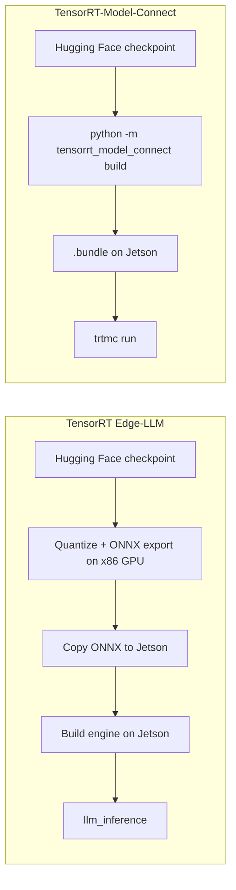

# Jetson AGX Orin 上で TensorRT-Model-Connect をデプロイする

<div align="center">
  
</div>

この wiki では、**Jetson AGX Orin** 搭載の Seeed reComputer 上で [NVIDIA TensorRT-Model-Connect](https://github.com/NVIDIA/TensorRT-Model-Connect)（TRTMC）を実行する方法を説明します。ネイティブランタイムをビルドした後のパスは短く、Hugging Face のチェックポイントから始めて、デバイス上で TensorRT の `.bundle` を生成し、そのままテキスト生成を実行できます。別途 x86 ホストを用意する必要も、ONNX エクスポート工程もありません。

この手順では FP16 の **Qwen3-4B-Instruct-2507** を使用します。このモデルは密な Transformer なので、TensorRT はバッチ化された prefill エンジンを利用できます。同じページでは、AGX Orin 64GB 上での変換時メモリ使用量と、llama.cpp CUDA との prefill / decode の同条件比較も記録しています。

:::note
TensorRT-Model-Connect はパブリックプレビューです。API、対応モデル、ビルドフローは今後も変更される可能性があります。NVIDIA 自身のガイダンスとしては、対応モデルを素早く試したい場合は TRTMC を、Jetson 上で本番向けの LLM/VLM ランタイムが必要な場合は [TensorRT Edge-LLM](/ja/deploy_tensorrt_edge_llm_on_jetpack6.2/) から始めることを推奨しています。
:::

## TensorRT-Model-Connect とは？

TensorRT-Model-Connect は、NVIDIA TensorRT 上に構築されたモデルファミリ向けリファレンス実装のコレクションです。ファミリ専用のビルダーが Hugging Face のスナップショットを読み込み、TensorRT エンジンを構築し、バージョン管理された `.bundle` を書き出します。同じ bundle は `trtmc` CLI からも、テキスト生成などのネイティブ C++ タスク API からも実行できます。

Jetson 上での実用的な違いは変換パスです。TensorRT Edge-LLM では、依然として x86 Linux マシン上のディスクリート GPU で量子化と ONNX エクスポートを行い、その ONNX ファイルをデバイスにコピーしてからエンジン生成を行うことが前提になっています。TRTMC はエンジン bundle を Jetson 自身でビルドします。



<div align="center">
  
</div>

## このパスが Jetson でより簡単な理由

| トピック | TensorRT Edge-LLM | TensorRT-Model-Connect |
| --- | --- | --- |
| 変換の実行場所 | NVIDIA GPU 搭載 x86 Linux ホスト上で ONNX をエクスポートし、その後 Jetson 上でエンジンをビルド | Jetson 上で Hugging Face スナップショットから `.bundle` を生成 |
| 中間ファイル | ONNX グラフ（数十 GB になることもあり）、デバイスへコピーが必要 | なし。`.bundle` が成果物 |
| セットアップ後のコマンド | エクスポート、コピー、エンジンビルド、その後 `llm_inference` を実行 | `python -m tensorrt_model_connect build` と `trtmc run` |
| 変換中のホストメモリ | ベンダー資料：FP8 ONNX エクスポートでは x86 マシンの CPU RAM にモデルサイズの約 18～20 倍が必要になる場合あり | AGX Orin 64GB 上での Qwen3-4B FP16 の実測値：ホスト使用量約 30.6 GB、コンテナピーク 41 GB |
| 最適な用途 | Jetson 上での本番向け LLM/VLM デプロイ | 実行対象と同じマシン上で、対応モデルを素早く試す用途 |

メモリの行は同一モデルでの直接比較ではありません。Edge-LLM が公開している ONNX エクスポート時の数値は、そのパイプラインが通常 Jetson ではなく大容量 RAM を持つワークステーションで実行される理由を説明しています。一方、TRTMC の数値は、AGX Orin 64GB 上で Qwen3-4B FP16 をビルドした際に実際に観測したものです。

## ハードウェア

このチュートリアルは、Jetson AGX Orin 64GB を搭載した **reComputer Classic J5012** 上で再現されています。Qwen3-4B FP16 の変換では、コンテナ内ピークが約 41 GB に達したため、実用上のターゲットは 64 GB のユニファイドメモリです。J5011（32GB）は同じ製品ファミリですが、この変換ではスラッシングが発生するか、失敗する可能性が高いでしょう。

<div style={{display:'grid', gridTemplateColumns:'repeat(2, minmax(0, 1fr))', gap:'24px', margin:'28px 0 42px'}}>
  <div style={{display:'flex', flexDirection:'column', overflow:'hidden', borderRadius:'16px', border:'2px solid #00a86b', background:'linear-gradient(145deg, #dce6ee, #cbd8e3)', color:'#172b4d', boxShadow:'0 14px 34px rgba(0,168,107,.18)'}}>
    <div style={{height:'290px', padding:'26px', display:'flex', alignItems:'center', justifyContent:'center', background:'linear-gradient(145deg, #d3dfe9, #bccbd8)'}}>
      
    </div>
    <div style={{display:'flex', flexDirection:'column', flex:'1', padding:'24px'}}>
      <div style={{fontSize:'23px', lineHeight:'1.35', fontWeight:'900', color:'#172b4d'}}>reComputer Classic J5012</div>
      <div style={{marginTop:'9px', color:'#526581', fontWeight:'600'}}>NVIDIA Jetson AGX Orin 64GB · 本 wiki で検証済み</div>
      <div class="get_one_now_container" style={{textAlign:'center', marginTop:'auto', paddingTop:'24px'}}>
        <a class="get_one_now_item" href="https://www.seeedstudio.com/reComputer-Classic-J5012-p-6881.html" target="_blank" rel="noopener noreferrer">
          <strong><span><font color={'FFFFFF'} size={"4"}> 今すぐ入手 🖱️</font></span></strong>
        </a>
      </div>
    </div>
  </div>

  <div style={{display:'flex', flexDirection:'column', overflow:'hidden', borderRadius:'16px', border:'2px solid #3182ce', background:'linear-gradient(145deg, #dce6ee, #cbd8e3)', color:'#172b4d', boxShadow:'0 14px 34px rgba(49,130,206,.18)'}}>
    <div style={{height:'290px', padding:'26px', display:'flex', alignItems:'center', justifyContent:'center', background:'linear-gradient(145deg, #d3dfe9, #bccbd8)'}}>
      
    </div>
    <div style={{display:'flex', flexDirection:'column', flex:'1', padding:'24px'}}>
      <div style={{fontSize:'23px', lineHeight:'1.35', fontWeight:'900', color:'#172b4d'}}>reComputer Classic J5011</div>
      <div style={{marginTop:'9px', color:'#526581', fontWeight:'600'}}>NVIDIA Jetson AGX Orin 32GB · 同一ボードファミリ</div>
      <div class="get_one_now_container" style={{textAlign:'center', marginTop:'auto', paddingTop:'24px'}}>
        <a class="get_one_now_item" href="https://www.seeedstudio.com/reComputer-Classic-J5011-p-6880.html" target="_blank" rel="noopener noreferrer">
          <strong><span><font color={'FFFFFF'} size={"4"}> 今すぐ入手 🖱️</font></span></strong>
        </a>
      </div>
    </div>
  </div>
</div>

## 前提条件

Jetson 上で以下を準備します：

- reComputer Classic J5012、またはその他の Jetson AGX Orin 64GB システム
- JetPack 7.2 / Ubuntu 24.04 / L4T R39.2
- NVIDIA ランタイム付き Docker（`docker info` の Runtimes に `nvidia` が表示されること）
- 開発用イメージ、Hugging Face スナップショット、`.bundle` 用に約 40 GB の空きディスク
- GitHub、Hugging Face、`nvcr.io` へのネットワークアクセス
- ベンチマークセクション向けのオプション：`nvpmodel` MAXN と `jetson_clocks`

検証済みのソフトウェアスタックは次のとおりです：

| 項目 | バージョン |
| --- | --- |
| デバイス | Jetson AGX Orin 64GB |
| OS | Ubuntu 24.04.4 LTS, kernel 6.8.12-tegra |
| L4T | R39.2 |
| TRTMC イメージ内の CUDA | 13.3.1 |
| TRTMC イメージ内の TensorRT | 11.1.0.106（TensorRT 26.07） |
| GPU SM | 87（Orin） |
| 電力モード | MAXN、GPU 1300 MHz |

:::tip
`docker ps` が `permission denied` を返す場合は、ユーザーを `docker` グループに追加してから再ログインしてください：

```bash
sudo usermod -aG docker $USER
```

:::

## 1. TensorRT-Model-Connect をクローンする

```bash
git clone https://github.com/NVIDIA/TensorRT-Model-Connect.git
cd TensorRT-Model-Connect
```

公式の入門パスは、[Build from Source](https://nvidia.github.io/TensorRT-Model-Connect/getting-started/source-build) と [Quick Start](https://nvidia.github.io/TensorRT-Model-Connect/getting-started/quick-start) の組み合わせです。以下のコマンドはそのパスに Jetson 固有のフラグを補ったものです。

## 2. 開発用コンテナをビルドする

AGX Orin の compute capability は 8.7 なので、`TRTMC_SM=87` になります。Jetson の Docker イメージでは `--runtime nvidia` も必要です。

```bash
GPU=0
SM="$(
  nvidia-smi -i "$GPU" \
    --query-gpu=compute_cap \
    --format=csv,noheader,nounits |
  tr -d '.[:space:]'
)"
IMAGE="trtmc-quickstart"

docker build \
  -f Dockerfile.dev.aarch64 \
  -t "$IMAGE" \
  requirements

SOURCE_DIR="$(git rev-parse --show-toplevel)"

docker run --rm -it \
  --runtime nvidia \
  --gpus "device=${GPU}" \
  --ipc=host \
  --network host \
  --mount "type=bind,source=${SOURCE_DIR},target=/src" \
  --workdir /src \
  --env TRTMC_SM="$SM" \
  "$IMAGE" \
  bash
```

:::caution
残りのコマンドはこのコンテナ内で実行し続けてください。このイメージにはすでに TensorRT 11.1、Python 3.12 の venv、Qwen ファミリのビルドに使われるネイティブヘッダが固定されています。Jetson 上で `nvidia-smi` が使えない場合は、手動で `SM=87` を設定してください。
:::

Hugging Face のスナップショットと bundle を外付け SSD に置く場合は、そのディスクも `-v /path/to/data:/out` のように bind mount してください。

## 3. ネイティブランタイムをビルドする

これらのコマンドをコンテナ内で実行します：

```bash
python -m pip install --no-deps -e . -C py-only=true

TRTMC_BUILD_DIR="build-sm${TRTMC_SM}"

cmake -S . -B "$TRTMC_BUILD_DIR" -G Ninja \
  -DCMAKE_BUILD_TYPE=Release \
  -DCMAKE_CUDA_ARCHITECTURES="${TRTMC_SM}-real" \
  -DTRTMC_BUILD_BACKEND_RTX=OFF \
  -DTRTMC_BUILD_TESTS=OFF \
  -DTRTMC_BUILD_EXAMPLES=OFF

cmake --build "$TRTMC_BUILD_DIR" --parallel "$(nproc)" --target \
  trtmc \
  trtmc_backend_trt \
  trtmc_model_qwen

export PATH="$PWD/$TRTMC_BUILD_DIR:$PATH"
```

`trtmc` は `--runtime-root` からネイティブライブラリを検索します。この引数を CMake ビルドディレクトリに指定してください。このディレクトリには `libtrtmc_core.so`、`libtrtmc_runtime.so`、`libtrtmc_backend_trt.so`、`libtrtmc_model_qwen.so` が含まれている必要があります。

## 4. Jetson 上で Qwen3-4B バンドルをビルドする

これは、以前は x86 GPU マシンを必要としていた変換ステップです。`--max-sequence-length` を固定してください。このチェックポイントの Hugging Face 設定では 262,144 トークンのコンテキストが宣伝されていますが、そのデフォルトのままにしておくと、エンジン生成中にメモリを使い果たします。

```bash
python -m tensorrt_model_connect build Qwen/Qwen3-4B-Instruct-2507 \
  --precision fp16 \
  --backend trt \
  --max-sequence-length 2048 \
  --max-batch-size 1 \
  --tensor-parallel-size 1 \
  --output qwen3-4b-instruct-2507.bundle \
  --verbose
```

ローカルのスナップショットディレクトリをモデル ID の代わりに指定することもできます。ビルダーはチェックポイントをダウンロードし、Qwen ファミリにそれを割り当て、TensorRT エンジンをすでに含んだ 1 つの `.bundle` を書き出します。

検証済みの J5012 ユニットでは、`max_sequence_length=2048` の Qwen3-4B FP16 が次のような変換フットプリントになりました。公開されている Qwen の単一デバイス FP16 パスは分割エンジン（`engine.plan` + `prefill.plan`）を書き出します。以下の数値は、プレフィルとデコードが 2 つの最適化プロファイルを持つ 1 つの plan を共有するデュアルプロファイルビルドから取得したものです。

| 指標 | 測定値 |
| --- | --- |
| 精度 / レイアウト | FP16、デュアルプロファイル |
| 最大シーケンス長 | 2048 |
| エンジン生成 | 128.1 s |
| TensorRT ウェイト | 7.49 GiB |
| プレフィルのアクティベーションメモリ | 633 MiB |
| デコードのアクティベーションメモリ | 12 MiB |
| TensorRT アロケータの GPU ピーク | 7,674 MiB |
| ホスト使用量、ピーク | 30,640 MB |
| コンテナメモリ、ピーク | 41.09 GiB |
| Python RSS、ピーク | 24.7 GB |
| 最終 `.bundle` | 7.6 GiB |

:::tip
これらのホスト／コンテナのピーク値が、この wiki で AGX Orin 64GB を推奨している理由です。エッジデバイス上で変換を行いますが、それでも TensorRT がエンジンをビルドするための十分なユニファイドメモリが必要です。
:::

実行前にバンドルを確認します：

```bash
trtmc inspect ./qwen3-4b-instruct-2507.bundle
```

`trtmc inspect` は JSON を出力します。`family: qwen`、`task: text_generation`、そして `engine.plan` とトークナイザファイルを含むセクションリストを探してください。分割 FP16 ビルドでは `prefill.plan` もリストされます。バンドル内には依然として ONNX グラフは存在しません。

## 5. 推論を実行する

```bash
trtmc run ./qwen3-4b-instruct-2507.bundle \
  --runtime-root "$PWD/build-sm${TRTMC_SM}" \
  --prompt "What is the capital of France? Answer in one word." \
  --use-chat-template true \
  --enable-thinking false \
  --max-new-tokens 32
```

正常に実行されると、`Paris` のような短い補完結果が出力されます。同じバンドルは、`trtmc::load_task(bundle, runtime_root)` と `ITextGeneration` インターフェースを使って C++ からもロードできます。詳しくは [C++ Task API](https://nvidia.github.io/TensorRT-Model-Connect/api/cpp-api) を参照してください。

## 推論性能の比較：llama.cpp 対比

変換のしやすさはストーリーの半分に過ぎません。同じ J5012 上で、TRTMC FP16 と llama.cpp CUDA + flash-attention FP16 を、どちらもコンテキスト 2048 で比較しました。この表の TRTMC 側は、前述のデュアルプロファイルエンジンを使用しています。

テスト構成：

- モデル：`Qwen/Qwen3-4B-Instruct-2507`、FP16
- プロンプト：約 6,000 文字の背景テキストに 70 語のパリに関する質問を追加（チャットテンプレート適用後 1,190～1,194 トークン）
- デコード：新規トークン 64 個、貪欲法（`temperature=0`、`top-k=1`）
- クロック：`nvpmodel MAXN`、`jetson_clocks`、GPU 1300 MHz
- ウォームアップ 1 回 + 計測 3 回；下表は 3 回の計測の中央値を使用
- llama.cpp：`GGML_CUDA=ON`、`GGML_CUDA_FA=ON`、`-ngl 99 -c 2048 -b 512 -ub 512`

<div align="center">
  
</div>

| バックエンド | プレフィル | デコード | 生成（プレフィル + デコード） |
| --- | --- | --- | --- |
| TensorRT-Model-Connect、デュアルプロファイル FP16 | 1,967 tok/s · 606.9 ms / 1,194 tok | 18.8 tok/s · 53.3 ms/tok | 4,019 ms |
| llama.cpp CUDA + flash-attn FP16 | 1,601 tok/s · 743.2 ms / 1,190 tok | 19.6 tok/s · 51.1 ms/tok | 3,998 ms |

TRTMC は長いプレフィルで優位に立ちます。これはバッチ化された TensorRT エンジンが効果を発揮するワークロードです。デコードは実質的に互角で、この計測では llama.cpp がわずかに先行しました。64 個の新規トークンに対するエンドツーエンドの生成時間も近く、プロンプトがすでに長い場合はデコードが支配的になるためです。

:::note
この比較は、密な Qwen3-4B トランスフォーマに対するものです。NVIDIA Nano-9B のようなハイブリッド Mamba モデルは、現在 TRTMC ではトークンごとにプレフィルを行うため、TensorRT のスループットを評価する方法としては適していません。
:::

## 数値が意味するもの

- **必要なマシン台数の削減。** ONNX をエクスポートするだけのために x86 GPU ワークステーションを用意する必要はありません。モデルを提供する Jetson 自身でビルドできます。
- **Edge-LLM の FP8 ONNX パスよりも少ない変換ホスト RAM。** Edge-LLM では FP8 ONNX エクスポートに対して、モデルサイズの約 20 倍までの CPU RAM を必要とすると記載されています。Qwen3-4B FP16 TRTMC ビルドでは、Orin 64GB 上でホスト使用量約 31 GB／コンテナ 41 GB 前後に収まりました。
- **この長コンテキストテストでは llama.cpp FP16 より高速なプレフィル** であり、デコードは同程度のレンジに収まっています。
- **再利用可能なアーティファクト。** `.bundle` がコピー、検査、実行する対象です。同期を保つ必要のある並行する ONNX ツリーは存在しません。

## トラブルシューティング

| 問題 | 確認事項 |
| --- | --- |
| コンテナから GPU が見えない | `--runtime nvidia` を使用し、`docker info` に `nvidia` ランタイムが表示されることを確認する |
| エンジンビルドでメモリ不足になる | `--max-sequence-length 2048` を固定し、AGX Orin 64GB を使用し、他の GPU 利用プロセスを終了する |
| `trtmc run` がライブラリをロードできない | `--runtime-root` に CMake ビルドディレクトリを渡す。CLI は DSO を `PATH` やカレントディレクトリからは検索しない |
| Hugging Face のダウンロードに失敗する | ローカルスナップショットをディスク上に配置し、そのディレクトリをモデル ID の代わりに `build` に渡す |
| デコードは問題ないがプレフィルが遅い | デュアルプロファイル／バッチ化プレフィルエンジンを持つ密なトランスフォーマであり、ハイブリッド Mamba グラフではないことを確認する |
| Jetson 上で `nvidia-smi` が見つからない | AGX Orin では `SM=87` を設定する |

## リソース

- [TensorRT-Model-Connect リポジトリ](https://github.com/NVIDIA/TensorRT-Model-Connect)
- [TensorRT-Model-Connect ドキュメント](https://nvidia.github.io/TensorRT-Model-Connect/)
- [JetPack 6.2 上で TensorRT Edge-LLM をデプロイ](/ja/deploy_tensorrt_edge_llm_on_jetpack6.2/)
- [reComputer Classic J501 入門ガイド](/ja/ai_robotics_seeed_agx_orin_dev_kit_getting_started/)
- [Qwen3-4B-Instruct-2507](https://huggingface.co/Qwen/Qwen3-4B-Instruct-2507)

## 技術サポート & 製品ディスカッション

弊社製品をお選びいただきありがとうございます。弊社は、お客様が製品をできるだけスムーズにご利用いただけるよう、さまざまなサポートを提供しています。お好みやニーズに合わせて選べる複数のコミュニケーションチャネルをご用意しています。

<div class="button_tech_support_container">
<a href="https://forum.seeedstudio.com/" class="button_forum"></a>
<a href="https://www.seeedstudio.com/contacts" class="button_email"></a>
</div>

<div class="button_tech_support_container">
<a href="https://discord.gg/eWkprNDMU7" class="button_discord"></a>
<a href="https://github.com/Seeed-Studio/wiki-documents/discussions/69" class="button_discussion"></a>
</div>
