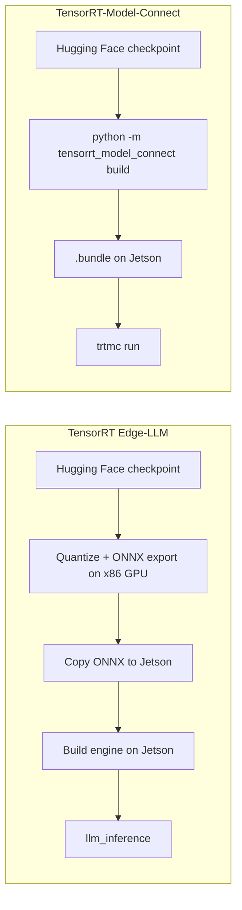

# Jetson AGX Orin に TensorRT-Model-Connect をデプロイする

<div align="center">
  
</div>

この wiki では、**Jetson AGX Orin** 搭載の Seeed reComputer 上で [NVIDIA TensorRT-Model-Connect](https://github.com/NVIDIA/TensorRT-Model-Connect)（TRTMC）を実行する方法を説明します。ネイティブランタイムをビルドした後のパスは短く、Hugging Face のチェックポイントから始めて、デバイス上で TensorRT の `.bundle` を生成し、テキスト生成を実行します。別の x86 ホストも ONNX エクスポート工程も不要です。

この手順では FP16 の **Qwen3-4B-Instruct-2507** を使用します。このモデルは密な Transformer なので、TensorRT はバッチ化された prefill エンジンを利用できます。同じページでは、AGX Orin 64GB 上での変換時メモリと、TRTMC が llama.cpp CUDA より高速だった 2 つのワークロード（Qwen3-4B の長い prefill と、Qwen3-0.6B の greedy decode）も記録しています。

:::note
TensorRT-Model-Connect はパブリックプレビューです。API、対応モデル、ビルドフローは今後も変更される可能性があります。NVIDIA 自身のガイダンスとしては、対応モデルを素早く試したい場合は TRTMC を使い、本番志向の LLM/VLM ランタイムを Jetson 上で必要とする場合は、まず [TensorRT Edge-LLM](/ja/deploy_tensorrt_edge_llm_on_jetpack6.2/) から始めることが推奨されています。
:::

## TensorRT-Model-Connect とは？

TensorRT-Model-Connect は、NVIDIA TensorRT 上に構築されたモデルファミリ向けリファレンス実装のコレクションです。ファミリ専用のビルダーが Hugging Face のスナップショットを読み取り、TensorRT エンジンを構築し、バージョン管理された `.bundle` を書き出します。同じ bundle は `trtmc` CLI からも、テキスト生成などのネイティブ C++ タスク API からも実行できます。

Jetson 上での実用的な違いは変換パスです。TensorRT Edge-LLM では、依然として x86 Linux マシン上のディスクリート GPU で量子化と ONNX エクスポートを行い、その ONNX ファイルをデバイスにコピーしてからエンジン生成を行うことが想定されています。TRTMC は Jetson 自身でエンジン bundle をビルドします。



<div align="center">
  
</div>

## このパスが Jetson で簡単な理由

| Topic | TensorRT Edge-LLM | TensorRT-Model-Connect |
| --- | --- | --- |
| Where conversion runs | NVIDIA GPU 搭載の x86 Linux ホスト上で ONNX をエクスポートし、その後 Jetson 上でエンジンをビルド | Jetson 上で Hugging Face スナップショットから `.bundle` を生成 |
| Intermediate files | ONNX グラフ（しばしば数十 GB）をデバイスにコピー | なし。`.bundle` が成果物 |
| Commands after setup | エクスポート、コピー、エンジンビルド、そして `llm_inference` を実行 | `python -m tensorrt_model_connect build` と `trtmc run` |
| Host memory during conversion | ベンダー資料：FP8 ONNX エクスポートには x86 マシンの CPU RAM でモデルサイズの約 18～20 倍が必要になる場合があります | Qwen3-4B FP16 を AGX Orin 64GB で測定：ホスト使用量は約 30.6 GB、コンテナピークは 41 GB |
| Best fit | Jetson 上での本番 LLM/VLM デプロイ | 実行に使うのと同じボックス上で、対応モデルを素早く試す用途 |

メモリの行は、同一モデルでの直接比較ではありません。Edge-LLM が公開している ONNX エクスポート時の数値は、そのパイプラインが通常 Jetson ではなく大容量 RAM のワークステーションで実行される理由を説明しています。一方 TRTMC の数値は、AGX Orin 64GB 上で Qwen3-4B FP16 をビルドした際に実際に観測したものです。

## ハードウェア

このチュートリアルは、Jetson AGX Orin 64GB を搭載した **reComputer Classic J5012** 上で再現されています。Qwen3-4B FP16 の変換では、コンテナ内ピークが約 41 GB に達したため、実用上のターゲットは 64 GB のユニファイドメモリです。J5011（32GB）は同じ製品ファミリですが、この変換ではスラッシングが発生するか、失敗する可能性が高いです。

<div style={{display:'grid', gridTemplateColumns:'repeat(2, minmax(0, 1fr))', gap:'24px', margin:'28px 0 42px'}}>
  <div style={{display:'flex', flexDirection:'column', overflow:'hidden', borderRadius:'16px', border:'2px solid #00a86b', background:'linear-gradient(145deg, #dce6ee, #cbd8e3)', color:'#172b4d', boxShadow:'0 14px 34px rgba(0,168,107,.18)'}}>
    <div style={{height:'290px', padding:'26px', display:'flex', alignItems:'center', justifyContent:'center', background:'linear-gradient(145deg, #d3dfe9, #bccbd8)'}}>
      
    </div>
    <div style={{display:'flex', flexDirection:'column', flex:'1', padding:'24px'}}>
      <div style={{fontSize:'23px', lineHeight:'1.35', fontWeight:'900', color:'#172b4d'}}>reComputer Classic J5012</div>
      <div style={{marginTop:'9px', color:'#526581', fontWeight:'600'}}>NVIDIA Jetson AGX Orin 64GB · 本 wiki で検証済み</div>
      <div class="get_one_now_container" style={{textAlign:'center', marginTop:'auto', paddingTop:'24px'}}>
        <a class="get_one_now_item" href="https://www.seeedstudio.com/reComputer-Classic-J5012-p-6881.html" target="_blank" rel="noopener noreferrer">
          <strong><span><font color={'FFFFFF'} size={"4"}> 今すぐ入手 🖱️</font></span></strong>
        </a>
      </div>
    </div>
  </div>

  <div style={{display:'flex', flexDirection:'column', overflow:'hidden', borderRadius:'16px', border:'2px solid #3182ce', background:'linear-gradient(145deg, #dce6ee, #cbd8e3)', color:'#172b4d', boxShadow:'0 14px 34px rgba(49,130,206,.18)'}}>
    <div style={{height:'290px', padding:'26px', display:'flex', alignItems:'center', justifyContent:'center', background:'linear-gradient(145deg, #d3dfe9, #bccbd8)'}}>
      
    </div>
    <div style={{display:'flex', flexDirection:'column', flex:'1', padding:'24px'}}>
      <div style={{fontSize:'23px', lineHeight:'1.35', fontWeight:'900', color:'#172b4d'}}>reComputer Classic J5011</div>
      <div style={{marginTop:'9px', color:'#526581', fontWeight:'600'}}>NVIDIA Jetson AGX Orin 32GB · 同一ボードファミリ</div>
      <div class="get_one_now_container" style={{textAlign:'center', marginTop:'auto', paddingTop:'24px'}}>
        <a class="get_one_now_item" href="https://www.seeedstudio.com/reComputer-Classic-J5011-p-6880.html" target="_blank" rel="noopener noreferrer">
          <strong><span><font color={'FFFFFF'} size={"4"}> 今すぐ入手 🖱️</font></span></strong>
        </a>
      </div>
    </div>
  </div>
</div>

## 前提条件

Jetson 上で次のものを準備します：

- reComputer Classic J5012、または他の Jetson AGX Orin 64GB システム
- JetPack 7.2 / Ubuntu 24.04 / L4T R39.2
- NVIDIA ランタイム付き Docker（`docker info` の Runtimes に `nvidia` が表示されること）
- 開発用イメージ、Hugging Face スナップショット、`.bundle` 用に約 40 GB の空きディスク
- GitHub、Hugging Face、`nvcr.io` へのネットワークアクセス
- ベンチマークセクション向けのオプション：`nvpmodel` MAXN と `jetson_clocks`

検証済みのソフトウェアスタックは次のとおりです：

| Item | Version |
| --- | --- |
| Device | Jetson AGX Orin 64GB |
| OS | Ubuntu 24.04.4 LTS, kernel 6.8.12-tegra |
| L4T | R39.2 |
| CUDA in the TRTMC image | 13.3.1 |
| TensorRT in the TRTMC image | 11.1.0.106 (TensorRT 26.07) |
| GPU SM | 87 (Orin) |
| Power mode | MAXN, GPU 1300 MHz |

:::tip
もし `docker ps` が `permission denied` を返す場合は、ユーザーを `docker` グループに追加してから再ログインしてください：

```bash
sudo usermod -aG docker $USER
```

:::

## 1. TensorRT-Model-Connect をクローンする

```bash
git clone https://github.com/NVIDIA/TensorRT-Model-Connect.git
cd TensorRT-Model-Connect
```

公式の入門パスは、[Build from Source](https://nvidia.github.io/TensorRT-Model-Connect/getting-started/source-build) と [Quick Start](https://nvidia.github.io/TensorRT-Model-Connect/getting-started/quick-start) の組み合わせです。以下のコマンドはそのパスに Jetson 固有のフラグを補ったものです。

## 2. 開発用コンテナをビルドする

AGX Orin の compute capability は 8.7 なので、`TRTMC_SM=87` です。Jetson の Docker イメージには `--runtime nvidia` も必要です。

```bash
GPU=0
SM="$(
  nvidia-smi -i "$GPU" \
    --query-gpu=compute_cap \
    --format=csv,noheader,nounits |
  tr -d '.[:space:]'
)"
IMAGE="trtmc-quickstart"

docker build \
  -f Dockerfile.dev.aarch64 \
  -t "$IMAGE" \
  requirements

SOURCE_DIR="$(git rev-parse --show-toplevel)"

docker run --rm -it \
  --runtime nvidia \
  --gpus "device=${GPU}" \
  --ipc=host \
  --network host \
  --mount "type=bind,source=${SOURCE_DIR},target=/src" \
  --workdir /src \
  --env TRTMC_SM="$SM" \
  "$IMAGE" \
  bash
```

:::caution
残りのコマンドはこのコンテナ内で実行してください。このイメージにはすでに TensorRT 11.1、Python 3.12 の venv、Qwen ファミリのビルドに使われるネイティブヘッダーが固定されています。Jetson 上で `nvidia-smi` が使えない場合は、手動で `SM=87` を設定してください。
:::

Hugging Face のスナップショットと bundle を外付け SSD に置く場合は、そのディスクも `-v /path/to/data:/out` のように bind mount してください。

## 3. ネイティブランタイムをビルドする

これらのコマンドをコンテナ内で実行します：

```bash
python -m pip install --no-deps -e . -C py-only=true

TRTMC_BUILD_DIR="build-sm${TRTMC_SM}"

cmake -S . -B "$TRTMC_BUILD_DIR" -G Ninja \
  -DCMAKE_BUILD_TYPE=Release \
  -DCMAKE_CUDA_ARCHITECTURES="${TRTMC_SM}-real" \
  -DTRTMC_BUILD_BACKEND_RTX=OFF \
  -DTRTMC_BUILD_TESTS=OFF \
  -DTRTMC_BUILD_EXAMPLES=OFF

cmake --build "$TRTMC_BUILD_DIR" --parallel "$(nproc)" --target \
  trtmc \
  trtmc_backend_trt \
  trtmc_model_qwen

export PATH="$PWD/$TRTMC_BUILD_DIR:$PATH"
```

`trtmc` は `--runtime-root` からネイティブライブラリを検索します。この引数を CMake のビルドディレクトリに指定してください。そのディレクトリには `libtrtmc_core.so`、`libtrtmc_runtime.so`、`libtrtmc_backend_trt.so`、`libtrtmc_model_qwen.so` が含まれている必要があります。

## 4. Jetson 上で Qwen3-4B バンドルをビルドする

これは、以前は x86 GPU マシンを必要としていた変換ステップです。`--max-sequence-length` を固定してください。このチェックポイントの Hugging Face 設定では 262,144 トークンのコンテキストが宣伝されていますが、そのデフォルトのままにしておくと、エンジン生成中にメモリを使い果たします。

```bash
python -m tensorrt_model_connect build Qwen/Qwen3-4B-Instruct-2507 \
  --precision fp16 \
  --backend trt \
  --max-sequence-length 2048 \
  --max-batch-size 1 \
  --tensor-parallel-size 1 \
  --output qwen3-4b-instruct-2507.bundle \
  --verbose
```

モデル ID の代わりにローカルスナップショットディレクトリを指定することもできます。ビルダーはチェックポイントをダウンロードし、Qwen ファミリにそれを割り当て、TensorRT エンジンをすでに含んだ 1 つの `.bundle` を書き出します。

検証済みの J5012 ユニットでは、`max_sequence_length=2048` の Qwen3-4B FP16 が次のような変換フットプリントになりました。公開されている Qwen の単一デバイス FP16 パスは分割エンジン（`engine.plan` + `prefill.plan`）を書き出しますが、以下の数値は 2 つの最適化プロファイルを持つ 1 つの plan を prefill と decode で共有するデュアルプロファイルビルドから取得したものです。

| 指標 | 測定値 |
| --- | --- |
| 精度 / レイアウト | FP16、デュアルプロファイル |
| 最大シーケンス長 | 2048 |
| エンジン生成時間 | 128.1 s |
| TensorRT ウェイト | 7.49 GiB |
| Prefill アクティベーションメモリ | 633 MiB |
| Decode アクティベーションメモリ | 12 MiB |
| TensorRT アロケータ GPU 使用ピーク | 7,674 MiB |
| ホスト使用量ピーク | 30,640 MB |
| コンテナメモリ使用ピーク | 41.09 GiB |
| Python RSS 使用ピーク | 24.7 GB |
| 最終 `.bundle` | 7.6 GiB |

:::tip
これらのホスト / コンテナのピークが、この wiki で AGX Orin 64GB を推奨している理由です。エッジデバイス上で変換を行いますが、TensorRT がエンジンをビルドするための十分なユニファイドメモリは依然として必要です。
:::

実行前にバンドルを確認します：

```bash
trtmc inspect ./qwen3-4b-instruct-2507.bundle
```

`trtmc inspect` は JSON を出力します。`family: qwen`、`task: text_generation`、そして `engine.plan` とトークナイザファイルを含むセクションリストを探してください。分割 FP16 ビルドでは `prefill.plan` もリストされます。バンドル内には依然として ONNX グラフは含まれていません。

## 5. 推論を実行する

```bash
trtmc run ./qwen3-4b-instruct-2507.bundle \
  --runtime-root "$PWD/build-sm${TRTMC_SM}" \
  --prompt "What is the capital of France? Answer in one word." \
  --use-chat-template true \
  --enable-thinking false \
  --max-new-tokens 32
```

成功すると、`Paris` のような短い補完が出力されます。同じバンドルは C++ からも `trtmc::load_task(bundle, runtime_root)` と `ITextGeneration` インターフェースでロードできます。詳しくは [C++ Task API](https://nvidia.github.io/TensorRT-Model-Connect/api/cpp-api) を参照してください。

## 推論性能の比較：llama.cpp 対比

変換のしやすさはストーリーの半分に過ぎません。同じ J5012 上で、TRTMC FP16 と llama.cpp CUDA + flash-attention FP16 を、どちらもコンテキスト 2048 で比較しました。以下のグラフと表には、TRTMC の方が高速なワークロードのみを掲載しています。

<div align="center">
  
</div>

| ワークロード | TensorRT-Model-Connect | llama.cpp CUDA | TRTMC の優位性 |
| --- | --- | --- | --- |
| Qwen3-4B-Instruct-2507 長文 prefill | 1,967 tok/s · 606.9 ms / 1,194 tok | 1,601 tok/s · 743.2 ms / 1,190 tok | +22.9% |
| Qwen3-0.6B decode、256 トークン生成 | 69.4 tok/s | 65.5 tok/s | +6.0% |
| Qwen3-0.6B decode、1,212 トークンのプロンプト後 | 69.6 tok/s | 63.0 tok/s | +10.5% |

4B prefill の結果は、1 回のウォームアップ後に 3 回測定した実行の中央値です。0.6B decode の結果は、モデルをリクエスト全体でロードしたままにし、KV キャッシュを 1 度だけ埋めてから多数のトークンを生成する、ウォームアップ後の 1 回の測定実行です。

:::note
この比較には密な Qwen3 Transformer を使用してください。NVIDIA Nano-9B のようなハイブリッド Mamba モデルは、現在 TRTMC ではトークンごとに prefill を行うため、TensorRT のスループットを評価する方法としては適していません。
:::

## 高速なワークロードを再現する

まずクロックを固定し、その後はリクエスト全体でモデルをロードしたままにします。プロセスの経過時間ではなく、エンジンのタイミング行を報告してください。プロセスの経過時間には TensorRT のデシリアライズ / GGUF ロードが含まれ、差が見えにくくなります。

```bash
sudo nvpmodel -m 0   # MAXN; confirm with nvpmodel -q
sudo jetson_clocks
```

このボード上の llama.cpp は CUDA と flash-attention 付きでビルドされ、すべてのレイヤーを GPU 上で実行しました：

```bash
cmake -S llama.cpp -B llama.cpp/build-cuda \
  -DGGML_CUDA=ON -DGGML_CUDA_FA=ON -DGGML_NATIVE=ON \
  -DCMAKE_BUILD_TYPE=Release -DCMAKE_CUDA_ARCHITECTURES=87-real
cmake --build llama.cpp/build-cuda -j
```

### 1. Qwen3-4B 長文 prefill

これは、バッチ化された TensorRT prefill エンジンが効果を発揮するワークロードです。[セクション 4](#4-jetson-上で-qwen3-4b-バンドルをビルドする) で `--max-sequence-length 2048` を指定して FP16 バンドルをビルドし、同じスナップショットを GGUF F16 に変換して、両方のランタイムに同じ長文プロンプトを与えます。

この行の共通セットアップ：

- モデル：`Qwen/Qwen3-4B-Instruct-2507`、FP16、コンテキスト 2048
- プロンプト：約 6,000 文字の背景説明と 70 語のパリに関する質問（チャットテンプレート適用後で 1,190～1,194 トークン）
- Decode：新規トークン 64 個、貪欲法（`temperature=0`、`top-k=1`）
- TRTMC：デュアルプロファイルバンドル、チャットテンプレート有効、thinking 無効
- llama.cpp：`GGML_CUDA=ON`、`GGML_CUDA_FA=ON`、`-ngl 99 -c 2048 -b 512 -ub 512 -fa on --jinja`
- ウォームアップ 1 回 + 測定 3 回；中央値を使用

同じ Hugging Face スナップショットを llama.cpp 用に GGUF F16 へ変換します：

```bash
python3 convert_hf_to_gguf.py Qwen3-4B-Instruct-2507 \
  --outfile Qwen3-4B-Instruct-2507-F16.gguf \
  --outtype f16
```

長文プロンプトを書き、TRTMC を実行します。`[trtmc-perf] Prefill`（または `qwen prefill` エンジンのタイミング）を確認してください。

```bash
python3 - <<'PY'
from pathlib import Path
filler = (
    "Transit planners track on-time performance, bus bunching, depot energy use, "
    "and spare-ratio policy across a dense coastal city. Housing staff compare "
    "permit latency, vacancy, and school-capacity constraints. Emergency managers "
    "rehearse flood gates, hospital diversion, and radio fallback. "
)
question = (
    "Write a 70-word factual paragraph about Paris. Include the Seine, the Louvre, "
    "and why it became the capital of France. Do not use bullet points. "
    "Do not stop after one word."
)
body = "Use the background notes only as context. Ignore them if they are not needed.\n\n"
while len(body) < 6000:
    body += filler
Path("qwen3-4b-long-prompt.txt").write_text(body[:6000] + "\n\n" + question)
print("wrote qwen3-4b-long-prompt.txt", 6000 + 2 + len(question), "chars")
PY

PROMPT="$(cat qwen3-4b-long-prompt.txt)"

trtmc run ./qwen3-4b-instruct-2507.bundle \
  --runtime-root "$PWD/build-sm${TRTMC_SM}" \
  --prompt "$PROMPT" \
  --use-chat-template true \
  --enable-thinking false \
  --temperature 0 \
  --top-k 1 \
  --max-new-tokens 64
```

同じプロンプトを llama.cpp に与えます。プロセス全体の時間ではなく、`prompt eval time` / `Prompt:` の tok/s 行を読み取ってください。

```bash
llama-completion \
  -m Qwen3-4B-Instruct-2507-F16.gguf \
  -ngl 99 -c 2048 -b 512 -ub 512 -fa on \
  --jinja --temp 0 --top-k 1 -n 64 \
  --no-warmup --simple-io --no-display-prompt \
  --prompt "$PROMPT"
```

検証済みの J5012 では、prefill が **1,967 tok/s 対 1,601 tok/s** となりました。

### 2. Qwen3-0.6B 貪欲 decode

Decode は、1 回のリクエストで長い補完を要求したときに TRTMC が優位に立つ 2 つ目のポイントです。Qwen3-4B と同じ方法で 0.6B FP16 バンドルをビルドし、`--max-sequence-length 2048` を固定したままにします。測定に使用したバンドルは、KV キャッシュ rows=2048 の分割 prefill/decode エンジンを使用していました。

```bash
python -m tensorrt_model_connect build Qwen/Qwen3-0.6B \
  --precision fp16 \
  --backend trt \
  --max-sequence-length 2048 \
  --max-batch-size 1 \
  --tensor-parallel-size 1 \
  --output qwen3-0.6b.bundle \
  --verbose
```

同じスナップショットを llama.cpp 用に GGUF F16 に変換し、2 つの decode ケースを実行します。このボードの `llama-cli` には `-st`（single-turn）が必要で、`--prompt-file` は受け付けません。代わりに `--prompt` を渡してください。

```bash
python3 convert_hf_to_gguf.py Qwen3-0.6B \
  --outfile Qwen3-0.6B-F16.gguf \
  --outtype f16
```

短いプロンプトで、新規トークン 256 個：

```bash
COUNT_PROMPT='Count from 1 to 220. Write only integers separated by spaces. Do not add commentary. Continue until 220.'

trtmc run ./qwen3-0.6b.bundle \
  --runtime-root "$PWD/build-sm${TRTMC_SM}" \
  --prompt "$COUNT_PROMPT" \
  --use-chat-template true \
  --enable-thinking false \
  --temperature 0 \
  --top-k 1 \
  --max-new-tokens 256

llama-cli -st --simple-io \
  -m Qwen3-0.6B-F16.gguf \
  -ngl 99 -c 2048 \
  --temp 0 --top-k 1 -n 256 \
  --prompt "$COUNT_PROMPT"
```

長いプロンプトで、新規トークン 128 個。測定に使用したプロンプトは、チャットテンプレート適用後で 1,212 トークンでした：軌道到達に関するメモと、その後に 180 語のブリーフィングを求めるリクエストです。

```bash
python3 - <<'PY'
from pathlib import Path
note = (
    "Low Earth orbit is a crowded working neighborhood for satellites, space stations, "
    "and visiting spacecraft. Reaching it requires a launcher that can fight gravity, "
    "thinning air, and the need for horizontal speed of about 7.8 kilometers per second. "
    "A typical rocket uses staged chemical propulsion. The first stage produces high "
    "thrust to clear the dense atmosphere. Upper stages ignite in thinner air to add "
    "delta-v. Guidance computers fly a gravity turn, then a circularization burn. "
)
text = "Read the notes below. Then write a detailed 180-word briefing on how rockets reach orbit. Keep writing until the briefing is complete.\n\n"
while text.count(" ") < 900:
    text += note
Path("qwen3-06b-long-prompt.txt").write_text(text)
print("wrote", len(text), "chars")
PY

LONG_PROMPT="$(cat qwen3-06b-long-prompt.txt)"

trtmc run ./qwen3-0.6b.bundle \
  --runtime-root "$PWD/build-sm${TRTMC_SM}" \
  --prompt "$LONG_PROMPT" \
  --use-chat-template true \
  --enable-thinking false \
  --temperature 0 \
  --top-k 1 \
  --max-new-tokens 128

llama-cli -st --simple-io \
  -m Qwen3-0.6B-F16.gguf \
  -ngl 99 -c 2048 \
  --temp 0 --top-k 1 -n 128 \
  --prompt "$LONG_PROMPT"
```

TRTMC の `qwen decoder` / `[trtmc-perf] Decode` と、llama.cpp の `eval time` / `Generation:` tok/s を確認してください。検証済みの J5012 では、新規トークン 256 個で **69.4 vs 65.5 tok/s**、1,212 トークンのプロンプト後では **69.6 vs 63.0 tok/s** です。

## 数値の意味

- **必要なマシンが少ない。** ONNX をエクスポートするためだけに x86 GPU ワークステーションは不要です。モデルを提供する Jetson 自身でビルドも行えます。
- **Edge-LLM の FP8 ONNX パスよりも変換ホスト RAM が少ない。** Edge-LLM は、FP8 ONNX エクスポートでモデルサイズの約 20 倍までの CPU RAM を必要とすると記載しています。Qwen3-4B FP16 の TRTMC ビルドでは、Orin 64GB 上でホスト使用量が約 31 GB / コンテナ 41 GB 付近に収まりました。
- **Qwen3-4B の長いプリフィルが llama.cpp FP16 より高速** であり、これはバッチ化された TensorRT エンジンが効果を発揮するワークロードです。
- **Qwen3-0.6B の貪欲デコードが高速** で、補完全体が 1 回のリクエストで実行される場合（新規トークン 256 個、または長いプロンプト後の新規トークン 128 個）。
- **再利用可能なアーティファクト。** `.bundle` がコピー・検査・実行する対象です。同期を保つ必要がある並行する ONNX ツリーは存在しません。

## トラブルシューティング

| 問題 | 確認すること |
| --- | --- |
| コンテナから GPU が見えない | `--runtime nvidia` を使用し、`docker info` に `nvidia` ランタイムが表示されることを確認します |
| エンジンビルドでメモリ不足になる | `--max-sequence-length 2048` を固定し、AGX Orin 64GB を使用し、他の GPU 利用プロセスを終了します |
| `trtmc run` がライブラリを読み込めない | CMake ビルドディレクトリを `--runtime-root` で指定します。CLI は DSO を `PATH` やカレントディレクトリからは検索しません |
| Hugging Face のダウンロードに失敗する | ローカルスナップショットをディスク上に配置し、そのディレクトリをモデル ID の代わりに `build` に渡します |
| デコードは問題ないがプリフィルが遅い | ハイブリッドな Mamba グラフではなく、デュアルプロファイル / バッチプリフィルエンジンを備えた高密度トランスフォーマであることを確認します |
| TRTMC が llama.cpp より遅く見える | プロセスの経過時間ではなく、エンジンのタイミング（`[trtmc-perf]`、`qwen decoder`、llama.cpp の `eval time`）を比較します。モデルをロードしたままにし、1 回のリクエストで多くのトークンを生成します |
| `llama-cli` が `--prompt-file` でエラーになる、または stdin を待ち続ける | `-st --simple-io --prompt "..."` を使用します |
| Jetson で `nvidia-smi` が見つからない | AGX Orin では `SM=87` を設定します |

## リソース

- [TensorRT-Model-Connect repository](https://github.com/NVIDIA/TensorRT-Model-Connect)
- [TensorRT-Model-Connect documentation](https://nvidia.github.io/TensorRT-Model-Connect/)
- [Deploy TensorRT Edge-LLM on JetPack 6.2](/ja/deploy_tensorrt_edge_llm_on_jetpack6.2/)
- [reComputer Classic J501 Getting Started](/ja/ai_robotics_seeed_agx_orin_dev_kit_getting_started/)
- [Qwen3-4B-Instruct-2507](https://huggingface.co/Qwen/Qwen3-4B-Instruct-2507)
- [Qwen3-0.6B](https://huggingface.co/Qwen/Qwen3-0.6B)

## 技術サポートと製品ディスカッション

弊社製品をお選びいただきありがとうございます。弊社は、製品をできるだけスムーズにご利用いただけるよう、さまざまなサポートを提供しています。お好みやニーズに応じて選択いただける複数のコミュニケーションチャネルをご用意しています。

<div class="button_tech_support_container">
<a href="https://forum.seeedstudio.com/" class="button_forum"></a>
<a href="https://www.seeedstudio.com/contacts" class="button_email"></a>
</div>

<div class="button_tech_support_container">
<a href="https://discord.gg/eWkprNDMU7" class="button_discord"></a>
<a href="https://github.com/Seeed-Studio/wiki-documents/discussions/69" class="button_discussion"></a>
</div>
