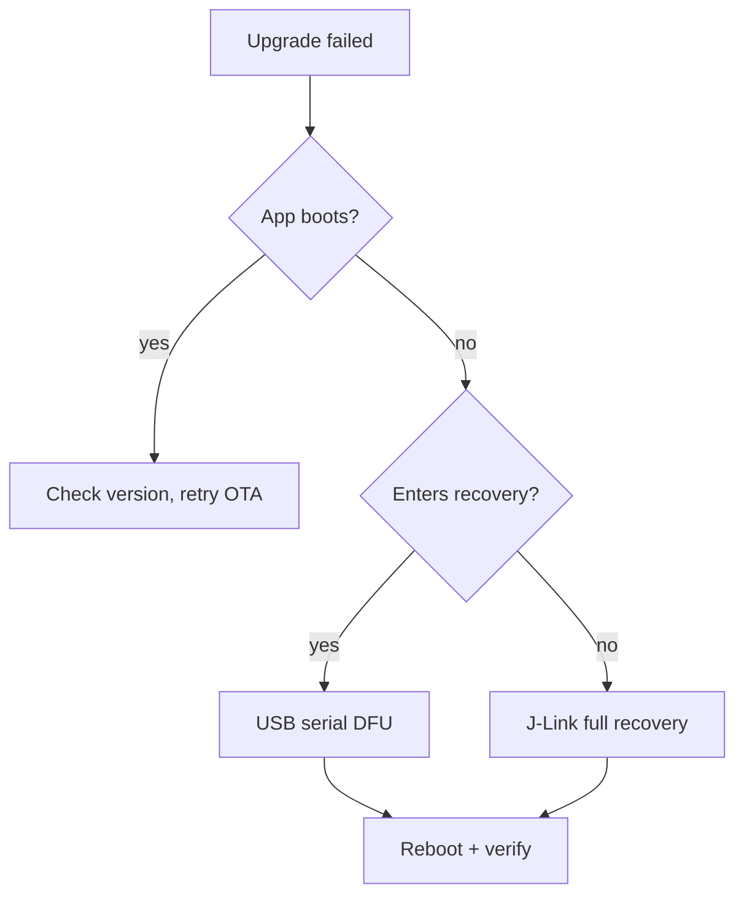

# reSpeaker Clip ファームウェア開発ガイド

reSpeaker Clip デバイス側ファームウェアの包括的なリファレンスです。どのように構成されているか、どの AT/GATT/UDP プロトコルを話すか、どのようにビルド・更新・リカバリ・検証・出荷されるかを説明します。クリーンなマシンからビルドしてスモークテストまでの手順については、[Getting Started with the reSpeaker Clip Firmware SDK](/ja/respeaker_clip_firmware_quick_start) を参照してください。ビルド／フラッシュ／電源／落とし穴の完全版については、[CLAUDE.md](https://github.com/Seeed-Studio/reSpeaker_Clip/blob/main/CLAUDE.md) を参照してください。

チェックアウトされたファームウェアソースが唯一の正典であり、このガイドはそれを要約したものです。両者が食い違う場合は、ソースを優先します。

## はじめに

Firmware SDK は、Nordic nRF5340（アプリケーションコア + ネットワークコア）上で動作するイベント駆動型 Zephyr RTOS アプリケーションであり、PDM マイクアレイ、BLE、Wi-Fi AP（nRF7002）、USB、SD ストレージ、OLED を備えています。デバイス側の動作を変更する開発者向けです。このガイドでは、設計と運用リファレンス（プロトコル、更新、検証、量産）を 1 か所にまとめ、各事実が必ず 1 つの「ホーム」を持つようにしています ― 相互参照は重複せずにここへ戻るようになっています。

## システムアーキテクチャ

### レイヤードアーキテクチャ

ファームウェアは 5 つのレイヤに整理されており、それぞれは直下のレイヤにのみ依存します。

| レイヤ | 責務 | 主なソース |
|-------|----------------|------------|
| **App / event** | 状態機械、UI、ボタン、副作用が発生する唯一の場所 | `clip_event.c`, `display.c`, `button.c`, `main.c` |
| **Service / transport-transfer-config** | バイトの転送（BLE/UDP/USB）、ファイル転送エンジン、永続設定 | `transport.c`, `transport_ble.c`, `transport_udp.c`, `usb_cdc.c`, `transfer.c`, `config.c` |
| **Processing / audio** | PDM キャプチャ → DSP → Opus → フレーム化されたファイル書き込み | `audio.c`, `storage.c` |
| **HAL / drivers** | ボードデバイス：OLED、PMIC、マイク／レギュレータ、SPI フラッシュ、SD、WiFi/BLE 無線 | `boards/seeed/clip/`, `drivers/`, `battery.c`, `haptic.c` |
| **Zephyr kernel** | スレッド、メッセージキュー、セマフォ、ミューテックス、電源管理 | NCS v3.3.0 |

不変条件：**アプリ層だけが状態を変更し、副作用をトリガーする。** ボタン押下や AT コマンドはマイクを直接起動したり SD カードに直接書き込んだりせず、イベントをポストし、`clip_event.c` が現在の状態で合法かどうかを判断して実行します。

リクエストの流れ：`button ISR` / `AT command` → `clip_post_event[_sync]()` → `[k_msgq]` → `clip_event_process()`（メインスレッド）→ `execute_transition()` → 副作用（`audio_*`, `storage_*`, `display_*`, `haptic_*`, `ble_notify_*`）。ボタンは非同期ポスト（`K_NO_WAIT`, ISR セーフ）、AT コマンドは同期ポスト（イベントごとのセマフォでブロックし、`AT+START` がセッション ID を同期的に返せるようにする）です。

### イベントと状態モデル

`clip_event.c` 内のディスパッチャはテーブル駆動の状態機械です。

- `clip_post_event(event)` — 非同期、ノンブロッキング、ISR セーフ。8 スロットキューが満杯の場合はドロップ。
- `clip_post_event_sync(event, &info)` — ブロッキング。`info` を通じて `OK` / `INVALID` / `BUSY` / `ERROR` を返す。

状態：`UNINITIALIZED → IDLE → RECORDING → TRANSMITTING / WIFI_SYNC → IDLE` に加え、`PAUSED`, `ERROR`, `OTA`。`transition_table[current_state][event]` は次の状態、`TRANS_SAME`（そのまま、例：`MARK`）、または `TRANS_INVALID`（拒否）を返します。事前にゲートされる 2 つの拒否：`WIFI_SYNC` 中の `START`（「WiFi blocked」）、USB MSC が SD を公開している間の `START`（「USB blocked」― 書き込み中に USB からマウントすると FAT が破損する）。状態は `execute_transition()` 内でのみ `atomic_set(&g_state, new)` によってコミットされます ― 状態が変化する唯一の場所です。

注目すべき副作用：`START` は `storage_ensure_mounted()` を呼び、満杯なら拒否し、その後 `audio_start_recording(AUDIO_MODE_MERGE)` を実行します。`STOP` はオーディオスレッドがフラッシュ／クローズするのを最大 5 秒待ちます。SD がビジーな場合でも、停止は `IDLE` をコミットし、状態機械が `RECORDING` でデッドロックしないようにします（録音の末尾は切り捨てられる可能性があります）。`POWER_OFF_EXEC` はアクティブな転送をキャンセル（有界待ち）し、録音を停止し、フューエルゲージ状態を保存し、PMIC を ship モードにします。

### スレッドモデル

アプリケーションスレッドは 5 本（Zephyr の優先度：数値が小さいほど高優先度、0 以上はプリエンプト可能。Bluetooth RX はさらに高優先度で動作）。

| スレッド | Pri | スタック | 役割 |
|--------|-----|-------|------|
| **Main** | (main) | — | イベントループ `clip_event_wait()`→`clip_event_process()`、UI、時刻管理。アイドル時は `K_FOREVER`、録音中は `K_MSEC(1000)` で待機。 |
| **Audio** `audio_rec` | 0 | 32768 | PDM 読み取り → DSP → Opus → ストレージ。最も高優先度のアプリスレッド（20 ms の Opus デッドラインはハード）。 |
| **Transfer** | 5 | 16384 | ファイル転送エンジン：SD を読み取り、トランスポート経由で送信し、再送を行う。 |
| **UDP server** | 5 | 4096 | Wi-Fi UDP ソケットサーバ（ポート 8089）。 |
| **AT server** | 7 | 4096 | BLE/UDP/USB 上の AT をパースし、同期イベントをポストし、JSON を送信。 |

同期パターン：終了要求には **volatile/atomic フラグ**（`transfer_cancel_requested`, `pause_requested`）、完了待ちには **セマフォ**（`stop_done_sem`, `file_closed_sem`, `transfer_trigger_sem`）、データ構造には **ミューテックス**（`audio_state_mutex`, `sd_lifecycle_mutex`, `session_json_mutex`, `transport_lock`）、重要なプロデューサ→コンシューマ経路には **1 つのメッセージキュー**（`clip_ev_msgq`, events → main）を使用します。32 × 1280 B バッファの `k_mem_slab` により、DMIC キューの深さ 640 ms を確保し、スケジューリングジッタ（BT RX によるプリエンプトを含む）を吸収します。

## オーディオおよび録音アーキテクチャ

### オーディオパイプライン

20 ms フレームごとに：`dmic_read()`（L+R ステレオ、1280 B）→ `process_pcm_frame()`（マージ + DSP、モード依存）→ `opus_encode()`（最大 4000 B のパケット）→ `storage_write_frame()`（2 バイトの長さプレフィックス付き、4 KiB バッファリング書き込み）。

定数（`audio.h`）：16 kHz、16 ビット、2 チャンネル PDM。20 ms フレーム → 320 サンプル／フレーム、1280 B／ブロック。32 個の DMIC バッファ（640 ms キュー）。

### 録音モード

> 以前のドキュメントでは `MODE_NORMAL` を **ステレオ** と説明していますが、それは誤りです。両方のモードは **モノラル** で録音します。

- **両方のモード** は L+R マージによるモノラル録音です。`clip_event.c` は `audio_start_recording(AUDIO_MODE_MERGE)` をハードコードしています。`MODE_NORMAL` はステレオではなく、その名称はレガシーです。
- **`MODE_NORMAL`**（デフォルト）：遅延をそろえた L+R マージ → 手書き実装の 100 Hz ハイパス → 整数 AGC（エンベロープ + ゲインコンピュータ + スムーザ）→ ソフトリミッタ。**SpeexDSP は使用しません。**
- **`MODE_ENHANCED`**：同じマージ + 手書き DSP に加え、**SpeexDSP** のノイズ抑圧 + 残響除去を実行します（`mode == ENHANCED && noise_suppress > 0` のときに有効、`audio.c:506`）。SpeexDSP の AGC は *使用しません*（ビルドは `FIXED_POINT` であり、浮動小数 FFT AGC には約 15 ms／フレームかかるため、整数 AGC がそれを置き換えています）。
- マージステップでは、L と R の相互相関をラグ \{−1, 0, +1\} で取り（マイク間隔 2.85 cm → 16 kHz で ITD は最大 1 サンプル）、加算前に遅延をそろえることでコムフィルタリングを防ぎます。AGC は古典的なコンプレッサで、アタック約 30 ms／リリース約 300 ms、ターゲット ≈−14.7 dBFS、ゲインは ±12/24 dB にクランプ、ソフトリミッタ（ニー −2 dBFS、ハードリミット −0.5 dBFS）を備えます。
- Opus：`OPUS_APPLICATION_AUDIO`（STT 用には VOIP より摩擦音を良好に保持）、VBR 非制限、ボイスシグナルヒント、16 ビット深度、DTX/FEC/パケットロス対策はオフ。ビットレート／複雑度は **モードごとの Kconfig**（`CLIP_NORMAL_*` / `CLIP_ENHANCED_*`）で決まり、ランタイムでは設定できません。エンコーダと SpeexDSP の状態はキャッシュされ、パラメータが変わったときのみ再初期化されます。
- モード設定は `AT+MODE=normal|enhanced`（永続）または `AT+START mode=enhanced`（セッションのみ、有効だが永続化しない）で行います。

### セッション、チャンク分割、およびストレージモデル

各録音は 1 つの **セッション** であり、14 桁の `session_id` を持ちます。時計が同期している場合は `YYYYMMDDHHMMSS`（UTC）、そうでない場合は `0` + 13 桁の稼働時間です。ストレージレイアウトがこれをパスコンポーネントに分割するため、14 桁形式はすべての場所で強制されます（`validate_session_id`）。

セッションはディレクトリツリーです。`session.json`（メタデータ：id, duration, files, synced, size, channels, sample_rate, mode）、`marks.bin`（バイナリブックマーク："BMRK" マジック + カウント + オフセット）、およびチャンクファイル `0/0001.opus`, `0/0002.opus` … `1/0101.opus`（group = (file_index−1)/100、サブディレクトリあたり 100 ファイル）から構成されます。Opus ファイルは **長さプレフィックス付きフレームストリーム**（2 バイト LE 長 + パケット、OGG ではない）であり、4 KiB の書き込みバッファでフレームをまとめてから `fs_write` します。

セグメントのチャンク分割：**非同期中（同期していないとき）は 300 秒／セグメント**（`CLIP_AUDIO_SEGMENT_DURATION_NO_SYNC`）、**アクティブな転送中は 60 秒**（`CLIP_AUDIO_SEGMENT_DURATION_SYNC`）。録音しながら転送（連続モード）する場合、転送スレッドはクローズ済みファイルしか読めないため、60 秒でクライアントが次のファイルを待つ時間を上限にします。同期がファイル途中で開始され、その時点で現在のファイルがすでに 60 秒を超えている場合、エンジンは即座に分割します（`audio.c:868`）。各 `PAUSE` / `RESUME` サイクルでも新しいファイルを開きます。`session.json` の `synced` フィールドは ACK 済みファイルを追跡し、ダウンロードが最初の未同期ファイルから再開できるようにします。

**ストレージ：** microSD（FAT32, `/SD:`）は `/SD:/REC/` 以下に録音を保持し、セッション ID をシャーディングしたバケットレイアウト（`/SD:/REC/<YYYYMMDD>/<HH>/<MM>/<SS>/…`）を取ります。外付け 8 MiB SPI フラッシュ（LittleFS, 約 6.8 MiB）は設定（`/lfs/settings/run`）と OTA スロットを保持します ― SD とは分離されているため、設定の破損や中断された OTA によって録音が失われることはありません。SD は `storage_ensure_mounted()` によって **遅延リマウント** され、実際にアイドルであることをロック下で確認したうえで（録音／転送がチェック中に開始される TOCTOU を塞ぐ）、`CLIP_SD_IDLE_DELAY_MS`（45 秒）後に **アイドル電源ゲート** されます。

### 電源管理

バッテリデバイス（170 mAh「240」セル、NPM1300 + nRF Fuel Gauge）。アイドル電流が支配的な制約です。3V3 レールでの量産ビルドにおける状況は次のとおりです。

| ソース | 挙動 | コスト |
|--------|----------|------|
| nRF5340 メイン + 無線レギュレータ | DCDC（`NRF5X_REG_MODE_DCDC`） | LDO と比較して約 500–600 µA |
| SD カード | 45 秒後にアイドル電源ゲート | アイドル時は約 0 |
| デバッグ UART コンソール | UARTE は出力間も有効のまま | **約 570 µA** のリーク |
| BLE スローアドバタイジング | 約 1 秒間隔 | 平均約 0.1 mA |
| nRF70 QSPI | WiFi 未使用時に `CONFIG_NRF70_QSPI_LOW_POWER` | 最小限 |

**量産時アイドル電流 ≈ 170 µA。** レギュレータと SD の問題を修正した後で最大のリークは **デバッグ UART コンソール**（約 570 µA）です。`production` スニペットはコンソールと UART ログバックエンド（`CONFIG_CONSOLE=n`, `CONFIG_UART_CONSOLE=n`, `CONFIG_LOG_BACKEND_UART=n`）を無効化し、これにより約 170 µA に到達します。`CONFIG_PM_DEVICE_RUNTIME=y` はアイドル時に UART/I2C/SPI ドライバを自動サスペンドします。録音／転送中は一時的に電流が増加します（CPU を 128 MHz までブースト、参照カウント管理；マイク + SD レールをオン；完了時に解放）。

## 通信プロトコル

### BLE GATT サービス

| キャラクタリスティック | UUID（`6E40xxxx-B5A3-F393-E0A9-E50E24DCCA9E` のサフィックス） | 役割 |
|---|---|---|
| サービス | `0001` | reSpeaker Clip サービス |
| コマンド受信 | `0002` | ホストが AT コマンドを書き込む場所 |
| レスポンス送信 | `0003` | デバイスが JSON レスポンスを通知 |
| ファイルデータ | `0004` | デバイスがバイナリのファイル転送フレームを通知 |
| オーディオ可視化 | `0005` | デバイスが録音のエネルギーレベルを通知 |

### AT コマンド文法

| 種類 | フォーマット | 例 | 備考 |
|---|---|---|---|
| EXEC | `AT+XX` | `AT+GSTAT` | アクション / デフォルト読み出し |
| SET | `AT+XX=<value>` | `AT+MODE=enhanced` | パラメータ設定 / 引数付きアクション |
| READ | `AT+XX?` | `AT+MODE?` | 現在値の問い合わせ |

パース処理は共通です：`parse_command()`（`at_server.c` 内）が `AT+NAME=args` 文法と `=` / `?` によるタイプ判定を担当し、ハンドラは `=` 以降をすでに分割済みの `ctx->args` として受け取ります。`AT+LIST?2&10` はページング付きの読み出しです。

### JSON レスポンス仕様

- 成功: `{"ok":true,"data":{...}}`
- 失敗: `{"ok":false,"msg":"..."}`
- **数値エラーコードなし、`error` フィールドなし、リクエスト ID なし。** 失敗時は `msg` を使用します。同じ JSON が BLE、UDP、USB のいずれでも同一の形で送信されます（コマンドの発生元トランスポートに応じて `SEND_RESPONSE()` マクロがルーティング — ハンドラ側はレスポンスバッファを埋めるだけです）。

### 登録済みコマンドリファレンス

登録済みコマンドは `applications/clip/src/at_commands.c`（`.name = "..."` テーブル）にあります。検証済みセット：

| グループ | コマンド |
|---|---|
| デバイスステータス | `GSTAT`, `BATT`, `DEVICE`, `VERSION` |
| 録音 | `START`, `STOP`, `PAUSE`, `RESUME`, `MARK` |
| ファイル管理 | `LIST`, `MARKS`, `DOWNLOAD`, `CANCEL`, `DELETE` |
| 設定 | `MODE`, `AUTODEL`, `BRIGHTNESS`, `TIME`, `NAME` |
| 接続性 | `WIFI`, `WIFICFG`, `USB`, `PAIR`, `DFU` |
| メンテナンス | `LOG`, `STORAGE`, `FORMAT`, `REBOOT`, `POWEROFF`, `FACTORY` |

**削除されたレガシー — 利用可能としてドキュメント化しないこと：** `BITRATE`, `COMPLEXITY`, `NOISE`, `AGC`, `DEREVERB`, `PURGE`。ノイズ抑圧／残響除去は起動時の Kconfig デフォルト（`CLIP_DEFAULT_NOISE`, `CLIP_DEFAULT_DEREVERB`）であり、`config.c` に永続化されますが、**ランタイム AT コマンドはありません**。AGC は自前実装で常時オン、設定不可です。AT レスポンス、コマンド、転送フレームを変更した場合は、同じ変更内で `docs/protocol.md` と `sdk/` を更新してください。

### UDP フレームタイプ

Wi-Fi UDP ファイル転送は、フレームごとに CRC32 を持つバイナリフレームプロトコル（ポート 8089）を使用します：

| 種類 | 値 | 構造 |
|---|---|---|
| `DATA` | `0x01` | type(1) + seq(2) + len(2) + data |
| `FILE_ACK` | `0x03` | type(1) + status(1) + received_count(2) + crc32(4) |
| `FILE_START` | `0x10` | type(1) + fn_len(1) + filename + file_size(4) |
| `FILE_END` | `0x11` | type(1) + crc32(4) |
| `TRANSFER_DONE` | `0x12` | type(1) + sid_len(1) + session_id + file_count(4) |
| `AT_RESP` | `0x20` | UDP 経由で運ばれる AT レスポンス |
| `HEARTBEAT` | `0x30` | キープアライブ |

**BLE にはフレーム単位の CRC はありません**（リンク層が配送を保証）— エンドツーエンドチェックとしては `FILE_END` 内のファイル全体の CRC32 のみです。UDP ではフレーム単位の CRC32 に加え、**選択再送ビットマップ NACK** を持つ `FILE_ACK` を使用します：クライアントは欠落しているフレームをビットマップで報告し、エンジンはそれらのみを再送します（`CLIP_UDP_REPAIR_PACE_US` によりペーシングされ、リトライラウンドごとに半減）。修復ペースが失敗した場合はファイル全体の再送にフォールバックします。`TRANSFER_MAX_FILE_RETRIES`（10）が `ERROR` になるまでの試行回数の上限です。

### セッションおよびファイルアドレッシング

ホストから見えるセッション ID は、正確に 14 桁の 10 進数 `YYYYMMDDHHMMSS` です。物理 FAT パスはプロトコル上に一切露出しません。`AT+DOWNLOAD` は `session` または `session:NNNN.opus` を受け付けます。ストレージ、パス、転送にアクセスする前に、ユーザー制御の引数を必ず検証してください。

## ファームウェア設定とビルドプロファイル

### 標準ビルドと開発ビルド

デフォルト（スニペットなし）のデバッグビルドでは UART コンソールを有効に保ち、INF レベルで `/SD:/LOG` にログを書き込みます（64 KiB ローテーションファイル、`CONFIG_LOG_BACKEND_FS=y`）。ビルド方法：

```sh
source ~/ncs/v3.3.0/zephyr/zephyr-env.sh
export ZEPHYR_EXTRA_MODULES=$PWD   # env var, not -D — Kconfig discovery runs before CMake
west build --build-dir build-clip --board clip/nrf5340/cpuapp applications/clip
# pristine (required after MCUboot/devicetree/sysbuild/partition changes):
west build --build-dir build-clip --pristine --board clip/nrf5340/cpuapp applications/clip
```

すべてのアプリはデフォルトで **sysbuild**（MCUboot + アプリコア + ネットコア無線）としてビルドされます。ボード側がその結合処理を提供します。主な `prj.conf` / devicetree / Kconfig の調整項目：機能スイッチ、ログレベル、BLE/Wi-Fi/FS 設定；GPIO/I2C/SPI/PDM/PMIC/OLED のマッピング；バッファサイズ、スレッドスタック、電源ポリシー。

### 量産ビルド

コンソール + UART ログをオフにし、アイドル ≈170 µA：

```sh
west build --build-dir build-clip-prod --board clip/nrf5340/cpuapp applications/clip \
  -- -DSNIPPET_ROOT=$(pwd)/applications/clip -DSNIPPET=production
```

`SNIPPET_ROOT` は絶対パスである必要があります。`production` スニペットは `applications/clip/snippets/production/` にあります。プロジェクトは **警告ゼロ** でビルドされなければなりません — コミット前にすべてのコンパイラ警告を修正してください。

## ファームウェア更新とリカバリ

### 更新方法の選択

| シナリオ | 推奨方法 | パッケージ |
|---|---|---|
| エンドユーザーによるアップグレード（筐体封止デバイス） | アプリ BLE OTA または USB シリアル DFU | `*-signed.bin` / `*-ota.zip` |
| シリアルリカバリ（アプリなし） | mcumgr シリアル | `*-signed.bin` |
| 開発デバッグ | `west flash` / J-Link | `merged.hex` |
| 量産フラッシュ | J-Link / プログラマ | 完全な `merged.hex` + `merged_CPUNET.hex` |
| アプリコアのみの微調整 | mcumgr シリアル | `*-signed.bin`（`single.zip` はまだ提供されていません） |

### USB シリアル DFU

アプリはデフォルトで USB をオフにしています — まず BLE 経由で `AT+USB=on` を送信してください（サンプルではデフォルトの CDC 自動有効化で USB がオンになるか、ユーザーボタンを押しながら接続します）。MCUboot シリアルリカバリをトリガーするには CDC-ACM ポートを **1200 ボー**で開きます；その後、新しいポートが **PID `0x8069`** で現れます（実行中アプリは `0x0069`；`0x8000` ビットがブートローダを示す；どちらも Seeed の VID `0x2886`）。アップロード + リセット：

```sh
nrfutil mcu-manager serial image-upload --firmware clip-<version>-signed.bin --serial-port /dev/ttyACMx
nrfutil mcu-manager serial reset     --serial-port /dev/ttyACMx
```

MCUboot は RSA 署名を検証し、新しいアプリを起動します。ブートローダパーティションは決して書き換えられません。

### BLE OTA

```sh
nrfutil mcu-manager ble image-upload --firmware clip-<version>-ota.zip --address <BLE-MAC>
```

または、スマートフォン上の nRF Connect Device Manager / SenseCraft Voice を使用します。

### J-Link

開発／量産／USB+BLE リカバリが失敗した場合に使用：

```sh
nrfutil device program --firmware clip-<version>-merged.hex --serial-number <JLINK-SN>
nrfutil device reset --serial-number <JLINK-SN>
```

### パッケージマニフェスト

各リリースにはマニフェストを同梱し、ユーザーがファイル名からパッケージ範囲を推測しなくて済むようにします：

```yaml
firmware_version:
hardware_revision:
ncs_version:        # v3.3.0
bootloader_version: # mcuboot
app_core_version:
net_core_version:
package_type:       # debug | production
included_partitions: # [mcuboot, app, netcore]
upgrade_method:     # serial-dfu | ble-ota | programmer
sha256:
rollback_supported:
```

### リカバリ判断ツリー



### リセットコマンドマトリクス

| 方法 | コマンド | タイミング |
|---|---|---|
| mcumgr シリアルリセット | `nrfutil mcu-manager serial reset --serial-port …` | シリアル DFU 後 |
| BLE mcumgr リセット | `nrfutil mcu-manager ble reset --address …` | BLE OTA 後 |
| J-Link リセット | `nrfutil device reset --serial-number <JLINK-SN>` | 開発／量産 |
| west runner リセット | `west flash --build-dir … && nrfutil device reset` | 開発 — `west flash --reset` はここでは動作しない点に注意 |

`--recover` は **両方のコア** を消去します（b0n アクセスポートロックをクリア）— ネットコア AP がロックされている場合にのみ使用し、日常的には決して使わないでください。

### 安全ルール

準備なしに決して行ってはならないこと：フルチップ消去；UICR の変更；ブートローダの上書き；パーティションテーブルの変更；誤ったハードウェアリビジョン向けの merged イメージの書き込み；設定をバックアップせずに量産デバイスをリカバリすること。

## 検証とデバッグ

### 変更タイプ別リグレッションマトリクス

| 変更 | 必須テスト |
|---|---|
| オーディオパイプライン | SNR, STOI, WER；バッファオーバーフロー；CPU；リアルタイム性（20 ms デッドライン） |
| Opus | デコード；フレームフォーマット；ファイルサイズ；転送互換性 |
| AT / GATT | 既存コマンド；レスポンス形式；エラーパス；Python SDK |
| ファイルシステム | 長時間録音；電源断；容量フル；CRC |
| BLE / Wi-Fi | 接続；フラグメンテーション；レジューム；タイムアウト |
| 電源 | アイドル；録音；Wi-Fi；ウェイク |
| ファームウェア更新 | OTA；リカバリ；バージョン読み出し；ロールバック |

### オーディオ品質指標

SNR（信号対ノイズの明瞭さ）、STOI（可聴性）、WER（ASR 誤り率 — ビジネス指標）、THD（DSP／ハードウェア歪み）。テストシナリオ：静かな環境での近距離／遠距離、オフィス、カフェ、車内、路上；Normal と Enhanced の両方；中国語、英語、数字列、無音をカバーすること。

> **PESQ/STOI にはクリーンなリファレンス + アラインメントが必要です。** 適当なフィールド録音に対して計算し、その結果から結論を主張してはいけません — マッチしたリファレンスがなければ、その数値には意味がありません。

### シリアル、ログ、ストレージ、およびタイミングデバッグ

```sh
minicom -D /dev/ttyACM0 -b 921600   # ttyACM1 if a J-Link also connected
```

ログレベル：`AT+LOG=off|info|debug`（デバッグビルドのデフォルトは info）。`CONFIG_LOG_BACKEND_FS=y` は `/SD:/LOG` に書き込みます（64 KiB ローテーション）ので、事後解析に利用できます；`AT+LOG=off` にすると SD をアイドル時にパワーゲートできます。オーディオスレッドは 500 フレーム（10 秒）ごとに DWT サイクルカウンタ統計（`enc avg/min/max`, `dsp`）を出力します。既知の落とし穴（`CLAUDE.md`）：nRF5340 では `%llu` はサポートされていません（`%u` + キャストを使用）；UDP の `sendto()` はサイレントな TX ドロップでも成功を返す；FAT のディレクトリ順は時系列ではない；破損した `/lfs/settings/run` は `settings_load` をブロックする（ウォッチドッグが 3 秒後に消去 + 再起動）。

### ホスト側テストツール

```sh
python applications/clip/tests/tools/clip-cli.py status        # BLE default; --transport wifi
python applications/clip/tests/tools/clip-cli.py record --duration 5
python applications/clip/tests/tools/clip-cli.py list
python applications/clip/tests/tools/clip-cli.py sync --session <id>
python applications/clip/tests/tools/clip-cli.py terminal      # interactive AT shell
python applications/clip/tests/tools/udp_sync.py --session <id>
python applications/clip/tests/tools/decode_opus.py <file>.opus out.wav
```

**「ビルドが通った」ことは「ハードウェア検証済み」を意味しません。** クリーンコンパイルは、デバイス上での動作については何も保証しません。

## 量産リリース

### リリース成果物とマニフェスト

現在は手動エクスポートです（タグトリガーの `scripts/build_release.sh` と `.github/workflows/release.yml` は**まだ実装されていません**）。デバッグ版とプロダクション版はそれぞれ 4 つの成果物を生成します：

| 成果物 | 用途 |
|---|---|
| `merged.hex` | App コアのフルイメージ（プログラマ / J-Link） |
| `merged_CPUNET.hex` | Network コアのフルイメージ |
| `dfu_application.zip`（リリース名 `*-ota.zip`） | mcumgr OTA パッケージ（BLE / USB シリアル） |
| `clip/zephyr/zephyr.signed.bin`（リリース名 `*-signed.bin`） | MCUboot 署名付きアプリイメージ（USB シリアル DFU） |

`single.zip`（App コアのみ）は**まだ出荷されていません** — `build_release.sh` が入るまでは、App のみの更新には `*-signed.bin` を使用してください。公開手順：`docs/release_notes/v$VERSION.md` を追加してコミットし、`git tag vX.Y.Z && git push origin vX.Y.Z` を実行すると、CI が GitHub Release をビルドします。

### 署名鍵

`boards/seeed/clip/sysbuild/root-rsa-2048.pem` は**MCUboot デフォルト鍵のコピー**です。公開ソースを持つ誰もが、あなたのデバイス向けのイメージに署名できます。**本番用には独自の鍵を生成し**、秘密鍵は秘匿してください。鍵をローテーションする場合は、鍵を置き換えてブートローダを再フラッシュします。

### CI

`.github/workflows/firmware.yml` は、`main` への push / PR 時に clip アプリをビルドします（コンパイルチェック；MCUboot パッチを適用し、`west build` を実行）。`mobile-ci.yml`（解析 + ユニットテスト、PR 時）と `mobile-verify.yml`（デバッグ APK / iOS スモークテスト、push + 手動）は `mobile/` をカバーします。

### 工場出荷時プログラミングとテスト用ファームウェア

各テストイメージは `tests/<name>` 配下のスタンドアロン sysbuild であり、`west build --build-dir build-test --pristine --board clip/nrf5340/cpuapp tests/clip` のようにビルドします。テストは `SB_CONFIG_BOOTLOADER_NONE=y` によって **MCUboot を使用しません**（工場 / 認証用ファームウェアで、J-Link 経由で直接フラッシュ）：

| テスト | 目的 |
|---|---|
| `tests/clip` | マルチイメージハードウェアテストスイート（`lfxo` / `hfxo` クリスタル調整シェルをホスト） |
| `tests/dtm` | BLE Direct Test Mode（RF 適合性；2 線式 UART @19200） |
| `tests/wifi_radio` | nRF70 Wi-Fi 無線テスト（TX/RX、トーン、IQ、FICR） |
| `tests/otp` | nRF70 OTP プログラミング（工場） |
| `tests/re` | リファレンスボードの立ち上げ |

大量書き込みには `nrfutil device program --firmware …-merged.hex --serial-number
<JLINK-SN>` を使用します。

### 互換性ルール

- AT レスポンスの形は維持してください：`{"ok":true,"data":{...}}` / `{"ok":false,"msg":"..."}`。数値エラーコードや `error` フィールドは使用しないでください。
- ファイルフォーマットを壊さないでください（長さプレフィックス付き Opus、`session.json` スキーマ）。
- AT レスポンス、コマンド、転送フレームに変更があった場合は、`docs/protocol.md` **および** `sdk/` を更新してください。
- チップ全体の消去を自動実行しないでください。プロダクションデバイスを自動フラッシュしないでください。
- ファームウェアのソースコードが唯一の信頼できる情報源です。

### NCS v3.2.1 から v3.3.0 への移行

`main` は **v3.3.0 専用の Kconfig**（例：WPA3 の `..._WPA3_IMPLEMENTATION_NONE` 選択肢）に移行しており、もはや NCS v3.2.1 ではビルドできません。`ncs/v3.3.0` ブランチは古い分岐ライン（`main` より約 12 コミット遅れ）です。ローカルの `master` は最初期のインポートのみです。ターゲットは NCS v3.3.0 としてください。

## AI 支援開発

このリポジトリには、このファームウェアを扱う AI エージェント（Claude Code など）向けの firmware-dev スキルが [`skills/clip-dev/`](https://github.com/Seeed-Studio/reSpeaker_Clip/blob/main/skills/clip-dev/SKILL.md) として同梱されています。これは、エージェントがプロジェクトの実際の制約を再導出せず、また間違えやすい事実を推測しないようにエンコードしたものです。**必ずこれを使用し、そのルールをドキュメントに重複して書かないでください。**

AI 支援による AT コマンドカスタマイズの、完全でコピー可能な例については、[Customization: Add a Custom AT Command](/ja/respeaker_clip_customization_at_command/) を参照してください。この記事では、AI エージェントにリポジトリスキルを読み込ませ、`AT+ECHO` を追加し、ファームウェアをビルドし、デバイス上でコマンドを検証する方法を示しています。

**スキルが提供するもの** — `SKILL.md` と、`skills/clip-dev/references/` 配下の 9 つのリファレンス（`audio`、`build-flash`、`ble-at`、`storage`、`wifi-udp`、`mcuboot`、`power`、`display`、`hardware`）：

- 使用中の NCS バージョン、ボード sysbuild のデフォルト、ビルド / フラッシュコマンド；
- **現在の AT コマンドセット**（`at_commands.c` で登録）と、レスポンス契約 `{"ok":true,"data":...}` / `{"ok":false,"msg":...}`；
- オーディオパイプラインの事実 — 両モードともモノラルの L+R マージであり、**ビットレート、コーデック複雑度、AGC、ノイズ抑圧、デリバーブのランタイムコマンドは存在しない**こと；
- 電力制約（コンソールリーク、`production` スニペット、SD アイドルゲーティング）；
- ファームウェアワークフロー：ドキュメントやクライアントを編集する前にソースで契約を確認し、ユーザー制御の引数を検証し、要求されたイメージのみをフラッシュし、AT レスポンスが変わるたびに `docs/protocol.md` と `sdk/` を同じ変更内で更新すること。

**読み込む方法。** Claude Code ではスキルは自動検出されます。それ以外の場合は、エージェントに次のファイルを指示します：

```
@clip-dev
Analyze how to add distinct haptic patterns for recording start vs stop.
Give the modification plan first; do not edit code yet.
```

**標準タスクテンプレート** — エージェントにファームウェア変更を依頼する前に、これを埋めてください：

```markdown
## Goal
<device behavior to implement>

## Baseline
- Firmware commit/tag: v0.0.9
- NCS version: v3.3.0
- Board target: clip/nrf5340/cpuapp
- Build config: debug | production

## Constraints
- Keep which AT/GATT interfaces compatible
- New protocol fields allowed? (yes/no)
- File format changes allowed? (yes/no)
- Devicetree/Kconfig changes allowed? (yes/no)
- MCUboot / partition table / signing key edits forbidden

## Acceptance criteria
- Firmware builds (pristine, zero new warnings)
- Basic-SDK regression passes
- Expected serial log
- On-device behavior
- RAM/Flash delta
- Power or real-time constraint
```

**スキルが強制する安全ルール。** ファイル、関数、Kconfig、ボードターゲットを推測せず、まず実際のソースを検索してください。内部モジュール名から公開インターフェースを推測しないでください。明示的な確認なしに MCUboot、パーティションテーブル、署名鍵を変更しないでください。チップ全体の自動消去やプロダクションデバイスの自動フラッシュを行わないでください。既存の AT レスポンスやファイルフォーマットを壊さないでください。「ビルドが通った」ことは「ハードウェア検証済み」ではありません — 実際にデバイス上でテストした内容だけを主張してください。オーディオ / プロトコルの変更については、CPU、バッファ、フラッシュ、RAM、および出力フォーマットへの影響を報告し、プロトコル変更の場合は Python の `sdk/` と `docs/protocol.md` を同じ変更内で更新してください。

## 関連リソース

- [Getting Started with the reSpeaker Clip Firmware SDK](/ja/respeaker_clip_firmware_quick_start) — ビルドからスモークテストまでのパス
- [CLAUDE.md](https://github.com/Seeed-Studio/reSpeaker_Clip/blob/main/CLAUDE.md) — ビルド / フラッシュ / 電力 / 落とし穴の完全なリファレンス
- [`skills/clip-dev/`](https://github.com/Seeed-Studio/reSpeaker_Clip/blob/main/skills/clip-dev/) — ファームウェア AI 開発スキル
- ソース： [clip_event.c](https://github.com/Seeed-Studio/reSpeaker_Clip/blob/main/applications/clip/src/clip_event.c)（ステートマシン）、[audio.c](https://github.com/Seeed-Studio/reSpeaker_Clip/blob/main/applications/clip/src/audio.c)（DSP / Opus）、[at_commands.c](https://github.com/Seeed-Studio/reSpeaker_Clip/blob/main/applications/clip/src/at_commands.c)（AT レジストリ）、[at_server.c](https://github.com/Seeed-Studio/reSpeaker_Clip/blob/main/applications/clip/src/at_server.c)（パース / ルーティング）、[transfer.c](https://github.com/Seeed-Studio/reSpeaker_Clip/blob/main/applications/clip/src/transfer.c)（転送エンジン）、[transport.c](https://github.com/Seeed-Studio/reSpeaker_Clip/blob/main/applications/clip/src/transport.c)（トランスポート抽象化）、[storage.c](https://github.com/Seeed-Studio/reSpeaker_Clip/blob/main/applications/clip/src/storage.c)（セッション / SD ライフサイクル）、[main.c](https://github.com/Seeed-Studio/reSpeaker_Clip/blob/main/applications/clip/src/main.c)（初期化順序）
- [usb_dfu.md](https://github.com/Seeed-Studio/reSpeaker_Clip/blob/main/docs/usb_dfu.md)、[protocol.md](https://github.com/Seeed-Studio/reSpeaker_Clip/blob/main/docs/protocol.md)、[udp_protocol.md](https://github.com/Seeed-Studio/reSpeaker_Clip/blob/main/docs/udp_protocol.md)

## 技術サポート & 製品ディスカッション

弊社製品をお選びいただきありがとうございます。弊社は、製品をできるだけスムーズにご利用いただけるよう、さまざまなサポートを提供しています。お好みやニーズに応じて選べる、複数のコミュニケーションチャネルをご用意しています。

<div class="button_tech_support_container">
<a href="https://forum.seeedstudio.com/" class="button_forum"></a>
<a href="https://www.seeedstudio.com/contacts" class="button_email"></a>
</div>

<div class="button_tech_support_container">
<a href="https://discord.gg/eWkprNDMU7" class="button_discord"></a>
<a href="https://github.com/Seeed-Studio/wiki-documents/discussions/69" class="button_discussion"></a>
</div>
