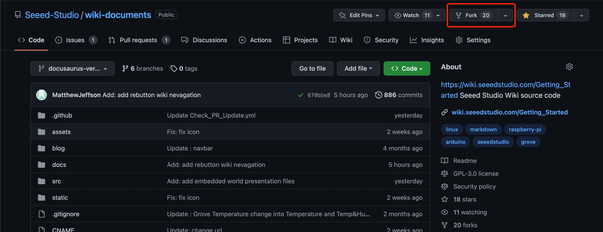
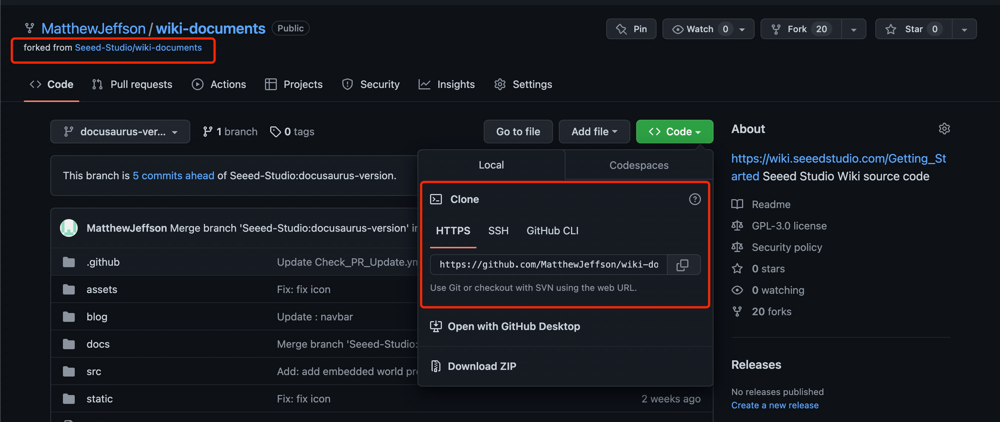
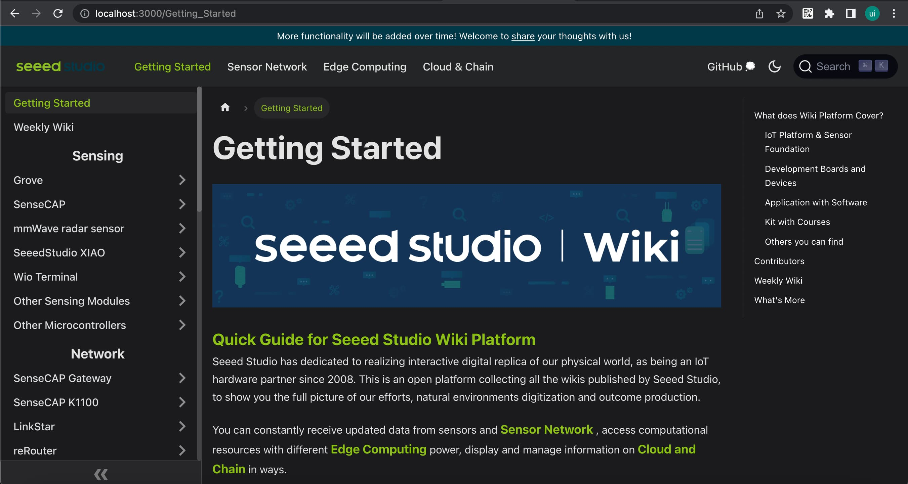

# Implantar a plataforma Wiki localmente

### 1. Fazer fork e baixar o repositório

a. Acesse o [repositório Github da plataforma Seeed Studio Wiki](https://github.com/Seeed-Studio/wiki-documents/tree/docusaurus-version) e então faça `fork` do repositório 'wiki-documents' para a sua própria conta.



b. Baixe os arquivos para o seu PC local. Se você não tiver o `git` você pode baixar [aqui](https://git-scm.com/).

```
git clone {your repository}
```



### 2. Baixar o node.js

Baixe o [node.js](https://nodejs.org/en/download/) de acordo com o seu sistema operacional (Windows, Mac).

Instale a versão `v20.18.1 (LTS)` do nodejs, caso contrário podem ocorrer erros durante o processo de instalação.

### 3. Baixar o Visual Studio Code

Baixe o [Visual Studio Code](https://code.visualstudio.com/Download) de acordo com o seu sistema operacional (Windows, Mac).

### 4. Instalar o Yarn

Abra o "Visual Studio Code" e use o seguinte comando para instalar o Yarn.

```
npm install --global yarn
```

Para mais informações, verifique [aqui](https://classic.yarnpkg.com/lang/en/docs/install/#windows-stable).

### 5. Instalar automaticamente as dependências usando Yarn

```
yarn
```

Para pessoas que usam o sistema operacional Windows, altere "Powershell" para "Command Prompt(cmd)" e então execute `yarn`.

### 6. Construir a plataforma wiki localmente usando Yarn

```
yarn start
```



### 7. Agora você pode fazer alterações ou adicionar arquivos

- [Passos completos para PR](/pt-br/full_steps_pull_request)
- [Passos rápidos para PR](/pt-br/quick_pull_request)
