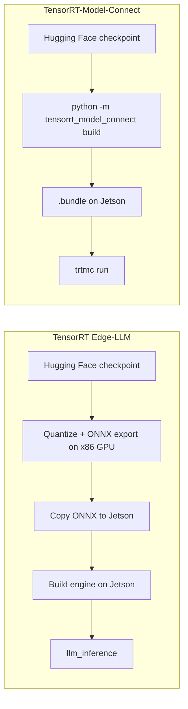

# Implantar TensorRT-Model-Connect no Jetson AGX Orin

<div align="center">
  
</div>

Este wiki mostra como executar o [NVIDIA TensorRT-Model-Connect](https://github.com/NVIDIA/TensorRT-Model-Connect) (TRTMC) em um Seeed reComputer com **Jetson AGX Orin**. Depois que o runtime nativo é compilado, o caminho é curto: começar de um checkpoint do Hugging Face, produzir um TensorRT `.bundle` no dispositivo e executar geração de texto. Não há host x86 separado nem etapa de exportação ONNX.

O passo a passo usa **Qwen3-4B-Instruct-2507** em FP16. Esse modelo é um transformer denso, então o TensorRT pode usar um mecanismo de prefill em lote. A mesma página também registra a memória de conversão no AGX Orin 64GB e uma comparação equivalente de prefill/decodificação com o llama.cpp CUDA.

:::note
TensorRT-Model-Connect é um preview público. As APIs, a cobertura de modelos e o fluxo de compilação ainda podem mudar. A própria orientação da NVIDIA é usar o TRTMC quando você quiser testar rapidamente modelos compatíveis e começar com o [TensorRT Edge-LLM](/pt-br/deploy_tensorrt_edge_llm_on_jetpack6.2/) quando precisar de um runtime de LLM/VLM voltado para produção no Jetson.
:::

## O que é TensorRT-Model-Connect?

TensorRT-Model-Connect é um conjunto de implementações de referência por família de modelos em cima do NVIDIA TensorRT. Um builder específico da família lê um snapshot do Hugging Face, constrói engines TensorRT e grava um `.bundle` versionado. O mesmo bundle pode ser executado a partir da CLI `trtmc` ou de APIs nativas de tarefa em C++, como geração de texto.

A diferença prática no Jetson é o caminho de conversão. O TensorRT Edge-LLM ainda espera que você quantize e exporte ONNX em uma máquina Linux x86 com uma GPU dedicada, depois copie esses arquivos ONNX para o dispositivo para geração das engines. O TRTMC constrói o bundle de engine no próprio Jetson.



<div align="center">
  
</div>

## Por que esse caminho é mais fácil no Jetson

| Tópico | TensorRT Edge-LLM | TensorRT-Model-Connect |
| --- | --- | --- |
| Onde a conversão é executada | Exportação ONNX em um host Linux x86 com uma GPU NVIDIA, depois compilação da engine no Jetson | Snapshot do Hugging Face para `.bundle` no Jetson |
| Arquivos intermediários | Grafos ONNX, muitas vezes dezenas de gigabytes, copiados para o dispositivo | Nenhum. O `.bundle` é o artefato |
| Comandos após a configuração | Exportar, copiar, compilar a engine e então executar `llm_inference` | `python -m tensorrt_model_connect build` e `trtmc run` |
| Memória do host durante a conversão | Documentação do fornecedor: a exportação ONNX em FP8 pode precisar de cerca de 18–20× o tamanho do modelo em RAM de CPU na máquina x86 | Medido no AGX Orin 64GB para Qwen3-4B FP16: cerca de 30,6 GB usados no host, pico de 41 GB no contêiner |
| Melhor uso | Implantação de LLM/VLM em produção no Jetson | Testar rapidamente um modelo compatível na mesma máquina que irá executá-lo |

A linha de memória não é uma comparação de “mesmo modelo”. Os números publicados de exportação ONNX do Edge-LLM explicam por que esse pipeline geralmente sai do Jetson e ocupa uma workstation com muita RAM. Os números do TRTMC abaixo são o que realmente observamos ao compilar o Qwen3-4B FP16 no AGX Orin 64GB.

## Hardware

Este tutorial foi reproduzido em um **reComputer Classic J5012** com Jetson AGX Orin 64GB. A conversão do Qwen3-4B FP16 atingiu pico em torno de 41 GB dentro do contêiner, então 64 GB de memória unificada é o alvo prático. O J5011 (32GB) é da mesma família de produtos, mas essa conversão provavelmente vai sofrer thrashing ou falhar lá.

<div style={{display:'grid', gridTemplateColumns:'repeat(2, minmax(0, 1fr))', gap:'24px', margin:'28px 0 42px'}}>
  <div style={{display:'flex', flexDirection:'column', overflow:'hidden', borderRadius:'16px', border:'2px solid #00a86b', background:'linear-gradient(145deg, #dce6ee, #cbd8e3)', color:'#172b4d', boxShadow:'0 14px 34px rgba(0,168,107,.18)'}}>
    <div style={{height:'290px', padding:'26px', display:'flex', alignItems:'center', justifyContent:'center', background:'linear-gradient(145deg, #d3dfe9, #bccbd8)'}}>
      
    </div>
    <div style={{display:'flex', flexDirection:'column', flex:'1', padding:'24px'}}>
      <div style={{fontSize:'23px', lineHeight:'1.35', fontWeight:'900', color:'#172b4d'}}>reComputer Classic J5012</div>
      <div style={{marginTop:'9px', color:'#526581', fontWeight:'600'}}>NVIDIA Jetson AGX Orin 64GB · verificado neste wiki</div>
      <div class="get_one_now_container" style={{textAlign:'center', marginTop:'auto', paddingTop:'24px'}}>
        <a class="get_one_now_item" href="https://www.seeedstudio.com/reComputer-Classic-J5012-p-6881.html" target="_blank" rel="noopener noreferrer">
          <strong><span><font color={'FFFFFF'} size={"4"}> Adquira agora 🖱️</font></span></strong>
        </a>
      </div>
    </div>
  </div>

  <div style={{display:'flex', flexDirection:'column', overflow:'hidden', borderRadius:'16px', border:'2px solid #3182ce', background:'linear-gradient(145deg, #dce6ee, #cbd8e3)', color:'#172b4d', boxShadow:'0 14px 34px rgba(49,130,206,.18)'}}>
    <div style={{height:'290px', padding:'26px', display:'flex', alignItems:'center', justifyContent:'center', background:'linear-gradient(145deg, #d3dfe9, #bccbd8)'}}>
      
    </div>
    <div style={{display:'flex', flexDirection:'column', flex:'1', padding:'24px'}}>
      <div style={{fontSize:'23px', lineHeight:'1.35', fontWeight:'900', color:'#172b4d'}}>reComputer Classic J5011</div>
      <div style={{marginTop:'9px', color:'#526581', fontWeight:'600'}}>NVIDIA Jetson AGX Orin 32GB · mesma família de placas</div>
      <div class="get_one_now_container" style={{textAlign:'center', marginTop:'auto', paddingTop:'24px'}}>
        <a class="get_one_now_item" href="https://www.seeedstudio.com/reComputer-Classic-J5011-p-6880.html" target="_blank" rel="noopener noreferrer">
          <strong><span><font color={'FFFFFF'} size={"4"}> Adquira agora 🖱️</font></span></strong>
        </a>
      </div>
    </div>
  </div>
</div>

## Pré-requisitos

Prepare o seguinte no Jetson:

- reComputer Classic J5012 ou outro sistema Jetson AGX Orin 64GB
- JetPack 7.2 / Ubuntu 24.04 / L4T R39.2
- Docker com o runtime NVIDIA (`docker info` deve listar `nvidia` em Runtimes)
- Cerca de 40 GB de espaço livre em disco para a imagem de desenvolvimento, snapshot do Hugging Face e `.bundle`
- Acesso de rede ao GitHub, Hugging Face e `nvcr.io`
- Opcional para a seção de benchmark: `nvpmodel` MAXN e `jetson_clocks`

A pilha de software verificada foi:

| Item | Versão |
| --- | --- |
| Dispositivo | Jetson AGX Orin 64GB |
| SO | Ubuntu 24.04.4 LTS, kernel 6.8.12-tegra |
| L4T | R39.2 |
| CUDA na imagem TRTMC | 13.3.1 |
| TensorRT na imagem TRTMC | 11.1.0.106 (TensorRT 26.07) |
| SM da GPU | 87 (Orin) |
| Modo de energia | MAXN, GPU 1300 MHz |

:::tip
Se `docker ps` retornar `permission denied`, adicione seu usuário ao grupo `docker` e faça login novamente:

```bash
sudo usermod -aG docker $USER
```

:::

## 1. Clonar o TensorRT-Model-Connect

```bash
git clone https://github.com/NVIDIA/TensorRT-Model-Connect.git
cd TensorRT-Model-Connect
```

O caminho oficial de primeiros passos é [Build from Source](https://nvidia.github.io/TensorRT-Model-Connect/getting-started/source-build) mais [Quick Start](https://nvidia.github.io/TensorRT-Model-Connect/getting-started/quick-start). Os comandos abaixo seguem esse caminho, com flags específicas para Jetson preenchidas.

## 2. Compilar o contêiner de desenvolvimento

No AGX Orin a capacidade de computação é 8.7, então `TRTMC_SM=87`. Imagens Docker para Jetson também precisam de `--runtime nvidia`.

```bash
GPU=0
SM="$(
  nvidia-smi -i "$GPU" \
    --query-gpu=compute_cap \
    --format=csv,noheader,nounits |
  tr -d '.[:space:]'
)"
IMAGE="trtmc-quickstart"

docker build \
  -f Dockerfile.dev.aarch64 \
  -t "$IMAGE" \
  requirements

SOURCE_DIR="$(git rev-parse --show-toplevel)"

docker run --rm -it \
  --runtime nvidia \
  --gpus "device=${GPU}" \
  --ipc=host \
  --network host \
  --mount "type=bind,source=${SOURCE_DIR},target=/src" \
  --workdir /src \
  --env TRTMC_SM="$SM" \
  "$IMAGE" \
  bash
```

:::caution
Mantenha os comandos restantes dentro deste contêiner. A imagem já fixa o TensorRT 11.1, um venv Python 3.12 e os headers nativos usados pela compilação da família Qwen. Se `nvidia-smi` estiver ausente no seu Jetson, defina `SM=87` manualmente.
:::

Se o snapshot do Hugging Face e o bundle forem ficar em um SSD externo, faça também o bind-mount desse disco, por exemplo `-v /path/to/data:/out`.

## 3. Compilar o runtime nativo

Execute estes comandos no contêiner:

```bash
python -m pip install --no-deps -e . -C py-only=true

TRTMC_BUILD_DIR="build-sm${TRTMC_SM}"

cmake -S . -B "$TRTMC_BUILD_DIR" -G Ninja \
  -DCMAKE_BUILD_TYPE=Release \
  -DCMAKE_CUDA_ARCHITECTURES="${TRTMC_SM}-real" \
  -DTRTMC_BUILD_BACKEND_RTX=OFF \
  -DTRTMC_BUILD_TESTS=OFF \
  -DTRTMC_BUILD_EXAMPLES=OFF

cmake --build "$TRTMC_BUILD_DIR" --parallel "$(nproc)" --target \
  trtmc \
  trtmc_backend_trt \
  trtmc_model_qwen

export PATH="$PWD/$TRTMC_BUILD_DIR:$PATH"
```

`trtmc` procura bibliotecas nativas em `--runtime-root`. Aponte esse argumento para o diretório de build do CMake, que deve conter `libtrtmc_core.so`, `libtrtmc_runtime.so`, `libtrtmc_backend_trt.so` e `libtrtmc_model_qwen.so`.

## 4. Gerar o bundle do Qwen3-4B no Jetson

Esta é a etapa de conversão que antes exigia uma máquina x86 com GPU. Fixe `--max-sequence-length`. A configuração do Hugging Face para este checkpoint anuncia um contexto de 262.144 tokens, e deixar esse padrão fará com que a memória se esgote durante a geração do engine.

```bash
python -m tensorrt_model_connect build Qwen/Qwen3-4B-Instruct-2507 \
  --precision fp16 \
  --backend trt \
  --max-sequence-length 2048 \
  --max-batch-size 1 \
  --tensor-parallel-size 1 \
  --output qwen3-4b-instruct-2507.bundle \
  --verbose
```

Um diretório de snapshot local pode substituir o ID do modelo. O builder faz o download do checkpoint, permite que a família Qwen o reivindique e grava um único `.bundle` que já contém os engines TensorRT.

Na unidade J5012 verificada, o Qwen3-4B FP16 com `max_sequence_length=2048` produziu a seguinte pegada de conversão. O caminho público FP16 de dispositivo único do Qwen grava engines divididos (`engine.plan` + `prefill.plan`); os números abaixo foram obtidos de um build com perfil duplo, em que prefill e decode compartilham um plano com dois perfis de otimização.

| Métrica | Valor medido |
| --- | --- |
| Precisão / layout | FP16, perfil duplo |
| Tamanho máximo da sequência | 2048 |
| Geração do engine | 128,1 s |
| Pesos TensorRT | 7,49 GiB |
| Memória de ativação do prefill | 633 MiB |
| Memória de ativação do decode | 12 MiB |
| Pico do alocador TensorRT na GPU | 7.674 MiB |
| Uso de host, pico | 30.640 MB |
| Memória do contêiner, pico | 41,09 GiB |
| RSS do Python, pico | 24,7 GB |
| `.bundle` final | 7,6 GiB |

:::tip
Esses picos de host/contêiner são o motivo pelo qual este wiki recomenda AGX Orin 64GB. Você está convertendo no dispositivo de borda, mas ainda precisa de memória unificada suficiente para o TensorRT construir os engines.
:::

Inspecione o bundle antes de executá-lo:

```bash
trtmc inspect ./qwen3-4b-instruct-2507.bundle
```

`trtmc inspect` imprime JSON. Procure por `family: qwen`, `task: text_generation` e uma lista de seções que inclua `engine.plan` mais os arquivos do tokenizer. Um build FP16 dividido também lista `prefill.plan`. Ainda não há grafo ONNX no bundle.

## 5. Executar inferência

```bash
trtmc run ./qwen3-4b-instruct-2507.bundle \
  --runtime-root "$PWD/build-sm${TRTMC_SM}" \
  --prompt "What is the capital of France? Answer in one word." \
  --use-chat-template true \
  --enable-thinking false \
  --max-new-tokens 32
```

Uma execução bem-sucedida imprime uma conclusão curta como `Paris`. O mesmo bundle pode ser carregado a partir de C++ com `trtmc::load_task(bundle, runtime_root)` e a interface `ITextGeneration`; consulte a [C++ Task API](https://nvidia.github.io/TensorRT-Model-Connect/api/cpp-api).

## Desempenho de inferência vs llama.cpp

A conveniência da conversão é apenas metade da história. No mesmo J5012, comparamos TRTMC FP16 com llama.cpp CUDA + flash-attention FP16, ambos com contexto 2048. O lado TRTMC desta tabela usou o engine de perfil duplo descrito acima.

Configuração de teste:

- Modelo: `Qwen/Qwen3-4B-Instruct-2507`, FP16
- Prompt: cerca de 6.000 caracteres de contexto mais uma pergunta sobre Paris com 70 palavras (1.190–1.194 tokens após o template de chat)
- Decode: 64 novos tokens, greedy (`temperature=0`, `top-k=1`)
- Clocks: `nvpmodel MAXN`, `jetson_clocks`, GPU 1300 MHz
- Aquecimento 1 + 3 medidos; a tabela abaixo usa a mediana das três execuções medidas
- llama.cpp: `GGML_CUDA=ON`, `GGML_CUDA_FA=ON`, `-ngl 99 -c 2048 -b 512 -ub 512`

<div align="center">
  
</div>

| Backend | Prefill | Decode | Geração (prefill + decode) |
| --- | --- | --- | --- |
| TensorRT-Model-Connect, FP16 de perfil duplo | 1.967 tok/s · 606,9 ms / 1.194 tok | 18,8 tok/s · 53,3 ms/tok | 4.019 ms |
| llama.cpp CUDA + flash-attn FP16 | 1.601 tok/s · 743,2 ms / 1.190 tok | 19,6 tok/s · 51,1 ms/tok | 3.998 ms |

O TRTMC vence no prefill longo, que é a carga de trabalho em que um engine TensorRT em batch ajuda. O decode fica praticamente empatado; o llama.cpp ficou ligeiramente à frente nesta medição. O tempo de geração de ponta a ponta para 64 novos tokens também é próximo, porque o decode domina quando o prompt já é longo.

:::note
Esta comparação é para um transformer denso Qwen3-4B. Modelos híbridos Mamba, como o NVIDIA Nano-9B, atualmente fazem prefill token a token no TRTMC, portanto são uma forma ruim de avaliar o throughput do TensorRT.
:::

## O que os números significam

- **Menos máquinas.** Você não precisa de uma estação de trabalho x86 com GPU apenas para exportar ONNX. O Jetson que servirá o modelo também pode construí-lo.
- **Menos RAM de host na conversão do que o caminho Edge-LLM FP8 ONNX.** A Edge-LLM documenta RAM de CPU de até cerca de 20× o tamanho do modelo para exportação ONNX FP8. O build Qwen3-4B FP16 TRTMC ficou em torno de 31 GB usados no host / 41 GB no contêiner no Orin 64GB.
- **Prefill mais rápido que o llama.cpp FP16** neste teste de contexto longo, com o decode permanecendo na mesma faixa.
- **Um artefato reutilizável.** O `.bundle` é o que você copia, inspeciona e executa. Não há uma árvore ONNX paralela para manter em sincronia.

## Solução de problemas

| Problema | O que verificar |
| --- | --- |
| O contêiner não consegue ver a GPU | Use `--runtime nvidia` e confirme que `docker info` lista o runtime `nvidia` |
| A construção do engine fica sem memória | Fixe `--max-sequence-length 2048`, use AGX Orin 64GB e feche outros usuários da GPU |
| `trtmc run` não consegue carregar bibliotecas | Passe `--runtime-root` para o diretório de build do CMake; a CLI não procura DSOs em `PATH` nem no diretório atual |
| Falha no download do Hugging Face | Coloque um snapshot local em disco e passe esse diretório para `build` em vez do ID do modelo |
| O decode parece bom, mas o prefill é lento | Confirme que você está em um transformer denso com um engine de prefill em perfil duplo / em batch, não em um grafo híbrido Mamba |
| `nvidia-smi` está ausente no Jetson | Defina `SM=87` para AGX Orin |

## Recursos

- [Repositório TensorRT-Model-Connect](https://github.com/NVIDIA/TensorRT-Model-Connect)
- [Documentação do TensorRT-Model-Connect](https://nvidia.github.io/TensorRT-Model-Connect/)
- [Implantar TensorRT Edge-LLM no JetPack 6.2](/pt-br/deploy_tensorrt_edge_llm_on_jetpack6.2/)
- [Introdução ao reComputer Classic J501](/pt-br/ai_robotics_seeed_agx_orin_dev_kit_getting_started/)
- [Qwen3-4B-Instruct-2507](https://huggingface.co/Qwen/Qwen3-4B-Instruct-2507)

## Suporte Técnico e Discussão de Produtos

Obrigado por escolher nossos produtos! Estamos aqui para oferecer diferentes tipos de suporte para garantir que sua experiência com nossos produtos seja a mais tranquila possível. Oferecemos vários canais de comunicação para atender a diferentes preferências e necessidades.

<div class="button_tech_support_container">
<a href="https://forum.seeedstudio.com/" class="button_forum"></a>
<a href="https://www.seeedstudio.com/contacts" class="button_email"></a>
</div>

<div class="button_tech_support_container">
<a href="https://discord.gg/eWkprNDMU7" class="button_discord"></a>
<a href="https://github.com/Seeed-Studio/wiki-documents/discussions/69" class="button_discussion"></a>
</div>
