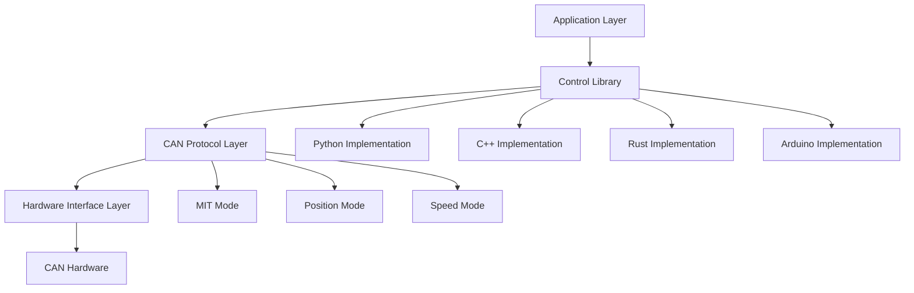
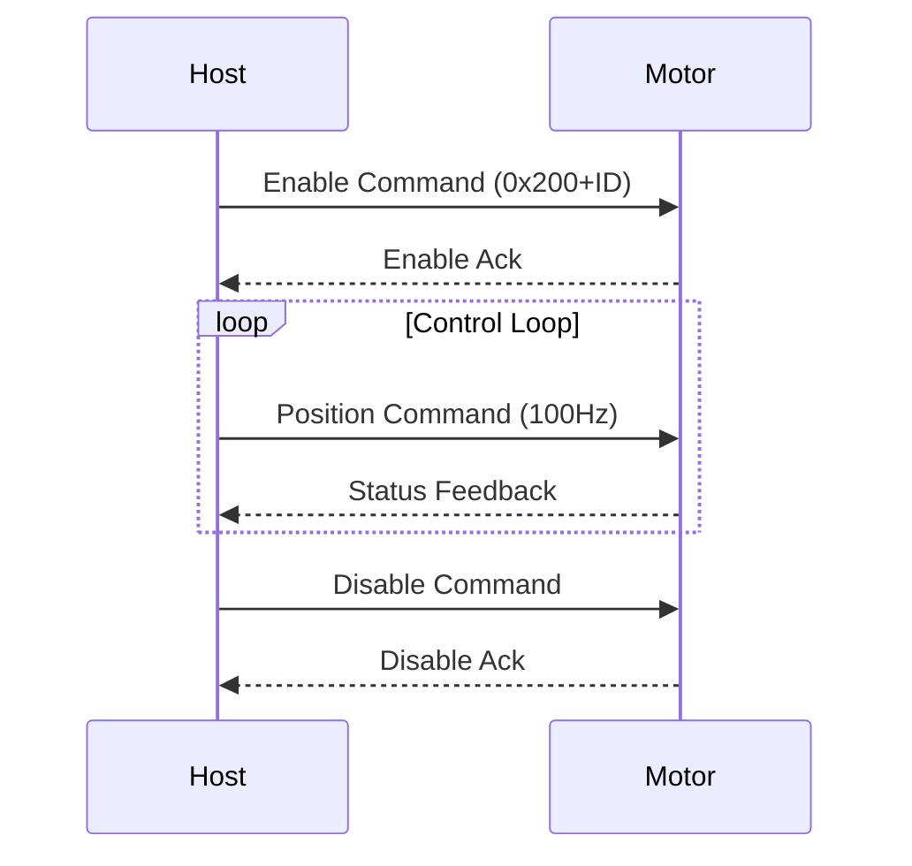

# Biblioteca de Controle RobStride - Documentação Técnica Completa

> Linha de base de controle de motor RobStride de alto desempenho com implementações em Python, C++, Rust e Arduino


## 📋 Tabela de Conteúdos

- [Visão Geral do Projeto](#visão-geral-do-projeto)
- [Modelos de Motor Suportados](#modelos-de-motor-suportados)
- [Arquitetura Técnica](#arquitetura-técnica)
- [Início Rápido](#início-rápido)
- [Implementação em Python](#implementação-em-python)
- [Implementação em C++](#implementação-em-c)
- [Implementação em Rust](#implementação-em-rust)
- [Implementação em Arduino](#implementação-em-arduino)
- [Detalhes do Protocolo](#detalhes-do-protocolo)
- [Otimização de Desempenho](#otimização-de-desempenho)
- [Solução de Problemas](#solução-de-problemas)
- [Guia de Desenvolvimento](#guia-de-desenvolvimento)

---

## 🎯 Visão Geral do Projeto

A Biblioteca de Controle RobStride é uma biblioteca de controle de motor de alto desempenho projetada especificamente para motores da série RobStride. Este projeto fornece uma solução completa de controle de motor com suporte a múltiplas linguagens de programação e plataformas de hardware, adequada para robótica, controle de automação, posicionamento de precisão e diversos outros cenários de aplicação.

### Recursos Principais

- ✅ **Suporte a múltiplas linguagens**: Implementações em Python, C++, Rust e Arduino
- ✅ **Vários Modos de Controle**: Modo MIT, Modo de Posição, Modo de Velocidade
- ✅ **Desempenho em Tempo Real**: Frequência de controle de 50–200Hz com baixa latência
- ✅ **Estabilidade de Grau Industrial**: Suporta operação contínua de longo prazo
- ✅ **Compatibilidade Multiplataforma**: Sistemas Linux, ESP32 e outras plataformas embarcadas
- ✅ **Interface Padronizada**: Design de API unificado para facilitar a troca de linguagem

### Vantagens Técnicas

- **Alto Desempenho**: Comunicação SocketCAN direta sem sobrecarga de middleware
- **Segurança de Memória**: A implementação em Rust fornece garantias de segurança de memória
- **Controle em Tempo Real**: A implementação em C++ atinge frequência de controle de 200Hz
- **Facilidade de Uso**: A implementação em Python fornece interface interativa amigável
- **Amigável a Sistemas Embarcados**: A implementação em Arduino é adequada para ambientes com recursos limitados

---

## Modelos de Motor Suportados

| Modelo | Torque Máx. | Velocidade Máx. | Faixa KP | Faixa KD |
|--------|------------|-----------|----------|----------|
| RS-00 | 17 Nm | 50 rad/s | 500.0 | 5.0 |
| RS-01 | 17 Nm | 44 rad/s | 500.0 | 5.0 |
| RS-02 | 17 Nm | 44 rad/s | 500.0 | 5.0 |
| RS-03 | 60 Nm | 50 rad/s | 5000.0| 100.0|
| RS-04 | 120 Nm| 15 rad/s | 5000.0| 100.0|
| RS-05 | 17 Nm | 33 rad/s | 500.0 | 5.0 |
| RS-06 | 60 Nm | 20 rad/s | 5000.0| 100.0|

---

## Arquitetura Técnica

### Diagrama de Arquitetura do Sistema



### Protocolo de Comunicação

- **Camada Física**: Padrão CAN 2.0B
- **Camada de Enlace de Dados**: Formato de quadro estendido (ID de 29 bits)
- **Camada de Aplicação**: Protocolo RobStride personalizado
- **Taxa de Transmissão**: 1 Mbps

### Detalhes do Modo de Controle

#### 1. Modo MIT (Modo 0)
- **Características**: Controle de torque direto com alta velocidade de resposta
- **Casos de Uso**: Aplicações que exigem resposta rápida
- **Parâmetros de Controle**: P, D, T, Posição, Velocidade

#### 2. Modo de Posição (Modo 1)
- **Características**: Controle em malha fechada de posição com posicionamento preciso
- **Casos de Uso**: Posicionamento de precisão, controle de juntas de robôs
- **Parâmetros de Controle**: Posição, Velocidade, Torque Máx.

#### 3. Modo de Velocidade (Modo 2)
- **Características**: Controle em malha fechada de velocidade com regulação estável
- **Casos de Uso**: Aplicações que exigem velocidade constante
- **Parâmetros de Controle**: Velocidade, Torque Máx.

---

## Início Rápido

### Configuração do Ambiente

```bash
# Ubuntu/Debian system dependencies
sudo apt-get update
sudo apt-get install -y \
    build-essential cmake \
    python3 python3-pip \
    rustc cargo \
    can-utils \
    gcc-avr avr-libc arduino-core

# CAN interface setup
sudo modprobe can
sudo ip link set can0 type can bitrate 1000000
sudo ip link set up can0
```

### Clonar Projeto

```bash
git clone https://github.com/Seeed-Projects/RobStride_Control.git
cd RobStride_Control
```

### Escolha a Implementação na Sua Linguagem

| Linguagem | Frequência de Controle | Uso de Memória | Casos de Uso |
|----------|-------------------|--------------|-----------|
| Python | 50-100Hz | ~50MB | Protótipo rápido, validação de algoritmo |
| C++ | 200Hz | ~10MB | Aplicações de alto desempenho, controle em tempo real |
| Rust | 150Hz | ~8MB | Crítico para segurança, requisitos de segurança de memória |
| Arduino | 100Hz | ~2KB | Embarcado, ambientes com recursos limitados |

---

## Implementação em Python

### Instalar Dependências

```bash
cd python
pip install -r requirements.txt
```

### Uso Básico

```python
#!/usr/bin/env python3
from robstride_dynamics import RobstrideBus

# Initialize CAN bus
bus = RobstrideBus('can0')

# Scan for motors
motors = bus.scan_channel()
print(f"Found motors: {motors}")

# MIT mode position control
motor_id = 1
target_position = 0.0

while True:
    # Send control command
    bus.write_operation_frame(
        motor_id=motor_id,
        p_des=target_position,
        v_des=0.0,
        kp=30.0,
        kd=0.5,
        t_ff=0.0
    )

    # Read status
    response = bus.read_frame(motor_id)
    print(f"Position: {response['position']:.3f} rad")

    time.sleep(0.01)  # 100Hz control frequency
```

### Interface Interativa

```bash
# Run MIT position control (with interactive interface)
python3 src/position_control.py 1

# Run speed control
python3 src/velocity_control.py 1
```

### Comandos Interativos

```bash
# Interactive commands in MIT mode
kp 30.0     # Set position gain
kd 0.5      # Set velocity gain
pos 1.0     # Set target position
vel 2.0     # Set target velocity
tor 5.0     # Set feed-forward torque
quit        # Exit program
```

### Recursos Avançados

```python
# Multi-motor synchronous control
motors = [1, 2, 3, 4]
bus.enable_motors(motors)

# Synchronous parameter setting
for motor_id in motors:
    bus.set_motor_param(motor_id, kp=50.0, kd=1.0)

# Synchronous control
while True:
    for i, motor_id in enumerate(motors):
        position = math.sin(time.time() + i * math.pi/2)
        bus.write_operation_frame(motor_id, position, 0, 50.0, 1.0, 0)
```

---

## Implementação em C++

### Compilar

```bash
cd cpp
mkdir build && cd build
cmake ..
make
```

### Uso Básico

```cpp
#include <iostream>
#include <thread>
#include <chrono>
#include <atomic>

class RobStrideMotor {
private:
    int can_socket;
    int motor_id;
    std::atomic<bool> running;

public:
    RobStrideMotor(int id) : motor_id(id), running(false) {
        can_socket = socket(PF_CAN, SOCK_RAW, CAN_RAW);
        // ... initialization code
    }

    void start() {
        running = true;
        std::thread control_thread(&RobStrideMotor::control_loop, this);
        control_thread.detach();
    }

    void set_position(double position, double kp, double kd) {
        uint8_t data[8];
        // ... pack data
        struct can_frame frame;
        frame.can_id = 0x200 + motor_id;
        frame.can_dlc = 8;
        memcpy(frame.data, data, 8);

        write(can_socket, &frame, sizeof(frame));
    }
};
```

### Otimização de Desempenho

```cpp
// High-performance configuration
static constexpr int CONTROL_FREQ = 200;  // 200Hz
static constexpr auto CONTROL_PERIOD =
    std::chrono::microseconds(1000000 / CONTROL_FREQ);

// Real-time control loop
void control_loop() {
    auto next_time = std::chrono::steady_clock::now();

    while (running) {
        // Control logic
        send_command();

        // Precise timing control
        next_time += CONTROL_PERIOD;
        std::this_thread::sleep_until(next_time);
    }
}
```

### Executar

```bash
# Requires administrator privileges
sudo ./build/robstride-mit-position 1
```

---

## Implementação em Rust

### Compilar

```bash
cd rust
cargo build --release
```

### Uso Básico

```rust
use socketcan::{CanSocket, CanFrame, EmbeddedFrame};
use std::sync::{Arc, Mutex};
use std::thread;

struct RobStrideController {
    socket: Arc<Mutex<CanSocket>>,
    motor_id: u8,
}

impl RobStrideController {
    fn new(interface: &str, motor_id: u8) -> Result<Self, Box<dyn std::error::Error>> {
        let socket = CanSocket::open(interface)?;
        Ok(Self {
            socket: Arc::new(Mutex::new(socket)),
            motor_id,
        })
    }

    fn send_position_command(
        &self,
        position: f32,
        velocity: f32,
        kp: f32,
        kd: f32,
        torque: f32,
    ) -> Result<(), Box<dyn std::error::Error>> {
        let data: [u8; 8] = [
            (position * 1000.0) as u8,
            ((position * 1000.0) / 256.0) as u8,
            ((position * 1000.0) / 65536.0) as u8,
            ((position * 1000.0) / 16777216.0) as u8,
            (velocity * 1000.0) as u8,
            (kp * 5.0) as u8,
            (kd * 500.0) as u8,
            (torque * 10.0) as u8,
        ];

        let frame = CanFrame::new(
            socketcan::CanId::new(0x200 + self.motor_id as u32).unwrap(),
            &data,
        )?;

        let socket = self.socket.lock().unwrap();
        socket.write_frame(&frame)?;
        Ok(())
    }
}
```

### Recursos de Segurança de Memória

```rust
// Multi-thread safe shared CAN interface
let controller = Arc::new(RobStrideController::new("can0", motor_id)?);

// Control thread
let ctrl_clone = Arc::clone(&controller);
thread::spawn(move || {
    loop {
        ctrl_clone.send_command()?;
        thread::sleep(Duration::from_millis(10));
    }
});

// Monitoring thread
let monitor_clone = Arc::clone(&controller);
thread::spawn(move || {
    loop {
        let status = monitor_clone.read_status()?;
        println!("Motor status: {:?}", status);
        thread::sleep(Duration::from_millis(50));
    }
});
```

### Executar

```bash
cargo run --release -- 1
```

---

## Implementação em Arduino

### Configuração de Hardware

```
ESP32           CAN Transceiver      RobStride Motor
GPIO5   <--->   TX                    CAN H
GPIO4   <--->   RX                    CAN L
5V      <--->   VCC                   Power Supply
GND     <--->   GND                   Ground
```

### Código Básico

```cpp
#include <ESP32-TWAI-CAN.h>

class RobStrideMotor {
private:
    TWAI_CAN can;
    uint8_t motor_id;

public:
    RobStrideMotor(uint8_t id) : motor_id(id) {}

    bool begin() {
        can.begin(TWAI_SPEED_1000KBPS, 4, 5);  // GPIO4=RX, GPIO5=TX
        return true;
    }

    void send_position_command(float position, float velocity, float kp, float kd, float torque) {
        can_frame_t frame;
        frame.identifier = 0x200 + motor_id;
        frame.extd = true;
        frame.data_length_code = 8;

        // Pack data
        int32_t pos_int = (int32_t)(position * 1000.0);
        frame.data[0] = pos_int & 0xFF;
        frame.data[1] = (pos_int >> 8) & 0xFF;
        frame.data[2] = (pos_int >> 16) & 0xFF;
        frame.data[3] = (pos_int >> 24) & 0xFF;
        frame.data[4] = (uint8_t)(velocity * 1000.0);
        frame.data[5] = (uint8_t)(kp * 5.0);
        frame.data[6] = (uint8_t)(kd * 500.0);
        frame.data[7] = (uint8_t)(torque * 10.0);

        can.writeFrame(&frame);
    }

    void enable_motor() {
        can_frame_t frame;
        frame.identifier = 0x200 + motor_id;
        frame.extd = true;
        frame.data_length_code = 8;
        memset(frame.data, 0xFF, 8);  // Enable command
        can.writeFrame(&frame);
    }
};
```

### Exemplo de Controle com Arduino

```cpp
RobStrideMotor motor(1);

void setup() {
    Serial.begin(115200);
    motor.begin();

    // Enable motor
    motor.enable_motor();
    delay(100);

    Serial.println("Motor enabled, starting control loop...");
}

void loop() {
    static float phase = 0.0;
    float target_pos = sin(phase) * 3.14159;  // ±π radians

    motor.send_position_command(target_pos, 0, 30.0, 0.5, 0);

    phase += 0.01;
    delay(10);  // 100Hz control frequency

    if (phase > 2 * 3.14159) {
        phase = 0;
    }
}
```

---

## Detalhes do Protocolo

### Formato do Quadro CAN

| Campo | Tamanho | Descrição |
|-------|------|-------------|
| ID | 29 bits | Identificador de quadro estendido |
| DLC | 4 bits | Comprimento dos dados (fixo em 8) |
| Dados | 8 bytes | Dados de controle |
| CRC | 16 bits | Verificação de redundância cíclica |

### Regras de Alocação de ID

- **0x200 + ID**: Comandos de controle em modo MIT
- **0x300 + ID**: Comandos de controle em modo de posição
- **0x400 + ID**: Comandos de controle em modo de velocidade
- **0x500 + ID**: Consultas de status do sistema
- **0x600 + ID**: Comandos de configuração do sistema

### Formato do Pacote de Dados

#### Comando de Controle em Modo MIT (8 bytes)

```c
struct mit_command_t {
    int32_t p_des;     // Target position (rad)
    int16_t v_des;     // Target velocity (rad/s)
    uint16_t kp;       // Position gain
    uint16_t kd;       // Velocity gain
    int16_t t_ff;      // Feed-forward torque (Nm)
};
```

#### Feedback de Status do Motor (8 bytes)

```c
struct motor_status_t {
    int32_t position;  // Current position (rad)
    int16_t velocity;  // Current velocity (rad/s)
    int16_t torque;    // Current torque (Nm)
    uint8_t mode;      // Current mode
    uint8_t error;     // Error code
};
```

### Temporização de Comunicação



---

## Otimização de Desempenho

### Ajuste do Sistema

#### 1. Otimização de Parâmetros do Kernel Linux

```bash
# Real-time priority setting
echo 'KERNEL=="can0", MODE="0666"' > /etc/udev/rules.d/99-can.rules

# CPU affinity binding
sudo taskset -cp 0-3 $(pgrep robstride-control)

# Memory locking (optional)
sudo sysctl -w vm.swappiness=1
```

#### 2. Escalonamento em Tempo Real

```cpp
#include <sched.h>
#include <sys/mman.h>

struct sched_param param;
param.sched_priority = 99;
sched_setscheduler(0, SCHED_FIFO, &param);

mlockall(MCL_CURRENT | MCL_FUTURE);
```

### Benchmarks de Desempenho

| Linguagem | Frequência de Controle | Uso de CPU | Latência | Uso de Memória |
|----------|-------------------|-----------|---------|--------------|
| Python | 50-100Hz | 15-20% | 2-5ms | ~50MB |
| C++ | 200Hz | 5-8% | 0.5-1ms | ~10MB |
| Rust | 150Hz | 8-12% | 1-2ms | ~8MB |
| Arduino | 100Hz | 40-60% | 1-3ms | ~2KB |

### Dicas de Otimização

#### Otimização em Python

```python
# Use C extensions for acceleration
from robstride_dynamics import RobstrideBus

# Pre-allocate arrays
import numpy as np
position_buffer = np.zeros(1000)

# Async I/O
import asyncio
async def control_loop():
    while True:
        await send_command()
        await asyncio.sleep(0.01)
```

#### Otimização em C++

```cpp
// Zero-copy optimization
static_assert(sizeof(motor_command_t) == 8, "Command size mismatch");

// Memory pool
class MemoryPool {
    std::array<motor_command_t, 100> pool;
    std::mutex mutex;
public:
    motor_command_t* acquire() { /* ... */ }
    void release(motor_command_t* ptr) { /* ... */ }
};
```

#### Otimização em Rust

```rust
// Pre-allocate capacity
let mut frames: Vec<CanFrame> = Vec::with_capacity(1000);

// Avoid heap allocation
#[repr(C, packed)]
struct MotorCommand {
    p_des: i32,
    v_des: i16,
    kp: u16,
    kd: u16,
    t_ff: i16,
}
```

---

## Solução de Problemas

### Problemas Comuns

#### 1. Falha na Comunicação CAN

```bash
# Check CAN interface status
ip -details link show can0

# Monitor CAN traffic
candump can0

# Reset CAN interface
sudo ip link set can0 down
sudo ip link set can0 up type can bitrate 1000000
```

#### 2. Motor Sem Resposta

```bash
# Scan devices on bus
python3 -c "
from robstride_dynamics import RobstrideBus
bus = RobstrideBus('can0')
motors = bus.scan_channel()
print(f'Found motors: {motors}')
"
```

#### 3. Problemas de Desempenho

```bash
# Check CPU usage
top -p $(pgrep robstride-control)

# Check real-time
sudo chrt -f 99 $(pgrep robstride-control)
```

### Códigos de Erro

| Código | Descrição | Solução |
|------|-------------|----------|
| 0x01 | Tempo limite de comunicação | Verifique a conexão CAN |
| 0x02 | Parâmetro fora do intervalo | Verifique os intervalos dos parâmetros de controle |
| 0x03 | Sobrecorrente do motor | Verifique a carga e os limites de torque |
| 0x04 | Overflow de posição | Verifique os limites e a posição alvo |
| 0x05 | Temperatura muito alta | Verifique o resfriamento e a carga |

### Ferramentas de Depuração

```bash
# Real-time CAN bus monitoring
candump -t A can0

# Send test frame
cansend can0 211#FFFFFFFF

# Network topology detection
canbusload can0@1000000

# Error statistics
cangen can0 -I 211 -D r
```

---

## Guia de Desenvolvimento

### Estrutura do Projeto

```
RobStride_Control/
├── cpp/                  # C++ implementation
│   ├── src/             # Source code
│   ├── include/         # Header files
│   ├── tests/           # Test code
│   └── examples/        # Example code
├── python/              # Python implementation
│   ├── src/             # Source code
│   ├── examples/        # Example code
│   └── tests/           # Test code
├── rust/                # Rust implementation
│   ├── src/             # Source code
│   ├── examples/        # Example code
│   └── tests/           # Test code
├── arduino/             # Arduino implementation
│   └── mi_motor_control/# ESP32 library
├── docs/                # Documentation
├── scripts/             # Utility scripts
└── tools/               # Helper tools
```

### Diretrizes de Contribuição

1. **Estilo de Código**
   - Python: Siga o PEP 8
   - C++: Siga o Google C++ Style Guide
   - Rust: Use rustfmt
   - Arduino: Siga o Arduino Style Guide

2. **Convenção de Commits**
   ```
   feat: Add new feature
   fix: Bug fix
   docs: Update documentation
   style: Code formatting changes
   refactor: Code refactoring
   test: Add tests
   chore: Build process or auxiliary tool changes
   ```

3. **Requisitos de Teste**
   ```bash
   # Run all tests
   python3 -m pytest python/tests/
   cd cpp && make test
   cd rust && cargo test
   ```

### Scripts de Build

```bash
#!/bin/bash
# scripts/build-all.sh

echo "Building all implementations..."

# Python
cd python
python3 setup.py build
cd ..

# C++
cd cpp
mkdir -p build && cd build
cmake ..
make -j$(nproc)
cd ../..

# Rust
cd rust
cargo build --release
cd ..

# Arduino (requires Arduino IDE)
echo "Arduino build requires Arduino IDE"
echo "Open arduino/mi_motor_control/mi_motor_control.ino"

echo "Build completed!"
```

### Guia de Deploy

#### Ubuntu/Debian

```bash
# Install dependencies
sudo apt-get install -y build-essential can-utils

# Build C++ version (fastest)
cd cpp/build
sudo make install

# Create system service
sudo cp scripts/robstride.service /etc/systemd/system/
sudo systemctl enable robstride
sudo systemctl start robstride
```

#### Docker

```dockerfile
FROM ubuntu:22.04

RUN apt-get update && apt-get install -y \
    build-essential cmake \
    python3 python3-pip \
    rustc cargo \
    can-utils

WORKDIR /app
COPY . .

# Build all versions
RUN scripts/build-all.sh

CMD ["./cpp/build/robstride-mit-position", "1"]
```

---

## Recursos

- **URL do Projeto**: https://github.com/Seeed-Projects/RobStride_Control
- **Relato de Problemas**: https://github.com/Seeed-Projects/RobStride_Control/issues
- **Mantenedor**: @tianrking


---

## Suporte Técnico & Discussão de Produto

Obrigado por escolher nossos produtos! Estamos aqui para fornecer diferentes tipos de suporte para garantir que sua experiência com nossos produtos seja a mais tranquila possível. Oferecemos vários canais de comunicação para atender a diferentes preferências e necessidades.

<div class="button_tech_support_container">
<a href="https://forum.seeedstudio.com/" class="button_forum"></a>
<a href="https://www.seeedstudio.com/contacts" class="button_email"></a>
</div>

<div class="button_tech_support_container">
<a href="https://discord.gg/eWkprNDMU7" class="button_discord"></a>
<a href="https://github.com/Seeed-Studio/wiki-documents/discussions/69" class="button_discussion"></a>
</div>
