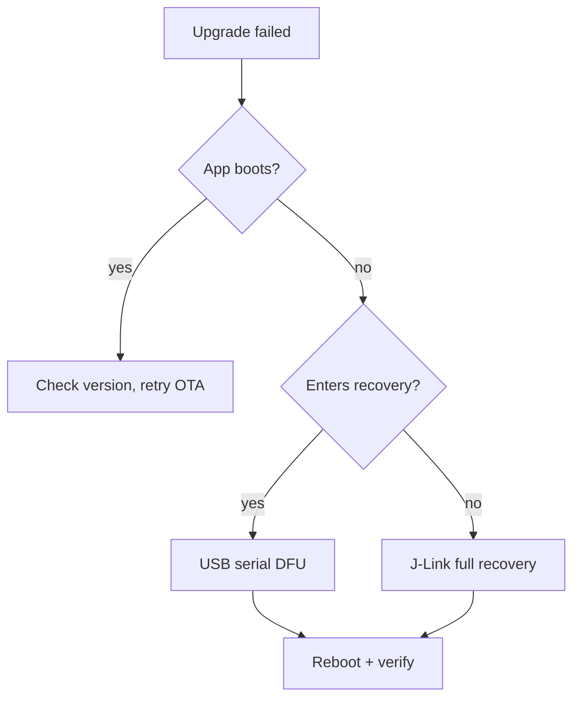

# Guia de Desenvolvimento de Firmware do reSpeaker Clip

A referência abrangente para o firmware do lado do dispositivo reSpeaker Clip: como ele é estruturado, o protocolo AT/GATT/UDP que ele utiliza, como é construído, atualizado, recuperado, validado e enviado. Para o caminho de build até smoke test a partir de uma máquina limpa, consulte [Getting Started with the reSpeaker Clip Firmware SDK](/pt-br/respeaker_clip_firmware_quick_start); para detalhes completos de build/flash/energia/armadilhas, consulte [CLAUDE.md](https://github.com/Seeed-Studio/reSpeaker_Clip/blob/main/CLAUDE.md).

O código-fonte do firmware obtido via checkout é a referência autoritativa; este guia o resume. Quando houver divergência, o código-fonte prevalece.

## Introdução

O Firmware SDK é uma aplicação Zephyr RTOS orientada a eventos no Nordic nRF5340 (core de aplicação + core de rede) com um array de microfones PDM, BLE, Wi-Fi AP (nRF7002), USB, armazenamento em SD e um OLED. Ele é destinado a desenvolvedores que modificam o comportamento do lado do dispositivo. Este guia cobre o design e a referência operacional (protocolo, atualização, validação, produção) em um só lugar, de forma que cada fato tenha exatamente um único local — referências cruzadas apontam de volta para cá em vez de duplicar.

## Arquitetura do Sistema

### Arquitetura em Camadas

O firmware é organizado em cinco camadas, cada uma dependendo apenas da camada abaixo:

| Camada | Responsabilidade | Código-fonte principal |
|-------|------------------|------------------------|
| **App / evento** | Máquina de estados, UI, botão, o único lugar onde efeitos colaterais acontecem | `clip_event.c`, `display.c`, `button.c`, `main.c` |
| **Serviço / transporte-transfer-config** | Movimentação de bytes (BLE/UDP/USB), mecanismo de transferência de arquivos, configuração persistente | `transport.c`, `transport_ble.c`, `transport_udp.c`, `usb_cdc.c`, `transfer.c`, `config.c` |
| **Processamento / áudio** | Captura PDM → DSP → Opus → gravações em arquivo enquadradas | `audio.c`, `storage.c` |
| **HAL / drivers** | Dispositivos da placa: OLED, PMIC, mic/reguladores, flash SPI, SD, rádio WiFi/BLE | `boards/seeed/clip/`, `drivers/`, `battery.c`, `haptic.c` |
| **Kernel Zephyr** | Threads, filas de mensagens, semáforos, mutexes, gerenciamento de energia | NCS v3.3.0 |

O invariante: **a camada de app é o único lugar que altera estado e dispara efeitos colaterais.** Pressionamentos de botão e comandos AT não iniciam o microfone nem gravam no cartão SD diretamente — eles publicam um evento, e `clip_event.c` decide se isso é permitido no estado atual e o executa.

Um pedido flui: `button ISR` / `AT command` → `clip_post_event[_sync]()` → `[k_msgq]` → `clip_event_process()` (thread principal) → `execute_transition()` → efeitos colaterais (`audio_*`, `storage_*`, `display_*`, `haptic_*`, `ble_notify_*`). Botões publicam de forma assíncrona (`K_NO_WAIT`, seguro em ISR); comandos AT publicam de forma síncrona (bloqueiam em um semáforo por evento para que `AT+START` possa retornar o id da sessão de forma síncrona).

### Modelo de Evento e Estado

O despachante em `clip_event.c` é uma máquina de estados orientada por tabela:

- `clip_post_event(event)` — assíncrono, não bloqueante, seguro em ISR; descarta se a fila de 8 slots estiver cheia.
- `clip_post_event_sync(event, &info)` — bloqueante; retorna `OK`/`INVALID`/ `BUSY`/`ERROR` via `info`.

Estados: `UNINITIALIZED → IDLE → RECORDING → TRANSMITTING / WIFI_SYNC → IDLE`, além de `PAUSED`, `ERROR`, `OTA`. `transition_table[current_state][event]` retorna um próximo estado, `TRANS_SAME` (permanece, por exemplo `MARK`), ou `TRANS_INVALID` (rejeita). Duas rejeições pré-controladas: `START` enquanto `WIFI_SYNC` ("WiFi bloqueado"), `START` enquanto o USB MSC expõe o SD ("USB bloqueado" — montar via USB enquanto grava corromperia o FAT). O estado é consolidado apenas em `execute_transition()` via `atomic_set(&g_state, new)` — o único lugar onde o estado muda.

Efeitos colaterais notáveis: `START` chama `storage_ensure_mounted()`, recusa se estiver cheio, depois `audio_start_recording(AUDIO_MODE_MERGE)`. `STOP` espera ≤5 s para a thread de áudio esvaziar/fechar; se o SD estiver ocupado, stop consolida `IDLE` mesmo assim para que a máquina nunca fique travada em `RECORDING` (a cauda da gravação pode ser cortada). `POWER_OFF_EXEC` cancela qualquer transferência ativa (espera limitada), interrompe uma gravação, salva o estado do medidor de carga e coloca o PMIC em modo ship.

### Modelo de Threads

Cinco threads de aplicação (prioridades Zephyr: número menor = prioridade maior, preemptível em 0+; o RX do Bluetooth roda ainda mais alto):

| Thread | Pri | Stack | Função |
|--------|-----|-------|--------|
| **Main** | (main) | — | Loop de eventos `clip_event_wait()`→`clip_event_process()`, UI, tempo. Espera `K_FOREVER` em idle ou `K_MSEC(1000)` gravando. |
| **Áudio** `audio_rec` | 0 | 32768 | Leitura PDM → DSP → Opus → armazenamento. Thread de aplicação de maior prioridade (deadline de 20 ms do Opus é rígida). |
| **Transfer** | 5 | 16384 | Mecanismo de transferência de arquivos: lê o SD, envia via transporte, retransmite. |
| **Servidor UDP** | 5 | 4096 | Servidor de soquete UDP Wi-Fi (porta 8089). |
| **Servidor AT** | 7 | 4096 | Analisa AT em BLE/UDP/USB, publica eventos síncronos, envia JSON. |

Padrão de sincronização: **flags voláteis/atômicas** para "devo parar?" (`transfer_cancel_requested`, `pause_requested`), **semáforos** para "você terminou?" (`stop_done_sem`, `file_closed_sem`, `transfer_trigger_sem`), **mutexes** para estruturas de dados (`audio_state_mutex`, `sd_lifecycle_mutex`, `session_json_mutex`, `transport_lock`), **uma fila de mensagens** para o caminho produtor→consumidor que importa (`clip_ev_msgq`, eventos → main). Um `k_mem_slab` de 32 × 1280 B buffers fornece 640 ms de profundidade de fila DMIC para absorver jitter de escalonamento (incluindo preempção de RX BT).

## Arquitetura de Áudio e Gravação

### Pipeline de Áudio

Por frame de 20 ms: `dmic_read()` (L+R estéreo, 1280 B) → `process_pcm_frame()` (merge + DSP, dependente do modo) → `opus_encode()` (pacote ≤4000 B) → `storage_write_frame()` (gravações em buffer de 2 bytes com comprimento prefixado, gravações em 4 KiB).

Constantes (`audio.h`): 16 kHz, 16 bits, PDM de 2 canais; frames de 20 ms → 320 amostras/frame, 1280 B/bloco; 32 buffers DMIC (fila de 640 ms).

### Modos de Gravação

> Documentações mais antigas descrevem `MODE_NORMAL` como **estéreo**. Isso está errado. Ambos os modos gravam em **mono**.

- **Ambos os modos** gravam em mono via um merge L+R. `clip_event.c` fixa `audio_start_recording(AUDIO_MODE_MERGE)`. `MODE_NORMAL` não é estéreo — o nome é legado.
- **`MODE_NORMAL`** (padrão): merge L+R alinhado em atraso → high-pass de 100 Hz feito à mão → AGC inteiro (envoltória + cálculo de ganho + suavizador) → limitador suave. **Sem SpeexDSP.**
- **`MODE_ENHANCED`**: o mesmo merge + DSP feito à mão, **mais SpeexDSP** supressão de ruído + desreverberação, condicionado a `mode == ENHANCED && noise_suppress > 0` (`audio.c:506`). O AGC do SpeexDSP *não* é usado (o build é `FIXED_POINT`; um AGC de FFT em float custaria ~15 ms/frame; o AGC inteiro o substitui).
- A etapa de merge faz correlação cruzada L vs R sobre atrasos \{−1, 0, +1\} (espaçamento de microfones de 2,85 cm → ≤1 amostra de ITD a 16 kHz) e alinha o atraso antes de somar, evitando filtragem em pente. O AGC é um compressor clássico: ~30 ms de ataque / ~300 ms de liberação, alvo ≈−14,7 dBFS, ganho limitado a ±12/24 dB, limitador suave (joelho em −2 dBFS, limite rígido em −0,5 dBFS).
- Opus: `OPUS_APPLICATION_AUDIO` (preserva fricativas melhor que VOIP para STT), VBR sem restrições, dica de sinal de voz, profundidade de 16 bits, DTX/FEC/perda de pacotes desativados. Bitrate/complexidade são **por modo via Kconfig** (`CLIP_NORMAL_*`/`CLIP_ENHANCED_*`), não configuráveis em tempo de execução. O estado do codificador + SpeexDSP é mantido em cache, reinicializado apenas quando os parâmetros mudam.
- Defina o modo com `AT+MODE=normal|enhanced` (persistente) ou `AT+START mode=enhanced` (apenas para a sessão, não persistente).

### Modelo de Sessão, Segmentação e Armazenamento

Cada gravação é uma **sessão** com um `session_id` de 14 dígitos: `YYYYMMDDHHMMSS` (UTC) quando o relógio está sincronizado, caso contrário `0` + 13 dígitos de uptime. A forma de 14 dígitos é aplicada em todos os lugares (`validate_session_id`) porque o layout de armazenamento a fragmenta em componentes de caminho.

Uma sessão é uma árvore de diretórios: `session.json` (metadados: id, duração, arquivos, synced, tamanho, canais, sample_rate, mode), `marks.bin` (bookmarks binários: magic "BMRK" + contagem + offsets) e arquivos de segmento `0/0001.opus`, `0/0002.opus` … `1/0101.opus` (grupo = (file_index−1)/100, 100 arquivos por subdiretório). Arquivos Opus são **streams de frames com comprimento prefixado** (comprimento LE de 2 bytes + pacote, não OGG); um buffer de gravação de 4 KiB agrega frames antes de `fs_write`.

Segmentação em partes: **300 s por segmento quando não está sincronizando** (`CLIP_AUDIO_SEGMENT_DURATION_NO_SYNC`), **60 s durante uma transferência ativa** (`CLIP_AUDIO_SEGMENT_DURATION_SYNC`) — ao gravar *enquanto* transfere (modo contínuo), a thread de transferência só pode ler um arquivo fechado, então 60 s limita a espera do cliente pelo próximo arquivo; se a sincronização começar no meio do arquivo e o arquivo atual já exceder 60 s, o mecanismo fatia imediatamente (`audio.c:868`). Cada ciclo `PAUSE`/`RESUME` também abre um novo arquivo. O campo `synced` de `session.json` rastreia arquivos reconhecidos para que um download seja retomado a partir do primeiro arquivo não sincronizado.

**Armazenamento:** o microSD (FAT32, `/SD:`) mantém gravações em `/SD:/REC/` em um layout de buckets que fragmenta o id da sessão (`/SD:/REC/<YYYYMMDD>/<HH>/<MM>/<SS>/…`). A flash SPI externa de 8 MiB (LittleFS, ~6,8 MiB) mantém configurações (`/lfs/settings/run`) e slots de OTA — separada do SD para que configurações corrompidas ou uma OTA interrompida nunca derrubem as gravações. O SD é **remontado sob demanda** via `storage_ensure_mounted()` e **desligado para economia de energia em idle** após `CLIP_SD_IDLE_DELAY_MS` (45 s) quando está genuinamente ocioso (verificado sob lock para fechar o TOCTOU com uma gravação/transferência iniciando no meio da verificação).

### Gerenciamento de Energia

Dispositivo de bateria (célula "240" de 170 mAh, NPM1300 + nRF Fuel Gauge); a corrente em idle é a principal restrição. Build de produção no trilho de 3V3:

| Fonte | Comportamento | Custo |
|--------|--------------|-------|
| Reguladores principal + rádio do nRF5340 | DCDC (`NRF5X_REG_MODE_DCDC`) | ~500–600 µA vs LDO |
| Cartão SD | Desligado para economia após 45 s em idle | ~0 quando ocioso |
| Console UART de debug | UARTE permanece habilitado entre impressões | **~570 µA** de fuga |
| Anúncio BLE lento | Intervalo de ~1 s | ~0,1 mA em média |
| nRF70 QSPI | `CONFIG_NRF70_QSPI_LOW_POWER` quando o WiFi não é usado | mínimo |

**Idle de produção ≈ 170 µA.** O maior vazamento depois que os reguladores e o SD foram corrigidos é o **console UART de depuração** (~570 µA); o snippet `production` desativa o console + backend de log UART (`CONFIG_CONSOLE=n`, `CONFIG_UART_CONSOLE=n`, `CONFIG_LOG_BACKEND_UART=n`), o que é o que atinge ~170 µA. `CONFIG_PM_DEVICE_RUNTIME=y` suspende automaticamente drivers UART/I2C/SPI quando ocioso. Gravação/transferência elevam brevemente a corrente (turbo de CPU para 128 MHz, com contagem de referências; trilho do mic + SD ligado; liberado na conclusão).

## Protocolo de Comunicação

### Serviço BLE GATT

| Característica | UUID (sufixo de `6E40xxxx-B5A3-F393-E0A9-E50E24DCCA9E`) | Papel |
|---|---|---|
| Serviço | `0001` | O serviço reSpeaker Clip |
| Recebimento de Comando | `0002` | O host grava comandos AT aqui |
| Envio de Resposta | `0003` | O dispositivo notifica respostas JSON |
| Dados de Arquivo | `0004` | O dispositivo notifica quadros binários de transferência de arquivo |
| Visualização de Áudio | `0005` | O dispositivo notifica níveis de energia da gravação |

### Gramática de Comandos AT

| Tipo | Formato | Exemplo | Notas |
|---|---|---|---|
| EXEC | `AT+XX` | `AT+GSTAT` | Ação / leitura padrão |
| SET | `AT+XX=<value>` | `AT+MODE=enhanced` | Define um parâmetro / age com argumentos |
| READ | `AT+XX?` | `AT+MODE?` | Consulta o valor atual |

A análise é compartilhada: `parse_command()` (em `at_server.c`) é responsável pela gramática `AT+NAME=args` e pela detecção de tipo `=`/`?`; os handlers recebem `ctx->args` já dividido (após o `=`). `AT+LIST?2&10` é uma leitura paginada.

### Contrato de Resposta JSON

- Sucesso: `{"ok":true,"data":{...}}`
- Falha: `{"ok":false,"msg":"..."}`
- **Sem códigos numéricos de erro, sem campo `error`, sem ID de requisição.** Falhas usam `msg`. O mesmo JSON sai de forma idêntica via BLE, UDP e USB (roteado pelo transporte de origem do comando via macro `SEND_RESPONSE()` — seu handler apenas preenche o buffer de resposta).

### Referência de Comandos Registrados

Os comandos registrados ficam em `applications/clip/src/at_commands.c` (a tabela `.name = "..."`). Conjunto verificado:

| Grupo | Comandos |
|---|---|
| Status do dispositivo | `GSTAT`, `BATT`, `DEVICE`, `VERSION` |
| Gravação | `START`, `STOP`, `PAUSE`, `RESUME`, `MARK` |
| Gerenciamento de arquivos | `LIST`, `MARKS`, `DOWNLOAD`, `CANCEL`, `DELETE` |
| Configuração | `MODE`, `AUTODEL`, `BRIGHTNESS`, `TIME`, `NAME` |
| Conectividade | `WIFI`, `WIFICFG`, `USB`, `PAIR`, `DFU` |
| Manutenção | `LOG`, `STORAGE`, `FORMAT`, `REBOOT`, `POWEROFF`, `FACTORY` |

**Legado removido — não documente como disponível:** `BITRATE`, `COMPLEXITY`, `NOISE`, `AGC`, `DEREVERB`, `PURGE`. Supressão de ruído / dereverb são padrões de Kconfig em tempo de boot (`CLIP_DEFAULT_NOISE`, `CLIP_DEFAULT_DEREVERB`), persistidos em `config.c`, mas **não têm comando AT em tempo de execução**; AGC é implementado manualmente, sempre ligado, não configurável. Quando você alterar uma resposta AT, comando ou quadro de transferência, atualize `docs/protocol.md` e `sdk/` na mesma alteração.

### Tipos de Quadros UDP

A transferência de arquivos via Wi-Fi UDP usa um protocolo de quadros binários (porta 8089) com CRC32 por quadro:

| Tipo | Valor | Estrutura |
|---|---|---|
| `DATA` | `0x01` | type(1) + seq(2) + len(2) + data |
| `FILE_ACK` | `0x03` | type(1) + status(1) + received_count(2) + crc32(4) |
| `FILE_START` | `0x10` | type(1) + fn_len(1) + filename + file_size(4) |
| `FILE_END` | `0x11` | type(1) + crc32(4) |
| `TRANSFER_DONE` | `0x12` | type(1) + sid_len(1) + session_id + file_count(4) |
| `AT_RESP` | `0x20` | Resposta AT transportada via UDP |
| `HEARTBEAT` | `0x30` | keepalive |

**BLE não tem CRC por quadro** (a camada de enlace garante a entrega) — apenas o CRC32 do arquivo completo em `FILE_END` para verificação fim a fim. UDP tem CRC32 por quadro + `FILE_ACK` com um **bitmap NACK de repetição seletiva**: o cliente informa quais quadros está faltando como um bitmap e o mecanismo retransmite apenas esses, ritmados por `CLIP_UDP_REPAIR_PACE_US` (reduzido pela metade a cada rodada de nova tentativa). Um ritmo de reparo que falha recai para retransmissão do arquivo inteiro; `TRANSFER_MAX_FILE_RETRIES` (10) limita as tentativas antes de `ERROR`.

### Endereçamento de Sessão e Arquivo

Os IDs de sessão visíveis ao host têm exatamente 14 dígitos decimais `YYYYMMDDHHMMSS`; caminhos físicos FAT nunca são expostos no protocolo. `AT+DOWNLOAD` aceita `session` ou `session:NNNN.opus`. Valide argumentos controlados pelo usuário antes de acesso a armazenamento, caminho ou transferência.

## Configuração de Firmware e Perfis de Build

### Builds Padrão e de Desenvolvimento

O build de depuração padrão (sem snippet) mantém o console UART ligado e grava logs em `/SD:/LOG` (arquivos rotativos de 64 KiB) no nível INF (`CONFIG_LOG_BACKEND_FS=y`). Build:

```sh
source ~/ncs/v3.3.0/zephyr/zephyr-env.sh
export ZEPHYR_EXTRA_MODULES=$PWD   # env var, not -D — Kconfig discovery runs before CMake
west build --build-dir build-clip --board clip/nrf5340/cpuapp applications/clip
# pristine (required after MCUboot/devicetree/sysbuild/partition changes):
west build --build-dir build-clip --pristine --board clip/nrf5340/cpuapp applications/clip
```

Cada app é compilado como um **sysbuild** (MCUboot + core do app + rádio do core de rede) por padrão; a placa fornece a cola. Principais ajustes de `prj.conf` / devicetree / Kconfig: chaves de recursos, níveis de log, configuração de BLE/Wi-Fi/FS; mapeamentos de GPIO/I2C/SPI/PDM/PMIC/OLED; tamanhos de buffer, pilhas de threads, política de energia.

### Build de Produção

Console + log UART desligados, idle ≈170 µA:

```sh
west build --build-dir build-clip-prod --board clip/nrf5340/cpuapp applications/clip \
  -- -DSNIPPET_ROOT=$(pwd)/applications/clip -DSNIPPET=production
```

`SNIPPET_ROOT` deve ser absoluto. O snippet `production` fica em `applications/clip/snippets/production/`. O projeto é compilado com **zero warnings** — corrija todos os avisos do compilador antes de fazer commit.

## Atualização e Recuperação de Firmware

### Seleção do Método de Atualização

| Cenário | Recomendado | Pacote |
|---|---|---|
| Atualização pelo usuário final (dispositivo fechado) | App BLE OTA ou DFU serial USB | `*-signed.bin` / `*-ota.zip` |
| Recuperação serial (sem app) | mcumgr serial | `*-signed.bin` |
| Depuração de desenvolvimento | `west flash` / J-Link | `merged.hex` |
| Gravação de produção | J-Link / programador | `merged.hex` completo + `merged_CPUNET.hex` |
| Ajuste apenas do core do app | mcumgr serial | `*-signed.bin` (um `single.zip` ainda não é distribuído) |

### DFU Serial USB

O app mantém o USB desligado por padrão — envie `AT+USB=on` via BLE primeiro (amostras com CDC padrão ativam USB automaticamente, ou mantenha o botão do usuário pressionado ao conectar). Abra a porta CDC-ACM a **1200 baud** para acionar a recuperação serial MCUboot; uma nova porta aparece com **PID `0x8069`** (app em execução `0x0069`; o bit `0x8000` marca o bootloader; ambos com VID Seeed `0x2886`). Upload + reset:

```sh
nrfutil mcu-manager serial image-upload --firmware clip-<version>-signed.bin --serial-port /dev/ttyACMx
nrfutil mcu-manager serial reset     --serial-port /dev/ttyACMx
```

MCUboot verifica a assinatura RSA e inicia o novo app; a partição do bootloader nunca é tocada.

### BLE OTA

```sh
nrfutil mcu-manager ble image-upload --firmware clip-<version>-ota.zip --address <BLE-MAC>
```

Ou use nRF Connect Device Manager / SenseCraft Voice em um telefone.

### J-Link

Para desenvolvimento/produção/quando a recuperação via USB+BLE falhar:

```sh
nrfutil device program --firmware clip-<version>-merged.hex --serial-number <JLINK-SN>
nrfutil device reset --serial-number <JLINK-SN>
```

### Manifesto de Pacote

Cada release deve trazer um manifesto para que os usuários não precisem adivinhar faixas de pacotes a partir de nomes de arquivo:

```yaml
firmware_version:
hardware_revision:
ncs_version:        # v3.3.0
bootloader_version: # mcuboot
app_core_version:
net_core_version:
package_type:       # debug | production
included_partitions: # [mcuboot, app, netcore]
upgrade_method:     # serial-dfu | ble-ota | programmer
sha256:
rollback_supported:
```

### Árvore de Decisão de Recuperação



### Matriz de Comandos de Reset

| Método | Comando | Quando |
|---|---|---|
| Reset serial mcumgr | `nrfutil mcu-manager serial reset --serial-port …` | Após DFU serial |
| Reset mcumgr BLE | `nrfutil mcu-manager ble reset --address …` | Após BLE OTA |
| Reset via J-Link | `nrfutil device reset --serial-number <JLINK-SN>` | Desenvolvimento/produção |
| Reset via runner do west | `west flash --build-dir … && nrfutil device reset` | Desenvolvimento — note que `west flash --reset` NÃO funciona aqui |

`--recover` apaga **ambos os cores** (limpa o lock da porta de acesso b0n) — use apenas quando o AP do core de rede estiver travado, nunca rotineiramente.

### Regras de Segurança

Nunca, sem preparo: apagar o chip inteiro; modificar UICR; sobrescrever o bootloader; alterar a tabela de partições; gravar uma imagem merged de revisão de hardware errada; recuperar um dispositivo de produção sem fazer backup da sua configuração.

## Validação e Depuração

### Matriz de Regressão por Tipo de Mudança

| Mudança | Deve testar |
|---|---|
| Pipeline de áudio | SNR, STOI, WER; estouro de buffer; CPU; tempo real (deadline de 20 ms) |
| Opus | Decodificação; formato de quadro; tamanho de arquivo; compat de transferência |
| AT / GATT | Comandos antigos; formato de resposta; caminhos de erro; SDK Python |
| Filesystem | Gravação longa; perda de energia; espaço cheio; CRC |
| BLE / Wi-Fi | Conexão; fragmentação; retomada; timeout |
| Energia | Idle; gravação; Wi-Fi; wake |
| Atualização de firmware | OTA; recuperação; leitura de versão; rollback |

### Métricas de Qualidade de Áudio

SNR (clareza sinal vs ruído), STOI (inteligibilidade), WER (taxa de erro de ASR — a métrica de negócio), THD (distorção de DSP/hardware). Cenários de teste: silêncio perto/longe, escritório, café, carro, rua; tanto Normal quanto Enhanced; cobrir chinês, inglês, sequências de dígitos, silêncio.

> **PESQ/STOI precisam de uma referência limpa + alinhamento.** Não os calcule em gravações de campo arbitrárias e tire conclusões — sem uma referência correspondente, o número não é significativo.

### Depuração de Serial, Log, Armazenamento e Temporização

```sh
minicom -D /dev/ttyACM0 -b 921600   # ttyACM1 if a J-Link also connected
```

Níveis de log: `AT+LOG=off|info|debug` (padrão de depuração: info). `CONFIG_LOG_BACKEND_FS=y` grava em `/SD:/LOG` (rotativo de 64 KiB) para pós-morte; `AT+LOG=off` permite que o SD desligue para economizar energia em idle. A thread de áudio imprime estatísticas do contador de ciclos DWT (`enc avg/min/max`, `dsp`) a cada 500 quadros (10 s). Armadilhas conhecidas (`CLAUDE.md`): `%llu` não é suportado no nRF5340 (use `%u` + cast); `sendto()` de UDP retorna sucesso mesmo em perdas silenciosas de TX; a ordem de diretório FAT não é cronológica; `/lfs/settings/run` corrompido bloqueia `settings_load` (watchdog apaga + reinicia após 3 s).

### Ferramentas de teste no host

```sh
python applications/clip/tests/tools/clip-cli.py status        # BLE default; --transport wifi
python applications/clip/tests/tools/clip-cli.py record --duration 5
python applications/clip/tests/tools/clip-cli.py list
python applications/clip/tests/tools/clip-cli.py sync --session <id>
python applications/clip/tests/tools/clip-cli.py terminal      # interactive AT shell
python applications/clip/tests/tools/udp_sync.py --session <id>
python applications/clip/tests/tools/decode_opus.py <file>.opus out.wav
```

**"Build passou" não significa "hardware verificado".** Uma compilação limpa não diz nada sobre o comportamento no dispositivo.

## Versão de produção

### Artefatos de release e manifesto

Exportação manual hoje (o `scripts/build_release.sh` acionado por tag + `.github/workflows/release.yml` **ainda não estão implementados**). Debug e produção geram cada um quatro artefatos:

| Artefato | Uso |
|---|---|
| `merged.hex` | Imagem completa do app-core (programador / J-Link) |
| `merged_CPUNET.hex` | Imagem completa do network-core |
| `dfu_application.zip` (nome de release `*-ota.zip`) | Pacote OTA mcumgr (BLE / serial USB) |
| `clip/zephyr/zephyr.signed.bin` (nome de release `*-signed.bin`) | Imagem de app assinada pelo MCUboot (DFU via serial USB) |

Um `single.zip` (somente app-core) **ainda não é distribuído** — até que o `build_release.sh` seja incorporado, use `*-signed.bin` para atualizações somente do app. Publicação: adicione `docs/release_notes/v$VERSION.md`, faça commit, `git tag vX.Y.Z && git push origin vX.Y.Z` → o CI gera o GitHub Release.

### Chaves de assinatura

`boards/seeed/clip/sysbuild/root-rsa-2048.pem` é uma **cópia da chave padrão do MCUboot**. Qualquer pessoa com o código-fonte público pode assinar imagens para seus dispositivos. **Gere sua própria chave para produção** e mantenha a parte privada em segredo; faça rotação substituindo a chave e regravando o bootloader.

### CI

`.github/workflows/firmware.yml` compila o app do clip em push/PR para `main` (checagem de compilação; aplica os patches do MCUboot + `west build`). `mobile-ci.yml` (análise + testes de unidade, em PR) e `mobile-verify.yml` (APK de debug / smoke de iOS, push + manual) cobrem `mobile/`.

### Programação em fábrica e firmware de teste

Cada imagem de teste é um sysbuild independente em `tests/<name>`, compilado como `west build --build-dir build-test --pristine --board clip/nrf5340/cpuapp tests/clip`. Os testes **não usam o MCUboot** (firmware de fábrica/certificação, gravado diretamente via J-Link) via `SB_CONFIG_BOOTLOADER_NONE=y`:

| Teste | Finalidade |
|---|---|
| `tests/clip` | Suíte de testes de hardware multi-imagem (hospeda o shell de ajuste dos cristais `lfxo`/`hfxo`) |
| `tests/dtm` | BLE Direct Test Mode (conformidade de RF; UART de 2 fios @19200) |
| `tests/wifi_radio` | Teste de rádio Wi-Fi nRF70 (TX/RX, tom, IQ, FICR) |
| `tests/otp` | Programação de OTP do nRF70 (fábrica) |
| `tests/re` | Bring-up da placa de referência |

A gravação em massa usa `nrfutil device program --firmware …-merged.hex --serial-number
<JLINK-SN>`.

### Regras de compatibilidade

- Mantenha o formato da resposta AT: `{"ok":true,"data":{...}}` / `{"ok":false,"msg":"..."}`. Sem códigos de erro numéricos, sem campo `error`.
- Não quebre o formato de arquivo (Opus com comprimento prefixado, esquema de `session.json`).
- Atualize `docs/protocol.md` **e** `sdk/` sempre que uma resposta, comando ou quadro de transferência AT mudar.
- Não execute automaticamente um erase de chip completo; não grave automaticamente um dispositivo de produção.
- O código-fonte do firmware é a fonte da verdade.

### Migração do NCS v3.2.1 para v3.3.0

O `main` migrou para **Kconfig somente da v3.3.0** (por exemplo, a opção WPA3 `..._WPA3_IMPLEMENTATION_NONE`) e não compilará mais contra o NCS v3.2.1. O branch `ncs/v3.3.0` é uma linha divergente mais antiga (~12 commits atrás de `main`); o `master` local é apenas a importação inicial antiga. Mire no NCS v3.3.0.

## Desenvolvimento assistido por IA

O repositório inclui uma skill de desenvolvimento de firmware em [`skills/clip-dev/`](https://github.com/Seeed-Studio/reSpeaker_Clip/blob/main/skills/clip-dev/SKILL.md) para agentes de IA (Claude Code, etc.) que trabalham neste firmware. Ela codifica as restrições reais do projeto para que um agente não precise redescobri-las — e não invente fatos fáceis de errar. **Use-a; não duplique suas regras na documentação.**

Para um exemplo completo e copiável de personalização de comandos AT assistida por IA, consulte [Customização: adicionar um comando AT personalizado](/pt-br/respeaker_clip_customization_at_command/). Esse artigo mostra como instruir um agente de IA a carregar a skill do repositório, adicionar `AT+ECHO`, compilar o firmware e validar o comando no dispositivo.

**O que a skill fornece** — `SKILL.md` mais nove referências em `skills/clip-dev/references/` (`audio`, `build-flash`, `ble-at`, `storage`, `wifi-udp`, `mcuboot`, `power`, `display`, `hardware`):

- versão ativa do NCS, padrões de sysbuild da placa, comandos de compilação/gravação;
- o **conjunto atual de comandos AT** (registrado em `at_commands.c`) e o contrato de resposta `{"ok":true,"data":...}` / `{"ok":false,"msg":...}`;
- a verdade sobre o pipeline de áudio — ambos os modos são mono com mescla L+R; **não existem comandos em tempo de execução para bitrate, complexidade do codec, AGC, supressão de ruído e dereverb**;
- restrições de energia (vazamento do console, o snippet `production`, gating de idle do SD);
- um fluxo de trabalho de firmware: confirmar o contrato no código-fonte antes de editar docs ou clientes, validar argumentos controlados pelo usuário, gravar apenas a imagem solicitada, atualizar `docs/protocol.md` + `sdk/` sempre que uma resposta AT mudar.

**Como carregá-la.** No Claude Code a skill é descoberta automaticamente; caso contrário, aponte o agente para o arquivo:

```
@clip-dev
Analyze how to add distinct haptic patterns for recording start vs stop.
Give the modification plan first; do not edit code yet.
```

**Modelo padrão de tarefa** — preencha isto antes de pedir a um agente para alterar o firmware:

```markdown
## Goal
<device behavior to implement>

## Baseline
- Firmware commit/tag: v0.0.9
- NCS version: v3.3.0
- Board target: clip/nrf5340/cpuapp
- Build config: debug | production

## Constraints
- Keep which AT/GATT interfaces compatible
- New protocol fields allowed? (yes/no)
- File format changes allowed? (yes/no)
- Devicetree/Kconfig changes allowed? (yes/no)
- MCUboot / partition table / signing key edits forbidden

## Acceptance criteria
- Firmware builds (pristine, zero new warnings)
- Basic-SDK regression passes
- Expected serial log
- On-device behavior
- RAM/Flash delta
- Power or real-time constraint
```

**Regras de segurança que a skill aplica.** Não adivinhe arquivos, funções, Kconfig ou targets de placa — pesquise primeiro no código-fonte real. Não infira uma interface pública a partir do nome de um módulo interno. Não modifique MCUboot, a tabela de partições ou as chaves de assinatura sem confirmação explícita. Não apague automaticamente o chip inteiro nem grave um dispositivo de produção. Não quebre respostas AT ou formatos de arquivo existentes. "Build passou" não significa "hardware verificado" — afirme apenas o que foi realmente testado em um dispositivo. Para mudanças de áudio/protocolo, relate o impacto em CPU, buffer, flash, RAM e formato de saída; para mudanças de protocolo, atualize o `sdk/` em Python e o `docs/protocol.md` na mesma alteração.

## Recursos relacionados

- [Introdução ao reSpeaker Clip Firmware SDK](/pt-br/respeaker_clip_firmware_quick_start) — caminho de build até smoke test
- [CLAUDE.md](https://github.com/Seeed-Studio/reSpeaker_Clip/blob/main/CLAUDE.md) — referência completa de build/flash/energia/armadilhas
- [`skills/clip-dev/`](https://github.com/Seeed-Studio/reSpeaker_Clip/blob/main/skills/clip-dev/) — skill de desenvolvimento de firmware com IA
- Fonte: [clip_event.c](https://github.com/Seeed-Studio/reSpeaker_Clip/blob/main/applications/clip/src/clip_event.c) (máquina de estados), [audio.c](https://github.com/Seeed-Studio/reSpeaker_Clip/blob/main/applications/clip/src/audio.c) (DSP/Opus), [at_commands.c](https://github.com/Seeed-Studio/reSpeaker_Clip/blob/main/applications/clip/src/at_commands.c) (registro AT), [at_server.c](https://github.com/Seeed-Studio/reSpeaker_Clip/blob/main/applications/clip/src/at_server.c) (parse/roteamento), [transfer.c](https://github.com/Seeed-Studio/reSpeaker_Clip/blob/main/applications/clip/src/transfer.c) (motor de transferência), [transport.c](https://github.com/Seeed-Studio/reSpeaker_Clip/blob/main/applications/clip/src/transport.c) (abstração de transporte), [storage.c](https://github.com/Seeed-Studio/reSpeaker_Clip/blob/main/applications/clip/src/storage.c) (ciclos de sessões/SD), [main.c](https://github.com/Seeed-Studio/reSpeaker_Clip/blob/main/applications/clip/src/main.c) (ordem de inicialização)
- [usb_dfu.md](https://github.com/Seeed-Studio/reSpeaker_Clip/blob/main/docs/usb_dfu.md), [protocol.md](https://github.com/Seeed-Studio/reSpeaker_Clip/blob/main/docs/protocol.md), [udp_protocol.md](https://github.com/Seeed-Studio/reSpeaker_Clip/blob/main/docs/udp_protocol.md)

## Suporte técnico e discussão sobre o produto

Obrigado por escolher nossos produtos! Estamos aqui para oferecer diferentes tipos de suporte para garantir que sua experiência com nossos produtos seja a mais tranquila possível. Oferecemos vários canais de comunicação para atender a diferentes preferências e necessidades.

<div class="button_tech_support_container">
<a href="https://forum.seeedstudio.com/" class="button_forum"></a>
<a href="https://www.seeedstudio.com/contacts" class="button_email"></a>
</div>

<div class="button_tech_support_container">
<a href="https://discord.gg/eWkprNDMU7" class="button_discord"></a>
<a href="https://github.com/Seeed-Studio/wiki-documents/discussions/69" class="button_discussion"></a>
</div>
