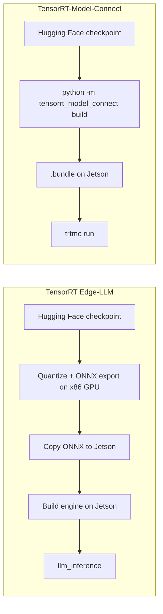

# 在 Jetson AGX Orin 上部署 TensorRT-Model-Connect

<div align="center">
  
</div>

本教程展示如何在由 **Jetson AGX Orin** 驱动的 Seeed reComputer 上运行 [NVIDIA TensorRT-Model-Connect](https://github.com/NVIDIA/TensorRT-Model-Connect)（TRTMC）。在构建好原生运行时时，路径非常短：从 Hugging Face checkpoint 开始，在设备上生成 TensorRT `.bundle`，然后运行文本生成。整个流程中没有单独的 x86 主机，也没有 ONNX 导出步骤。

本演示使用 FP16 精度的 **Qwen3-4B-Instruct-2507**。该模型是稠密 transformer，因此 TensorRT 可以使用批量 prefill 引擎。同一页面还记录了在 AGX Orin 64GB 上的转换内存占用，以及与 llama.cpp CUDA 在 prefill/解码阶段的一对一对比。

:::note
TensorRT-Model-Connect 目前是公开预览版本。API、模型覆盖范围以及构建流程仍可能发生变化。NVIDIA 自身的建议是：当你想快速尝试受支持的模型时使用 TRTMC，而在 Jetson 上需要面向生产的 LLM/VLM 运行时时，从 [TensorRT Edge-LLM](/cn/deploy_tensorrt_edge_llm_on_jetpack6.2/) 入手。
:::

## 什么是 TensorRT-Model-Connect？

TensorRT-Model-Connect 是一组基于 NVIDIA TensorRT 的模型家族参考实现。由各模型家族维护的构建器会读取 Hugging Face 快照，构建 TensorRT 引擎，并写出带版本的 `.bundle`。同一个 bundle 既可以通过 `trtmc` CLI 执行，也可以通过原生 C++ 任务 API（例如文本生成）来执行。

在 Jetson 上，实际差异体现在转换路径上。TensorRT Edge-LLM 仍然要求你在带有独立 GPU 的 x86 Linux 机器上进行量化并导出 ONNX，然后将这些 ONNX 文件复制到设备上生成引擎。而 TRTMC 则是在 Jetson 本机上构建引擎 bundle。



<div align="center">
  
</div>

## 为什么这条路径在 Jetson 上更简单

| 主题 | TensorRT Edge-LLM | TensorRT-Model-Connect |
| --- | --- | --- |
| 转换在何处运行 | 在带 NVIDIA GPU 的 x86 Linux 主机上导出 ONNX，然后在 Jetson 上构建引擎 | 在 Jetson 上从 Hugging Face 快照直接生成 `.bundle` |
| 中间文件 | ONNX 计算图，通常有数十 GB，需要复制到设备上 | 无。`.bundle` 本身就是产物 |
| 完成环境准备后的命令 | 导出、复制、构建引擎，然后运行 `llm_inference` | `python -m tensorrt_model_connect build` 和 `trtmc run` |
| 转换期间的主机内存 | 厂商文档：FP8 ONNX 导出在 x86 机器上可能需要约 18–20× 模型大小的 CPU 内存 | 在 AGX Orin 64GB 上测得的 Qwen3-4B FP16：主机使用约 30.6 GB，容器峰值 41 GB |
| 最佳适用场景 | 在 Jetson 上进行生产级 LLM/VLM 部署 | 在将要运行模型的同一设备上快速尝试受支持的模型 |

表格中的内存行并不是同一模型的正面对比。Edge-LLM 已发布的 ONNX 导出数据解释了为什么该流水线通常要离开 Jetson，转而占用一台高内存工作站。TRTMC 的数据则是我们在 AGX Orin 64GB 上实际构建 Qwen3-4B FP16 时观察到的结果。

## 硬件

本教程在搭载 Jetson AGX Orin 64GB 的 **reComputer Classic J5012** 上复现。Qwen3-4B FP16 转换在容器内的峰值约为 41 GB，因此 64 GB 统一内存是实际可行的目标。J5011（32GB）属于同一产品家族，但在其上进行该转换很可能会频繁换页或失败。

<div style={{display:'grid', gridTemplateColumns:'repeat(2, minmax(0, 1fr))', gap:'24px', margin:'28px 0 42px'}}>
  <div style={{display:'flex', flexDirection:'column', overflow:'hidden', borderRadius:'16px', border:'2px solid #00a86b', background:'linear-gradient(145deg, #dce6ee, #cbd8e3)', color:'#172b4d', boxShadow:'0 14px 34px rgba(0,168,107,.18)'}}>
    <div style={{height:'290px', padding:'26px', display:'flex', alignItems:'center', justifyContent:'center', background:'linear-gradient(145deg, #d3dfe9, #bccbd8)'}}>
      
    </div>
    <div style={{display:'flex', flexDirection:'column', flex:'1', padding:'24px'}}>
      <div style={{fontSize:'23px', lineHeight:'1.35', fontWeight:'900', color:'#172b4d'}}>reComputer Classic J5012</div>
      <div style={{marginTop:'9px', color:'#526581', fontWeight:'600'}}>NVIDIA Jetson AGX Orin 64GB · 已在本教程中验证</div>
      <div class="get_one_now_container" style={{textAlign:'center', marginTop:'auto', paddingTop:'24px'}}>
        <a class="get_one_now_item" href="https://www.seeedstudio.com/reComputer-Classic-J5012-p-6881.html" target="_blank" rel="noopener noreferrer">
          <strong><span><font color={'FFFFFF'} size={"4"}> 立即获取 🖱️</font></span></strong>
        </a>
      </div>
    </div>
  </div>

  <div style={{display:'flex', flexDirection:'column', overflow:'hidden', borderRadius:'16px', border:'2px solid #3182ce', background:'linear-gradient(145deg, #dce6ee, #cbd8e3)', color:'#172b4d', boxShadow:'0 14px 34px rgba(49,130,206,.18)'}}>
    <div style={{height:'290px', padding:'26px', display:'flex', alignItems:'center', justifyContent:'center', background:'linear-gradient(145deg, #d3dfe9, #bccbd8)'}}>
      
    </div>
    <div style={{display:'flex', flexDirection:'column', flex:'1', padding:'24px'}}>
      <div style={{fontSize:'23px', lineHeight:'1.35', fontWeight:'900', color:'#172b4d'}}>reComputer Classic J5011</div>
      <div style={{marginTop:'9px', color:'#526581', fontWeight:'600'}}>NVIDIA Jetson AGX Orin 32GB · 同一主板家族</div>
      <div class="get_one_now_container" style={{textAlign:'center', marginTop:'auto', paddingTop:'24px'}}>
        <a class="get_one_now_item" href="https://www.seeedstudio.com/reComputer-Classic-J5011-p-6880.html" target="_blank" rel="noopener noreferrer">
          <strong><span><font color={'FFFFFF'} size={"4"}> 立即获取 🖱️</font></span></strong>
        </a>
      </div>
    </div>
  </div>
</div>

## 前置条件

在 Jetson 上准备以下环境：

- reComputer Classic J5012，或其他 Jetson AGX Orin 64GB 系统
- JetPack 7.2 / Ubuntu 24.04 / L4T R39.2
- 带 NVIDIA runtime 的 Docker（`docker info` 应该在 Runtimes 下列出 `nvidia`）
- 约 40 GB 的可用磁盘空间，用于开发镜像、Hugging Face 快照和 `.bundle`
- 可访问 GitHub、Hugging Face 和 `nvcr.io` 的网络
- 基准测试部分的可选项：`nvpmodel` MAXN 和 `jetson_clocks`

已验证的软件栈如下：

| 项目 | 版本 |
| --- | --- |
| 设备 | Jetson AGX Orin 64GB |
| 操作系统 | Ubuntu 24.04.4 LTS，内核 6.8.12-tegra |
| L4T | R39.2 |
| TRTMC 镜像中的 CUDA | 13.3.1 |
| TRTMC 镜像中的 TensorRT | 11.1.0.106（TensorRT 26.07） |
| GPU SM | 87（Orin） |
| 功耗模式 | MAXN，GPU 1300 MHz |

:::tip
如果 `docker ps` 返回 `permission denied`，请将你的用户加入 `docker` 组并重新登录：

```bash
sudo usermod -aG docker $USER
```

:::

## 1. 克隆 TensorRT-Model-Connect

```bash
git clone https://github.com/NVIDIA/TensorRT-Model-Connect.git
cd TensorRT-Model-Connect
```

官方的入门路径是 [Build from Source](https://nvidia.github.io/TensorRT-Model-Connect/getting-started/source-build) 加上 [Quick Start](https://nvidia.github.io/TensorRT-Model-Connect/getting-started/quick-start)。下面的命令就是这条路径，只是补充了 Jetson 特定的参数。

## 2. 构建开发容器

在 AGX Orin 上，计算能力是 8.7，因此 `TRTMC_SM=87`。Jetson 的 Docker 镜像还需要 `--runtime nvidia`。

```bash
GPU=0
SM="$(
  nvidia-smi -i "$GPU" \
    --query-gpu=compute_cap \
    --format=csv,noheader,nounits |
  tr -d '.[:space:]'
)"
IMAGE="trtmc-quickstart"

docker build \
  -f Dockerfile.dev.aarch64 \
  -t "$IMAGE" \
  requirements

SOURCE_DIR="$(git rev-parse --show-toplevel)"

docker run --rm -it \
  --runtime nvidia \
  --gpus "device=${GPU}" \
  --ipc=host \
  --network host \
  --mount "type=bind,source=${SOURCE_DIR},target=/src" \
  --workdir /src \
  --env TRTMC_SM="$SM" \
  "$IMAGE" \
  bash
```

:::caution
请在该容器内继续执行后续命令。该镜像已经固定了 TensorRT 11.1、Python 3.12 虚拟环境，以及 Qwen 系列构建所需的原生头文件。如果你的 Jetson 上没有 `nvidia-smi`，请手动将 `SM` 设为 87。
:::

如果 Hugging Face 快照和 bundle 将存放在外置 SSD 上，也请将该磁盘进行绑定挂载，例如使用 `-v /path/to/data:/out`。

## 3. 构建原生运行时

在容器内运行以下命令：

```bash
python -m pip install --no-deps -e . -C py-only=true

TRTMC_BUILD_DIR="build-sm${TRTMC_SM}"

cmake -S . -B "$TRTMC_BUILD_DIR" -G Ninja \
  -DCMAKE_BUILD_TYPE=Release \
  -DCMAKE_CUDA_ARCHITECTURES="${TRTMC_SM}-real" \
  -DTRTMC_BUILD_BACKEND_RTX=OFF \
  -DTRTMC_BUILD_TESTS=OFF \
  -DTRTMC_BUILD_EXAMPLES=OFF

cmake --build "$TRTMC_BUILD_DIR" --parallel "$(nproc)" --target \
  trtmc \
  trtmc_backend_trt \
  trtmc_model_qwen

export PATH="$PWD/$TRTMC_BUILD_DIR:$PATH"
```

`trtmc` 会从 `--runtime-root` 查找本地库。将该参数指向 CMake 构建目录，该目录中必须包含 `libtrtmc_core.so`、`libtrtmc_runtime.so`、`libtrtmc_backend_trt.so` 和 `libtrtmc_model_qwen.so`。

## 4. 在 Jetson 上构建 Qwen3-4B bundle

这是以前需要 x86 GPU 机器才能完成的转换步骤。固定 `--max-sequence-length`。该 checkpoint 的 Hugging Face 配置宣称支持 262,144 token 的上下文，如果保持这个默认值不变，在生成引擎时会耗尽内存。

```bash
python -m tensorrt_model_connect build Qwen/Qwen3-4B-Instruct-2507 \
  --precision fp16 \
  --backend trt \
  --max-sequence-length 2048 \
  --max-batch-size 1 \
  --tensor-parallel-size 1 \
  --output qwen3-4b-instruct-2507.bundle \
  --verbose
```

本地快照目录可以替代模型 ID。构建器会下载 checkpoint，让 Qwen 系列模型接管它，并写出一个已经包含 TensorRT 引擎的 `.bundle`。

在经过验证的 J5012 设备上，`max_sequence_length=2048` 的 Qwen3-4B FP16 产生了如下转换占用情况。公开的 Qwen 单设备 FP16 路径会写出拆分引擎（`engine.plan` + `prefill.plan`）；下表中的数据来自一个双 profile 构建，其中 prefill 和 decode 共享一个 plan，包含两个优化 profile。

| 指标 | 实测数值 |
| --- | --- |
| 精度 / 布局 | FP16，双 profile |
| 最大序列长度 | 2048 |
| 引擎生成时间 | 128.1 s |
| TensorRT 权重 | 7.49 GiB |
| Prefill 激活内存 | 633 MiB |
| Decode 激活内存 | 12 MiB |
| TensorRT 分配器 GPU 峰值 | 7,674 MiB |
| 主机使用内存峰值 | 30,640 MB |
| 容器内存峰值 | 41.09 GiB |
| Python RSS 峰值 | 24.7 GB |
| 最终 `.bundle` | 7.6 GiB |

:::tip
这些主机 / 容器内存峰值就是本 wiki 推荐使用 AGX Orin 64GB 的原因。你是在边缘设备上进行转换，但仍然需要足够的统一内存来让 TensorRT 构建引擎。
:::

在运行之前检查 bundle：

```bash
trtmc inspect ./qwen3-4b-instruct-2507.bundle
```

`trtmc inspect` 会打印 JSON。检查是否包含 `family: qwen`、`task: text_generation`，以及一个包含 `engine.plan` 和 tokenizer 文件的 sections 列表。拆分 FP16 构建还会列出 `prefill.plan`。bundle 中依然不会包含 ONNX 计算图。

## 5. 运行推理

```bash
trtmc run ./qwen3-4b-instruct-2507.bundle \
  --runtime-root "$PWD/build-sm${TRTMC_SM}" \
  --prompt "What is the capital of France? Answer in one word." \
  --use-chat-template true \
  --enable-thinking false \
  --max-new-tokens 32
```

成功运行会打印一个简短的补全结果，例如 `Paris`。同一个 bundle 也可以在 C++ 中通过 `trtmc::load_task(bundle, runtime_root)` 和 `ITextGeneration` 接口加载；参见 [C++ Task API](https://nvidia.github.io/TensorRT-Model-Connect/api/cpp-api)。

## 推理性能对比 llama.cpp

转换的便捷性只是故事的一半。在同一台 J5012 上，我们对比了上下文长度为 2048 时的 TRTMC FP16 与 llama.cpp CUDA + flash-attention FP16。下表中 TRTMC 一侧使用的是上文描述的双 profile 引擎。

测试设置：

- 模型：`Qwen/Qwen3-4B-Instruct-2507`，FP16
- 提示词：约 6,000 个背景字符加一个 70 词的巴黎问题（应用聊天模板后为 1,190–1,194 个 token）
- 解码：生成 64 个新 token，贪心解码（`temperature=0`，`top-k=1`）
- 频率：`nvpmodel MAXN`、`jetson_clocks`，GPU 1300 MHz
- 预热 1 次 + 实测 3 次；下表使用 3 次实测运行的中位数
- llama.cpp：`GGML_CUDA=ON`、`GGML_CUDA_FA=ON`、`-ngl 99 -c 2048 -b 512 -ub 512`

<div align="center">
  
</div>

| 后端 | Prefill | Decode | Generate（prefill + decode） |
| --- | --- | --- | --- |
| TensorRT-Model-Connect，双 profile FP16 | 1,967 tok/s · 606.9 ms / 1,194 tok | 18.8 tok/s · 53.3 ms/tok | 4,019 ms |
| llama.cpp CUDA + flash-attn FP16 | 1,601 tok/s · 743.2 ms / 1,190 tok | 19.6 tok/s · 51.1 ms/tok | 3,998 ms |

在较长的 prefill 阶段，TRTMC 获胜，这正是批处理 TensorRT 引擎发挥作用的负载。Decode 基本打成平手；在这次测量中 llama.cpp 略微领先。对于 64 个新 token 的端到端生成时间也非常接近，因为在提示词已经很长的情况下，decode 阶段占主导。

:::note
本次对比针对的是稠密的 Qwen3-4B transformer。像 NVIDIA Nano-9B 这样的混合 Mamba 模型目前在 TRTMC 中是逐 token 进行 prefill，因此并不适合作为评估 TensorRT 吞吐量的方式。
:::

## 这些数字意味着什么

- **更少的机器。** 你不需要一台 x86 GPU 工作站来导出 ONNX。将要服务该模型的 Jetson 也可以构建它。
- **比 Edge-LLM FP8 ONNX 路径更低的转换主机内存占用。** Edge-LLM 文档中提到 FP8 ONNX 导出时 CPU 内存最高可达模型大小的约 20 倍。Qwen3-4B FP16 TRTMC 构建在 Orin 64GB 上的主机内存约为 31 GB / 容器 41 GB。
- **在本次长上下文测试中，prefill 比 llama.cpp FP16 更快**，同时 decode 仍处于同一水平区间。
- **可复用的制品。** `.bundle` 就是你复制、检查和运行的对象。无需维护一棵需要保持同步的平行 ONNX 树。

## 故障排查

| 问题 | 检查内容 |
| --- | --- |
| 容器看不到 GPU | 使用 `--runtime nvidia`，并确认 `docker info` 中列出了 `nvidia` runtime |
| 引擎构建内存不足 | 固定 `--max-sequence-length 2048`，使用 AGX Orin 64GB，并关闭其他 GPU 使用者 |
| `trtmc run` 无法加载库 | 将 `--runtime-root` 传入 CMake 构建目录；CLI 不会在 `PATH` 或当前目录中搜索 DSO |
| Hugging Face 下载失败 | 在磁盘上放置本地快照，并将该目录传给 `build`，而不是传模型 ID |
| Decode 看起来正常但 prefill 很慢 | 确认你使用的是带双 profile / 批处理 prefill 引擎的稠密 transformer，而不是混合 Mamba 计算图 |
| Jetson 上缺少 `nvidia-smi` | 为 AGX Orin 设置 `SM=87` |

## 资源

- [TensorRT-Model-Connect 仓库](https://github.com/NVIDIA/TensorRT-Model-Connect)
- [TensorRT-Model-Connect 文档](https://nvidia.github.io/TensorRT-Model-Connect/)
- [在 JetPack 6.2 上部署 TensorRT Edge-LLM](/cn/deploy_tensorrt_edge_llm_on_jetpack6.2/)
- [reComputer Classic J501 入门指南](/cn/ai_robotics_seeed_agx_orin_dev_kit_getting_started/)
- [Qwen3-4B-Instruct-2507](https://huggingface.co/Qwen/Qwen3-4B-Instruct-2507)

## 技术支持与产品讨论

感谢你选择我们的产品！我们将为你提供多种支持，确保你在使用我们产品的过程中尽可能顺畅。我们提供多种沟通渠道，以满足不同的偏好和需求。

<div class="button_tech_support_container">
<a href="https://forum.seeedstudio.com/" class="button_forum"></a>
<a href="https://www.seeedstudio.com/contacts" class="button_email"></a>
</div>

<div class="button_tech_support_container">
<a href="https://discord.gg/eWkprNDMU7" class="button_discord"></a>
<a href="https://github.com/Seeed-Studio/wiki-documents/discussions/69" class="button_discussion"></a>
</div>
