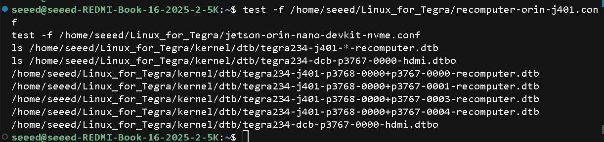
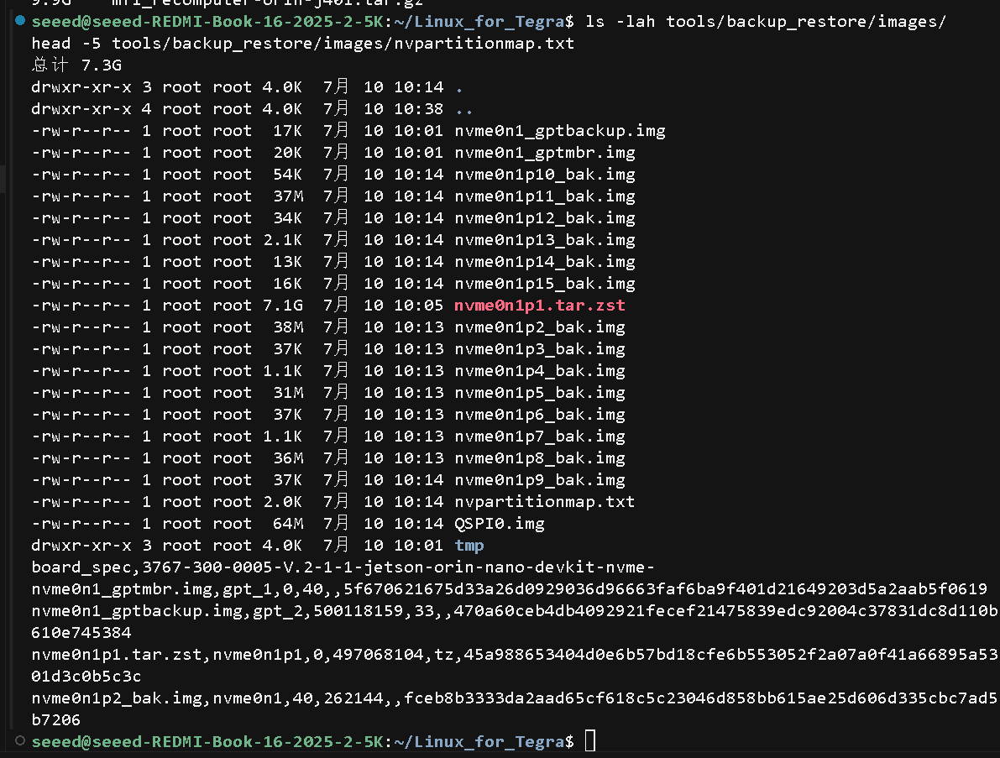
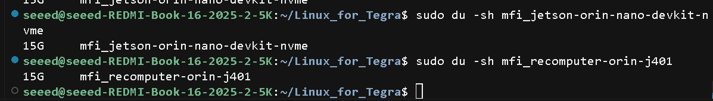
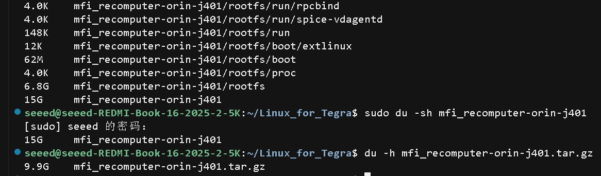

本 wiki 演示如何从 **NVIDIA Jetson Orin Nano Developer Kit** 克隆完整开发环境，做成可刷到 **Seeed reComputer Classic（J4011/J4012，板级配置 `recomputer-orin-j401`）** 的 Hybrid BSP，并完成刷写。

本流程是同载板 DIY BSP 的扩展。若源机与目标机都是 Seeed 板，请直接使用 [从 Jetson 开发环境创建自定义 BSP 包](/make_diy_bsp_for_jetson/)。

相关文档：

- [从 Jetson 开发环境创建自定义 BSP 包](/make_diy_bsp_for_jetson/)
- [将 Orin Nano DK 的 /home 迁到 reComputer](/migrate_home_data_from_jetson_orin_nano_developer_kit_to_recomputer/)
- [刷写 JetPack 到指定产品](/flash/jetpack_to_selected_product/)

本指南以 JetPack 6.2 / L4T 36.4.3 为例（模块 **SKU 0005** = Orin Nano 8GB）。

## 你要达成什么

<div class="table-center">
<table style={{textAlign: 'center'}}>
  <thead>
    <tr>
      <th>目标</th>
      <th>产物</th>
      <th>用途</th>
    </tr>
  </thead>
  <tbody>
    <tr>
      <td>A. 同载板克隆</td>
      <td><code>mfi_jetson-orin-nano-devkit-nvme.tar.gz</code></td>
      <td>再刷回 <strong>DevKit</strong>，完整环境克隆</td>
    </tr>
    <tr>
      <td>B. Classic Bundle</td>
      <td><code>mfi_recomputer-orin-j401.tar.gz</code></td>
      <td>刷到 <strong>Classic J4011</strong>：J401 板级 QSPI + DevKit 整盘 APP（含 <code>/home</code>）</td>
    </tr>
    <tr>
      <td>C. 稳妥回退</td>
      <td>官方 J401 BSP + 只迁 <code>/home</code></td>
      <td>Hybrid 异常时用</td>
    </tr>
  </tbody>
</table>
</div>

:::danger
**不要**把 DevKit 的 `mfi_jetson-orin-nano-devkit-nvme` 直接刷到 Classic。  
**不要**只改 mfi 目录里某个 `.dtb` 就当适配完成。
:::

## 前提条件

### 硬件

- 源机：Orin Nano **Developer Kit**（本例模块 **SKU 0005** = Orin Nano 8GB，NVMe 启动）
- 目标机：Seeed **reComputer Classic J4011/J4012**（载板 J401，模块建议同为 0005）
- 主机：Ubuntu 22.04 x86_64，USB Type-C 数据线（刷写口）
- 磁盘：建议预留 **≥ 100GB** 空闲（备份 + 双 mfi + 快照）

### 主机依赖

```bash
sudo apt-get update -y
sudo apt-get install -y \
  build-essential flex bison libssl-dev \
  sshpass abootimg nfs-kernel-server \
  libxml2-utils qemu-user-static
```

备份/刷写前：

```bash
sudo systemctl stop udisks2.service
sudo service nfs-kernel-server start
lsusb | grep 0955:7523   # 必须看到 NVIDIA Corp. APX
```

### 板型对照（本例）

<div class="table-center">
<table style={{textAlign: 'center'}}>
  <thead>
    <tr>
      <th>项目</th>
      <th>DevKit</th>
      <th>Classic J4011</th>
    </tr>
  </thead>
  <tbody>
    <tr>
      <td>board-name</td>
      <td><code>jetson-orin-nano-devkit-nvme</code></td>
      <td><code>recomputer-orin-j401</code></td>
    </tr>
    <tr>
      <td>配置文件</td>
      <td><code>p3768-0000-p3767-0000-a0-nvme.conf</code></td>
      <td><code>recomputer-orin-j401.conf</code></td>
    </tr>
    <tr>
      <td>Pinmux</td>
      <td><code>...-dp-a03</code>（DP）</td>
      <td><code>...-hdmi-a03</code>（HDMI）</td>
    </tr>
    <tr>
      <td>Overlay</td>
      <td>DevKit dynamic 等</td>
      <td><code>tegra234-dcb-p3767-0000-hdmi.dtbo</code> + <code>tegra234-p3767-camera-p3768-imx219-dual-seeed.dtbo</code></td>
    </tr>
    <tr>
      <td>SKU0005 主 DTB</td>
      <td><code>...-0005-nv(-super).dtb</code></td>
      <td><strong>仍用</strong> <code>tegra234-p3768-0000+p3767-0005-nv-super.dtb</code></td>
    </tr>
  </tbody>
</table>
</div>

本例备份 `board_spec`：

```text
3767-300-0005-V.2-1-1-jetson-orin-nano-devkit-nvme-
```

:::danger
reComputer Classic 系列的散热不足以支持 MAXN 超级模式。如果您在 Classic 设备上刷写了 JetPack 6.2，请**不要启用 MAXN 模式**。
:::

## 1. 准备 Linux_for_Tegra 工作区

从 [从 Jetson 开发环境创建自定义 BSP 包](/make_diy_bsp_for_jetson/) 的「在 PC 上准备工作目录」表格下载 Seeed L4T 工作包（本例为 JetPack 6.2 / L4T 36.4.3 plus）。

```bash
sudo tar xpf L4T_36.4.3_plus.tar.gz
# 请按实际下载的压缩包名称调整

cd Linux_for_Tegra/
sudo ./apply_binaries.sh
cd ..

export ARCH=arm64
export CROSS_COMPILE="$PWD/aarch64--glibc--stable-2022.08-1/bin/aarch64-buildroot-linux-gnu-"
export PATH="$PWD/aarch64--glibc--stable-2022.08-1/bin:$PATH"
export INSTALL_MOD_PATH="$PWD/Linux_for_Tegra/rootfs/"

cd Linux_for_Tegra/source
./nvbuild.sh
./do_copy.sh
./nvbuild.sh -i
```

验收：

```bash
test -f Linux_for_Tegra/recomputer-orin-j401.conf
test -f Linux_for_Tegra/jetson-orin-nano-devkit-nvme.conf
ls Linux_for_Tegra/kernel/dtb/tegra234-j401-*-recomputer.dtb
ls Linux_for_Tegra/kernel/dtb/tegra234-dcb-p3767-0000-hdmi.dtbo
```

<div align="center">



</div>

## 2. 从 DevKit 备份完整环境

### 2.1 源机进恢复模式

用 USB Type-C 数据线将 DevKit 刷写口连接到主机，并进入恢复模式。主机执行 `lsusb` 应看到 `0955:7523` **APX**。

进入恢复模式的说明见：[刷写 JetPack 到指定产品](/flash/jetpack_to_selected_product/)

备份过程中设备可能短暂变成 `0955:7035`（Linux for Tegra / initrd），属正常。

### 2.2 备份命令

```bash
cd Linux_for_Tegra
sudo ./tools/backup_restore/l4t_backup_restore.sh \
  -e nvme0n1 -b -c jetson-orin-nano-devkit-nvme
```

:::warning
源机是 DevKit 时，**不要**用 `recomputer-orin-j401` 做第一次备份，否则 `board_spec` / 后续基线会乱。
:::

### 2.3 验收

```bash
ls -lah tools/backup_restore/images/
head -5 tools/backup_restore/images/nvpartitionmap.txt
```

应看到：

- `board_spec` 含 `jetson-orin-nano-devkit-nvme`
- `nvme0n1p1.tar.zst`（或后续转换的大 APP）体积为 **GB 级**
- 存在 `QSPI0.img`（这是 **DevKit** 的 QSPI，后面 Hybrid 不能直接当 Classic 用）

<div align="center">



</div>

建议立刻打快照：

```bash
sudo cp -a tools/backup_restore/images ~/backup_images_dk_sku0005
```

## 3. 打出 DevKit 同载板 DIY BSP（可选）

设备再次进入 **APX**。主机执行 `lsusb` 应看到 `0955:7523 APX`：

```bash
cd Linux_for_Tegra
sudo ./tools/kernel_flash/l4t_initrd_flash.sh \
  --use-backup-image --no-flash --network usb0 --massflash 5 \
  jetson-orin-nano-devkit-nvme internal
```

产物：

- `mfi_jetson-orin-nano-devkit-nvme/`
- `mfi_jetson-orin-nano-devkit-nvme.tar.gz`

<div align="center">



</div>

:::danger
**仅用于再刷 DevKit。禁止刷 Classic。**
:::

## 4. 必读：QSPI 陷阱

`--use-backup-image` 经 `convert_backup_image_to_initrd_flash` 会把：

| 备份内容 | 放到 |
| --- | --- |
| NVMe / APP | `tools/kernel_flash/images/external/` |
| **源机** `QSPI0.img` | `tools/kernel_flash/images/internal/` |

因此：

| 错误做法 | 结果 |
| --- | --- |
| 只改 `mfi/.../rootfs` 或某个 `.dtb` | 无效（真正刷的是 bak / QSPI） |
| 备份来自 DevKit，却直接 `recomputer-orin-j401` + `--use-backup-image` | **仍刷 DevKit QSPI（DP pinmux）**，HDMI/USB 可能异常 |
| 改 conf 后再 `--flash-only` | `--flash-only` **不会**按 conf 重算镜像 |

Classic J4011 真正差在 conf 里的 **HDMI pinmux + DCB/camera overlay**（见 `recomputer-orin-j401.conf`）：

```bash
PINMUX_CONFIG="tegra234-mb1-bct-pinmux-p3767-hdmi-a03.dtsi"
PMC_CONFIG="tegra234-mb1-bct-padvoltage-p3767-hdmi-a03.dtsi"
OVERLAY_DTB_FILE+=",tegra234-dcb-p3767-0000-hdmi.dtbo,tegra234-p3767-camera-p3768-imx219-dual-seeed.dtbo"
DCE_OVERLAY_DTB_FILE="tegra234-dcb-p3767-0000-hdmi.dtbo"
```

对 SKU **0005**，主 DTB 文件名仍是 NVIDIA 的 `*-0005-nv-super.dtb`，**不是**强行换成 `*-0000-recomputer.dtb`（那是 NX 16GB 路径）。

## 5. Hybrid B'：做 Classic J4011 Bundle

核心思路：

1. **APP**：继续用 DevKit 备份（整盘用户环境）
2. **QSPI**：用 `recomputer-orin-j401` **重新生成**（不要 `--use-backup-image`）
3. 组装成 `mfi_recomputer-orin-j401`

```text
DevKit 备份 APP  ──►  external/（nvme0n1p1_bak.img 等）
J401 conf 新 QSPI ──►  internal/（分片 QSPI，非 DevKit 单体 QSPI0.img）
                    └──► mfi_recomputer-orin-j401(.tar.gz)
```

### 5.1 准备 APP-only（去掉 DevKit QSPI）

```bash
cd Linux_for_Tegra
sudo cp -a ~/backup_images_dk_sku0005 \
  tools/backup_restore/images_app_only
sudo rm -f tools/backup_restore/images_app_only/QSPI0.img
sudo sed -i '/qspi/Id' tools/backup_restore/images_app_only/nvpartitionmap.txt
```

将 APP-only 转成 initrd flash 的 `external` 镜像（可用备份工具的 convert，或复用 DevKit 打包步骤已有的 `tools/kernel_flash/images/external/` 大 APP）。

### 5.2 用 J401 conf 新生成 QSPI

设备须处于 APX。模块参数与备份一致（本例 3767 / 0005 / 300 / V.2）：

```bash
cd Linux_for_Tegra
sudo BOARDID=3767 BOARDSKU=0005 FAB=300 BOARDREV=V.2 CHIP_SKU=00:00:00:D5 \
  ./tools/kernel_flash/l4t_initrd_flash.sh \
  --external-device nvme0n1p1 \
  -c tools/kernel_flash/flash_l4t_t234_nvme.xml \
  -p "-c bootloader/generic/cfg/flash_t234_qspi.xml --no-systemimg" \
  --no-flash --massflash 5 --showlogs --network usb0 \
  recomputer-orin-j401 internal
```

日志中应出现 HDMI pinmux，例如：`tegra234-mb1-bct-pinmux-p3767-hdmi-a03`。

建议保存新 QSPI internal：

```bash
sudo cp -a tools/kernel_flash/images/internal ~/j401_qspi_internal_save
```

### 5.3 组装 mfi

最终目录应满足：

| 路径 | 内容 |
| --- | --- |
| `mfi_recomputer-orin-j401/recomputer-orin-j401.conf` | 存在 |
| `.../tools/kernel_flash/images/internal/` | **J401 新 QSPI**（无 DevKit 单体 `QSPI0.img`，或哈希与 DevKit 不同；`flash.idx` 常为多行分片） |
| `.../tools/kernel_flash/images/external/nvme0n1p1_bak.img` | **GB 级** APP |

打包归档（可选）：

```bash
cd Linux_for_Tegra
sudo tar czf mfi_recomputer-orin-j401.tar.gz mfi_recomputer-orin-j401
```

<div align="center">



</div>

## 6. 刷到 Classic J4011

### 6.1 目标机进 APX

`lsusb` → `0955:7523 NVIDIA Corp. APX`

### 6.2 刷写命令

**若本机已有解压目录，不要再** `tar xpf`**：**

```bash
cd Linux_for_Tegra/mfi_recomputer-orin-j401
sudo ./tools/kernel_flash/l4t_initrd_flash.sh \
  --flash-only --massflash 1 --network usb0 --showlogs
```

仅当另一台电脑**只有** `.tar.gz` 时：

```bash
sudo tar xpf mfi_recomputer-orin-j401.tar.gz
cd mfi_recomputer-orin-j401
sudo ./tools/kernel_flash/l4t_initrd_flash.sh \
  --flash-only --massflash 1 --network usb0 --showlogs
```

### 6.3 刷写过程中正常现象

| 日志 | 含义 |
| --- | --- |
| `p3768-0000-p3767-0000-a0.conf: 没有那个文件或目录` | `--flash-only` 下常见，镜像已预生成，可继续 |
| `rpcbind already running` | 可忽略 |
| `blockdev: cannot open /dev/mmcblk0boot0` | Orin Nano 无该分区，常见无害 |
| RCM-boot + `SSH ready` | 正常进入刷写 |
| DTB `...-0005-nv-super.dtb` | SKU0005 正确 |
| `internal` 多行 + `Starting to flash to qspi` | 正在刷 J401 QSPI |
| `tar ... zstd ... nvme0n1p1_bak.img` | 正在恢复 APP（最久，可能数十分钟） |

:::warning
**在出现成功结束提示前不要断电、不要拔线。**
:::

### 6.4 刷后检查（在 Classic 上）

```bash
cat /proc/device-tree/model
ls /boot/kernel_tegra234*.dtb
ls /boot/*.dtbo | grep -E 'hdmi|imx219-dual-seeed' || true

# 外设是否真的可用（比 model / dtbo 文件名更重要）
xrandr 2>/dev/null | head -20
lsusb | head
ip -br link
ls /boot/*.dtbo 2>/dev/null | head -40
sudo dmesg | grep -iE 'dtb|overlay|hdmi|tegra234' | tail -30

# 原 DevKit 用户环境是否还在（以 CUDA 为例）
nvcc --version
```

:::info
`dmesg` 无 sudo 时可能报 `Operation not permitted`，属权限问题，加 `sudo` 即可。
:::

**实机：model / DTB**

<div align="center">


</div>

**实机：原 DevKit 安装的 CUDA 仍可用**

<div align="center">


</div>

#### 如何解读结果（SKU 0005）

**1）**`/proc/device-tree/model` **仍显示 DevKit —— 对 SKU 0005 是正常的**

例如：

```text
NVIDIA Jetson Orin Nano Engineering Reference Developer Kit Super
```

原因：`recomputer-orin-j401.conf` 对 **SKU 0005** 选用的是 NVIDIA 的 `tegra234-p3768-0000+p3767-0005-nv-super.dtb`，**不会**换成 `tegra234-j401-*-recomputer.dtb`，因此 model 字符串仍像官方 DevKit。**不能**单凭这行判断「刷错成 DevKit 包」。

**2）**`/boot` **里的 DTB 文件名**

常见可见：

```text
/boot/kernel_tegra234-p3768-0000+p3767-0000-nv.dtb
/boot/kernel_tegra234-p3768-0000+p3767-0005-nv.dtb
```

不一定能看到 `*-0005-nv-super.dtb` 文件名；实际启动 DTB 往往由 **UEFI/QSPI** 侧决定，`/boot` 列表只是参考。

**3）**`grep hdmi|imx219-dual-seeed` **为空 —— 也不等于失败**

Hybrid 刷完后，`/boot/*.dtbo` 里经常仍是 DevKit 备份带来的通用 overlay 列表，**不一定**出现 `tegra234-dcb-p3767-0000-hdmi.dtbo` 或 `...-imx219-dual-seeed.dtbo`。Seeed HDMI/摄像头相关配置更多在 **J401 新生成的 QSPI / UEFI overlay** 路径上生效。

**4）真正要以「能不能用」为准**

| 检查项 | 正常示例 |
| --- | --- |
| USB | 能枚举 Hub、鼠标、蓝牙、USB 网卡等（`lsusb` 有多设备） |
| 有线网 | `enP8p1s0` 等为 `UP` |
| Wi‑Fi | `wlP1p1s0` 为 `UP` |
| 显示 | 桌面可用；或 `xrandr` 有输出 |
| 用户环境 | 原 DevKit 的用户、软件、数据仍在 |
| CUDA | `nvcc --version` 能跑通（本例 **12.6**），说明 APP 克隆完整 |

#### 何时才需要改 `extlinux.conf`

仅当 **HDMI / USB / 启动异常** 时，再尝试在 `/boot/extlinux/extlinux.conf` 的 `LABEL primary` 下增加：

```text
FDT /boot/kernel_tegra234-p3768-0000+p3767-0005-nv-super.dtb
```

（若 `/boot` 没有该文件，可先试 `...-0005-nv.dtb`，或从 BSP 的 `kernel/dtb/` 拷入后再指定。）

```bash
sudo reboot
```

若仍异常，改走第 7 节方案 A（官方 J401 BSP + 迁 `/home`）。

## 7. 方案 A 回退（官方更稳妥）

若 Hybrid 刷机后分区/UEFI/外设异常：

1. 按 Seeed 流程刷**官方** `recomputer-orin-j401` BSP（不要刷 DevKit mfi）。
2. 从备份抽出 `/home`（`nvme0n1p1.tar.zst`），或按 [将 Orin Nano DK 的 /home 迁到 reComputer](/migrate_home_data_from_jetson_orin_nano_developer_kit_to_recomputer/) 操作。
3. 在 Classic 上恢复 `/home`，再按需补装系统级软件（`/usr`、`/etc`、Docker 等需另处理）。

优点：板级固件最干净。缺点：不是整盘 `/` 克隆。

## 8. 关键路径速查

| 类型 | 路径（相对 `Linux_for_Tegra/`） |
| --- | --- |
| DK mfi | `mfi_jetson-orin-nano-devkit-nvme.tar.gz` |
| Classic Bundle mfi | `mfi_recomputer-orin-j401.tar.gz` |
| J401 conf | `recomputer-orin-j401.conf` |
| HDMI DCB | `kernel/dtb/tegra234-dcb-p3767-0000-hdmi.dtbo` |
| Seeed 双 IMX219 | `kernel/dtb/tegra234-p3767-camera-p3768-imx219-dual-seeed.dtbo` |
| J401 DTB | `kernel/dtb/tegra234-j401-p3768-0000+p3767-*-recomputer.dtb` |
| SKU0005 DTB | `kernel/dtb/tegra234-p3768-0000+p3767-0005-nv-super.dtb` |

## 9. 流程总览

```text
[主机] 解压 L4T + apply_binaries + nvbuild
          │
          ▼
[DevKit APX] backup -c jetson-orin-nano-devkit-nvme
          │
          ├─►（可选）--use-backup-image → mfi_jetson-orin-nano-devkit-nvme
          │
          ├─► 快照 backup_images_dk_sku0005
          │         │
          │         ├─ APP-only（删 QSPI）
          │         └─► external APP
          │
          └─► [APX] J401 无 --use-backup-image 生成 QSPI
                    │
                    ▼
              组装 mfi_recomputer-orin-j401
                    │
                    ▼
              [Classic APX] --flash-only
                    │
                    ▼
              检查显示/USB/NVMe/用户环境
```

## 10. FAQ

**Q: 目录和** `.tar.gz` **都有，还要解压吗？**  
A: 不要。有 `mfi_recomputer-orin-j401/` 就直接 `cd` 进去 `--flash-only`。

**Q: 目标 Classic 模块不是 0005？**  
A: 改 `BOARDSKU`，并按 `recomputer-orin-j401.conf` 里 `p3767_super_overlay` 选对应 DTB，再重新生成 QSPI。

**Q: 只想保留** `/home`**，不要整盘克隆？**  
A: 直接走方案 A（第 7 节），更简单稳妥。

**Q: Wiki DIY 示例为什么写** `recomputer-orin-j401`**？**  
A: 那是**源机与目标同为 Seeed 板**时的示例。源机是官方 DevKit 时，备份必须先用 `jetson-orin-nano-devkit-nvme`，再按本教程 Hybrid 适配 Classic。

## 技术支持与产品讨论

感谢您选择我们的产品！我们在这里为您提供不同的支持，以确保您使用我们产品的体验尽可能顺畅。我们提供多种沟通渠道，以满足不同的偏好和需求。

<div class="button_tech_support_container">
<a href="https://forum.seeedstudio.com/" class="button_forum"></a>
<a href="https://www.seeedstudio.com/contacts" class="button_email"></a>
</div>

<div class="button_tech_support_container">
<a href="https://discord.gg/eWkprNDMU7" class="button_discord"></a>
<a href="https://github.com/Seeed-Studio/wiki-documents/discussions/69" class="button_discussion"></a>
</div>
