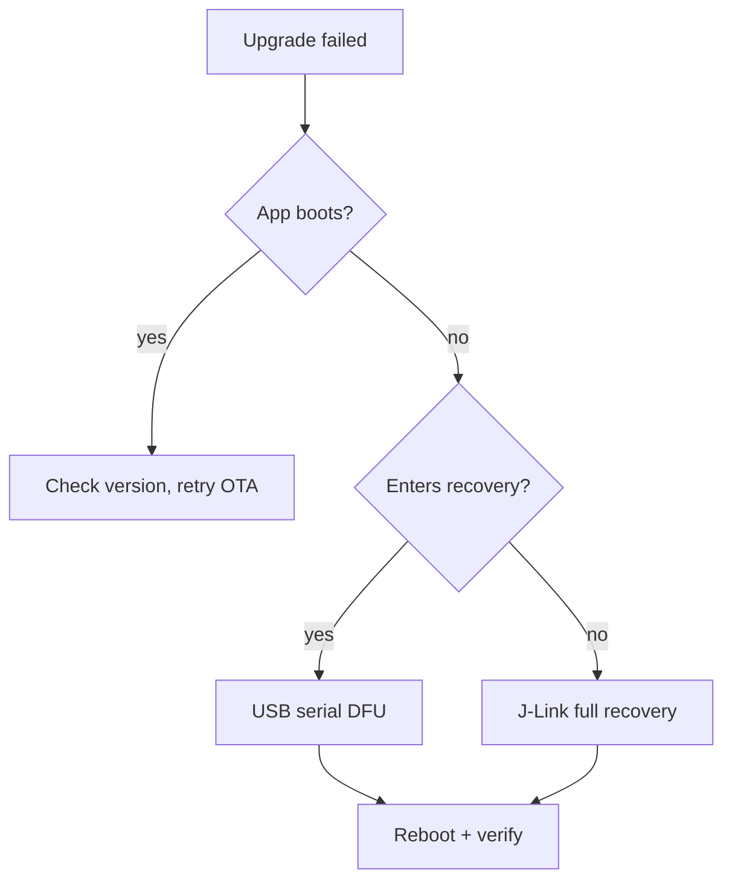

# reSpeaker Clip 固件开发指南

这是 reSpeaker Clip 设备端固件的完整参考：它是如何构成的、它使用的 AT/GATT/UDP 协议、如何构建、更新、恢复、验证以及发布。关于从一台干净机器开始的“构建到冒烟测试”路径，请参见 [Getting Started with the reSpeaker Clip Firmware SDK](./respeaker_clip_firmware_quick_start.md)；关于完整的构建/烧录/供电/坑点，请参见 [CLAUDE.md](https://github.com/Seeed-Studio/reSpeaker_Clip/blob/main/CLAUDE.md)。

检出的固件源码是权威来源；本指南对其进行总结。当两者不一致时，以源码为准。

## 介绍

Firmware SDK 是运行在 Nordic nRF5340（应用核 + 网络核）上的事件驱动 Zephyr RTOS 应用，配有 PDM 麦克风阵列、BLE、Wi-Fi AP（nRF7002）、USB、SD 存储和 OLED。它面向需要修改设备端行为的开发者。本指南在一个地方覆盖设计和运行参考（协议、更新、验证、量产），使每条事实只有一个归属——交叉引用指回这里而不是重复内容。

## 系统架构

### 分层架构

固件被组织为五层，每一层只依赖其下方的层：

| 层级 | 职责 | 关键源码 |
|-------|----------------|------------|
| **应用 / 事件** | 状态机、UI、按键、产生副作用的唯一位置 | `clip_event.c`, `display.c`, `button.c`, `main.c` |
| **服务 / 传输-传输-配置** | 传输字节（BLE/UDP/USB）、文件传输引擎、持久化配置 | `transport.c`, `transport_ble.c`, `transport_udp.c`, `usb_cdc.c`, `transfer.c`, `config.c` |
| **处理 / 音频** | PDM 采集 → DSP → Opus → 分帧写文件 | `audio.c`, `storage.c` |
| **HAL / 驱动** | 板级设备：OLED、PMIC、麦克风/稳压器、SPI Flash、SD、WiFi/BLE 射频 | `boards/seeed/clip/`, `drivers/`, `battery.c`, `haptic.c` |
| **Zephyr 内核** | 线程、消息队列、信号量、互斥锁、电源管理 | NCS v3.3.0 |

不变式：**应用层是唯一会修改状态并触发副作用的地方。** 按键按下和 AT 命令不会直接启动麦克风或写 SD 卡——它们只会投递一个事件，由 `clip_event.c` 决定在当前状态下是否合法并执行。

请求流转路径：`button ISR` / `AT command` → `clip_post_event[_sync]()` → `[k_msgq]` → `clip_event_process()`（主线程）→ `execute_transition()` → 副作用（`audio_*`, `storage_*`, `display_*`, `haptic_*`, `ble_notify_*`）。按键异步投递（`K_NO_WAIT`，ISR 安全）；AT 命令同步投递（在每个事件的信号量上阻塞，以便 `AT+START` 可以同步返回会话 ID）。

### 事件与状态模型

`clip_event.c` 中的分发器是一个表驱动状态机：

- `clip_post_event(event)` —— 异步、非阻塞、ISR 安全；如果 8 槽队列已满则丢弃。
- `clip_post_event_sync(event, &info)` —— 阻塞；通过 `info` 返回 `OK`/`INVALID`/ `BUSY`/`ERROR`。

状态：`UNINITIALIZED → IDLE → RECORDING → TRANSMITTING / WIFI_SYNC → IDLE`，外加 `PAUSED`、`ERROR`、`OTA`。`transition_table[current_state][event]` 返回下一个状态、`TRANS_SAME`（保持，例如 `MARK`），或 `TRANS_INVALID`（拒绝）。有两个预先门控的拒绝：`WIFI_SYNC` 状态下的 `START`（“WiFi blocked”），USB MSC 暴露 SD 时的 `START`（“USB blocked”——在写入时通过 USB 挂载会破坏 FAT）。状态只在 `execute_transition()` 中通过 `atomic_set(&g_state, new)` 提交——这是唯一改变状态的地方。

值得注意的副作用：`START` 调用 `storage_ensure_mounted()`，如果已满则拒绝，然后调用 `audio_start_recording(AUDIO_MODE_MERGE)`。`STOP` 最多等待 5 秒让音频线程刷新/关闭；如果 SD 忙，停止仍然提交 `IDLE`，这样状态机永远不会死锁在 `RECORDING`（录音尾部可能被截断）。`POWER_OFF_EXEC` 会取消任何活动传输（有界等待）、停止录音、保存电量计状态，并将 PMIC 置于运输模式。

### 线程模型

五个应用线程（Zephyr 优先级：数字越小优先级越高，0 及以上可抢占；Bluetooth RX 运行在更高优先级）：

| 线程 | 优先级 | 栈 | 角色 |
|--------|-----|-------|------|
| **Main** | (main) | — | 事件循环 `clip_event_wait()`→`clip_event_process()`，UI，时间。空闲时等待 `K_FOREVER`，录音时等待 `K_MSEC(1000)`。 |
| **Audio** `audio_rec` | 0 | 32768 | PDM 读取 → DSP → Opus → 存储。最高优先级应用线程（20 ms Opus 截止期是硬实时）。 |
| **Transfer** | 5 | 16384 | 文件传输引擎：读取 SD，通过传输发送并重传。 |
| **UDP server** | 5 | 4096 | Wi-Fi UDP 套接字服务器（端口 8089）。 |
| **AT server** | 7 | 4096 | 解析 BLE/UDP/USB 上的 AT，投递同步事件，发送 JSON。 |

同步模式：用**易失/原子标志位**表示“我该停了吗？”（`transfer_cancel_requested`, `pause_requested`），用**信号量**表示“你完成了吗？”（`stop_done_sem`, `file_closed_sem`, `transfer_trigger_sem`），用**互斥锁**保护数据结构（`audio_state_mutex`, `sd_lifecycle_mutex`, `session_json_mutex`, `transport_lock`），用**一个消息队列**承载关键的生产者→消费者路径（`clip_ev_msgq`，事件 → 主线程）。一个由 32 个 × 1280 B 缓冲组成的 `k_mem_slab` 提供 640 ms 的 DMIC 队列深度，以吸收调度抖动（包括 BT RX 抢占）。

## 音频与录音架构

### 音频流水线

每 20 ms 帧：`dmic_read()`（L+R 立体声，1280 B）→ `process_pcm_frame()`（合并 + DSP，依模式而定）→ `opus_encode()`（≤4000 B 包）→ `storage_write_frame()`（2 字节长度前缀，4 KiB 缓冲写入）。

常量（`audio.h`）：16 kHz、16 位、2 通道 PDM；20 ms 帧 → 320 样本/帧，1280 B/块；32 个 DMIC 缓冲（640 ms 队列）。

### 录音模式

> 旧文档将 `MODE_NORMAL` 描述为**立体声**。这是错误的。两种模式都录制**单声道**。

- **两种模式**都通过 L+R 合并录制单声道。`clip_event.c` 将 `audio_start_recording(AUDIO_MODE_MERGE)` 写死。`MODE_NORMAL` 不是立体声——这个名字只是历史遗留。
- **`MODE_NORMAL`**（默认）：延时对齐的 L+R 合并 → 手写 100 Hz 高通 → 整数 AGC（包络 + 增益计算器 + 平滑器）→ 软限幅。**不使用 SpeexDSP。**
- **`MODE_ENHANCED`**：相同的合并 + 手写 DSP，**再加上 SpeexDSP** 噪声抑制 + 去混响，条件为 `mode == ENHANCED && noise_suppress > 0`（`audio.c:506`）。不使用 SpeexDSP AGC（构建为 `FIXED_POINT`；浮点 FFT AGC 每帧大约要 15 ms；由整数 AGC 取代）。
- 合并步骤对 L 与 R 在滞后 \{−1, 0, +1\} 上做互相关（2.85 cm 麦距 → 在 16 kHz 下 ITD ≤ 1 个采样），并在求和前做延时对齐，以避免梳状滤波。AGC 是经典压缩器：约 30 ms 攻击 / 约 300 ms 释放，目标 ≈−14.7 dBFS，增益限制在 ±12/24 dB，软限幅（拐点 −2 dBFS，硬限幅 −0.5 dBFS）。
- Opus：`OPUS_APPLICATION_AUDIO`（相比 VOIP 更好地保留擦音，利于 STT），VBR 不受限，语音信号提示，16 位深度，关闭 DTX/FEC/丢包补偿。码率/复杂度为**按模式的 Kconfig**（`CLIP_NORMAL_*`/`CLIP_ENHANCED_*`），运行时不可设置。编码器 + SpeexDSP 状态被缓存，仅在参数变化时重新初始化。
- 通过 `AT+MODE=normal|enhanced`（持久化）或 `AT+START mode=enhanced`（仅本次会话，不持久化）设置模式。

### 会话、分段与存储模型

每次录音是一个**会话**，带有 14 位 `session_id`：`YYYYMMDDHHMMSS`（UTC），当时钟已同步时如此；否则为 `0` + 13 位运行时间数字。到处都强制使用 14 位形式（`validate_session_id`），因为存储布局会将其拆分为路径组件。

一个会话是一个目录树：`session.json`（元数据：id、duration、files、synced、size、channels、sample_rate、mode）、`marks.bin`（二进制书签："BMRK" 魔数 + 计数 + 偏移），以及分段文件 `0/0001.opus`, `0/0002.opus` … `1/0101.opus`（group = (file_index−1)/100，每个子目录 100 个文件）。Opus 文件是**长度前缀帧流**（2 字节 LE 长度 + 包，不是 OGG）；4 KiB 写缓冲在 `fs_write` 前合并帧。

分段策略：**未同步时每段 300 s**（`CLIP_AUDIO_SEGMENT_DURATION_NO_SYNC`），**活动传输期间每段 60 s**（`CLIP_AUDIO_SEGMENT_DURATION_SYNC`）——在录音*同时*传输（连续模式）时，传输线程只能读取已关闭的文件，因此 60 s 限制了客户端等待下一个文件的时间；如果同步在文件中途开始且当前文件已超过 60 s，引擎会立即切片（`audio.c:868`）。每次 `PAUSE`/`RESUME` 循环也会打开一个新文件。`session.json` 的 `synced` 字段跟踪已确认的文件，因此下载会从第一个未同步文件恢复。

**存储：** microSD（FAT32，`/SD:`）在 `/SD:/REC/` 下以桶式布局存放录音，会话 ID 被拆分为路径（`/SD:/REC/<YYYYMMDD>/<HH>/<MM>/<SS>/…`）。外部 8 MiB SPI Flash（LittleFS，约 6.8 MiB）存放设置（`/lfs/settings/run`）和 OTA 分区——与 SD 分离，这样设置损坏或 OTA 中断也不会影响录音。SD 通过 `storage_ensure_mounted()` **惰性重新挂载**，并在真正空闲时（在锁下检查，以关闭录音/传输在检查中途开始的 TOCTOU）在 `CLIP_SD_IDLE_DELAY_MS`（45 s）后**空闲断电**。

### 电源管理

电池设备（170 mAh “240” 电芯，NPM1300 + nRF Fuel Gauge）；空闲电流是主要约束。量产构建在 3V3 轨上的表现：

| 来源 | 行为 | 代价 |
|--------|----------|------|
| nRF5340 主核 + 射频稳压器 | DCDC（`NRF5X_REG_MODE_DCDC`） | 相比 LDO 约 500–600 µA |
| SD 卡 | 空闲 45 s 后断电 | 空闲时约为 0 |
| 调试 UART 控制台 | UARTE 在打印之间保持使能 | **约 570 µA** 漏电 |
| BLE 慢广播 | 约 1 s 间隔 | 平均约 0.1 mA |
| nRF70 QSPI | WiFi 未使用时启用 `CONFIG_NRF70_QSPI_LOW_POWER` | 极小 |

**量产空闲电流 ≈ 170 µA。** 在修复稳压器和 SD 之后，最大的漏电是**调试 UART 控制台**（约 570 µA）；`production` 代码片段会禁用控制台和 UART 日志后端（`CONFIG_CONSOLE=n`、`CONFIG_UART_CONSOLE=n`、`CONFIG_LOG_BACKEND_UART=n`），从而达到约 170 µA。`CONFIG_PM_DEVICE_RUNTIME=y` 会在空闲时自动挂起 UART/I2C/SPI 驱动。录音/传输会短暂提升电流（CPU 提升到 128 MHz，基于引用计数；麦克风 + SD 供电轨打开；完成后释放）。

## 通信协议

### BLE GATT 服务

| 特征 | UUID（`6E40xxxx-B5A3-F393-E0A9-E50E24DCCA9E` 的后缀） | 角色 |
|---|---|---|
| Service | `0001` | reSpeaker Clip 服务 |
| Command Receive | `0002` | 主机在此写入 AT 命令 |
| Response Send | `0003` | 设备在此通知 JSON 响应 |
| File Data | `0004` | 设备在此通知二进制文件传输帧 |
| Audio Visualization | `0005` | 设备在此通知录音能量等级 |

### AT 命令语法

| 类型 | 格式 | 示例 | 说明 |
|---|---|---|---|
| EXEC | `AT+XX` | `AT+GSTAT` | 执行动作 / 默认读取 |
| SET | `AT+XX=<value>` | `AT+MODE=enhanced` | 设置参数 / 携带参数执行 |
| READ | `AT+XX?` | `AT+MODE?` | 查询当前值 |

解析逻辑是共享的：`parse_command()`（位于 `at_server.c`）负责 `AT+NAME=args` 语法以及 `=`/`?` 类型检测；处理函数接收到的 `ctx->args` 已经拆分完毕（位于 `=` 之后）。`AT+LIST?2&10` 是分页读取。

### JSON 响应约定

- 成功：`{"ok":true,"data":{...}}`
- 失败：`{"ok":false,"msg":"..."}`
- **没有数字错误码，没有 `error` 字段，没有请求 ID。** 失败时使用 `msg`。相同的 JSON 会以完全相同的形式通过 BLE、UDP 和 USB 发送（由命令的来源传输层通过 `SEND_RESPONSE()` 宏路由——你的处理函数只需填充响应缓冲区）。

### 已注册命令参考

已注册的命令位于 `applications/clip/src/at_commands.c`（`.name = "..."` 表）。已验证集合：

| 分组 | 命令 |
|---|---|
| 设备状态 | `GSTAT`、`BATT`、`DEVICE`、`VERSION` |
| 录音 | `START`、`STOP`、`PAUSE`、`RESUME`、`MARK` |
| 文件管理 | `LIST`、`MARKS`、`DOWNLOAD`、`CANCEL`、`DELETE` |
| 配置 | `MODE`、`AUTODEL`、`BRIGHTNESS`、`TIME`、`NAME` |
| 连接 | `WIFI`、`WIFICFG`、`USB`、`PAIR`、`DFU` |
| 维护 | `LOG`、`STORAGE`、`FORMAT`、`REBOOT`、`POWEROFF`、`FACTORY` |

**已移除的旧版命令——不要文档化为可用：**`BITRATE`、`COMPLEXITY`、`NOISE`、`AGC`、`DEREVERB`、`PURGE`。噪声抑制 / 去混响是启动时的 Kconfig 默认值（`CLIP_DEFAULT_NOISE`、`CLIP_DEFAULT_DEREVERB`），持久化在 `config.c` 中，但**没有运行时 AT 命令**；AGC 是手写实现、始终开启、不可配置。当你修改 AT 响应、命令或传输帧时，请在同一次变更中更新 `docs/protocol.md` 和 `sdk/`。

### UDP 帧类型

Wi-Fi UDP 文件传输使用带有逐帧 CRC32 的二进制帧协议（端口 8089）：

| 类型 | 值 | 结构 |
|---|---|---|
| `DATA` | `0x01` | type(1) + seq(2) + len(2) + data |
| `FILE_ACK` | `0x03` | type(1) + status(1) + received_count(2) + crc32(4) |
| `FILE_START` | `0x10` | type(1) + fn_len(1) + filename + file_size(4) |
| `FILE_END` | `0x11` | type(1) + crc32(4) |
| `TRANSFER_DONE` | `0x12` | type(1) + sid_len(1) + session_id + file_count(4) |
| `AT_RESP` | `0x20` | 通过 UDP 承载的 AT 响应 |
| `HEARTBEAT` | `0x30` | 保活 |

**BLE 没有逐帧 CRC**（链路层保证交付）——仅在 `FILE_END` 中使用整文件 CRC32 做端到端校验。UDP 具有逐帧 CRC32 + `FILE_ACK`，并带有**选择重传位图 NACK**：客户端以位图形式报告缺失的帧，传输引擎只重发这些帧，节奏由 `CLIP_UDP_REPAIR_PACE_US` 控制（每一轮重试减半）。如果修复节奏失败，则回退到整文件重传；`TRANSFER_MAX_FILE_RETRIES`（10）限制在报 `ERROR` 之前的尝试次数。

### 会话与文件寻址

主机可见的会话 ID 恰好是 14 位十进制数字 `YYYYMMDDHHMMSS`；物理 FAT 路径在协议中从不暴露。`AT+DOWNLOAD` 接受 `session` 或 `session:NNNN.opus`。在访问存储、路径或传输之前，请先校验所有用户可控参数。

## 固件配置与构建配置集

### 标准版与开发版构建

默认（无代码片段）调试构建会保持 UART 控制台开启，并以 INF 日志级别（`CONFIG_LOG_BACKEND_FS=y`）将日志写入 `/SD:/LOG`（循环 64 KiB 文件）。构建命令：

```sh
source ~/ncs/v3.3.0/zephyr/zephyr-env.sh
export ZEPHYR_EXTRA_MODULES=$PWD   # env var, not -D — Kconfig discovery runs before CMake
west build --build-dir build-clip --board clip/nrf5340/cpuapp applications/clip
# pristine (required after MCUboot/devicetree/sysbuild/partition changes):
west build --build-dir build-clip --pristine --board clip/nrf5340/cpuapp applications/clip
```

每个应用默认都会构建为 **sysbuild**（MCUboot + 应用核 + 网络核射频）；开发板提供胶合逻辑。关键的 `prj.conf` / devicetree / Kconfig 控制项包括：功能开关、日志级别、BLE/Wi-Fi/文件系统配置；GPIO/I2C/SPI/PDM/PMIC/OLED 映射；缓冲区大小、线程栈、功耗策略。

### 量产构建

关闭控制台和 UART 日志，空闲约 170 µA：

```sh
west build --build-dir build-clip-prod --board clip/nrf5340/cpuapp applications/clip \
  -- -DSNIPPET_ROOT=$(pwd)/applications/clip -DSNIPPET=production
```

`SNIPPET_ROOT` 必须是绝对路径。`production` 代码片段位于 `applications/clip/snippets/production/`。项目构建时必须**零警告**——在提交前修复所有编译器警告。

## 固件更新与恢复

### 更新方式选择

| 场景 | 推荐方式 | 包类型 |
|---|---|---|
| 终端用户升级（封闭设备） | 应用 BLE OTA 或 USB 串口 DFU | `*-signed.bin` / `*-ota.zip` |
| 串口恢复（无应用） | mcumgr 串口 | `*-signed.bin` |
| 开发调试 | `west flash` / J-Link | `merged.hex` |
| 量产烧录 | J-Link / 编程器 | 完整 `merged.hex` + `merged_CPUNET.hex` |
| 仅应用核微调 | mcumgr 串口 | `*-signed.bin`（尚未提供 `single.zip`） |

### USB 串口 DFU

应用默认保持 USB 关闭——先通过 BLE 发送 `AT+USB=on`（示例中默认 CDC 会自动开启 USB，或者在插入时按住用户按键）。以 **1200 波特率** 打开 CDC-ACM 端口以触发 MCUboot 串口恢复；此时会出现一个新的端口，PID 为 **`0x8069`**（运行中应用为 `0x0069`；`0x8000` 位标记引导加载程序；二者均使用 Seeed VID `0x2886`）。上传并复位：

```sh
nrfutil mcu-manager serial image-upload --firmware clip-<version>-signed.bin --serial-port /dev/ttyACMx
nrfutil mcu-manager serial reset     --serial-port /dev/ttyACMx
```

MCUboot 会验证 RSA 签名并启动新应用；引导加载程序分区永远不会被改写。

### BLE OTA

```sh
nrfutil mcu-manager ble image-upload --firmware clip-<version>-ota.zip --address <BLE-MAC>
```

或者在手机上使用 nRF Connect Device Manager / SenseCraft Voice。

### J-Link

用于开发 / 量产 / 当 USB + BLE 恢复失败时：

```sh
nrfutil device program --firmware clip-<version>-merged.hex --serial-number <JLINK-SN>
nrfutil device reset --serial-number <JLINK-SN>
```

### 包清单

每个发行版都应携带一个清单，以免用户通过文件名猜测包的适用范围：

```yaml
firmware_version:
hardware_revision:
ncs_version:        # v3.3.0
bootloader_version: # mcuboot
app_core_version:
net_core_version:
package_type:       # debug | production
included_partitions: # [mcuboot, app, netcore]
upgrade_method:     # serial-dfu | ble-ota | programmer
sha256:
rollback_supported:
```

### 恢复决策树



### 复位命令矩阵

| 方式 | 命令 | 适用场景 |
|---|---|---|
| mcumgr 串口复位 | `nrfutil mcu-manager serial reset --serial-port …` | 串口 DFU 之后 |
| BLE mcumgr 复位 | `nrfutil mcu-manager ble reset --address …` | BLE OTA 之后 |
| J-Link 复位 | `nrfutil device reset --serial-number <JLINK-SN>` | 开发 / 量产 |
| west runner 复位 | `west flash --build-dir … && nrfutil device reset` | 开发——注意此处 `west flash --reset` 无效 |

`--recover` 会擦除**两个内核**（清除 b0n 访问端口锁）——仅在网络核 AP 被锁定时使用，绝不要作为常规操作。

### 安全规则

在没有充分准备的情况下，绝不要执行：整片芯片擦除；修改 UICR；覆盖引导加载程序；修改分区表；为错误硬件版本烧录合并镜像；在未备份配置的情况下恢复量产设备。

## 验证与调试

### 按变更类型划分的回归测试矩阵

| 变更 | 必须测试 |
|---|---|
| 音频流水线 | SNR、STOI、WER；缓冲区溢出；CPU；实时性（20 ms 截止时间） |
| Opus | 解码；帧格式；文件大小；传输兼容性 |
| AT / GATT | 旧命令；响应格式；错误路径；Python SDK |
| 文件系统 | 长时间录音；掉电；空间耗尽；CRC |
| BLE / Wi-Fi | 连接；分片；恢复；超时 |
| 功耗 | 空闲；录音；Wi-Fi；唤醒 |
| 固件更新 | OTA；恢复；版本回读；回滚 |

### 音频质量指标

SNR（信号与噪声清晰度）、STOI（可懂度）、WER（ASR 词错误率——业务指标）、THD（DSP/硬件失真）。测试场景：安静近场/远场、办公室、咖啡馆、车内、街道；同时覆盖 Normal 和 Enhanced 模式；覆盖中文、英文、数字序列、静音。

> **PESQ/STOI 需要干净的参考信号 + 对齐。** 不要在任意现场录音上计算这些指标并据此下结论——如果没有匹配的参考信号，这个数值没有意义。

### 串口、日志、存储与时序调试

```sh
minicom -D /dev/ttyACM0 -b 921600   # ttyACM1 if a J-Link also connected
```

日志级别：`AT+LOG=off|info|debug`（调试构建默认：info）。`CONFIG_LOG_BACKEND_FS=y` 会写入 `/SD:/LOG`（循环 64 KiB），用于事后分析；`AT+LOG=off` 允许 SD 在空闲时断电。音频线程每 500 帧（10 s）打印一次 DWT 周期计数统计（`enc avg/min/max`、`dsp`）。已知陷阱（`CLAUDE.md`）：nRF5340 不支持 `%llu`（请使用 `%u` + 强制类型转换）；UDP `sendto()` 即使在静默丢包时也会返回成功；FAT 目录顺序不是按时间排序；损坏的 `/lfs/settings/run` 会阻塞 `settings_load`（看门狗在 3 s 后清除并重启）。

### 主机端测试工具

```sh
python applications/clip/tests/tools/clip-cli.py status        # BLE default; --transport wifi
python applications/clip/tests/tools/clip-cli.py record --duration 5
python applications/clip/tests/tools/clip-cli.py list
python applications/clip/tests/tools/clip-cli.py sync --session <id>
python applications/clip/tests/tools/clip-cli.py terminal      # interactive AT shell
python applications/clip/tests/tools/udp_sync.py --session <id>
python applications/clip/tests/tools/decode_opus.py <file>.opus out.wav
```

**“构建通过”不等于“硬件已验证”。** 干净编译并不能说明任何设备端行为。

## 生产发布

### 发布制品与清单

目前为手动导出（由标签触发的 `scripts/build_release.sh` 和 `.github/workflows/release.yml` **尚未实现**）。调试版和生产版各会生成四个制品：

| 制品 | 用途 |
|---|---|
| `merged.hex` | 应用核完整镜像（编程器 / J-Link） |
| `merged_CPUNET.hex` | 网络核完整镜像 |
| `dfu_application.zip`（发布名为 `*-ota.zip`） | mcumgr OTA 包（BLE / USB 串口） |
| `clip/zephyr/zephyr.signed.bin`（发布名为 `*-signed.bin`） | MCUboot 签名应用镜像（USB 串口 DFU） |

`single.zip`（仅应用核）**尚未提供**——在 `build_release.sh` 就位之前，请使用 `*-signed.bin` 进行仅应用更新。发布流程：添加 `docs/release_notes/v$VERSION.md`，提交，执行 `git tag vX.Y.Z && git push origin vX.Y.Z` → CI 构建 GitHub Release。

### 签名密钥

`boards/seeed/clip/sysbuild/root-rsa-2048.pem` 是 **MCUboot 默认密钥的副本**。任何拥有公开源码的人都可以为你的设备签名镜像。**在生产环境中生成你自己的密钥**，并妥善保管私钥；通过替换密钥并重新烧录引导加载程序来轮换密钥。

### CI

`.github/workflows/firmware.yml` 会在推送 / PR 到 `main` 时构建 clip 应用（编译检查；应用 MCUboot 补丁并执行 `west build`）。`mobile-ci.yml`（分析 + 单元测试，针对 PR）和 `mobile-verify.yml`（调试 APK / iOS 冒烟测试，推送 + 手动）覆盖 `mobile/`。

### 工厂编程与测试固件

每个测试镜像都是 `tests/<name>` 下的独立 sysbuild，构建方式类似 `west build --build-dir build-test --pristine --board clip/nrf5340/cpuapp tests/clip`。测试通过 `SB_CONFIG_BOOTLOADER_NONE=y` **选择不使用 MCUboot**（工厂 / 认证固件，通过 J-Link 直接烧录）：

| 测试 | 目的 |
|---|---|
| `tests/clip` | 多镜像硬件测试套件（承载 `lfxo`/`hfxo` 晶振调谐 shell） |
| `tests/dtm` | BLE 直接测试模式（射频一致性；2 线 UART @19200） |
| `tests/wifi_radio` | nRF70 Wi-Fi 射频测试（发射 / 接收、单音、IQ、FICR） |
| `tests/otp` | nRF70 OTP 编程（工厂） |
| `tests/re` | 参考板点亮测试 |

批量烧录使用 `nrfutil device program --firmware …-merged.hex --serial-number
<JLINK-SN>`。

### 兼容性规则

- 保持 AT 响应结构：`{"ok":true,"data":{...}}` / `{"ok":false,"msg":"..."}`。不要使用数字错误码，不要使用 `error` 字段。
- 不要破坏文件格式（长度前缀的 Opus、`session.json` 模式）。
- 每当 AT 响应、命令或传输帧发生变化时，同时更新 `docs/protocol.md` **和** `sdk/`。
- 不要自动执行整片芯片擦除；不要自动烧录生产设备。
- 固件源码是唯一可信来源。

### NCS v3.2.1 到 v3.3.0 迁移

`main` 已迁移到 **仅支持 v3.3.0 的 Kconfig**（例如 WPA3 的 `..._WPA3_IMPLEMENTATION_NONE` 选项），不再能基于 NCS v3.2.1 构建。`ncs/v3.3.0` 分支是一条较早的分叉线（比 `main` 落后约 12 个提交）；本地的 `master` 只是最初导入的远古版本。目标为 NCS v3.3.0。

## AI 辅助开发

该仓库为从事此固件开发的 AI 代理（Claude Code 等）提供了一个固件开发技能，位于 [`skills/clip-dev/`](https://github.com/Seeed-Studio/reSpeaker_Clip/blob/main/skills/clip-dev/SKILL.md)。它编码了项目的真实约束，使代理无需重新推导这些约束——也不会去猜测那些很容易出错的事实。**请使用它；不要在文档中重复它的规则。**

关于 AI 辅助 AT 命令定制的完整、可复制示例，请参见 [Customization: Add a Custom AT Command](/cn/respeaker_clip_customization_at_command/)。该文章展示了如何提示 AI 代理加载仓库技能，添加 `AT+ECHO`，构建固件，并在设备上验证该命令。

**技能提供的内容**——`SKILL.md` 加上 `skills/clip-dev/references/` 下的九个参考（`audio`、`build-flash`、`ble-at`、`storage`、`wifi-udp`、`mcuboot`、`power`、`display`、`hardware`）：

- 活跃的 NCS 版本、板级 sysbuild 默认值、构建 / 烧录命令；
- **当前 AT 命令集**（在 `at_commands.c` 中注册）以及响应约定 `{"ok":true,"data":...}` / `{"ok":false,"msg":...}`；
- 音频流水线事实——两种模式都是单声道 L+R 混合；**不存在用于比特率、编解码器复杂度、AGC、噪声抑制和去混响的运行时命令**；
- 功耗约束（控制台泄漏、`production` 代码片段、SD 空闲门控）；
- 固件工作流：在编辑文档或客户端之前先在源码中确认约定，验证用户可控参数，只烧录被请求的镜像，每当 AT 响应发生变化时同时更新 `docs/protocol.md` 和 `sdk/`。

**如何加载它。** 在 Claude Code 中会自动发现该技能；否则请将代理指向该文件：

```
@clip-dev
Analyze how to add distinct haptic patterns for recording start vs stop.
Give the modification plan first; do not edit code yet.
```

**标准任务模板**——在请求代理修改固件之前，请先填写以下内容：

```markdown
## Goal
<device behavior to implement>

## Baseline
- Firmware commit/tag: v0.0.9
- NCS version: v3.3.0
- Board target: clip/nrf5340/cpuapp
- Build config: debug | production

## Constraints
- Keep which AT/GATT interfaces compatible
- New protocol fields allowed? (yes/no)
- File format changes allowed? (yes/no)
- Devicetree/Kconfig changes allowed? (yes/no)
- MCUboot / partition table / signing key edits forbidden

## Acceptance criteria
- Firmware builds (pristine, zero new warnings)
- Basic-SDK regression passes
- Expected serial log
- On-device behavior
- RAM/Flash delta
- Power or real-time constraint
```

**技能强制执行的安全规则。** 不要猜测文件、函数、Kconfig 或板级目标——请先搜索真实源码。不要从内部模块名推断公共接口。未经明确确认，不要修改 MCUboot、分区表或签名密钥。不要自动擦除整片芯片或烧录生产设备。不要破坏现有 AT 响应或文件格式。“构建通过”不等于“硬件已验证”——只声明在设备上实际测试过的内容。对于音频 / 协议更改，请报告对 CPU、缓冲区、闪存、RAM 和输出格式的影响；对于协议更改，请在同一次变更中更新 Python `sdk/` 和 `docs/protocol.md`。

## 相关资源

- [Getting Started with the reSpeaker Clip Firmware SDK](./respeaker_clip_firmware_quick_start.md) — 从构建到冒烟测试的路径
- [CLAUDE.md](https://github.com/Seeed-Studio/reSpeaker_Clip/blob/main/CLAUDE.md) — 完整的构建 / 烧录 / 功耗 / 踩坑参考
- [`skills/clip-dev/`](https://github.com/Seeed-Studio/reSpeaker_Clip/blob/main/skills/clip-dev/) — 固件 AI 开发技能
- 源码：[clip_event.c](https://github.com/Seeed-Studio/reSpeaker_Clip/blob/main/applications/clip/src/clip_event.c)（状态机）、[audio.c](https://github.com/Seeed-Studio/reSpeaker_Clip/blob/main/applications/clip/src/audio.c)（DSP/Opus）、[at_commands.c](https://github.com/Seeed-Studio/reSpeaker_Clip/blob/main/applications/clip/src/at_commands.c)（AT 注册表）、[at_server.c](https://github.com/Seeed-Studio/reSpeaker_Clip/blob/main/applications/clip/src/at_server.c)（解析 / 路由）、[transfer.c](https://github.com/Seeed-Studio/reSpeaker_Clip/blob/main/applications/clip/src/transfer.c)（传输引擎）、[transport.c](https://github.com/Seeed-Studio/reSpeaker_Clip/blob/main/applications/clip/src/transport.c)（传输抽象）、[storage.c](https://github.com/Seeed-Studio/reSpeaker_Clip/blob/main/applications/clip/src/storage.c)（会话 / SD 生命周期）、[main.c](https://github.com/Seeed-Studio/reSpeaker_Clip/blob/main/applications/clip/src/main.c)（初始化顺序）
- [usb_dfu.md](https://github.com/Seeed-Studio/reSpeaker_Clip/blob/main/docs/usb_dfu.md)、[protocol.md](https://github.com/Seeed-Studio/reSpeaker_Clip/blob/main/docs/protocol.md)、[udp_protocol.md](https://github.com/Seeed-Studio/reSpeaker_Clip/blob/main/docs/udp_protocol.md)

## 技术支持与产品讨论

感谢你选择我们的产品！我们将为你提供多种支持，确保你在使用我们产品的过程中尽可能顺畅。我们提供多种沟通渠道，以满足不同的偏好和需求。

<div class="button_tech_support_container">
<a href="https://forum.seeedstudio.com/" class="button_forum"></a>
<a href="https://www.seeedstudio.com/contacts" class="button_email"></a>
</div>

<div class="button_tech_support_container">
<a href="https://discord.gg/eWkprNDMU7" class="button_discord"></a>
<a href="https://github.com/Seeed-Studio/wiki-documents/discussions/69" class="button_discussion"></a>
</div>
